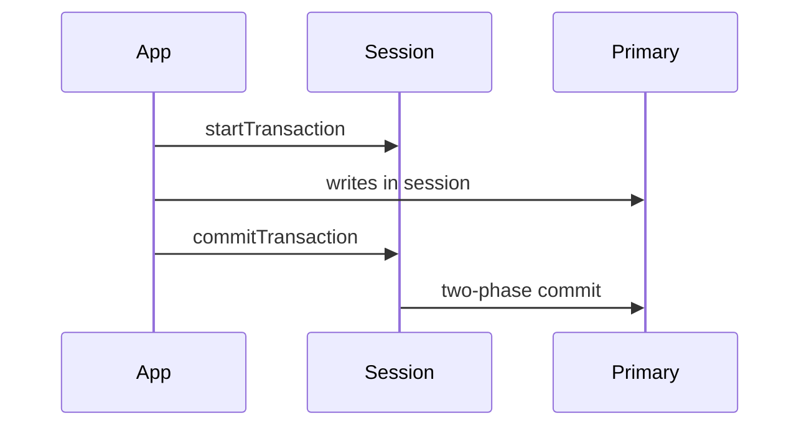

## Executive Summary

Multi-document **ACID transactions** (4.0+ on replica sets, 4.2+ sharded) use **sessions** with snapshot isolation. Prefer single-document atomicity when possible — transactions add latency and oplog overhead.

---

## Core Concepts

| Scope | Atomicity |
| :--- | :--- |
| Single document | Always atomic (including embedded arrays) |
| Multi-document | Transaction required |
| Multi-collection | Same transaction (same replica set / cluster) |
| Cross-shard | Supported 4.2+ with performance cost |



---

## Quick Reference

```javascript
// Shell
session = db.getMongo().startSession()
session.startTransaction({ readConcern: { level: "snapshot" }, writeConcern: { w: "majority" } })
try {
  const orders = session.getDatabase("shop").orders
  const inventory = session.getDatabase("shop").inventory
  orders.insertOne({ orderId: "O1", sku: "X", qty: 1 })
  const r = inventory.updateOne({ sku: "X", qty: { $gte: 1 } }, { $inc: { qty: -1 } })
  if (r.modifiedCount !== 1) throw new Error("insufficient stock")
  session.commitTransaction()
} catch (e) {
  session.abortTransaction()
  throw e
} finally {
  session.endSession()
}
```

---

## Snippets

```java
// Java driver
try (ClientSession session = client.startSession()) {
  session.withTransaction(() -> {
    orders.insertOne(session, new Document("orderId", "O1"));
    inventory.updateOne(session,
        Filters.eq("sku", "X"),
        Updates.inc("qty", -1));
    return null;
  });
}
```

```javascript
// Retryable writes (idempotent with retryWrites=true in URI)
// insertOne, updateOne, deleteOne, replaceOne auto-retry on transient errors
mongodb://host/mydb?retryWrites=true&w=majority
```

---

## Common Gotchas

- Default transaction limit: **60 second** lifetime — configure `transactionLifetimeLimitSeconds`.
- Collections must exist before transaction includes them (or create in prior txn).
- Index/catalog changes inside transactions are restricted.
- High-contention workloads — design for document-level atomicity instead of long transactions.

---

## Related Topics

- [Previous: Sharding](/mongodb-cheatsheet/sharding/)
- [Next: Schema Design](/mongodb-cheatsheet/schema-design/)
- [Replication](/mongodb-cheatsheet/replication/)
- [MongoDB Cheatsheet Index](/mongodb-cheatsheet/)
