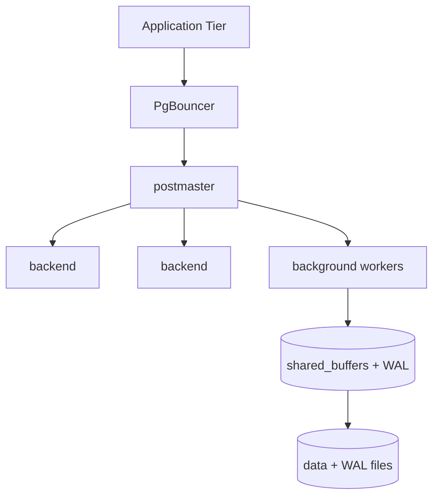

## Quick Revision

- **postmaster** supervises shared memory and spawns backends per connection.
- Background workers: **checkpointer**, **background writer**, **WAL writer**, **autovacuum**.
- Clients should use a **pooler** in microservice deployments — see [Connection Pooling](/postgresql-cheatsheet/06-production-operations/connection-pooling/).

## Core Concepts

| Process | Role |
| :--- | :--- |
| postmaster | Parent; manages lifecycle |
| backend | One per client session (or pooler connection) |
| checkpointer | Writes checkpoint records; advances redo horizon |
| bgwriter | Dirty page write-ahead to reduce checkpoint spikes |
| walwriter | Flushes WAL buffers |
| autovacuum launcher/worker | Dead tuple reclaim |

## Internal Working

Connection flow: client → (PgBouncer) → postmaster forks backend → parses SQL → planner → executor. Shared memory holds **buffer pool**, lock tables, WAL buffers. Per-backend memory includes `work_mem` for sorts/hashes.

## Architecture

## Design Tradeoffs

| Choice | Trade-off |
| :--- | :--- |
| Direct connections | Simple; poor beyond ~few hundred connections |
| Transaction pooling | High density; breaks session features |
| Single large instance | Strong consistency; vertical scale ceiling |

## Production Patterns

- One primary writer; scale reads with replicas + routing.
- Separate **WAL/disk** from data volume on cloud NVMe where possible.
- `max_connections` conservative; pooler mandatory for Java/Node fleets.

## Observability

`pg_stat_activity`, `pg_stat_bgwriter`, `pg_stat_database`, OS iowait and memory pressure.

## Interview Answers

## Question {#q-1}

How does the postmaster process model differ from thread-per-connection databases?

### Short Answer

PostgreSQL uses a **multi-process** model: one backend OS process per connection, supervised by **postmaster** — not threads per connection.

### Detailed Explanation

Thread-per-connection databases multiplex work inside one process. PostgreSQL forks a backend for each client session, giving strong isolation but higher memory per connection. Background workers (checkpointer, bgwriter, walwriter, autovacuum) are separate processes sharing memory via shared_buffers.

### Internal Working

postmaster listens on the port, accepts connections, and `fork()`/`exec()` backends. Crash of a backend does not take down the cluster; postmaster respawns workers.

### Production Notes

Pair with PgBouncer — backends are expensive at thousands of connections.

### Common Mistakes

Equating PostgreSQL to a threaded DB when sizing connection counts.

### Follow-up Questions

- How does PgBouncer change this model?
- What is shared_buffers?

---

## Question {#q-2}

What shared memory structures must fit in RAM for a production PostgreSQL cluster?

### Short Answer

PostgreSQL separates client backends from background workers under postmaster. This directly answers: what shared memory structures must fit in ram for a production postgresql cluster?

### Detailed Explanation

Shared memory holds buffers, locks, and WAL state; each backend has private work_mem for sorts. For **Architecture** depth, reason about failure modes and measurable signals before changing configuration.

### Internal Working

Canonical internals live on `/postgresql-cheatsheet/02-core-postgresql/architecture/` — cite xmin/xmax, WAL, or planner nodes as appropriate.

### Production Notes

Confirm with metrics and staged tests; document rollback for HA and DDL changes.

### Common Mistakes

Applying generic blog tuning without workload evidence; ignoring pooler and replica lag.

### Follow-up Questions

- What metric would disprove your hypothesis?
- Which handbook page is the canonical source?

---

## Question {#q-3}

Why does PostgreSQL fork a new backend per connection, and what scaling problem does that create?

### Short Answer

PostgreSQL separates client backends from background workers under postmaster. This directly answers: why does postgresql fork a new backend per connection, and what scaling problem does that create?

### Detailed Explanation

Shared memory holds buffers, locks, and WAL state; each backend has private work_mem for sorts. For **Architecture** depth, reason about failure modes and measurable signals before changing configuration.

### Internal Working

Canonical internals live on `/postgresql-cheatsheet/02-core-postgresql/architecture/` — cite xmin/xmax, WAL, or planner nodes as appropriate.

### Production Notes

Confirm with metrics and staged tests; document rollback for HA and DDL changes.

### Common Mistakes

Applying generic blog tuning without workload evidence; ignoring pooler and replica lag.

### Follow-up Questions

- What metric would disprove your hypothesis?
- Which handbook page is the canonical source?

---

## Question {#q-4}

What is the role of the checkpointer versus the background writer?

### Short Answer

PostgreSQL separates client backends from background workers under postmaster. This directly answers: what is the role of the checkpointer versus the background writer?

### Detailed Explanation

Shared memory holds buffers, locks, and WAL state; each backend has private work_mem for sorts. For **Architecture** depth, reason about failure modes and measurable signals before changing configuration.

### Internal Working

Canonical internals live on `/postgresql-cheatsheet/02-core-postgresql/architecture/` — cite xmin/xmax, WAL, or planner nodes as appropriate.

### Production Notes

Confirm with metrics and staged tests; document rollback for HA and DDL changes.

### Common Mistakes

Applying generic blog tuning without workload evidence; ignoring pooler and replica lag.

### Follow-up Questions

- What metric would disprove your hypothesis?
- Which handbook page is the canonical source?

---

## Question {#q-5}

How do autovacuum launcher and worker processes interact under load?

### Short Answer

PostgreSQL separates client backends from background workers under postmaster. This directly answers: how do autovacuum launcher and worker processes interact under load?

### Detailed Explanation

Shared memory holds buffers, locks, and WAL state; each backend has private work_mem for sorts. For **Architecture** depth, reason about failure modes and measurable signals before changing configuration.

### Internal Working

Canonical internals live on `/postgresql-cheatsheet/02-core-postgresql/architecture/` — cite xmin/xmax, WAL, or planner nodes as appropriate.

### Production Notes

Confirm with metrics and staged tests; document rollback for HA and DDL changes.

### Common Mistakes

Applying generic blog tuning without workload evidence; ignoring pooler and replica lag.

### Follow-up Questions

- What metric would disprove your hypothesis?
- Which handbook page is the canonical source?

---

## Question {#q-116}

How does pg_hba.conf control authentication methods by network?

### Short Answer

PostgreSQL separates client backends from background workers under postmaster. This directly answers: how does pg_hba.conf control authentication methods by network?

### Detailed Explanation

Shared memory holds buffers, locks, and WAL state; each backend has private work_mem for sorts. For **Security** depth, reason about failure modes and measurable signals before changing configuration.

### Internal Working

Canonical internals live on `/postgresql-cheatsheet/02-core-postgresql/architecture/` — cite xmin/xmax, WAL, or planner nodes as appropriate.

### Production Notes

Confirm with metrics and staged tests; document rollback for HA and DDL changes.

### Common Mistakes

Applying generic blog tuning without workload evidence; ignoring pooler and replica lag.

### Follow-up Questions

- What metric would disprove your hypothesis?
- Which handbook page is the canonical source?

---

## Question {#q-117}

Why prefer scram-sha-256 over md5 password authentication?

### Short Answer

PostgreSQL separates client backends from background workers under postmaster. This directly answers: why prefer scram-sha-256 over md5 password authentication?

### Detailed Explanation

Shared memory holds buffers, locks, and WAL state; each backend has private work_mem for sorts. For **Security** depth, reason about failure modes and measurable signals before changing configuration.

### Internal Working

Canonical internals live on `/postgresql-cheatsheet/02-core-postgresql/architecture/` — cite xmin/xmax, WAL, or planner nodes as appropriate.

### Production Notes

Confirm with metrics and staged tests; document rollback for HA and DDL changes.

### Common Mistakes

Applying generic blog tuning without workload evidence; ignoring pooler and replica lag.

### Follow-up Questions

- What metric would disprove your hypothesis?
- Which handbook page is the canonical source?

---

## Question {#q-123}

What TLS settings are required for compliance-grade encryption in transit?

### Short Answer

PostgreSQL separates client backends from background workers under postmaster. This directly answers: what tls settings are required for compliance-grade encryption in transit?

### Detailed Explanation

Shared memory holds buffers, locks, and WAL state; each backend has private work_mem for sorts. For **Security** depth, reason about failure modes and measurable signals before changing configuration.

### Internal Working

Canonical internals live on `/postgresql-cheatsheet/02-core-postgresql/architecture/` — cite xmin/xmax, WAL, or planner nodes as appropriate.

### Production Notes

Confirm with metrics and staged tests; document rollback for HA and DDL changes.

### Common Mistakes

Applying generic blog tuning without workload evidence; ignoring pooler and replica lag.

### Follow-up Questions

- What metric would disprove your hypothesis?
- Which handbook page is the canonical source?

---

## Question {#q-127}

What network segmentation pattern isolates PostgreSQL in Kubernetes?

### Short Answer

PostgreSQL separates client backends from background workers under postmaster. This directly answers: what network segmentation pattern isolates postgresql in kubernetes?

### Detailed Explanation

Shared memory holds buffers, locks, and WAL state; each backend has private work_mem for sorts. For **Security** depth, reason about failure modes and measurable signals before changing configuration.

### Internal Working

Canonical internals live on `/postgresql-cheatsheet/02-core-postgresql/architecture/` — cite xmin/xmax, WAL, or planner nodes as appropriate.

### Production Notes

Confirm with metrics and staged tests; document rollback for HA and DDL changes.

### Common Mistakes

Applying generic blog tuning without workload evidence; ignoring pooler and replica lag.

### Follow-up Questions

- What metric would disprove your hypothesis?
- Which handbook page is the canonical source?

---

## Question {#q-128}

How are superuser capabilities restricted in production roles?

### Short Answer

PostgreSQL separates client backends from background workers under postmaster. This directly answers: how are superuser capabilities restricted in production roles?

### Detailed Explanation

Shared memory holds buffers, locks, and WAL state; each backend has private work_mem for sorts. For **Security** depth, reason about failure modes and measurable signals before changing configuration.

### Internal Working

Canonical internals live on `/postgresql-cheatsheet/02-core-postgresql/architecture/` — cite xmin/xmax, WAL, or planner nodes as appropriate.

### Production Notes

Confirm with metrics and staged tests; document rollback for HA and DDL changes.

### Common Mistakes

Applying generic blog tuning without workload evidence; ignoring pooler and replica lag.

### Follow-up Questions

- What metric would disprove your hypothesis?
- Which handbook page is the canonical source?

## See Also

- [Previous: Install](/postgresql-cheatsheet/01-fundamentals/installation/)
- [Next: Storage](/postgresql-cheatsheet/02-core-postgresql/storage-engine/)
- [PostgreSQL Handbook](/postgresql-cheatsheet/)
- [Database Handbook — PostgreSQL](/database-handbook/postgresql/)
