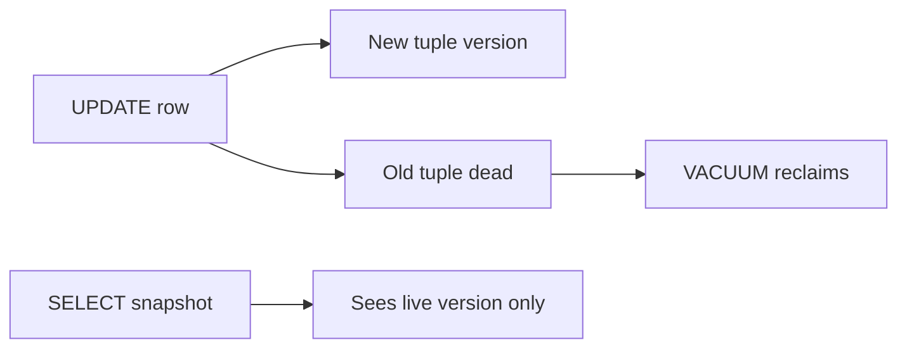

## Quick Revision

**Multi-Version Concurrency Control** keeps old row versions for in-flight transactions. Readers don't block writers; **VACUUM** reclaims dead tuples.

---

## Core Concepts

| Concept | Role |
| :--- | :--- |
| `xmin` | Inserting transaction ID |
| `xmax` | Deleting/updating transaction ID |
| **Snapshot** | Visible tuple set for a transaction |
| **Dead tuple** | Old version no longer visible to any snapshot |
| **VACUUM** | Marks space reusable; **FREEZE** prevents wraparound |

---

## Quick Reference

```sql
-- Tuple metadata (extension)
CREATE EXTENSION IF NOT EXISTS pageinspect;
-- heap_page_items, tuple headers — advanced debugging

SELECT relname, n_live_tup, n_dead_tup, last_vacuum, last_autovacuum
FROM pg_stat_user_tables
ORDER BY n_dead_tup DESC;
```

---

## Snippets



---

## Common Gotchas

- High churn tables need healthy autovacuum — watch `n_dead_tup`.
- Long transactions prevent vacuum from reclaiming space → bloat.
- `SELECT ... FOR UPDATE` locks current row version.

---


## Interview Answers

## Question {#q-16}

How does MVCC allow non-blocking reads while writers update rows?

### Short Answer

Readers take a **snapshot** and never block writers; writers create new tuple versions while old versions remain visible to open snapshots.

### Detailed Explanation

MVCC decouples read and write locking for plain SELECT. A transaction sees tuple versions whose xmin/xmax fit its snapshot. Concurrent UPDATE inserts a new row version; readers of older snapshots continue reading the previous version.

### Internal Working

Visibility is computed per tuple using xmin, xmax, and the snapshot's xmin/xmax horizons — no read lock on the heap page for ordinary SELECT.

### Production Notes

High churn + long transactions → bloat; monitor `n_dead_tup` and vacuum health.

### Common Mistakes

Assuming SELECT blocks UPDATE on the same row — only `FOR UPDATE` does.

### Follow-up Questions

- Why does UPDATE create a new row version?
- When does vacuum run?

---

## Question {#q-17}

What do xmin and xmax represent in a tuple header?

### Short Answer

**xmin** is the inserting transaction ID; **xmax** is the deleting/updating transaction (0 if live). Snapshot rules decide if the tuple is visible.

### Detailed Explanation

On INSERT, xmin is set to the current txid. DELETE/UPDATE sets xmax on the old version. A SELECT walks versions and applies snapshot visibility: committed xmin before snapshot, xmax null or after snapshot, and not in active xact list.

### Internal Working

Tuple headers also carry hint bits, null bitmap, and ctid (physical location).

### Production Notes

Use `pageinspect` only in forensic/debug contexts — not routine prod.

### Common Mistakes

Confusing xmin with transaction start time — it's a 32-bit txid counter.

### Follow-up Questions

- What is HOT update?
- How does freeze work?

---

## Question {#q-18}

How is transaction snapshot visibility determined for a SELECT?

### Short Answer

Tuple versions and snapshots implement non-blocking reads. This directly answers: how is transaction snapshot visibility determined for a select?

### Detailed Explanation

Vacuum reclaims dead tuples when no snapshot needs them. For **Architecture** depth, reason about failure modes and measurable signals before changing configuration.

### Internal Working

Canonical internals live on `/postgresql-cheatsheet/02-core-postgresql/mvcc/` — cite xmin/xmax, WAL, or planner nodes as appropriate.

### Production Notes

Confirm with metrics and staged tests; document rollback for HA and DDL changes.

### Common Mistakes

Applying generic blog tuning without workload evidence; ignoring pooler and replica lag.

### Follow-up Questions

- What metric would disprove your hypothesis?
- Which handbook page is the canonical source?

---

## Question {#q-19}

Why does UPDATE create a new row version instead of overwriting in place?

### Short Answer

Tuple versions and snapshots implement non-blocking reads. This directly answers: why does update create a new row version instead of overwriting in place?

### Detailed Explanation

Vacuum reclaims dead tuples when no snapshot needs them. For **Architecture** depth, reason about failure modes and measurable signals before changing configuration.

### Internal Working

Canonical internals live on `/postgresql-cheatsheet/02-core-postgresql/mvcc/` — cite xmin/xmax, WAL, or planner nodes as appropriate.

### Production Notes

Confirm with metrics and staged tests; document rollback for HA and DDL changes.

### Common Mistakes

Applying generic blog tuning without workload evidence; ignoring pooler and replica lag.

### Follow-up Questions

- What metric would disprove your hypothesis?
- Which handbook page is the canonical source?

---

## Question {#q-20}

How do long-running transactions interact with vacuum and bloat?

### Short Answer

Tuple versions and snapshots implement non-blocking reads. This directly answers: how do long-running transactions interact with vacuum and bloat?

### Detailed Explanation

Vacuum reclaims dead tuples when no snapshot needs them. For **Architecture** depth, reason about failure modes and measurable signals before changing configuration.

### Internal Working

Canonical internals live on `/postgresql-cheatsheet/02-core-postgresql/mvcc/` — cite xmin/xmax, WAL, or planner nodes as appropriate.

### Production Notes

Confirm with metrics and staged tests; document rollback for HA and DDL changes.

### Common Mistakes

Applying generic blog tuning without workload evidence; ignoring pooler and replica lag.

### Follow-up Questions

- What metric would disprove your hypothesis?
- Which handbook page is the canonical source?


## See Also

- [Previous: WAL](/postgresql-cheatsheet/02-core-postgresql/wal/)
- [Next: Transactions](/postgresql-cheatsheet/02-core-postgresql/transactions/)
- [PostgreSQL Handbook](/postgresql-cheatsheet/)
- [Database Handbook — PostgreSQL](/database-handbook/postgresql/)