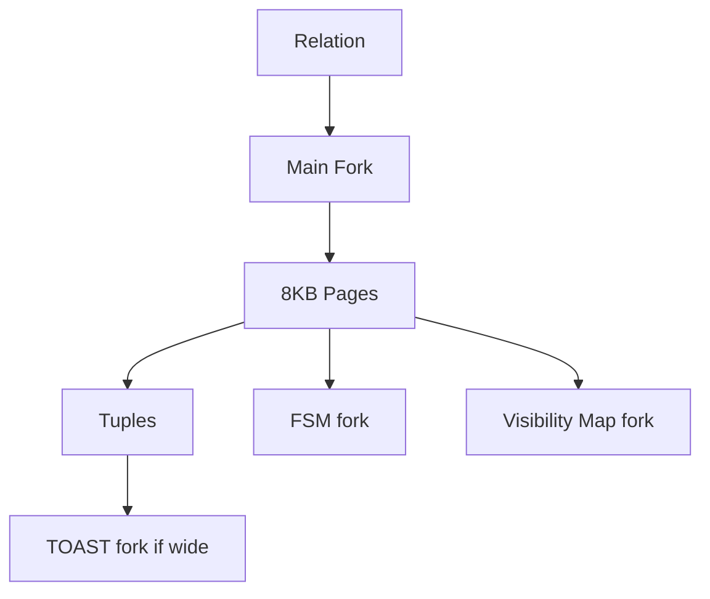
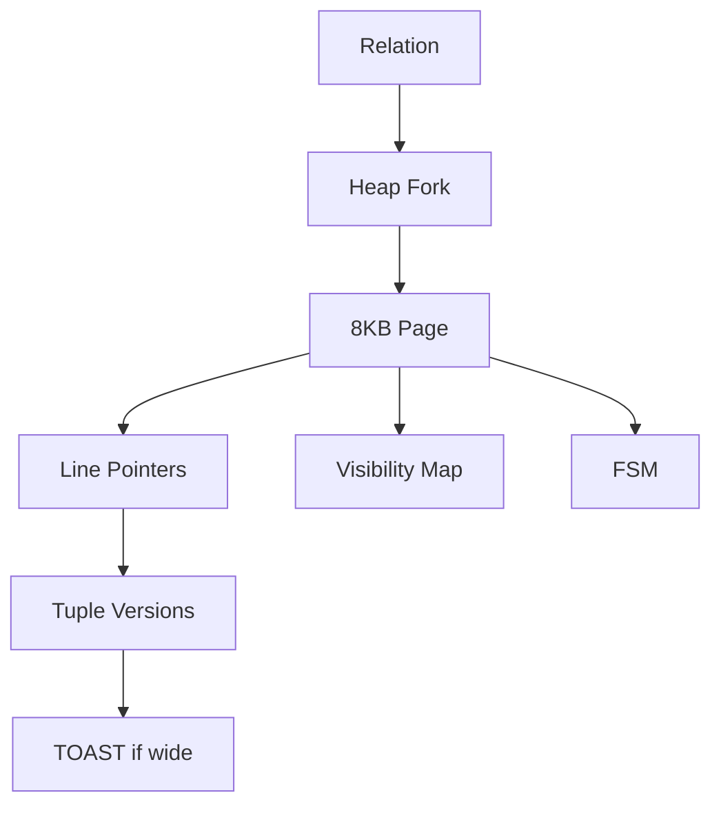
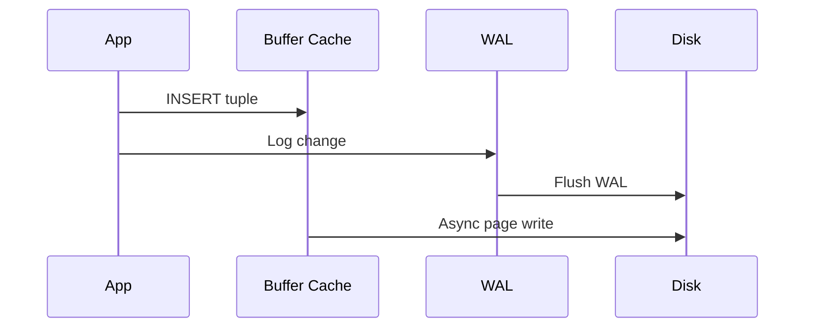

## Quick Revision

- Tables stored in **heap** files (8 KB **pages**).
- **TOAST** stores oversized varlena values out-of-line.
- **FSM** tracks free space; **Visibility Map** enables index-only scans and vacuum skips.
- **Buffer cache** (`shared_buffers`) mirrors pages in RAM.

## Core Concepts

| Component | Function |
| :--- | :--- |
| Heap page | Line pointers → tuple versions |
| Tuple header | `xmin`, `xmax`, `ctid`, null bitmap |
| TOAST table | Compressed/external storage for wide columns |
| FSM | Page free-space hints for inserts |
| Visibility Map | All-visible / all-frozen flags per page |
| Buffer pool | LRU-ish page cache in shared memory |

## Internal Working

**INSERT**: find page with space (FSM) → write tuple → WAL → buffer dirty.**UPDATE** (non-HOT): new tuple version + index updates; old version dead until vacuum.**HOT update**: same page, no index update if indexed columns unchanged.

## Architecture

## Design Tradeoffs

| Pattern | Effect |
| :--- | :--- |
| Wide JSON/text columns | TOAST I/O on large reads |
| Fillfactor < 100 | Room for HOT updates; more bloat headroom |
| Low shared_buffers | More OS cache reliance — test on your OS |

## Production Patterns

- Monitor bloat on high-churn tables — [VACUUM](/postgresql-cheatsheet/06-production-operations/vacuum/).
- `pgstattuple` / `pgstatindex` for forensic bloat measurement.
- Index-only scans require VM bit + heap visibility recheck.

## Troubleshooting

| Symptom | Check |
| :--- | :--- |
| Table larger than row count suggests | Dead tuples / bloat → `n_dead_tup` |
| Slow wide-row reads | TOAST fetches — column design |

## Interview Questions

- Explain heap page layout and line pointers.
- When does HOT update apply?
- What does the visibility map enable?

## Internal Working

## Interview Answers

## Question {#q-6}

Describe heap page layout including line pointers and tuple storage.

### Short Answer

Heap-organized tables store 8 KB pages with line pointers to tuple versions. This directly answers: describe heap page layout including line pointers and tuple storage.?

### Detailed Explanation

TOAST, FSM, and visibility map forks support wide values, free space, and index-only scans. For **Architecture** depth, reason about failure modes and measurable signals before changing configuration.

### Internal Working

Canonical internals live on `/postgresql-cheatsheet/02-core-postgresql/storage-engine/` — cite xmin/xmax, WAL, or planner nodes as appropriate.

### Production Notes

Confirm with metrics and staged tests; document rollback for HA and DDL changes.

### Common Mistakes

Applying generic blog tuning without workload evidence; ignoring pooler and replica lag.

### Follow-up Questions

- What metric would disprove your hypothesis?
- Which handbook page is the canonical source?

---

## Question {#q-7}

When does PostgreSQL route a column value to TOAST storage?

### Short Answer

Heap-organized tables store 8 KB pages with line pointers to tuple versions. This directly answers: when does postgresql route a column value to toast storage?

### Detailed Explanation

TOAST, FSM, and visibility map forks support wide values, free space, and index-only scans. For **Architecture** depth, reason about failure modes and measurable signals before changing configuration.

### Internal Working

Canonical internals live on `/postgresql-cheatsheet/02-core-postgresql/storage-engine/` — cite xmin/xmax, WAL, or planner nodes as appropriate.

### Production Notes

Confirm with metrics and staged tests; document rollback for HA and DDL changes.

### Common Mistakes

Applying generic blog tuning without workload evidence; ignoring pooler and replica lag.

### Follow-up Questions

- What metric would disprove your hypothesis?
- Which handbook page is the canonical source?

---

## Question {#q-8}

What is the Free Space Map used for during inserts?

### Short Answer

Heap-organized tables store 8 KB pages with line pointers to tuple versions. This directly answers: what is the free space map used for during inserts?

### Detailed Explanation

TOAST, FSM, and visibility map forks support wide values, free space, and index-only scans. For **Architecture** depth, reason about failure modes and measurable signals before changing configuration.

### Internal Working

Canonical internals live on `/postgresql-cheatsheet/02-core-postgresql/storage-engine/` — cite xmin/xmax, WAL, or planner nodes as appropriate.

### Production Notes

Confirm with metrics and staged tests; document rollback for HA and DDL changes.

### Common Mistakes

Applying generic blog tuning without workload evidence; ignoring pooler and replica lag.

### Follow-up Questions

- What metric would disprove your hypothesis?
- Which handbook page is the canonical source?

---

## Question {#q-9}

How does the visibility map enable index-only scans?

### Short Answer

Heap-organized tables store 8 KB pages with line pointers to tuple versions. This directly answers: how does the visibility map enable index-only scans?

### Detailed Explanation

TOAST, FSM, and visibility map forks support wide values, free space, and index-only scans. For **Architecture** depth, reason about failure modes and measurable signals before changing configuration.

### Internal Working

Canonical internals live on `/postgresql-cheatsheet/02-core-postgresql/storage-engine/` — cite xmin/xmax, WAL, or planner nodes as appropriate.

### Production Notes

Confirm with metrics and staged tests; document rollback for HA and DDL changes.

### Common Mistakes

Applying generic blog tuning without workload evidence; ignoring pooler and replica lag.

### Follow-up Questions

- What metric would disprove your hypothesis?
- Which handbook page is the canonical source?

---

## Question {#q-10}

Explain HOT updates and when index entries are skipped.

### Short Answer

Heap-organized tables store 8 KB pages with line pointers to tuple versions. This directly answers: explain hot updates and when index entries are skipped.?

### Detailed Explanation

TOAST, FSM, and visibility map forks support wide values, free space, and index-only scans. For **Architecture** depth, reason about failure modes and measurable signals before changing configuration.

### Internal Working

Canonical internals live on `/postgresql-cheatsheet/02-core-postgresql/storage-engine/` — cite xmin/xmax, WAL, or planner nodes as appropriate.

### Production Notes

Confirm with metrics and staged tests; document rollback for HA and DDL changes.

### Common Mistakes

Applying generic blog tuning without workload evidence; ignoring pooler and replica lag.

### Follow-up Questions

- What metric would disprove your hypothesis?
- Which handbook page is the canonical source?

---

## Question {#q-11}

How does shared_buffers interact with the operating system page cache?

### Short Answer

Heap-organized tables store 8 KB pages with line pointers to tuple versions. This directly answers: how does shared_buffers interact with the operating system page cache?

### Detailed Explanation

TOAST, FSM, and visibility map forks support wide values, free space, and index-only scans. For **Architecture** depth, reason about failure modes and measurable signals before changing configuration.

### Internal Working

Canonical internals live on `/postgresql-cheatsheet/02-core-postgresql/storage-engine/` — cite xmin/xmax, WAL, or planner nodes as appropriate.

### Production Notes

Confirm with metrics and staged tests; document rollback for HA and DDL changes.

### Common Mistakes

Applying generic blog tuning without workload evidence; ignoring pooler and replica lag.

### Follow-up Questions

- What metric would disprove your hypothesis?
- Which handbook page is the canonical source?

---

## Question {#q-88}

What role does fillfactor play in update-heavy tables?

### Short Answer

Heap-organized tables store 8 KB pages with line pointers to tuple versions. This directly answers: what role does fillfactor play in update-heavy tables?

### Detailed Explanation

TOAST, FSM, and visibility map forks support wide values, free space, and index-only scans. For **Performance** depth, reason about failure modes and measurable signals before changing configuration.

### Internal Working

Canonical internals live on `/postgresql-cheatsheet/02-core-postgresql/storage-engine/` — cite xmin/xmax, WAL, or planner nodes as appropriate.

### Production Notes

Confirm with metrics and staged tests; document rollback for HA and DDL changes.

### Common Mistakes

Applying generic blog tuning without workload evidence; ignoring pooler and replica lag.

### Follow-up Questions

- What metric would disprove your hypothesis?
- Which handbook page is the canonical source?

---

## Question {#q-111}

What data corruption detection exists in PostgreSQL at rest?

### Short Answer

Heap-organized tables store 8 KB pages with line pointers to tuple versions. This directly answers: what data corruption detection exists in postgresql at rest?

### Detailed Explanation

TOAST, FSM, and visibility map forks support wide values, free space, and index-only scans. For **Reliability** depth, reason about failure modes and measurable signals before changing configuration.

### Internal Working

Canonical internals live on `/postgresql-cheatsheet/02-core-postgresql/storage-engine/` — cite xmin/xmax, WAL, or planner nodes as appropriate.

### Production Notes

Confirm with metrics and staged tests; document rollback for HA and DDL changes.

### Common Mistakes

Applying generic blog tuning without workload evidence; ignoring pooler and replica lag.

### Follow-up Questions

- What metric would disprove your hypothesis?
- Which handbook page is the canonical source?

## See Also

- [Previous: Architecture](/postgresql-cheatsheet/02-core-postgresql/architecture/)
- [Next: WAL](/postgresql-cheatsheet/02-core-postgresql/wal/)
- [PostgreSQL Handbook](/postgresql-cheatsheet/)
- [Database Handbook — PostgreSQL](/database-handbook/postgresql/)
