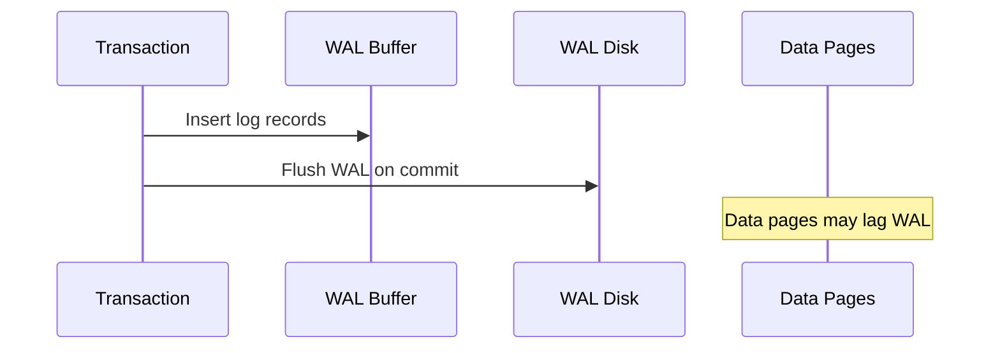

## Quick Revision

- Every commit persists **WAL** before data pages (write-ahead logging).
- **LSN** monotonically identifies WAL position.
- **Checkpoints** bound crash recovery time.
- WAL is the foundation for **streaming replication** and **PITR**.

## Core Concepts

| Term | Meaning |
| :--- | :--- |
| WAL segment | Typically 16 MB file of log records |
| LSN | Log Sequence Number — replay pointer |
| Checkpoint | Consistent recovery starting point |
| `archive_command` | Ship completed segments for DR |
| `pg_switch_wal()` | Force segment rotation before promotion |

## Internal Working

**Commit path**: record changes in WAL buffer → `XLOG_FLUSH` → mark transaction committed in CLOG → return to client. Crash recovery **replays** WAL from last checkpoint. Standbys **replay** same WAL stream.

## Architecture

## Reliability

- Place WAL on **durable low-latency** storage — NVMe preferred.
- `synchronous_commit` and replication quorum control durability vs latency.
- Monitor WAL generation rate for disk and replica capacity.

## Production Patterns

- Enable `wal_compression` on busy OLTP if CPU allows.
- Size `max_wal_size` to avoid checkpoint storms — see [Performance Tuning](/postgresql-cheatsheet/03-query-performance/performance-tuning/).
- Base backup + archived WAL for [Disaster Recovery](/postgresql-cheatsheet/04-high-availability/disaster-recovery/).

## Troubleshooting

| Symptom | Likely cause |
| :--- | :--- |
| Disk filling | Replication slot lag or archive failure |
| Slow commits | `synchronous_commit=on` + slow sync replica |

## Interview Answers

## Question {#q-12}

What is write-ahead logging and why must WAL flush precede commit acknowledgment?

### Short Answer

WAL records changes before data pages reach disk; commit waits for WAL flush (unless relaxed). This directly answers: what is write-ahead logging and why must wal flush precede commit acknowledgment?

### Detailed Explanation

Checkpoints bound recovery; LSN positions enable replication and PITR. For **Architecture** depth, reason about failure modes and measurable signals before changing configuration.

### Internal Working

Canonical internals live on `/postgresql-cheatsheet/02-core-postgresql/wal/` — cite xmin/xmax, WAL, or planner nodes as appropriate.

### Production Notes

Confirm with metrics and staged tests; document rollback for HA and DDL changes.

### Common Mistakes

Applying generic blog tuning without workload evidence; ignoring pooler and replica lag.

### Follow-up Questions

- What metric would disprove your hypothesis?
- Which handbook page is the canonical source?

---

## Question {#q-13}

How do LSN values relate to replication and PITR?

### Short Answer

WAL records changes before data pages reach disk; commit waits for WAL flush (unless relaxed). This directly answers: how do lsn values relate to replication and pitr?

### Detailed Explanation

Checkpoints bound recovery; LSN positions enable replication and PITR. For **Architecture** depth, reason about failure modes and measurable signals before changing configuration.

### Internal Working

Canonical internals live on `/postgresql-cheatsheet/02-core-postgresql/wal/` — cite xmin/xmax, WAL, or planner nodes as appropriate.

### Production Notes

Confirm with metrics and staged tests; document rollback for HA and DDL changes.

### Common Mistakes

Applying generic blog tuning without workload evidence; ignoring pooler and replica lag.

### Follow-up Questions

- What metric would disprove your hypothesis?
- Which handbook page is the canonical source?

---

## Question {#q-14}

What triggers a checkpoint and how does it bound crash recovery time?

### Short Answer

WAL records changes before data pages reach disk; commit waits for WAL flush (unless relaxed). This directly answers: what triggers a checkpoint and how does it bound crash recovery time?

### Detailed Explanation

Checkpoints bound recovery; LSN positions enable replication and PITR. For **Architecture** depth, reason about failure modes and measurable signals before changing configuration.

### Internal Working

Canonical internals live on `/postgresql-cheatsheet/02-core-postgresql/wal/` — cite xmin/xmax, WAL, or planner nodes as appropriate.

### Production Notes

Confirm with metrics and staged tests; document rollback for HA and DDL changes.

### Common Mistakes

Applying generic blog tuning without workload evidence; ignoring pooler and replica lag.

### Follow-up Questions

- What metric would disprove your hypothesis?
- Which handbook page is the canonical source?

---

## Question {#q-15}

How does crash recovery replay WAL after an unclean shutdown?

### Short Answer

WAL records changes before data pages reach disk; commit waits for WAL flush (unless relaxed). This directly answers: how does crash recovery replay wal after an unclean shutdown?

### Detailed Explanation

Checkpoints bound recovery; LSN positions enable replication and PITR. For **Architecture** depth, reason about failure modes and measurable signals before changing configuration.

### Internal Working

Canonical internals live on `/postgresql-cheatsheet/02-core-postgresql/wal/` — cite xmin/xmax, WAL, or planner nodes as appropriate.

### Production Notes

Confirm with metrics and staged tests; document rollback for HA and DDL changes.

### Common Mistakes

Applying generic blog tuning without workload evidence; ignoring pooler and replica lag.

### Follow-up Questions

- What metric would disprove your hypothesis?
- Which handbook page is the canonical source?

---

## Question {#q-68}

What failures occur when archive_command stops shipping WAL?

### Short Answer

WAL records changes before data pages reach disk; commit waits for WAL flush (unless relaxed). This directly answers: what failures occur when archive_command stops shipping wal?

### Detailed Explanation

Checkpoints bound recovery; LSN positions enable replication and PITR. For **Troubleshooting** depth, reason about failure modes and measurable signals before changing configuration.

### Internal Working

Canonical internals live on `/postgresql-cheatsheet/02-core-postgresql/wal/` — cite xmin/xmax, WAL, or planner nodes as appropriate.

### Production Notes

Confirm with metrics and staged tests; document rollback for HA and DDL changes.

### Common Mistakes

Applying generic blog tuning without workload evidence; ignoring pooler and replica lag.

### Follow-up Questions

- What metric would disprove your hypothesis?
- Which handbook page is the canonical source?

---

## Question {#q-102}

How does WAL archiving enable point-in-time recovery?

### Short Answer

WAL records changes before data pages reach disk; commit waits for WAL flush (unless relaxed). This directly answers: how does wal archiving enable point-in-time recovery?

### Detailed Explanation

Checkpoints bound recovery; LSN positions enable replication and PITR. For **Reliability** depth, reason about failure modes and measurable signals before changing configuration.

### Internal Working

Canonical internals live on `/postgresql-cheatsheet/02-core-postgresql/wal/` — cite xmin/xmax, WAL, or planner nodes as appropriate.

### Production Notes

Confirm with metrics and staged tests; document rollback for HA and DDL changes.

### Common Mistakes

Applying generic blog tuning without workload evidence; ignoring pooler and replica lag.

### Follow-up Questions

- What metric would disprove your hypothesis?
- Which handbook page is the canonical source?

---

## Question {#q-113}

What is the durability guarantee with synchronous_commit=off?

### Short Answer

WAL records changes before data pages reach disk; commit waits for WAL flush (unless relaxed). This directly answers: what is the durability guarantee with synchronous_commit=off?

### Detailed Explanation

Checkpoints bound recovery; LSN positions enable replication and PITR. For **Reliability** depth, reason about failure modes and measurable signals before changing configuration.

### Internal Working

Canonical internals live on `/postgresql-cheatsheet/02-core-postgresql/wal/` — cite xmin/xmax, WAL, or planner nodes as appropriate.

### Production Notes

Confirm with metrics and staged tests; document rollback for HA and DDL changes.

### Common Mistakes

Applying generic blog tuning without workload evidence; ignoring pooler and replica lag.

### Follow-up Questions

- What metric would disprove your hypothesis?
- Which handbook page is the canonical source?

## See Also

- [Previous: Storage](/postgresql-cheatsheet/02-core-postgresql/storage-engine/)
- [Next: MVCC](/postgresql-cheatsheet/02-core-postgresql/mvcc/)
- [PostgreSQL Handbook](/postgresql-cheatsheet/)
- [Database Handbook — PostgreSQL](/database-handbook/postgresql/)
