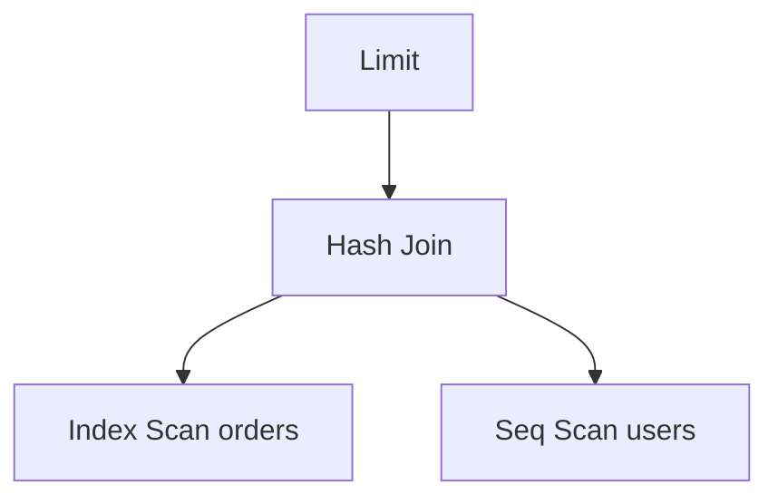

## Quick Revision

`EXPLAIN` shows the planner's chosen path. Add **ANALYZE** to execute and show actual row counts and timing; **BUFFERS** reveals cache hits.

---

## Core Concepts

| Node | Meaning |
| :--- | :--- |
| `Seq Scan` | Full table read — OK for small tables |
| `Index Scan` | Index lookup + heap fetch |
| `Index Only Scan` | Satisfied from index — ideal |
| `Bitmap Heap Scan` | Index bitmap then heap visit |
| `Nested Loop` | Good for small outer sets |
| `Hash Join` | Build hash on inner — equality joins |
| `Merge Join` | Pre-sorted inputs |

---

## Quick Reference

```sql
EXPLAIN SELECT * FROM orders WHERE user_id = 42;

EXPLAIN (ANALYZE, BUFFERS, FORMAT TEXT)
SELECT * FROM orders WHERE user_id = 42;

EXPLAIN (ANALYZE, BUFFERS, VERBOSE, SETTINGS)
SELECT o.* FROM orders o JOIN users u ON u.id = o.user_id WHERE u.email = 'a@b.com';
```

---

## Snippets

```sql
-- Compare estimated vs actual rows — big gaps mean stale stats
-- Run: ANALYZE orders;

-- Force plan for testing only (session-local)
SET enable_seqscan = off;
```

---

## Common Gotchas

- High **actual** vs **estimated** rows → run `ANALYZE` or increase `default_statistics_target`.
- `EXPLAIN` without `ANALYZE` is cheap but can mislead on row estimates.
- Use [Monitoring](/postgresql-cheatsheet/06-production-operations/monitoring/) (`pg_stat_statements`) for production workload — not ad-hoc EXPLAIN everywhere.

---

## Internal Working



Large gaps between **rows=estimated** and **actual** rows indicate stale statistics — see [Query Optimization](/postgresql-cheatsheet/03-query-performance/query-optimization/).


## Interview Answers

## Question {#q-43}

How do estimated versus actual rows in EXPLAIN ANALYZE guide diagnosis?

### Short Answer

Large **actual rows** on Seq Scan with selective filter + high **Buffers read** → candidate for index; compare estimated vs actual for stats drift.

### Detailed Explanation

EXPLAIN (ANALYZE, BUFFERS) shows plan nodes with timing and buffer hits. Seq Scan on a huge table where few rows return suggests missing index. Big estimate/actual gap → run ANALYZE or raise statistics target.

### Internal Working

Bitmap Heap Scan may appear when index is selective but heap fetch is still needed.

### Production Notes

Use pg_stat_statements first to find offenders; EXPLAIN on representative queries only.

### Common Mistakes

Creating indexes before checking selectivity and write amplification.

### Follow-up Questions

- What is an Index Only Scan?
- When does Hash Join win?

---

## Question {#q-44}

What indicates a missing index on a large table scan?

### Short Answer

EXPLAIN shows planned nodes; ANALYZE executes and shows actuals. This directly answers: what indicates a missing index on a large table scan?

### Detailed Explanation

BUFFERS exposes cache efficiency per node. For **Troubleshooting** depth, reason about failure modes and measurable signals before changing configuration.

### Internal Working

Canonical internals live on `/postgresql-cheatsheet/03-query-performance/explain/` — cite xmin/xmax, WAL, or planner nodes as appropriate.

### Production Notes

Confirm with metrics and staged tests; document rollback for HA and DDL changes.

### Common Mistakes

Applying generic blog tuning without workload evidence; ignoring pooler and replica lag.

### Follow-up Questions

- What metric would disprove your hypothesis?
- Which handbook page is the canonical source?

---

## Question {#q-64}

What causes sort operations to spill to disk and how do you confirm?

### Short Answer

EXPLAIN shows planned nodes; ANALYZE executes and shows actuals. This directly answers: what causes sort operations to spill to disk and how do you confirm?

### Detailed Explanation

BUFFERS exposes cache efficiency per node. For **Troubleshooting** depth, reason about failure modes and measurable signals before changing configuration.

### Internal Working

Canonical internals live on `/postgresql-cheatsheet/03-query-performance/explain/` — cite xmin/xmax, WAL, or planner nodes as appropriate.

### Production Notes

Confirm with metrics and staged tests; document rollback for HA and DDL changes.

### Common Mistakes

Applying generic blog tuning without workload evidence; ignoring pooler and replica lag.

### Follow-up Questions

- What metric would disprove your hypothesis?
- Which handbook page is the canonical source?

---

## Question {#q-76}

What does EXPLAIN BUFFERS reveal about cache efficiency?

### Short Answer

EXPLAIN shows planned nodes; ANALYZE executes and shows actuals. This directly answers: what does explain buffers reveal about cache efficiency?

### Detailed Explanation

BUFFERS exposes cache efficiency per node. For **Performance** depth, reason about failure modes and measurable signals before changing configuration.

### Internal Working

Canonical internals live on `/postgresql-cheatsheet/03-query-performance/explain/` — cite xmin/xmax, WAL, or planner nodes as appropriate.

### Production Notes

Confirm with metrics and staged tests; document rollback for HA and DDL changes.

### Common Mistakes

Applying generic blog tuning without workload evidence; ignoring pooler and replica lag.

### Follow-up Questions

- What metric would disprove your hypothesis?
- Which handbook page is the canonical source?


## See Also

- [Previous: Indexes](/postgresql-cheatsheet/03-query-performance/indexes/)
- [Next: Optimizer](/postgresql-cheatsheet/03-query-performance/query-optimization/)
- [PostgreSQL Handbook](/postgresql-cheatsheet/)
- [Database Handbook — PostgreSQL](/database-handbook/postgresql/)