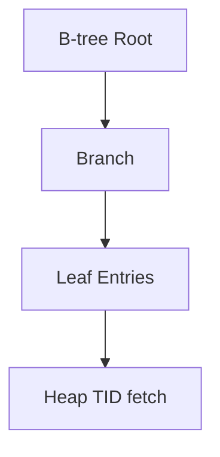

## Quick Revision

Indexes accelerate reads at write/storage cost. Default **B-tree** suits most equality/range queries; specialized indexes for JSON, text search, and geospatial.

---

## Core Concepts

| Type | Best for |
| :--- | :--- |
| **B-tree** (default) | `=`, `<`, `>`, `BETWEEN`, `ORDER BY` |
| **Hash** | Equality only — rarely needed vs B-tree |
| **GIN** | jsonb, arrays, full-text |
| **GiST** | Geometric, range types, full-text |
| **BRIN** | Very large, naturally ordered tables |
| **Partial** | `WHERE active = true` — smaller, targeted |

---

## Quick Reference

```sql
CREATE INDEX idx_orders_user_created ON orders (user_id, created_at DESC);
CREATE INDEX idx_users_email_lower ON users (lower(email));
CREATE UNIQUE INDEX idx_products_sku ON products (sku);

-- Covering index (INCLUDE — PG 11+)
CREATE INDEX idx_orders_cover ON orders (user_id) INCLUDE (total, status);
```

---

## Snippets

```sql
-- JSONB GIN
CREATE INDEX idx_events_payload ON events USING gin (payload jsonb_path_ops);

-- Partial index
CREATE INDEX idx_active_users ON users (last_login) WHERE status = 'active';
```

---

## Common Gotchas

- Unused indexes waste write amplification — check `pg_stat_user_indexes`.
- `REINDEX CONCURRENTLY` rebuilds without blocking reads (PG 12+).
- Too many indexes on hot write tables hurts INSERT/UPDATE throughput.

---


## Internal Working




## Interview Answers

## Question {#q-71}

When would you choose a partial index over a full B-tree index?

### Short Answer

B-tree is default; GIN/GiST/BRIN match access patterns. This directly answers: when would you choose a partial index over a full b-tree index?

### Detailed Explanation

Partial and covering indexes reduce size and heap fetches. For **Performance** depth, reason about failure modes and measurable signals before changing configuration.

### Internal Working

Canonical internals live on `/postgresql-cheatsheet/03-query-performance/indexes/` — cite xmin/xmax, WAL, or planner nodes as appropriate.

### Production Notes

Confirm with metrics and staged tests; document rollback for HA and DDL changes.

### Common Mistakes

Applying generic blog tuning without workload evidence; ignoring pooler and replica lag.

### Follow-up Questions

- What metric would disprove your hypothesis?
- Which handbook page is the canonical source?

---

## Question {#q-72}

How does a covering index with INCLUDE enable index-only scans?

### Short Answer

**Partial** indexes rows matching `WHERE` — smaller, targeted. **Covering** indexes add `INCLUDE` columns for index-only scans without entering the predicate.

### Detailed Explanation

Partial index when queries always filter (`WHERE active`). Covering when projection columns can be satisfied from the index leaf pages. Combine: partial + INCLUDE for hot filtered queries.

### Production Notes

Confirm Index Only Scan in EXPLAIN; requires visibility map cooperation.

### Common Mistakes

Partial index predicate not matching query WHERE — planner ignores it.

### Follow-up Questions

- When is GIN better than B-tree?
- How to find unused indexes?

---

## Question {#q-73}

When does GIN outperform B-tree for jsonb queries?

### Short Answer

Transaction pooling returns server connections between transactions; **named prepared statements** are session-bound and break unless using unnamed statements or driver settings.

### Detailed Explanation

PgBouncer transaction mode yields a server connection per transaction only. Prepared statements prepared on connection A may not exist when the next transaction gets connection B. Fixes: `prepare_threshold=0` (JDBC), unnamed prepares, or session pooling.

### Production Notes

Test failover + pool mode in staging with exact driver/framework versions.

### Common Mistakes

Switching to transaction pooling without regression-testing ORM prepared statement behavior.

### Follow-up Questions

- Session vs transaction pooling tradeoffs?
- How to rotate credentials with pooler?

---

## Question {#q-74}

What is BRIN appropriate for and when is it wrong?

### Short Answer

B-tree is default; GIN/GiST/BRIN match access patterns. This directly answers: what is brin appropriate for and when is it wrong?

### Detailed Explanation

Partial and covering indexes reduce size and heap fetches. For **Performance** depth, reason about failure modes and measurable signals before changing configuration.

### Internal Working

Canonical internals live on `/postgresql-cheatsheet/03-query-performance/indexes/` — cite xmin/xmax, WAL, or planner nodes as appropriate.

### Production Notes

Confirm with metrics and staged tests; document rollback for HA and DDL changes.

### Common Mistakes

Applying generic blog tuning without workload evidence; ignoring pooler and replica lag.

### Follow-up Questions

- What metric would disprove your hypothesis?
- Which handbook page is the canonical source?

---

## Question {#q-75}

How do you identify and drop unused indexes safely?

### Short Answer

B-tree is default; GIN/GiST/BRIN match access patterns. This directly answers: how do you identify and drop unused indexes safely?

### Detailed Explanation

Partial and covering indexes reduce size and heap fetches. For **Performance** depth, reason about failure modes and measurable signals before changing configuration.

### Internal Working

Canonical internals live on `/postgresql-cheatsheet/03-query-performance/indexes/` — cite xmin/xmax, WAL, or planner nodes as appropriate.

### Production Notes

Confirm with metrics and staged tests; document rollback for HA and DDL changes.

### Common Mistakes

Applying generic blog tuning without workload evidence; ignoring pooler and replica lag.

### Follow-up Questions

- What metric would disprove your hypothesis?
- Which handbook page is the canonical source?

---

## Question {#q-86}

What index strategy supports keyset pagination at scale?

### Short Answer

B-tree is default; GIN/GiST/BRIN match access patterns. This directly answers: what index strategy supports keyset pagination at scale?

### Detailed Explanation

Partial and covering indexes reduce size and heap fetches. For **Performance** depth, reason about failure modes and measurable signals before changing configuration.

### Internal Working

Canonical internals live on `/postgresql-cheatsheet/03-query-performance/indexes/` — cite xmin/xmax, WAL, or planner nodes as appropriate.

### Production Notes

Confirm with metrics and staged tests; document rollback for HA and DDL changes.

### Common Mistakes

Applying generic blog tuning without workload evidence; ignoring pooler and replica lag.

### Follow-up Questions

- What metric would disprove your hypothesis?
- Which handbook page is the canonical source?

---

## Question {#q-87}

How do you reduce write amplification from too many secondary indexes?

### Short Answer

B-tree is default; GIN/GiST/BRIN match access patterns. This directly answers: how do you reduce write amplification from too many secondary indexes?

### Detailed Explanation

Partial and covering indexes reduce size and heap fetches. For **Performance** depth, reason about failure modes and measurable signals before changing configuration.

### Internal Working

Canonical internals live on `/postgresql-cheatsheet/03-query-performance/indexes/` — cite xmin/xmax, WAL, or planner nodes as appropriate.

### Production Notes

Confirm with metrics and staged tests; document rollback for HA and DDL changes.

### Common Mistakes

Applying generic blog tuning without workload evidence; ignoring pooler and replica lag.

### Follow-up Questions

- What metric would disprove your hypothesis?
- Which handbook page is the canonical source?

---

## Question {#q-94}

What is the cost of functional indexes on lower(email)?

### Short Answer

B-tree is default; GIN/GiST/BRIN match access patterns. This directly answers: what is the cost of functional indexes on lower(email)?

### Detailed Explanation

Partial and covering indexes reduce size and heap fetches. For **Performance** depth, reason about failure modes and measurable signals before changing configuration.

### Internal Working

Canonical internals live on `/postgresql-cheatsheet/03-query-performance/indexes/` — cite xmin/xmax, WAL, or planner nodes as appropriate.

### Production Notes

Confirm with metrics and staged tests; document rollback for HA and DDL changes.

### Common Mistakes

Applying generic blog tuning without workload evidence; ignoring pooler and replica lag.

### Follow-up Questions

- What metric would disprove your hypothesis?
- Which handbook page is the canonical source?

---

## Question {#q-142}

What is the role of extensions like PostGIS or pgvector in platform architecture?

### Short Answer

B-tree is default; GIN/GiST/BRIN match access patterns. This directly answers: what is the role of extensions like postgis or pgvector in platform architecture?

### Detailed Explanation

Partial and covering indexes reduce size and heap fetches. For **Architecture** depth, reason about failure modes and measurable signals before changing configuration.

### Internal Working

Canonical internals live on `/postgresql-cheatsheet/03-query-performance/indexes/` — cite xmin/xmax, WAL, or planner nodes as appropriate.

### Production Notes

Confirm with metrics and staged tests; document rollback for HA and DDL changes.

### Common Mistakes

Applying generic blog tuning without workload evidence; ignoring pooler and replica lag.

### Follow-up Questions

- What metric would disprove your hypothesis?
- Which handbook page is the canonical source?


## See Also

- [Previous: Joins](/postgresql-cheatsheet/01-fundamentals/joins/)
- [Next: EXPLAIN](/postgresql-cheatsheet/03-query-performance/explain/)
- [PostgreSQL Handbook](/postgresql-cheatsheet/)
- [Database Handbook — PostgreSQL](/database-handbook/postgresql/)
