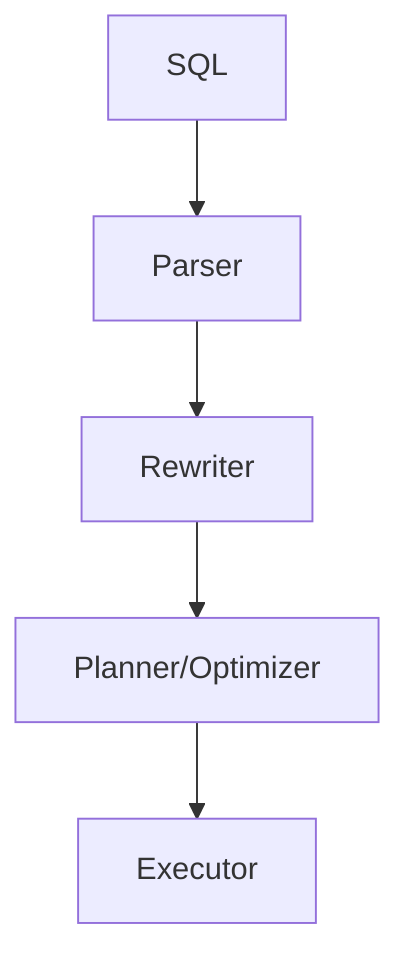
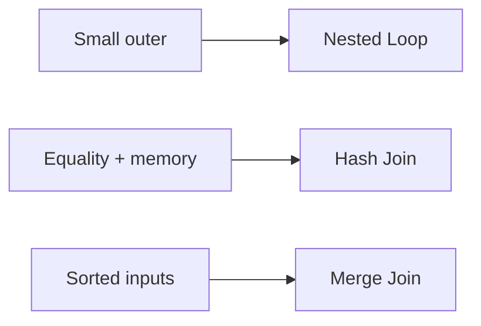

## Quick Revision

- **Parser** → **rewriter** → **planner** → **executor**.
- Planner uses **statistics** and **cost model** (seq_page_cost, cpu_tuple_cost, …).
- Bad cardinality estimates → wrong join order — fix stats before knobs.
- **Parallel query** uses gather workers for large scans/aggregates.

## Core Concepts

| Stage | Output |
| :--- | :--- |
| Parser | Query tree |
| Planner | Cheapest path (join order, access methods) |
| Executor | Tuple pipeline |
| `pg_statistic` | Column histograms, ndistinct |
| Extended stats | Multivariate ndistinct, dependencies |

## Internal Working

Join planning: nested loop (small outer), hash join (equality, memory-bound), merge join (sorted inputs). **Genetic** optimizer kicks in for many-table joins. CTE inlining controlled by `MATERIALIZED` hints — see [CTEs](/postgresql-cheatsheet/01-fundamentals/ctes/).

## Design Tradeoffs

| Tuning | Risk |
| :--- | :--- |
| Disable seqscan globally | Hides planner mistakes |
| Raise `default_statistics_target` | Slower ANALYZE; better estimates |
| Force parallel | CPU contention on OLTP |

## Production Patterns

- Run `ANALYZE` after large data changes.
- Use `EXPLAIN (ANALYZE, BUFFERS)` — [EXPLAIN](/postgresql-cheatsheet/03-query-performance/explain/).
- `pg_stat_statements` for workload-wide regressions — [Monitoring](/postgresql-cheatsheet/06-production-operations/monitoring/).

## Internal Working

## Interview Answers

## Question {#q-65}

How do you remediate a query plan regression after statistics drift?

### Short Answer

Cost-based planner picks join order and access paths using statistics. This directly answers: how do you remediate a query plan regression after statistics drift?

### Detailed Explanation

Bad cardinality estimates cause wrong join algorithms. For **Troubleshooting** depth, reason about failure modes and measurable signals before changing configuration.

### Internal Working

Canonical internals live on `/postgresql-cheatsheet/03-query-performance/query-optimization/` — cite xmin/xmax, WAL, or planner nodes as appropriate.

### Production Notes

Confirm with metrics and staged tests; document rollback for HA and DDL changes.

### Common Mistakes

Applying generic blog tuning without workload evidence; ignoring pooler and replica lag.

### Follow-up Questions

- What metric would disprove your hypothesis?
- Which handbook page is the canonical source?

---

## Question {#q-77}

How does increasing default_statistics_target affect plan quality and ANALYZE cost?

### Short Answer

Cost-based planner picks join order and access paths using statistics. This directly answers: how does increasing default_statistics_target affect plan quality and analyze cost?

### Detailed Explanation

Bad cardinality estimates cause wrong join algorithms. For **Performance** depth, reason about failure modes and measurable signals before changing configuration.

### Internal Working

Canonical internals live on `/postgresql-cheatsheet/03-query-performance/query-optimization/` — cite xmin/xmax, WAL, or planner nodes as appropriate.

### Production Notes

Confirm with metrics and staged tests; document rollback for HA and DDL changes.

### Common Mistakes

Applying generic blog tuning without workload evidence; ignoring pooler and replica lag.

### Follow-up Questions

- What metric would disprove your hypothesis?
- Which handbook page is the canonical source?

---

## Question {#q-78}

When does the planner choose hash join versus nested loop?

### Short Answer

Cost-based planner picks join order and access paths using statistics. This directly answers: when does the planner choose hash join versus nested loop?

### Detailed Explanation

Bad cardinality estimates cause wrong join algorithms. For **Performance** depth, reason about failure modes and measurable signals before changing configuration.

### Internal Working

Canonical internals live on `/postgresql-cheatsheet/03-query-performance/query-optimization/` — cite xmin/xmax, WAL, or planner nodes as appropriate.

### Production Notes

Confirm with metrics and staged tests; document rollback for HA and DDL changes.

### Common Mistakes

Applying generic blog tuning without workload evidence; ignoring pooler and replica lag.

### Follow-up Questions

- What metric would disprove your hypothesis?
- Which handbook page is the canonical source?

---

## Question {#q-79}

What parameters enable parallel sequential scan and when is parallel harmful?

### Short Answer

Cost-based planner picks join order and access paths using statistics. This directly answers: what parameters enable parallel sequential scan and when is parallel harmful?

### Detailed Explanation

Bad cardinality estimates cause wrong join algorithms. For **Performance** depth, reason about failure modes and measurable signals before changing configuration.

### Internal Working

Canonical internals live on `/postgresql-cheatsheet/03-query-performance/query-optimization/` — cite xmin/xmax, WAL, or planner nodes as appropriate.

### Production Notes

Confirm with metrics and staged tests; document rollback for HA and DDL changes.

### Common Mistakes

Applying generic blog tuning without workload evidence; ignoring pooler and replica lag.

### Follow-up Questions

- What metric would disprove your hypothesis?
- Which handbook page is the canonical source?

---

## Question {#q-83}

How does effective_cache_size influence index versus seq scan choices?

### Short Answer

Cost-based planner picks join order and access paths using statistics. This directly answers: how does effective_cache_size influence index versus seq scan choices?

### Detailed Explanation

Bad cardinality estimates cause wrong join algorithms. For **Performance** depth, reason about failure modes and measurable signals before changing configuration.

### Internal Working

Canonical internals live on `/postgresql-cheatsheet/03-query-performance/query-optimization/` — cite xmin/xmax, WAL, or planner nodes as appropriate.

### Production Notes

Confirm with metrics and staged tests; document rollback for HA and DDL changes.

### Common Mistakes

Applying generic blog tuning without workload evidence; ignoring pooler and replica lag.

### Follow-up Questions

- What metric would disprove your hypothesis?
- Which handbook page is the canonical source?

## See Also

- [Previous: EXPLAIN](/postgresql-cheatsheet/03-query-performance/explain/)
- [Next: Perf Tuning](/postgresql-cheatsheet/03-query-performance/performance-tuning/)
- [PostgreSQL Handbook](/postgresql-cheatsheet/)
- [Database Handbook — PostgreSQL](/database-handbook/postgresql/)