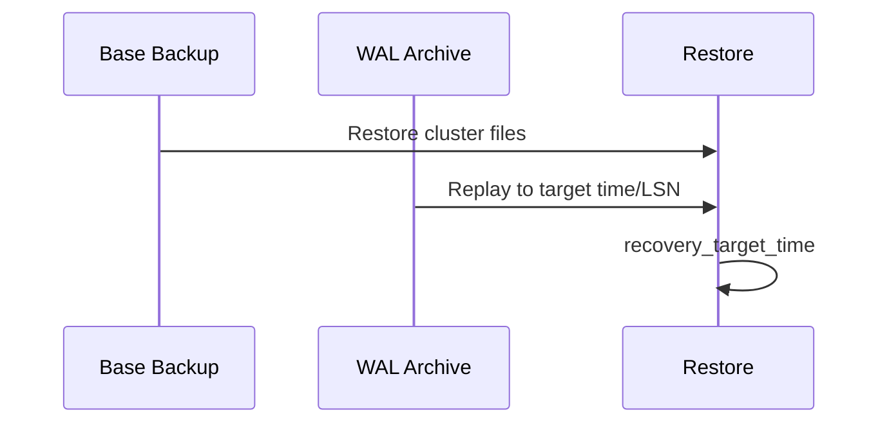

## Quick Revision

- **PITR** = base backup + continuous WAL archive → recover to timestamp/LSN.
- Define **RPO** (max acceptable data loss) and **RTO** (max downtime).
- Logical backups (`pg_dump`) are portable but not PITR.
- Test restores — backup without restore test is incomplete.

## Core Concepts

| Method | PITR | Granularity |
| :--- | :---: | :--- |
| `pg_dump` / `pg_restore` | No | DB/schema/table |
| Base backup + WAL archive | Yes | Cluster |
| Storage snapshot + WAL | Yes | Cluster (vendor-dependent) |

## Production Patterns

- `archive_command` or `archive_library` ships WAL to object storage.
- `recovery_target_time` for point-in-time restore.
- 3-2-1 backup rule: 3 copies, 2 media types, 1 offsite.

## Reliability

| Tier | RPO | RTO |
| :--- | :--- | :--- |
| Logical nightly dump | Up to 24h | Hours |
| WAL archive + daily base | Minutes | Tens of minutes |
| Sync replica + auto failover | ~0 | Minutes |

## Reliability

## Interview Answers

## Question {#q-66}

What steps validate a backup before an incident requires restore?

### Short Answer

PITR needs base backup + continuous WAL archive. This directly answers: what steps validate a backup before an incident requires restore?

### Detailed Explanation

Test restores define real RTO. For **Troubleshooting** depth, reason about failure modes and measurable signals before changing configuration.

### Internal Working

Canonical internals live on `/postgresql-cheatsheet/04-high-availability/disaster-recovery/` — cite xmin/xmax, WAL, or planner nodes as appropriate.

### Production Notes

Confirm with metrics and staged tests; document rollback for HA and DDL changes.

### Common Mistakes

Applying generic blog tuning without workload evidence; ignoring pooler and replica lag.

### Follow-up Questions

- What metric would disprove your hypothesis?
- Which handbook page is the canonical source?

---

## Question {#q-67}

How do you perform PITR to a timestamp before accidental DELETE?

### Short Answer

PITR needs base backup + continuous WAL archive. This directly answers: how do you perform pitr to a timestamp before accidental delete?

### Detailed Explanation

Test restores define real RTO. For **Troubleshooting** depth, reason about failure modes and measurable signals before changing configuration.

### Internal Working

Canonical internals live on `/postgresql-cheatsheet/04-high-availability/disaster-recovery/` — cite xmin/xmax, WAL, or planner nodes as appropriate.

### Production Notes

Confirm with metrics and staged tests; document rollback for HA and DDL changes.

### Common Mistakes

Applying generic blog tuning without workload evidence; ignoring pooler and replica lag.

### Follow-up Questions

- What metric would disprove your hypothesis?
- Which handbook page is the canonical source?

---

## Question {#q-100}

How do you design a 3-2-1 backup strategy for PostgreSQL?

### Short Answer

PITR needs base backup + continuous WAL archive. This directly answers: how do you design a 3-2-1 backup strategy for postgresql?

### Detailed Explanation

Test restores define real RTO. For **Reliability** depth, reason about failure modes and measurable signals before changing configuration.

### Internal Working

Canonical internals live on `/postgresql-cheatsheet/04-high-availability/disaster-recovery/` — cite xmin/xmax, WAL, or planner nodes as appropriate.

### Production Notes

Confirm with metrics and staged tests; document rollback for HA and DDL changes.

### Common Mistakes

Applying generic blog tuning without workload evidence; ignoring pooler and replica lag.

### Follow-up Questions

- What metric would disprove your hypothesis?
- Which handbook page is the canonical source?

---

## Question {#q-101}

What is recovery_target_time in PITR restore?

### Short Answer

PITR needs base backup + continuous WAL archive. This directly answers: what is recovery_target_time in pitr restore?

### Detailed Explanation

Test restores define real RTO. For **Reliability** depth, reason about failure modes and measurable signals before changing configuration.

### Internal Working

Canonical internals live on `/postgresql-cheatsheet/04-high-availability/disaster-recovery/` — cite xmin/xmax, WAL, or planner nodes as appropriate.

### Production Notes

Confirm with metrics and staged tests; document rollback for HA and DDL changes.

### Common Mistakes

Applying generic blog tuning without workload evidence; ignoring pooler and replica lag.

### Follow-up Questions

- What metric would disprove your hypothesis?
- Which handbook page is the canonical source?

---

## Question {#q-114}

How do you validate RTO with scheduled restore drills?

### Short Answer

PITR needs base backup + continuous WAL archive. This directly answers: how do you validate rto with scheduled restore drills?

### Detailed Explanation

Test restores define real RTO. For **Reliability** depth, reason about failure modes and measurable signals before changing configuration.

### Internal Working

Canonical internals live on `/postgresql-cheatsheet/04-high-availability/disaster-recovery/` — cite xmin/xmax, WAL, or planner nodes as appropriate.

### Production Notes

Confirm with metrics and staged tests; document rollback for HA and DDL changes.

### Common Mistakes

Applying generic blog tuning without workload evidence; ignoring pooler and replica lag.

### Follow-up Questions

- What metric would disprove your hypothesis?
- Which handbook page is the canonical source?

## See Also

- [Previous: Backup](/postgresql-cheatsheet/04-high-availability/backup-restore/)
- [Next: Functions](/postgresql-cheatsheet/05-advanced-features/functions/)
- [PostgreSQL Handbook](/postgresql-cheatsheet/)
- [Database Handbook — PostgreSQL](/database-handbook/postgresql/)