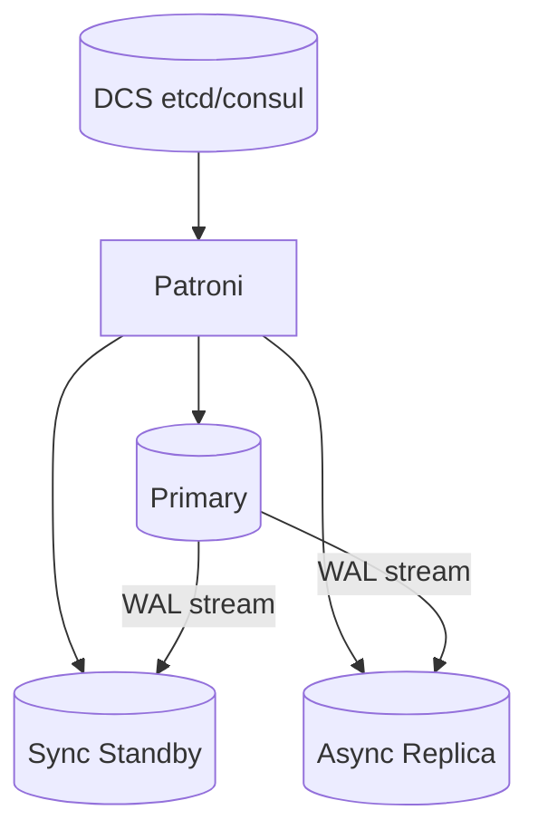

## Quick Revision

- **Streaming replication** keeps standby in recovery mode replaying WAL.
- **Promotion** ends recovery and accepts writes — `pg_ctl promote` or Patroni.
- Know **RPO** (async data loss window) and **RTO** (time to writable primary).
- Use orchestration (Patroni, repmgr, cloud HA) — manual promotion is last resort.

## Core Concepts

| Mode | RPO |
| :--- | :--- |
| Async replication | May lose un-replicated WAL |
| Sync `remote_write` | WAL received on standby |
| Sync `remote_apply` | Applied on standby — tighter |
| Quorum commit | Majority standbys |

## Architecture

## Production Patterns

- `pg_switch_wal()` before controlled failover.
- Rewind or rebuild orphaned old primary after split-brain.
- Connection strings via VIP, DNS, or pooler with failover hooks.

## Reliability

- Test failover quarterly — untested HA fails in incidents.
- Monitor replication lag bytes and `pg_stat_replication` state.

## Interview Answers

## Question {#q-34}

What HA topology would you design for RPO near zero in a single region?

### Short Answer

Promotion ends recovery; orchestration avoids split-brain. This directly answers: what ha topology would you design for rpo near zero in a single region?

### Detailed Explanation

Know RPO/RTO for sync vs async. For **Architecture** depth, reason about failure modes and measurable signals before changing configuration.

### Internal Working

Canonical internals live on `/postgresql-cheatsheet/04-high-availability/failover/` — cite xmin/xmax, WAL, or planner nodes as appropriate.

### Production Notes

Confirm with metrics and staged tests; document rollback for HA and DDL changes.

### Common Mistakes

Applying generic blog tuning without workload evidence; ignoring pooler and replica lag.

### Follow-up Questions

- What metric would disprove your hypothesis?
- Which handbook page is the canonical source?

---

## Question {#q-35}

How does Patroni coordinate failover with a distributed consensus store?

### Short Answer

Promotion ends recovery; orchestration avoids split-brain. This directly answers: how does patroni coordinate failover with a distributed consensus store?

### Detailed Explanation

Know RPO/RTO for sync vs async. For **Architecture** depth, reason about failure modes and measurable signals before changing configuration.

### Internal Working

Canonical internals live on `/postgresql-cheatsheet/04-high-availability/failover/` — cite xmin/xmax, WAL, or planner nodes as appropriate.

### Production Notes

Confirm with metrics and staged tests; document rollback for HA and DDL changes.

### Common Mistakes

Applying generic blog tuning without workload evidence; ignoring pooler and replica lag.

### Follow-up Questions

- What metric would disprove your hypothesis?
- Which handbook page is the canonical source?

---

## Question {#q-36}

What happens to the old primary after promotion in a split-brain scenario?

### Short Answer

Promotion ends recovery; orchestration avoids split-brain. This directly answers: what happens to the old primary after promotion in a split-brain scenario?

### Detailed Explanation

Know RPO/RTO for sync vs async. For **Architecture** depth, reason about failure modes and measurable signals before changing configuration.

### Internal Working

Canonical internals live on `/postgresql-cheatsheet/04-high-availability/failover/` — cite xmin/xmax, WAL, or planner nodes as appropriate.

### Production Notes

Confirm with metrics and staged tests; document rollback for HA and DDL changes.

### Common Mistakes

Applying generic blog tuning without workload evidence; ignoring pooler and replica lag.

### Follow-up Questions

- What metric would disprove your hypothesis?
- Which handbook page is the canonical source?

---

## Question {#q-103}

What failure modes occur during promote when replicas are diverged?

### Short Answer

Promotion ends recovery; orchestration avoids split-brain. This directly answers: what failure modes occur during promote when replicas are diverged?

### Detailed Explanation

Know RPO/RTO for sync vs async. For **Reliability** depth, reason about failure modes and measurable signals before changing configuration.

### Internal Working

Canonical internals live on `/postgresql-cheatsheet/04-high-availability/failover/` — cite xmin/xmax, WAL, or planner nodes as appropriate.

### Production Notes

Confirm with metrics and staged tests; document rollback for HA and DDL changes.

### Common Mistakes

Applying generic blog tuning without workload evidence; ignoring pooler and replica lag.

### Follow-up Questions

- What metric would disprove your hypothesis?
- Which handbook page is the canonical source?

---

## Question {#q-104}

How does pg_rewind help rejoin an old primary?

### Short Answer

Promotion ends recovery; orchestration avoids split-brain. This directly answers: how does pg_rewind help rejoin an old primary?

### Detailed Explanation

Know RPO/RTO for sync vs async. For **Reliability** depth, reason about failure modes and measurable signals before changing configuration.

### Internal Working

Canonical internals live on `/postgresql-cheatsheet/04-high-availability/failover/` — cite xmin/xmax, WAL, or planner nodes as appropriate.

### Production Notes

Confirm with metrics and staged tests; document rollback for HA and DDL changes.

### Common Mistakes

Applying generic blog tuning without workload evidence; ignoring pooler and replica lag.

### Follow-up Questions

- What metric would disprove your hypothesis?
- Which handbook page is the canonical source?

---

## Question {#q-109}

What cloud-managed HA features replace self-managed Patroni?

### Short Answer

Promotion ends recovery; orchestration avoids split-brain. This directly answers: what cloud-managed ha features replace self-managed patroni?

### Detailed Explanation

Know RPO/RTO for sync vs async. For **Reliability** depth, reason about failure modes and measurable signals before changing configuration.

### Internal Working

Canonical internals live on `/postgresql-cheatsheet/04-high-availability/failover/` — cite xmin/xmax, WAL, or planner nodes as appropriate.

### Production Notes

Confirm with metrics and staged tests; document rollback for HA and DDL changes.

### Common Mistakes

Applying generic blog tuning without workload evidence; ignoring pooler and replica lag.

### Follow-up Questions

- What metric would disprove your hypothesis?
- Which handbook page is the canonical source?

---

## Question {#q-110}

How do you test failover without customer-visible downtime?

### Short Answer

Promotion ends recovery; orchestration avoids split-brain. This directly answers: how do you test failover without customer-visible downtime?

### Detailed Explanation

Know RPO/RTO for sync vs async. For **Reliability** depth, reason about failure modes and measurable signals before changing configuration.

### Internal Working

Canonical internals live on `/postgresql-cheatsheet/04-high-availability/failover/` — cite xmin/xmax, WAL, or planner nodes as appropriate.

### Production Notes

Confirm with metrics and staged tests; document rollback for HA and DDL changes.

### Common Mistakes

Applying generic blog tuning without workload evidence; ignoring pooler and replica lag.

### Follow-up Questions

- What metric would disprove your hypothesis?
- Which handbook page is the canonical source?

---

## Question {#q-135}

How would you blueprint HA for a payment ledger with strict consistency?

### Short Answer

Promotion ends recovery; orchestration avoids split-brain. This directly answers: how would you blueprint ha for a payment ledger with strict consistency?

### Detailed Explanation

Know RPO/RTO for sync vs async. For **Architecture** depth, reason about failure modes and measurable signals before changing configuration.

### Internal Working

Canonical internals live on `/postgresql-cheatsheet/04-high-availability/failover/` — cite xmin/xmax, WAL, or planner nodes as appropriate.

### Production Notes

Confirm with metrics and staged tests; document rollback for HA and DDL changes.

### Common Mistakes

Applying generic blog tuning without workload evidence; ignoring pooler and replica lag.

### Follow-up Questions

- What metric would disprove your hypothesis?
- Which handbook page is the canonical source?

---

## Question {#q-143}

How would you evaluate managed RDS/Aurora versus self-hosted Patroni?

### Short Answer

Promotion ends recovery; orchestration avoids split-brain. This directly answers: how would you evaluate managed rds/aurora versus self-hosted patroni?

### Detailed Explanation

Know RPO/RTO for sync vs async. For **Architecture** depth, reason about failure modes and measurable signals before changing configuration.

### Internal Working

Canonical internals live on `/postgresql-cheatsheet/04-high-availability/failover/` — cite xmin/xmax, WAL, or planner nodes as appropriate.

### Production Notes

Confirm with metrics and staged tests; document rollback for HA and DDL changes.

### Common Mistakes

Applying generic blog tuning without workload evidence; ignoring pooler and replica lag.

### Follow-up Questions

- What metric would disprove your hypothesis?
- Which handbook page is the canonical source?

## See Also

- [Previous: Replication](/postgresql-cheatsheet/04-high-availability/replication/)
- [Next: Backup](/postgresql-cheatsheet/04-high-availability/backup-restore/)
- [PostgreSQL Handbook](/postgresql-cheatsheet/)
- [Database Handbook — PostgreSQL](/database-handbook/postgresql/)
