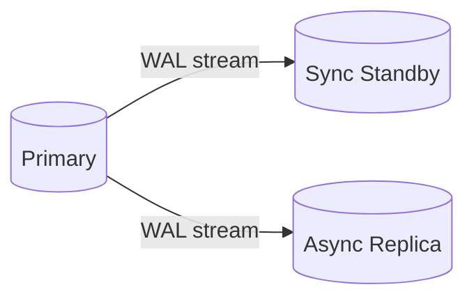
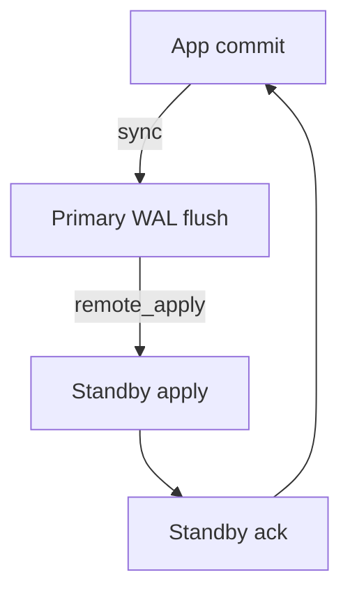

## Quick Revision

**Streaming replication** ships WAL to standbys for HA. **Logical replication** publishes table changes for migrations and fan-out.

---

## Core Concepts

| Mode | Use |
| :--- | :--- |
| Physical / streaming | Hot standby, failover |
| Logical | Selective tables, upgrades, CDC |
| Replication slot | Prevents WAL removal until consumed |

---

## Quick Reference

```sql
-- On primary
CREATE ROLE replicator WITH REPLICATION LOGIN PASSWORD 'secret';

-- pg_hba.conf: host replication replicator 10.0.0.0/24 scram-sha-256

-- Logical publication
CREATE PUBLICATION app_pub FOR TABLE orders, customers;
```

---

## Snippets

```bash
# Standby base backup
pg_basebackup -h primary -D /var/lib/postgresql/data -U replicator -Fp -Xs -P -R
```

---

## Common Gotchas

- Async replication → potential data loss on failover — see [Failover](/postgresql-cheatsheet/04-high-availability/failover/) and RPO.
- Replication slots on idle subscribers can fill disk with WAL.
- `pg_switch_wal()` before promotion in orchestrated failover.

---

## Architecture






## Interview Answers

## Question {#q-31}

How does streaming replication ship changes from primary to standby?

### Short Answer

Physical replication streams WAL; logical decodes row changes. This directly answers: how does streaming replication ship changes from primary to standby?

### Detailed Explanation

Slots pin WAL until consumers advance. For **Architecture** depth, reason about failure modes and measurable signals before changing configuration.

### Internal Working

Canonical internals live on `/postgresql-cheatsheet/04-high-availability/replication/` — cite xmin/xmax, WAL, or planner nodes as appropriate.

### Production Notes

Confirm with metrics and staged tests; document rollback for HA and DDL changes.

### Common Mistakes

Applying generic blog tuning without workload evidence; ignoring pooler and replica lag.

### Follow-up Questions

- What metric would disprove your hypothesis?
- Which handbook page is the canonical source?

---

## Question {#q-32}

What is the difference between physical and logical replication?

### Short Answer

**Physical (streaming)** replication ships WAL bytes for full cluster HA; **logical** replication decodes WAL to row changes for selective tables.

### Detailed Explanation

Streaming replication rebuilds standby pages identically — basis for failover. Logical replication publishes changes per table for migrations, upgrades, and CDC fan-out. Slots track consumer LSN for both modes.

### Internal Working

WAL is the canonical log; physical replay is byte-for-byte; logical uses output plugin decoding.

### Production Notes

Logical replication does not replicate DDL by default — plan schema upgrades.

### Common Mistakes

Using logical replication as sole DR without understanding DDL/limitations.

### Follow-up Questions

- What is a replication slot?
- What RPO does async streaming imply?

---

## Question {#q-33}

How do replication slots prevent WAL removal?

### Short Answer

Physical replication streams WAL; logical decodes row changes. This directly answers: how do replication slots prevent wal removal?

### Detailed Explanation

Slots pin WAL until consumers advance. For **Architecture** depth, reason about failure modes and measurable signals before changing configuration.

### Internal Working

Canonical internals live on `/postgresql-cheatsheet/04-high-availability/replication/` — cite xmin/xmax, WAL, or planner nodes as appropriate.

### Production Notes

Confirm with metrics and staged tests; document rollback for HA and DDL changes.

### Common Mistakes

Applying generic blog tuning without workload evidence; ignoring pooler and replica lag.

### Follow-up Questions

- What metric would disprove your hypothesis?
- Which handbook page is the canonical source?

---

## Question {#q-39}

How would you architect read/write splitting with replicas and connection poolers?

### Short Answer

Physical replication streams WAL; logical decodes row changes. This directly answers: how would you architect read/write splitting with replicas and connection poolers?

### Detailed Explanation

Slots pin WAL until consumers advance. For **Architecture** depth, reason about failure modes and measurable signals before changing configuration.

### Internal Working

Canonical internals live on `/postgresql-cheatsheet/04-high-availability/replication/` — cite xmin/xmax, WAL, or planner nodes as appropriate.

### Production Notes

Confirm with metrics and staged tests; document rollback for HA and DDL changes.

### Common Mistakes

Applying generic blog tuning without workload evidence; ignoring pooler and replica lag.

### Follow-up Questions

- What metric would disprove your hypothesis?
- Which handbook page is the canonical source?

---

## Question {#q-54}

How can an unused replication slot fill the primary disk with WAL?

### Short Answer

Physical replication streams WAL; logical decodes row changes. This directly answers: how can an unused replication slot fill the primary disk with wal?

### Detailed Explanation

Slots pin WAL until consumers advance. For **Troubleshooting** depth, reason about failure modes and measurable signals before changing configuration.

### Internal Working

Canonical internals live on `/postgresql-cheatsheet/04-high-availability/replication/` — cite xmin/xmax, WAL, or planner nodes as appropriate.

### Production Notes

Confirm with metrics and staged tests; document rollback for HA and DDL changes.

### Common Mistakes

Applying generic blog tuning without workload evidence; ignoring pooler and replica lag.

### Follow-up Questions

- What metric would disprove your hypothesis?
- Which handbook page is the canonical source?

---

## Question {#q-55}

How do you diagnose synchronous replication commit stalls?

### Short Answer

Physical replication streams WAL; logical decodes row changes. This directly answers: how do you diagnose synchronous replication commit stalls?

### Detailed Explanation

Slots pin WAL until consumers advance. For **Troubleshooting** depth, reason about failure modes and measurable signals before changing configuration.

### Internal Working

Canonical internals live on `/postgresql-cheatsheet/04-high-availability/replication/` — cite xmin/xmax, WAL, or planner nodes as appropriate.

### Production Notes

Confirm with metrics and staged tests; document rollback for HA and DDL changes.

### Common Mistakes

Applying generic blog tuning without workload evidence; ignoring pooler and replica lag.

### Follow-up Questions

- What metric would disprove your hypothesis?
- Which handbook page is the canonical source?

---

## Question {#q-69}

How do logical replication conflicts manifest on subscribers?

### Short Answer

Physical replication streams WAL; logical decodes row changes. This directly answers: how do logical replication conflicts manifest on subscribers?

### Detailed Explanation

Slots pin WAL until consumers advance. For **Troubleshooting** depth, reason about failure modes and measurable signals before changing configuration.

### Internal Working

Canonical internals live on `/postgresql-cheatsheet/04-high-availability/replication/` — cite xmin/xmax, WAL, or planner nodes as appropriate.

### Production Notes

Confirm with metrics and staged tests; document rollback for HA and DDL changes.

### Common Mistakes

Applying generic blog tuning without workload evidence; ignoring pooler and replica lag.

### Follow-up Questions

- What metric would disprove your hypothesis?
- Which handbook page is the canonical source?

---

## Question {#q-96}

What RPO does asynchronous streaming replication imply?

### Short Answer

Physical replication streams WAL; logical decodes row changes. This directly answers: what rpo does asynchronous streaming replication imply?

### Detailed Explanation

Slots pin WAL until consumers advance. For **Reliability** depth, reason about failure modes and measurable signals before changing configuration.

### Internal Working

Canonical internals live on `/postgresql-cheatsheet/04-high-availability/replication/` — cite xmin/xmax, WAL, or planner nodes as appropriate.

### Production Notes

Confirm with metrics and staged tests; document rollback for HA and DDL changes.

### Common Mistakes

Applying generic blog tuning without workload evidence; ignoring pooler and replica lag.

### Follow-up Questions

- What metric would disprove your hypothesis?
- Which handbook page is the canonical source?

---

## Question {#q-97}

How do synchronous_commit and synchronous_standby_names combine?

### Short Answer

Physical replication streams WAL; logical decodes row changes. This directly answers: how do synchronous_commit and synchronous_standby_names combine?

### Detailed Explanation

Slots pin WAL until consumers advance. For **Reliability** depth, reason about failure modes and measurable signals before changing configuration.

### Internal Working

Canonical internals live on `/postgresql-cheatsheet/04-high-availability/replication/` — cite xmin/xmax, WAL, or planner nodes as appropriate.

### Production Notes

Confirm with metrics and staged tests; document rollback for HA and DDL changes.

### Common Mistakes

Applying generic blog tuning without workload evidence; ignoring pooler and replica lag.

### Follow-up Questions

- What metric would disprove your hypothesis?
- Which handbook page is the canonical source?

---

## Question {#q-105}

Why must DDL be considered in logical replication upgrades?

### Short Answer

Physical replication streams WAL; logical decodes row changes. This directly answers: why must ddl be considered in logical replication upgrades?

### Detailed Explanation

Slots pin WAL until consumers advance. For **Reliability** depth, reason about failure modes and measurable signals before changing configuration.

### Internal Working

Canonical internals live on `/postgresql-cheatsheet/04-high-availability/replication/` — cite xmin/xmax, WAL, or planner nodes as appropriate.

### Production Notes

Confirm with metrics and staged tests; document rollback for HA and DDL changes.

### Common Mistakes

Applying generic blog tuning without workload evidence; ignoring pooler and replica lag.

### Follow-up Questions

- What metric would disprove your hypothesis?
- Which handbook page is the canonical source?

---

## Question {#q-106}

How do you monitor replication slot lag and WAL retention?

### Short Answer

Physical replication streams WAL; logical decodes row changes. This directly answers: how do you monitor replication slot lag and wal retention?

### Detailed Explanation

Slots pin WAL until consumers advance. For **Reliability** depth, reason about failure modes and measurable signals before changing configuration.

### Internal Working

Canonical internals live on `/postgresql-cheatsheet/04-high-availability/replication/` — cite xmin/xmax, WAL, or planner nodes as appropriate.

### Production Notes

Confirm with metrics and staged tests; document rollback for HA and DDL changes.

### Common Mistakes

Applying generic blog tuning without workload evidence; ignoring pooler and replica lag.

### Follow-up Questions

- What metric would disprove your hypothesis?
- Which handbook page is the canonical source?

---

## Question {#q-115}

When does logical replication lag during large bulk loads?

### Short Answer

Physical replication streams WAL; logical decodes row changes. This directly answers: when does logical replication lag during large bulk loads?

### Detailed Explanation

Slots pin WAL until consumers advance. For **Reliability** depth, reason about failure modes and measurable signals before changing configuration.

### Internal Working

Canonical internals live on `/postgresql-cheatsheet/04-high-availability/replication/` — cite xmin/xmax, WAL, or planner nodes as appropriate.

### Production Notes

Confirm with metrics and staged tests; document rollback for HA and DDL changes.

### Common Mistakes

Applying generic blog tuning without workload evidence; ignoring pooler and replica lag.

### Follow-up Questions

- What metric would disprove your hypothesis?
- Which handbook page is the canonical source?

---

## Question {#q-124}

How does logical replication handle PII table subsets securely?

### Short Answer

Physical replication streams WAL; logical decodes row changes. This directly answers: how does logical replication handle pii table subsets securely?

### Detailed Explanation

Slots pin WAL until consumers advance. For **Security** depth, reason about failure modes and measurable signals before changing configuration.

### Internal Working

Canonical internals live on `/postgresql-cheatsheet/04-high-availability/replication/` — cite xmin/xmax, WAL, or planner nodes as appropriate.

### Production Notes

Confirm with metrics and staged tests; document rollback for HA and DDL changes.

### Common Mistakes

Applying generic blog tuning without workload evidence; ignoring pooler and replica lag.

### Follow-up Questions

- What metric would disprove your hypothesis?
- Which handbook page is the canonical source?

---

## Question {#q-129}

What compliance considerations apply to cross-region replication of EU data?

### Short Answer

Physical replication streams WAL; logical decodes row changes. This directly answers: what compliance considerations apply to cross-region replication of eu data?

### Detailed Explanation

Slots pin WAL until consumers advance. For **Security** depth, reason about failure modes and measurable signals before changing configuration.

### Internal Working

Canonical internals live on `/postgresql-cheatsheet/04-high-availability/replication/` — cite xmin/xmax, WAL, or planner nodes as appropriate.

### Production Notes

Confirm with metrics and staged tests; document rollback for HA and DDL changes.

### Common Mistakes

Applying generic blog tuning without workload evidence; ignoring pooler and replica lag.

### Follow-up Questions

- What metric would disprove your hypothesis?
- Which handbook page is the canonical source?

---

## Question {#q-145}

How do read replicas affect consistency for reporting dashboards?

### Short Answer

Physical replication streams WAL; logical decodes row changes. This directly answers: how do read replicas affect consistency for reporting dashboards?

### Detailed Explanation

Slots pin WAL until consumers advance. For **Architecture** depth, reason about failure modes and measurable signals before changing configuration.

### Internal Working

Canonical internals live on `/postgresql-cheatsheet/04-high-availability/replication/` — cite xmin/xmax, WAL, or planner nodes as appropriate.

### Production Notes

Confirm with metrics and staged tests; document rollback for HA and DDL changes.

### Common Mistakes

Applying generic blog tuning without workload evidence; ignoring pooler and replica lag.

### Follow-up Questions

- What metric would disprove your hypothesis?
- Which handbook page is the canonical source?


## See Also

- [Previous: Sharding](/postgresql-cheatsheet/03-query-performance/sharding/)
- [Next: Failover](/postgresql-cheatsheet/04-high-availability/failover/)
- [PostgreSQL Handbook](/postgresql-cheatsheet/)
- [Database Handbook — PostgreSQL](/database-handbook/postgresql/)