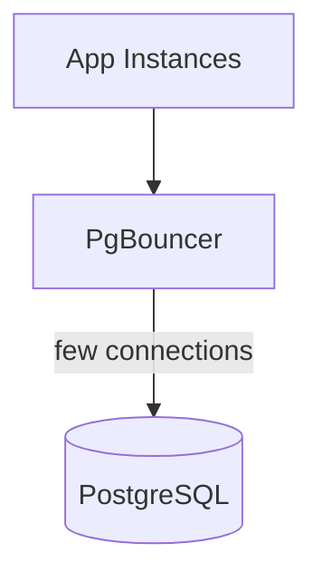
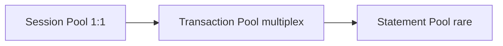

## Quick Revision

- PostgreSQL **process-per-connection** — thousands of app connections exhaust RAM/CPU.
- **PgBouncer** multiplexes clients onto fewer server connections.
- **Transaction pooling** — highest density; breaks prepared statements and some session features.
- **Session pooling** — safer semantics; lower multiplexing.

## Core Concepts

| Pool mode | Semantics |
| :--- | :--- |
| Session | 1:1 for client session lifetime |
| Transaction | Server conn only for one transaction |
| Statement | Rare; very restrictive |

## Design Tradeoffs

| Setting | Effect |
| :--- | :--- |
| `pool_size` per user/db | Cap backend usage |
| `max_client_conn` | Front-door limit |
| Prepared statements in txn mode | Must use unnamed or disable — driver-specific |

## Production Patterns

- Size: `(num_app_instances × pool_per_instance) ≤ max_connections − admin headroom`.
- Place pooler close to apps or on same host as PG for latency.
- Use `DISCARD ALL` / reset query on server connection checkout in txn mode.

## Architecture

## Interview Answers

## Question {#q-37}

How does PgBouncer transaction pooling differ from session pooling architecturally?

### Short Answer

Pooler multiplexes clients to fewer PostgreSQL backends. This directly answers: how does pgbouncer transaction pooling differ from session pooling architecturally?

### Detailed Explanation

Transaction pooling changes session semantics. For **Architecture** depth, reason about failure modes and measurable signals before changing configuration.

### Internal Working

Canonical internals live on `/postgresql-cheatsheet/06-production-operations/connection-pooling/` — cite xmin/xmax, WAL, or planner nodes as appropriate.

### Production Notes

Confirm with metrics and staged tests; document rollback for HA and DDL changes.

### Common Mistakes

Applying generic blog tuning without workload evidence; ignoring pooler and replica lag.

### Follow-up Questions

- What metric would disprove your hypothesis?
- Which handbook page is the canonical source?

---

## Question {#q-38}

Why is raising max_connections often the wrong fix for connection storms?

### Short Answer

Each connection consumes a backend process and memory; raising `max_connections` increases RAM and context switching without fixing client over-connecting.

### Detailed Explanation

PostgreSQL forks a backend per connection. Thousands of app instances × pool size can exceed sensible process counts. A pooler multiplexes many clients onto fewer server connections.

### Production Notes

Set `max_connections` ≈ pooler pool_size + admin headroom; size pooler from instance count.

### Common Mistakes

Setting max_connections=2000 on a 16 GB host without a pooler.

### Follow-up Questions

- Transaction vs session pooling?
- How to detect connection leaks?

---

## Question {#q-63}

How do prepared statements interact with PgBouncer transaction pooling?

### Short Answer

Pooler multiplexes clients to fewer PostgreSQL backends. This directly answers: how do prepared statements interact with pgbouncer transaction pooling?

### Detailed Explanation

Transaction pooling changes session semantics. For **Troubleshooting** depth, reason about failure modes and measurable signals before changing configuration.

### Internal Working

Canonical internals live on `/postgresql-cheatsheet/06-production-operations/connection-pooling/` — cite xmin/xmax, WAL, or planner nodes as appropriate.

### Production Notes

Confirm with metrics and staged tests; document rollback for HA and DDL changes.

### Common Mistakes

Applying generic blog tuning without workload evidence; ignoring pooler and replica lag.

### Follow-up Questions

- What metric would disprove your hypothesis?
- Which handbook page is the canonical source?

---

## Question {#q-122}

How do you rotate database credentials without downtime in pooled apps?

### Short Answer

Pooler multiplexes clients to fewer PostgreSQL backends. This directly answers: how do you rotate database credentials without downtime in pooled apps?

### Detailed Explanation

Transaction pooling changes session semantics. For **Security** depth, reason about failure modes and measurable signals before changing configuration.

### Internal Working

Canonical internals live on `/postgresql-cheatsheet/06-production-operations/connection-pooling/` — cite xmin/xmax, WAL, or planner nodes as appropriate.

### Production Notes

Confirm with metrics and staged tests; document rollback for HA and DDL changes.

### Common Mistakes

Applying generic blog tuning without workload evidence; ignoring pooler and replica lag.

### Follow-up Questions

- What metric would disprove your hypothesis?
- Which handbook page is the canonical source?

---

## Question {#q-144}

What connection storm patterns appear during Kubernetes pod scale events?

### Short Answer

Pooler multiplexes clients to fewer PostgreSQL backends. This directly answers: what connection storm patterns appear during kubernetes pod scale events?

### Detailed Explanation

Transaction pooling changes session semantics. For **Architecture** depth, reason about failure modes and measurable signals before changing configuration.

### Internal Working

Canonical internals live on `/postgresql-cheatsheet/06-production-operations/connection-pooling/` — cite xmin/xmax, WAL, or planner nodes as appropriate.

### Production Notes

Confirm with metrics and staged tests; document rollback for HA and DDL changes.

### Common Mistakes

Applying generic blog tuning without workload evidence; ignoring pooler and replica lag.

### Follow-up Questions

- What metric would disprove your hypothesis?
- Which handbook page is the canonical source?

## See Also

- [Previous: Troubleshooting](/postgresql-cheatsheet/06-production-operations/troubleshooting/)
- [Next: Capacity](/postgresql-cheatsheet/06-production-operations/capacity-planning/)
- [PostgreSQL Handbook](/postgresql-cheatsheet/)
- [Database Handbook — PostgreSQL](/database-handbook/postgresql/)
