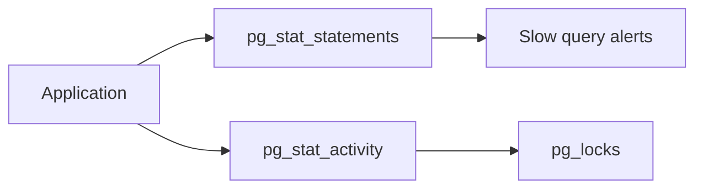

## Quick Revision

- **`pg_stat_activity`** — who is connected and what they run.
- **`pg_stat_statements`** — normalized query stats (extension).
- **`pg_locks`** — lock waits and blockers.
- **Wait events** — where time is spent (IO, Lock, LWLock, …).

## Core Concepts

| View / Extension | Use |
| :--- | :--- |
| `pg_stat_activity` | Active/idle, wait_event, query |
| `pg_stat_statements` | calls, mean_time, rows, shared_blks |
| `pg_locks` + `pg_blocking_pids()` | Blocker chains |
| `pg_stat_user_tables` | seq_scan vs idx_scan, dead tuples |
| `pg_stat_replication` | Replica lag, sync state |

## Quick Reference

```sql
SELECT pid, usename, state, wait_event_type, wait_event, left(query, 80)
FROM pg_stat_activity
WHERE state <> 'idle' ORDER BY query_start;

SELECT query, calls, mean_exec_time, total_exec_time
FROM pg_stat_statements ORDER BY total_exec_time DESC LIMIT 20;

SELECT l.pid, pg_blocking_pids(l.pid) AS blockers, a.query
FROM pg_locks l JOIN pg_stat_activity a ON a.pid = l.pid
WHERE NOT l.granted;
```

## Production Patterns

- Export metrics to Prometheus (`postgres_exporter`) or cloud monitor.
- Alert: connection count, replication lag, oldest xmin, disk usage, checkpoint frequency.
- Correlate app traces with `pg_stat_activity.application_name`.

## Observability




## Interview Answers

## Question {#q-42}

How do you find the top 10 queries by total time in production?

### Short Answer

pg_stat_activity for live sessions; pg_stat_statements for query workload. This directly answers: how do you find the top 10 queries by total time in production?

### Detailed Explanation

wait_event fields show where time is spent. For **Troubleshooting** depth, reason about failure modes and measurable signals before changing configuration.

### Internal Working

Canonical internals live on `/postgresql-cheatsheet/06-production-operations/monitoring/` — cite xmin/xmax, WAL, or planner nodes as appropriate.

### Production Notes

Confirm with metrics and staged tests; document rollback for HA and DDL changes.

### Common Mistakes

Applying generic blog tuning without workload evidence; ignoring pooler and replica lag.

### Follow-up Questions

- What metric would disprove your hypothesis?
- Which handbook page is the canonical source?

---

## Question {#q-46}

When should you use pg_cancel_backend versus pg_terminate_backend?

### Short Answer

pg_stat_activity for live sessions; pg_stat_statements for query workload. This directly answers: when should you use pg_cancel_backend versus pg_terminate_backend?

### Detailed Explanation

wait_event fields show where time is spent. For **Troubleshooting** depth, reason about failure modes and measurable signals before changing configuration.

### Internal Working

Canonical internals live on `/postgresql-cheatsheet/06-production-operations/monitoring/` — cite xmin/xmax, WAL, or planner nodes as appropriate.

### Production Notes

Confirm with metrics and staged tests; document rollback for HA and DDL changes.

### Common Mistakes

Applying generic blog tuning without workload evidence; ignoring pooler and replica lag.

### Follow-up Questions

- What metric would disprove your hypothesis?
- Which handbook page is the canonical source?

---

## Question {#q-56}

What wait events suggest IO-bound queries versus lock contention?

### Short Answer

pg_stat_activity for live sessions; pg_stat_statements for query workload. This directly answers: what wait events suggest io-bound queries versus lock contention?

### Detailed Explanation

wait_event fields show where time is spent. For **Troubleshooting** depth, reason about failure modes and measurable signals before changing configuration.

### Internal Working

Canonical internals live on `/postgresql-cheatsheet/06-production-operations/monitoring/` — cite xmin/xmax, WAL, or planner nodes as appropriate.

### Production Notes

Confirm with metrics and staged tests; document rollback for HA and DDL changes.

### Common Mistakes

Applying generic blog tuning without workload evidence; ignoring pooler and replica lag.

### Follow-up Questions

- What metric would disprove your hypothesis?
- Which handbook page is the canonical source?

---

## Question {#q-62}

What metrics alert you before max_connections is exhausted?

### Short Answer

pg_stat_activity for live sessions; pg_stat_statements for query workload. This directly answers: what metrics alert you before max_connections is exhausted?

### Detailed Explanation

wait_event fields show where time is spent. For **Troubleshooting** depth, reason about failure modes and measurable signals before changing configuration.

### Internal Working

Canonical internals live on `/postgresql-cheatsheet/06-production-operations/monitoring/` — cite xmin/xmax, WAL, or planner nodes as appropriate.

### Production Notes

Confirm with metrics and staged tests; document rollback for HA and DDL changes.

### Common Mistakes

Applying generic blog tuning without workload evidence; ignoring pooler and replica lag.

### Follow-up Questions

- What metric would disprove your hypothesis?
- Which handbook page is the canonical source?

---

## Question {#q-130}

How do you secure pg_stat_statements from exposing sensitive query text?

### Short Answer

pg_stat_activity for live sessions; pg_stat_statements for query workload. This directly answers: how do you secure pg_stat_statements from exposing sensitive query text?

### Detailed Explanation

wait_event fields show where time is spent. For **Security** depth, reason about failure modes and measurable signals before changing configuration.

### Internal Working

Canonical internals live on `/postgresql-cheatsheet/06-production-operations/monitoring/` — cite xmin/xmax, WAL, or planner nodes as appropriate.

### Production Notes

Confirm with metrics and staged tests; document rollback for HA and DDL changes.

### Common Mistakes

Applying generic blog tuning without workload evidence; ignoring pooler and replica lag.

### Follow-up Questions

- What metric would disprove your hypothesis?
- Which handbook page is the canonical source?

---

## Question {#q-140}

What monitoring SLOs define PostgreSQL platform health?

### Short Answer

pg_stat_activity for live sessions; pg_stat_statements for query workload. This directly answers: what monitoring slos define postgresql platform health?

### Detailed Explanation

wait_event fields show where time is spent. For **Architecture** depth, reason about failure modes and measurable signals before changing configuration.

### Internal Working

Canonical internals live on `/postgresql-cheatsheet/06-production-operations/monitoring/` — cite xmin/xmax, WAL, or planner nodes as appropriate.

### Production Notes

Confirm with metrics and staged tests; document rollback for HA and DDL changes.

### Common Mistakes

Applying generic blog tuning without workload evidence; ignoring pooler and replica lag.

### Follow-up Questions

- What metric would disprove your hypothesis?
- Which handbook page is the canonical source?


## See Also

- [Previous: VACUUM](/postgresql-cheatsheet/06-production-operations/vacuum/)
- [Next: Troubleshooting](/postgresql-cheatsheet/06-production-operations/troubleshooting/)
- [PostgreSQL Handbook](/postgresql-cheatsheet/)
- [Database Handbook — PostgreSQL](/database-handbook/postgresql/)
