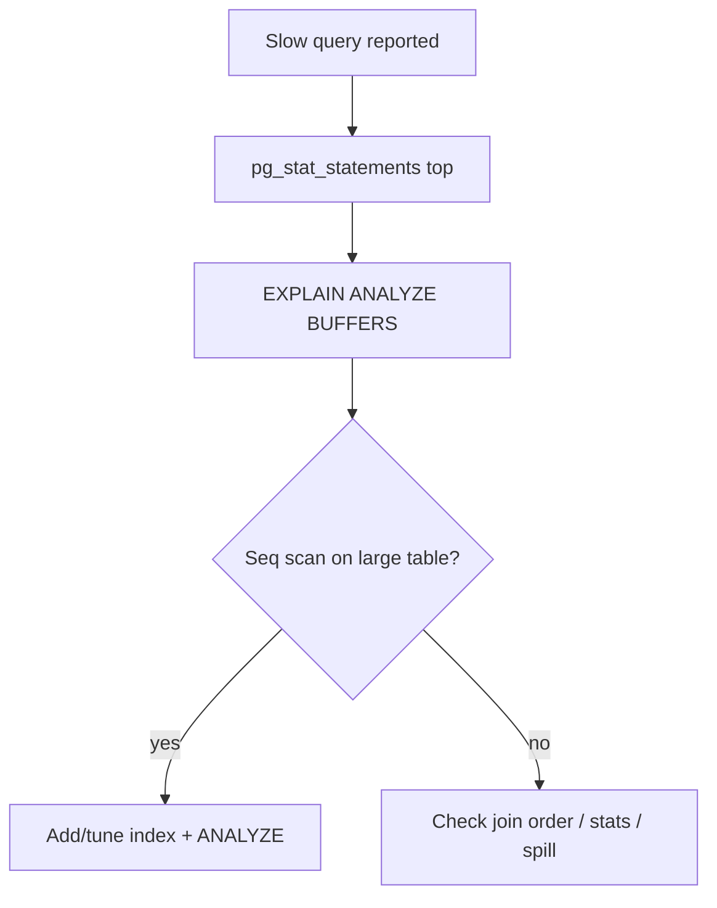

## Quick Revision

- **Slow query** → `pg_stat_statements` → `EXPLAIN (ANALYZE, BUFFERS)`.
- **Blocking** → `pg_blocking_pids()` → kill blocker or fix app lock order.
- **Bloat** → long transactions + autovacuum lag → [VACUUM](/postgresql-cheatsheet/06-production-operations/vacuum/).
- **Replication lag** → network, replay, slots, sync conflicts.

## Troubleshooting

| Symptom | First checks | Action |
| :--- | :--- | :--- |
| Slow queries | `pg_stat_statements`, explain | Index/stats/plan fix |
| Deadlock | `deadlock_detected` in logs | Retry txn; consistent lock order |
| Blocking | `pg_locks`, blockers | Shorten txn; `pg_cancel_backend` |
| Bloat | `n_dead_tup`, long `xmin` | Kill idle in transaction; tune autovacuum |
| Replica lag | `pg_stat_replication` | Index on replica; parallel apply; network |
| Connections exhausted | `pg_stat_activity` count | Pooler; fix connection leaks |
| WAL disk full | `pg_replication_slots` | Drop stale slot; fix archive |

## Interview Answers

## Question {#q-41}

What is your first step when p99 query latency doubles after a deploy?

### Short Answer

Measure → identify subsystem → apply targeted fix. This directly answers: what is your first step when p99 query latency doubles after a deploy?

### Detailed Explanation

Avoid killing backends without identifying root blocker. For **Troubleshooting** depth, reason about failure modes and measurable signals before changing configuration.

### Internal Working

Canonical internals live on `/postgresql-cheatsheet/06-production-operations/troubleshooting/` — cite xmin/xmax, WAL, or planner nodes as appropriate.

### Production Notes

Confirm with metrics and staged tests; document rollback for HA and DDL changes.

### Common Mistakes

Applying generic blog tuning without workload evidence; ignoring pooler and replica lag.

### Follow-up Questions

- What metric would disprove your hypothesis?
- Which handbook page is the canonical source?

---

## Question {#q-45}

How do you identify blocking sessions and their root blockers?

### Short Answer

Measure → identify subsystem → apply targeted fix. This directly answers: how do you identify blocking sessions and their root blockers?

### Detailed Explanation

Avoid killing backends without identifying root blocker. For **Troubleshooting** depth, reason about failure modes and measurable signals before changing configuration.

### Internal Working

Canonical internals live on `/postgresql-cheatsheet/06-production-operations/troubleshooting/` — cite xmin/xmax, WAL, or planner nodes as appropriate.

### Production Notes

Confirm with metrics and staged tests; document rollback for HA and DDL changes.

### Common Mistakes

Applying generic blog tuning without workload evidence; ignoring pooler and replica lag.

### Follow-up Questions

- What metric would disprove your hypothesis?
- Which handbook page is the canonical source?

---

## Question {#q-51}

What symptoms indicate autovacuum cannot keep up on a hot table?

### Short Answer

Measure → identify subsystem → apply targeted fix. This directly answers: what symptoms indicate autovacuum cannot keep up on a hot table?

### Detailed Explanation

Avoid killing backends without identifying root blocker. For **Troubleshooting** depth, reason about failure modes and measurable signals before changing configuration.

### Internal Working

Canonical internals live on `/postgresql-cheatsheet/06-production-operations/troubleshooting/` — cite xmin/xmax, WAL, or planner nodes as appropriate.

### Production Notes

Confirm with metrics and staged tests; document rollback for HA and DDL changes.

### Common Mistakes

Applying generic blog tuning without workload evidence; ignoring pooler and replica lag.

### Follow-up Questions

- What metric would disprove your hypothesis?
- Which handbook page is the canonical source?

---

## Question {#q-53}

What causes replication lag to grow on a standby during heavy write load?

### Short Answer

Measure → identify subsystem → apply targeted fix. This directly answers: what causes replication lag to grow on a standby during heavy write load?

### Detailed Explanation

Avoid killing backends without identifying root blocker. For **Troubleshooting** depth, reason about failure modes and measurable signals before changing configuration.

### Internal Working

Canonical internals live on `/postgresql-cheatsheet/06-production-operations/troubleshooting/` — cite xmin/xmax, WAL, or planner nodes as appropriate.

### Production Notes

Confirm with metrics and staged tests; document rollback for HA and DDL changes.

### Common Mistakes

Applying generic blog tuning without workload evidence; ignoring pooler and replica lag.

### Follow-up Questions

- What metric would disprove your hypothesis?
- Which handbook page is the canonical source?

---

## Question {#q-61}

How do you detect connection leaks from application servers?

### Short Answer

Measure → identify subsystem → apply targeted fix. This directly answers: how do you detect connection leaks from application servers?

### Detailed Explanation

Avoid killing backends without identifying root blocker. For **Troubleshooting** depth, reason about failure modes and measurable signals before changing configuration.

### Internal Working

Canonical internals live on `/postgresql-cheatsheet/06-production-operations/troubleshooting/` — cite xmin/xmax, WAL, or planner nodes as appropriate.

### Production Notes

Confirm with metrics and staged tests; document rollback for HA and DDL changes.

### Common Mistakes

Applying generic blog tuning without workload evidence; ignoring pooler and replica lag.

### Follow-up Questions

- What metric would disprove your hypothesis?
- Which handbook page is the canonical source?

---

## Question {#q-70}

What is your runbook when the primary runs out of disk on the WAL volume?

### Short Answer

Measure → identify subsystem → apply targeted fix. This directly answers: what is your runbook when the primary runs out of disk on the wal volume?

### Detailed Explanation

Avoid killing backends without identifying root blocker. For **Troubleshooting** depth, reason about failure modes and measurable signals before changing configuration.

### Internal Working

Canonical internals live on `/postgresql-cheatsheet/06-production-operations/troubleshooting/` — cite xmin/xmax, WAL, or planner nodes as appropriate.

### Production Notes

Confirm with metrics and staged tests; document rollback for HA and DDL changes.

### Common Mistakes

Applying generic blog tuning without workload evidence; ignoring pooler and replica lag.

### Follow-up Questions

- What metric would disprove your hypothesis?
- Which handbook page is the canonical source?

## See Also

- [Previous: Monitoring](/postgresql-cheatsheet/06-production-operations/monitoring/)
- [Next: Pooling](/postgresql-cheatsheet/06-production-operations/connection-pooling/)
- [PostgreSQL Handbook](/postgresql-cheatsheet/)
- [Database Handbook — PostgreSQL](/database-handbook/postgresql/)
