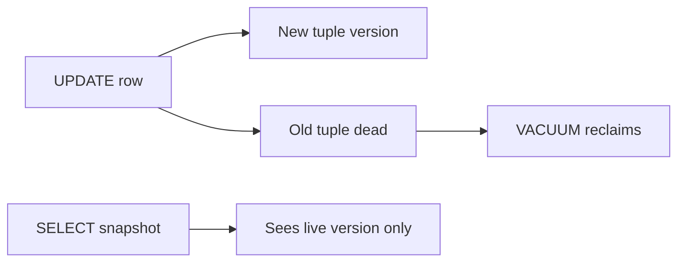

## Executive Summary

**Multi-Version Concurrency Control** keeps old row versions for in-flight transactions. Readers don't block writers; **VACUUM** reclaims dead tuples.

---

## Core Concepts

| Concept | Role |
| :--- | :--- |
| `xmin` | Inserting transaction ID |
| `xmax` | Deleting/updating transaction ID |
| **Snapshot** | Visible tuple set for a transaction |
| **Dead tuple** | Old version no longer visible to any snapshot |
| **VACUUM** | Marks space reusable; **FREEZE** prevents wraparound |

---

## Quick Reference

```sql
-- Tuple metadata (extension)
CREATE EXTENSION IF NOT EXISTS pageinspect;
-- heap_page_items, tuple headers — advanced debugging

SELECT relname, n_live_tup, n_dead_tup, last_vacuum, last_autovacuum
FROM pg_stat_user_tables
ORDER BY n_dead_tup DESC;
```

---

## Snippets



---

## Common Gotchas

- High churn tables need healthy autovacuum — watch `n_dead_tup`.
- Long transactions prevent vacuum from reclaiming space → bloat.
- `SELECT ... FOR UPDATE` locks current row version.

---

## Related Topics

- [Previous: Isolation](/postgresql-cheatsheet/isolation-levels/)
- [Next: Locks](/postgresql-cheatsheet/locks/)
- [PostgreSQL Cheatsheet Index](/postgresql-cheatsheet/)
- [Database Handbook — PostgreSQL](/database-handbook/postgresql/)
