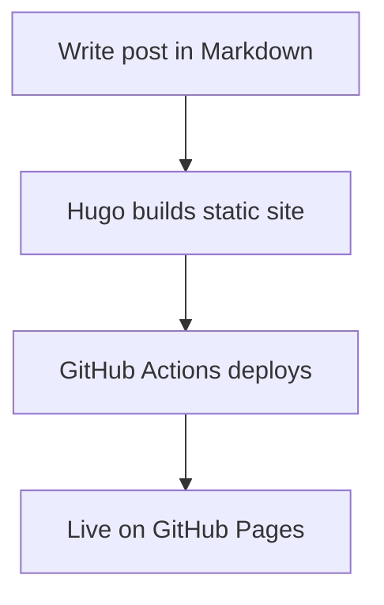

Welcome to my Hugo blog powered by PaperMod.

## Sample Markdown Table

| Feature        | Status | Notes                          |
|----------------|--------|--------------------------------|
| Hugo Setup     | Done   | Base config is in `hugo.toml` |
| PaperMod Theme | Done   | Clean and minimal              |
| GitHub Pages   | Done   | Automated via GitHub Actions   |

## Sample Go Code

```go
package main

import "fmt"

func main() {
    name := "Hugo"
    fmt.Printf("Hello, %s blog!\n", name)
}
```

## Mermaid Flowchart


