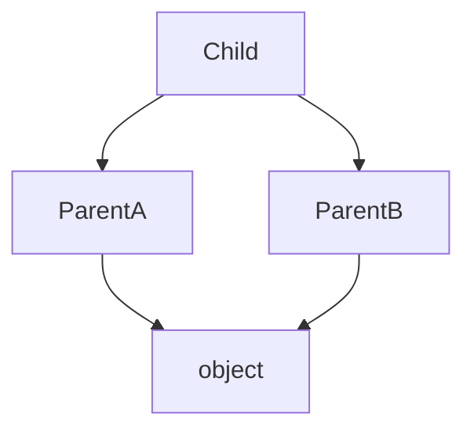

## At a Glance

- Multiple inheritance supported — MRO (C3 linearization) resolves method lookup.
- `super()` follows MRO, not just parent class — critical in diamonds.
- Prefer composition + Protocol typing over deep inheritance hierarchies.

---

## Reference Tables

| Pattern | Mechanism |
| :--- | :--- |
| Inheritance | `class Child(Parent):` |
| MRO | `Child.__mro__` or `help(Child)` |
| Abstract base | `abc.ABC` + `@abstractmethod` |
| Protocol (structural) | See [Typing](/python-cheatsheet/01-fundamentals/typing/) |
| Mixins | Small orthogonal parent classes |



---

## Snippets

```python
from abc import ABC, abstractmethod

class Repository(ABC):
    @abstractmethod
    def get(self, id: str) -> object: ...

class LoggingMixin:
    def log(self, msg: str) -> None:
        print(msg)

class Service(LoggingMixin):
    def run(self) -> None:
        self.log("start")

# cooperative super in multiple inheritance
class A:
    def method(self): return "A" + super().method()
```

---

## Internals & Gotchas

- `super()` in `__init__` must be called in cooperative multiple inheritance.
- Mixins should not define `__init__` without accepting `**kwargs`.
- `isinstance(x, Protocol)` works with `@runtime_checkable` only.

---

## Production Notes

- Favor small ABCs at integration boundaries (ports).
- Document extension points; seal internal classes with leading `_`.


## Interview Questions

See [Top 150](/python-cheatsheet/09-interview-guide/top-150-interview-questions/).

---

## See Also

- [Previous: Typing](/python-cheatsheet/01-fundamentals/typing/)
- [Next: Classes](/python-cheatsheet/02-core-python/classes/)
- [Python Handbook Index](/python-cheatsheet/)
- [Top 150 Interview Questions](/python-cheatsheet/09-interview-guide/top-150-interview-questions/)
