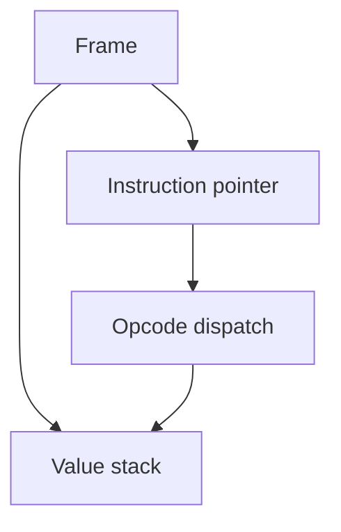

## Quick Revision

- Source → AST → **code object** (bytecode + consts + names) → frame execution.
- `dis.dis(fn)` shows opcodes — essential for understanding hot loops.
- `LOAD_FAST`, `LOAD_ATTR`, `CALL` dominate many profiles.

## Core Concepts

| Artifact | Contains |
| :--- | :--- |
| Code object | `co_code`, `co_consts`, `co_names`, `co_varnames`, flags |
| Frame | Stack, locals, globals, instruction pointer |
| Opcode | Single VM instruction |

## Internal Working



```python
import dis

def hot(x: int) -> int:
    total = 0
    for i in range(x):
        total += i
    return total

dis.dis(hot)
```

## Performance Considerations

- Local variables faster than globals — `LOAD_FAST` vs `LOAD_GLOBAL`.
- Attribute access in tight loops — cache in local variable.

## Troubleshooting

- Unexpected branches — inspect bytecode after decorator desugaring.


## Interview Questions

See [Top 150](/python-cheatsheet/09-interview-guide/top-150-interview-questions/).

---

## See Also

- [Previous: Cpython Internals](/python-cheatsheet/03-python-internals/cpython-internals/)
- [Next: Object Model](/python-cheatsheet/03-python-internals/object-model/)
- [Python Handbook Index](/python-cheatsheet/)
- [Top 150 Interview Questions](/python-cheatsheet/09-interview-guide/top-150-interview-questions/)
