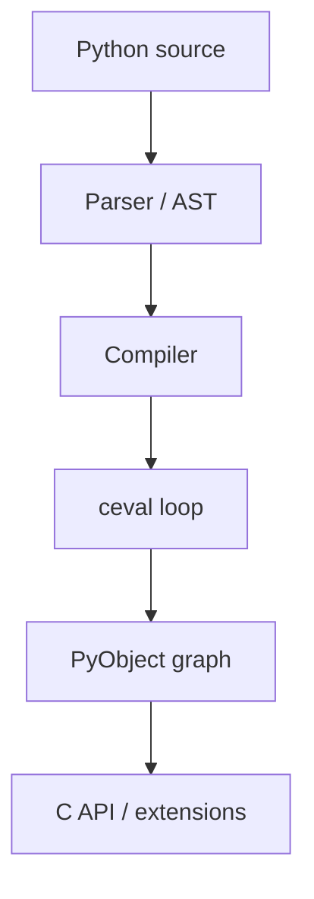

## Quick Revision

  - CPython = parser + compiler + ceval loop + object system + C API.
  - Most objects are `PyObject*` with refcount and type pointer.
  - C extensions release the GIL around blocking/native work.

  ## Core Concepts

  | Component | Role |
  | :--- | :--- |
  | Parser / AST | Source → concrete syntax tree |
  | Compiler | AST → code objects (bytecode + constants) |
  | ceval | Opcode dispatch loop |
  | Object model | `PyTypeObject`, `PyObject` layout |
  | C-API / ctypes / cffi | Native interop |

  ## Internal Working



  ```mermaid
  flowchart TB
    src[Source] --> parse[Parser]
    parse --> ast[AST]
    ast --> compile[Compiler]
    compile --> code[Code object]
    code --> ceval[Eval loop]
    ceval --> objects[PyObject graph]
  ```

  ## Runtime Behavior

  - Pure Python CPU work holds the [GIL](/python-cheatsheet/03-python-internals/gil/) in the default build.
  - Many stdlib I/O and numeric ops delegate to C that releases the GIL.

  ## Production Usage

  - Hot paths: profile before rewriting in Cython/Rust — see [Performance Optimization](/python-cheatsheet/05-performance/performance-optimization/).

  ## Interview Questions

See [Top 150](/python-cheatsheet/09-interview-guide/top-150-interview-questions/) — CPython architecture questions.

  ## Architect Notes

  Choosing CPython assumes the GIL model unless you standardize on free-threading builds — plan concurrency accordingly.


---

## See Also

- [Previous: Python Runtime](/python-cheatsheet/03-python-internals/python-runtime/)
- [Next: Bytecode](/python-cheatsheet/03-python-internals/bytecode/)
- [Python Handbook Index](/python-cheatsheet/)
- [Top 150 Interview Questions](/python-cheatsheet/09-interview-guide/top-150-interview-questions/)
