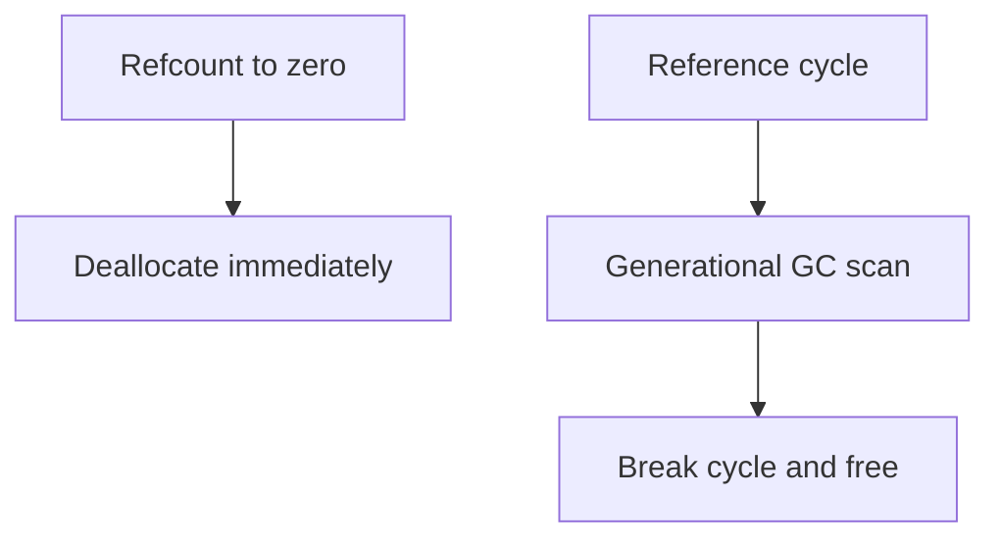

## Quick Revision

- Primary reclamation: **reference counting** (immediate when refcount hits 0).
- **Cyclic GC** collects unreachable reference cycles (generations 0/1/2).
- `gc` module introspects cycles; `weakref` breaks strong cycles intentionally.

## Core Concepts

| Layer | Behavior |
| :--- | :--- |
| Refcount | Increment on bind, decrement on del/out-of-scope |
| Cyclic GC | Detects unreachable cycles; runs on thresholds |
| `weakref` | Non-owning references; `WeakValueDictionary` for caches |

## Internal Working




```python
import gc, weakref

gc.set_debug(gc.DEBUG_STATS)
gc.collect()  # rarely in hot paths — diagnostics only

cache: weakref.WeakValueDictionary = weakref.WeakValueDictionary()
```

## Performance Considerations

- Large cycles cause GC pauses — break cycles with `weakref` or explicit `clear()`.
- `gc.collect()` in production hot paths is usually a smell.

## Troubleshooting

| Symptom | Action |
| :--- | :--- |
| RSS grows, refcount objects alive | `tracemalloc`, `objgraph`, check globals and caches |
| GC pauses | Reduce cycle creation, tune thresholds carefully |


## Interview Questions

See [Top 150](/python-cheatsheet/09-interview-guide/top-150-interview-questions/).

---

## See Also

- [Previous: Memory Management](/python-cheatsheet/03-python-internals/memory-management/)
- [Next: Gil](/python-cheatsheet/03-python-internals/gil/)
- [Python Handbook Index](/python-cheatsheet/)
- [Top 150 Interview Questions](/python-cheatsheet/09-interview-guide/top-150-interview-questions/)
