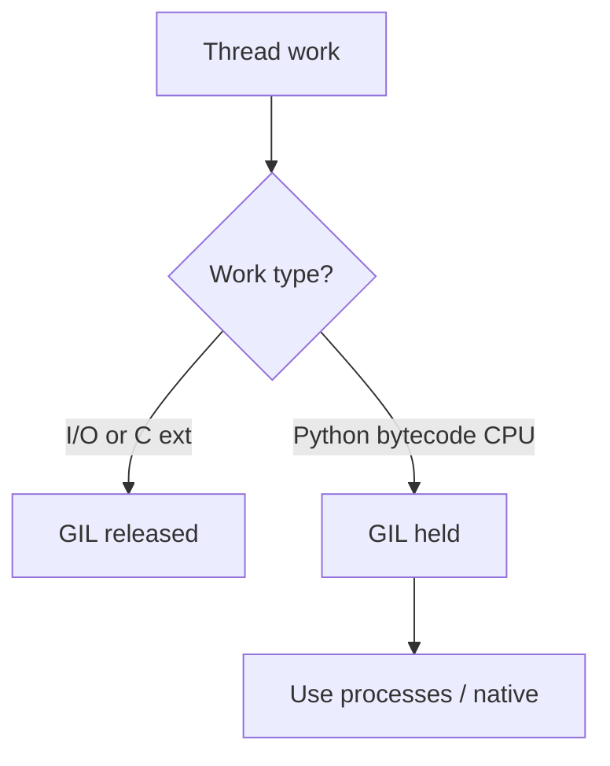
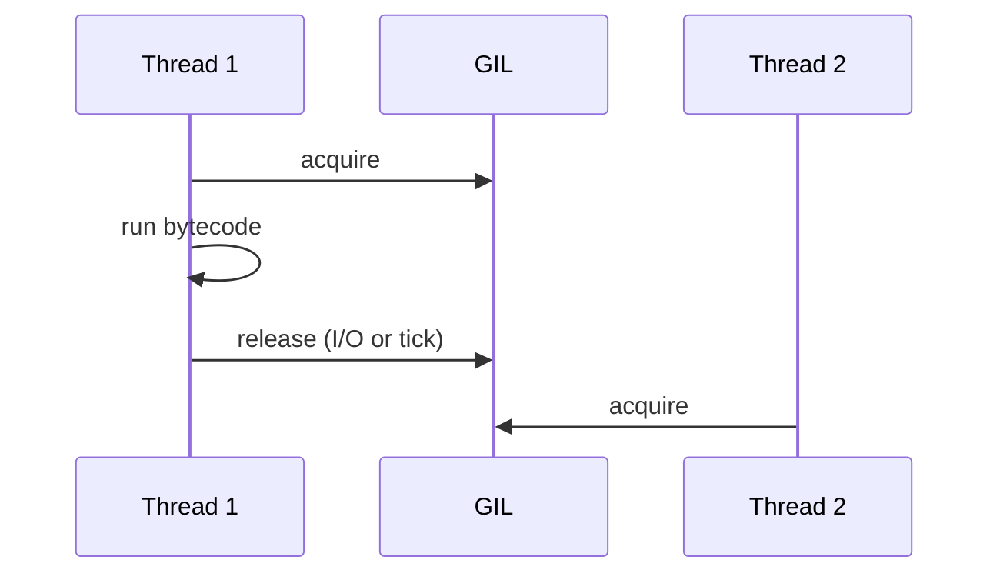

## Quick Revision

- **GIL** = mutex allowing one thread to execute Python bytecode at a time per process.
- Protects CPython object internals without per-object locks.
- Released around I/O and many C extension calls — **not** a fix for CPU-bound threads.

## Core Concepts

| Topic | Detail |
| :--- | :--- |
| Purpose | Simplify C API and refcounting thread safety |
| CPU-bound threads | No parallel bytecode execution |
| Workarounds | `multiprocessing`, native extensions, free-threading builds |
| I/O-bound threads | Still useful — GIL released during waits |

## Internal Working

## Production Usage

- CPU parallelism → [Multiprocessing](/python-cheatsheet/04-concurrency/multiprocessing/) or vectorized C libs.
- Mixed workloads → [Concurrency Patterns](/python-cheatsheet/04-concurrency/concurrency-patterns/) (async I/O + process pool for CPU).

## Design Tradeoffs

| Model | When |
| :--- | :--- |
| Threads + GIL | Blocking I/O libraries |
| Asyncio | Many concurrent I/O waits, async APIs |
| Processes | CPU-bound pure Python |
| nogil / 3.13+ | Evaluate compatibility before platform bet |

## Architect Notes

The GIL is a **platform constraint** for Python thread scaling — document it in concurrency ADRs.

## Interview Questions

See [Top 150](/python-cheatsheet/09-interview-guide/top-150-interview-questions/).

---

## See Also

- [Previous: Garbage Collection](/python-cheatsheet/03-python-internals/garbage-collection/)
- [Next: Concurrency](/python-cheatsheet/04-concurrency/concurrency/)
- [Python Handbook Index](/python-cheatsheet/)
- [Top 150 Interview Questions](/python-cheatsheet/09-interview-guide/top-150-interview-questions/)
