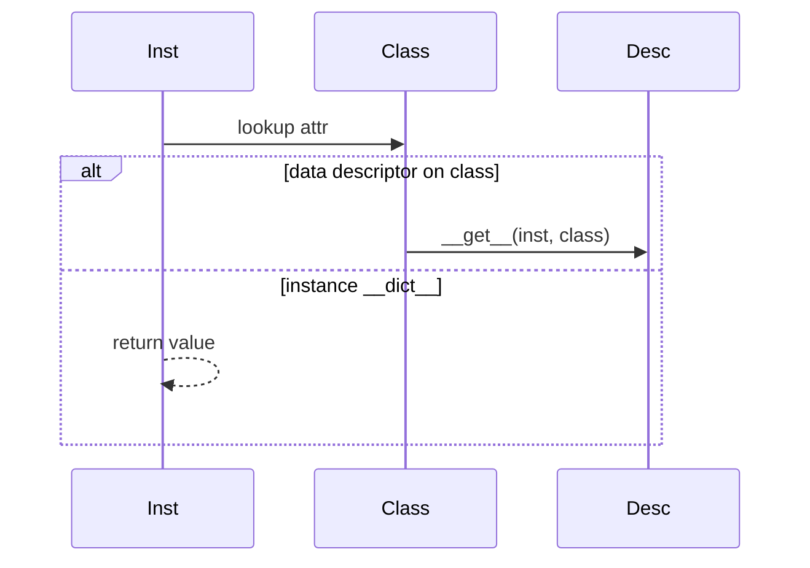

## Quick Revision

- Everything is an object; variables bind names to objects.
- Attribute lookup: instance `__dict__` → class → MRO → descriptors.
- `__eq__` without `__hash__` sets `__hash__ = None` (unhashable).

## Core Concepts

| Mechanism | Role |
| :--- | :--- |
| `PyObject` | `ob_refcnt`, `ob_type`, payload |
| `__dict__` | Per-instance attribute storage (unless `__slots__`) |
| Descriptor | `__get__` / `__set__` / `__delete__` on class attributes |
| `__new__` | Allocates instance; `__init__` initializes |

## Internal Working

## Design Tradeoffs

| Choice | Trade-off |
| :--- | :--- |
| `__slots__` | Lower memory, no arbitrary attrs |
| `__eq__` only | Breaks hash-based collections |
| Descriptors | Power vs complexity |

## Production Usage

- Use `@property` for validation; understand descriptor cost on hot paths.

## Interview Questions

See [Top 150](/python-cheatsheet/09-interview-guide/top-150-interview-questions/).

---

## See Also

- [Previous: Bytecode](/python-cheatsheet/03-python-internals/bytecode/)
- [Next: Memory Management](/python-cheatsheet/03-python-internals/memory-management/)
- [Python Handbook Index](/python-cheatsheet/)
- [Top 150 Interview Questions](/python-cheatsheet/09-interview-guide/top-150-interview-questions/)
