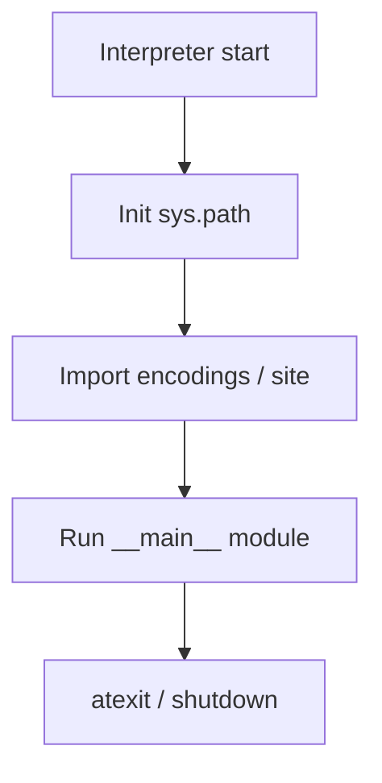

## Quick Revision

  - `python script.py` → interpreter startup → `sys.path` init → run `__main__` module.
  - `import` uses `sys.meta_path` finders → loaders → module object in `sys.modules`.
  - `if __name__ == '__main__'` guards script-only code; required for multiprocessing `spawn`.

  ## Core Concepts

  | Stage | What happens |
  | :--- | :--- |
  | Startup | Parse flags, init interpreter, import encodings, site |
  | Import | Finder locates spec → loader executes module body |
  | Execution | `PyEval_EvalFrameDefault` runs bytecode in frames |
  | Shutdown | `atexit`, flush stdio, teardown interpreters |

  ## Internal Working



  ```mermaid
  sequenceDiagram
    participant Main
    participant Importlib
    participant Loader
    participant Module
    Main->>Importlib: import pkg.mod
    Importlib->>Importlib: sys.meta_path find_spec
    Importlib->>Loader: exec_module
    Loader->>Module: run module body
    Loader-->>Main: sys.modules[name]
  ```

  **Import path:** Built-in and frozen importers first, then `PathFinder` on `sys.path` entries (including site-packages and editable installs).

## Runtime Behavior

  - Circular imports: module partially initialized in `sys.modules` — defer imports or extract shared types.
  - Lazy imports reduce CLI cold start — measure with [Profiling](/python-cheatsheet/05-performance/profiling/).
  - `PYTHONPATH` prepends entries; prefer explicit packaging over manipulating `sys.path` in libraries.

  ## Design Tradeoffs

  | Choice | Trade-off |
  | :--- | :--- |
  | Absolute imports | Clearer, refactor-friendly |
  | Relative imports | Shorter intra-package, breaks if package renamed |
  | Lazy import | Faster startup vs scattered import errors |
  | `importlib.reload` | Dev convenience vs broken invariants |

  ## Production Usage

  - One entry module; package `__init__.py` exposes stable public API via `__all__`.
  - Container images: set `PYTHONUNBUFFERED=1`, pin `requires-python`.

  ## Performance Considerations

  - Import cost is paid once per process (until reload) — profile startup separately.

  ## Troubleshooting

  | Symptom | Check |
  | :--- | :--- |
  | `ModuleNotFoundError` in Docker | `sys.path`, `WORKDIR`, editable vs wheel install |
  | Circular import at startup | Import graph, move shared types |
  | Wrong package version loaded | `pip show`, multiple paths shadowing |

  ## Common Mistakes

  - Mutating `sys.path` in library code.
  - Side effects at import time (network calls, heavy computation).

  ## Interview Questions

  See [Top 150](/python-cheatsheet/09-interview-guide/top-150-interview-questions/) — Internals & Runtime category.

  ## Architect Notes

  Import and startup behavior drive **cold-start SLOs** for serverless and CLI tools — treat as architecture, not trivia.


---

## See Also

- [Previous: Comprehensions](/python-cheatsheet/02-core-python/comprehensions/)
- [Next: Cpython Internals](/python-cheatsheet/03-python-internals/cpython-internals/)
- [Python Handbook Index](/python-cheatsheet/)
- [Top 150 Interview Questions](/python-cheatsheet/09-interview-guide/top-150-interview-questions/)
