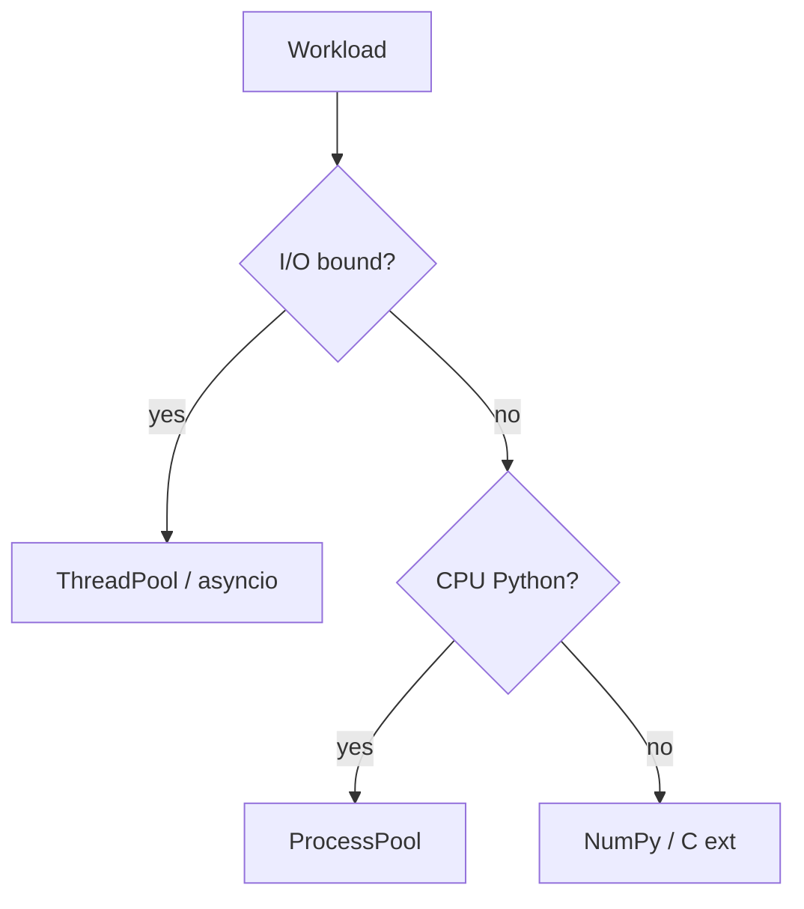
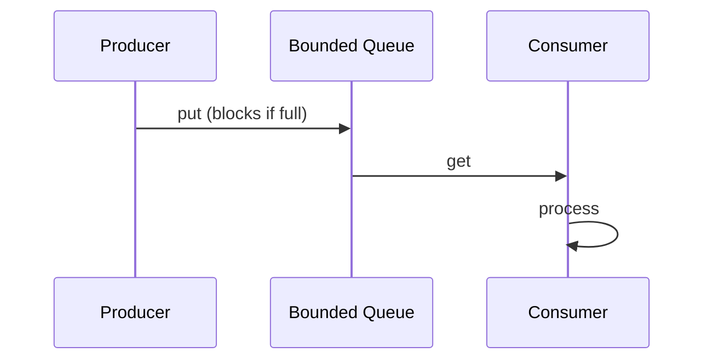

## Quick Revision

- **Thread pool** — blocking I/O; **process pool** — CPU-bound Python.
- **Bounded `Queue`** — producer-consumer with backpressure.
- **`asyncio.Semaphore`** — cap concurrent coroutines.

## Core Concepts

| Pattern | Tool |
| :--- | :--- |
| Thread pool | `ThreadPoolExecutor` |
| Process pool | `ProcessPoolExecutor` |
| Producer-consumer | `queue.Queue(maxsize=N)` |
| Async rate limit | `asyncio.Semaphore` |

## Internal Working





## Production Usage

```python
from concurrent.futures import ThreadPoolExecutor, as_completed
from queue import Queue
import asyncio

async def bounded_fetch(urls, limit=10):
    sem = asyncio.Semaphore(limit)
    async def one(url):
        async with sem:
            return await client.get(url)
    return await asyncio.gather(*(one(u) for u in urls))
```

## Design Tradeoffs

| Pattern | Risk |
| :--- | :--- |
| Unbounded queue | Memory blowup under slow consumers |
| Huge thread pool | FD exhaustion, context switching |
| Tiny process pool | Queue backlog, latency |

## Performance Considerations

- Pool size ≈ downstream connection limits, not CPU count alone.
- Batch work to amortize IPC/pickle in process pools.

## Common Mistakes

- No shutdown protocol for worker threads (`Queue.join` + sentinels).
- Process pool for sub-millisecond tasks.


## Interview Questions

See [Top 150](/python-cheatsheet/09-interview-guide/top-150-interview-questions/).

---

## See Also

- [Previous: Multiprocessing](/python-cheatsheet/04-concurrency/multiprocessing/)
- [Next: Performance Optimization](/python-cheatsheet/05-performance/performance-optimization/)
- [Python Handbook Index](/python-cheatsheet/)
- [Top 150 Interview Questions](/python-cheatsheet/09-interview-guide/top-150-interview-questions/)
