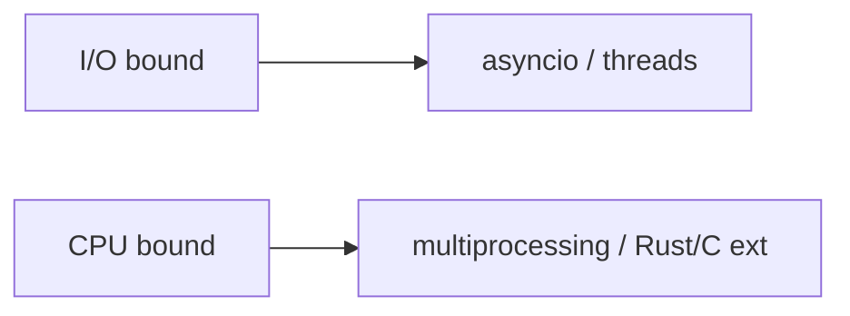

## At a Glance

- CPython [GIL](/python-cheatsheet/03-python-internals/gil/) limits CPU parallelism in threads — see canonical page for internals.
- I/O-bound → `asyncio` or threads; CPU-bound → `multiprocessing` or native extensions.
- Mix models carefully — blocking call in async event loop stalls all tasks.

---

## Reference Tables

| Model | Best for | GIL impact |
| :--- | :--- | :--- |
| `asyncio` | Many concurrent I/O waits | N/A (single thread) |
| `threading` | Blocking I/O libraries | Limited CPU parallelism |
| `multiprocessing` | CPU-bound Python code | Bypass GIL (separate interpreters) |
| `concurrent.futures` | Unified pool API | Thread or process executor |



---

## Snippets

```python
from concurrent.futures import ThreadPoolExecutor, ProcessPoolExecutor, as_completed

with ThreadPoolExecutor(max_workers=8) as pool:
    futures = [pool.submit(fetch, url) for url in urls]
    for fut in as_completed(futures):
        handle(fut.result())
```

---

## Internals & Gotchas

- Async is not faster CPU — it schedules I/O wait better.
- Thread safety: protect shared mutable state — see [Concurrency Patterns](/python-cheatsheet/04-concurrency/concurrency-patterns/).
- `asyncio.run()` creates/closes event loop — entry point for scripts.

---

## Production Notes

- Offload blocking IO with `asyncio.to_thread` (3.9+) in async apps.
- Size thread pools from downstream limits (DB connections, API rate).


## Interview Questions

See [Top 150](/python-cheatsheet/09-interview-guide/top-150-interview-questions/).

---

## See Also

- [Previous: Gil](/python-cheatsheet/03-python-internals/gil/)
- [Next: Asyncio](/python-cheatsheet/04-concurrency/asyncio/)
- [Python Handbook Index](/python-cheatsheet/)
- [Top 150 Interview Questions](/python-cheatsheet/09-interview-guide/top-150-interview-questions/)
