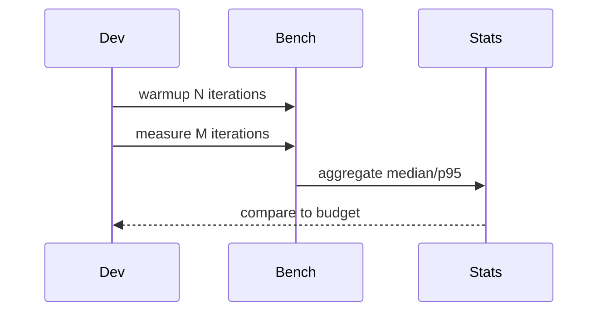

## Quick Revision

- Warmup iterations discard JIT/cache effects (less relevant in CPython than JVM, still stabilizes I/O caches).
- Report **median** and **p95** — not single best run.
- Use `timeit` for micro-benchmarks; `pytest-benchmark` for CI regression gates.

## Core Concepts

| Practice | Why |
| :--- | :--- |
| Warmup | Stabilize caches and connection pools |
| Multiple iterations | Reduce noise |
| Same hardware/CI agent | Comparable runs |
| Isolate | Close other workloads |

## Internal Working



## Production Usage

```python
import timeit

timeit.timeit("sorted(range(1000))", number=10000)

# pytest-benchmark in CI for regression on parse_serialization()
```

## Design Tradeoffs

| Approach | Trade-off |
| :--- | :--- |
| Micro-benchmark | Precise but may not reflect system behavior |
| End-to-end load test | Realistic but noisy |
| CI benchmark gate | Catches regressions; flaky if environment varies |

## Common Mistakes

- Benchmarking debug builds or dev machines only.
- Comparing asyncio and sync without same concurrency model.


## Interview Questions

See [Top 150](/python-cheatsheet/09-interview-guide/top-150-interview-questions/).

---

## See Also

- [Previous: Profiling](/python-cheatsheet/05-performance/profiling/)
- [Next: Memory Optimization](/python-cheatsheet/05-performance/memory-optimization/)
- [Python Handbook Index](/python-cheatsheet/)
- [Top 150 Interview Questions](/python-cheatsheet/09-interview-guide/top-150-interview-questions/)
