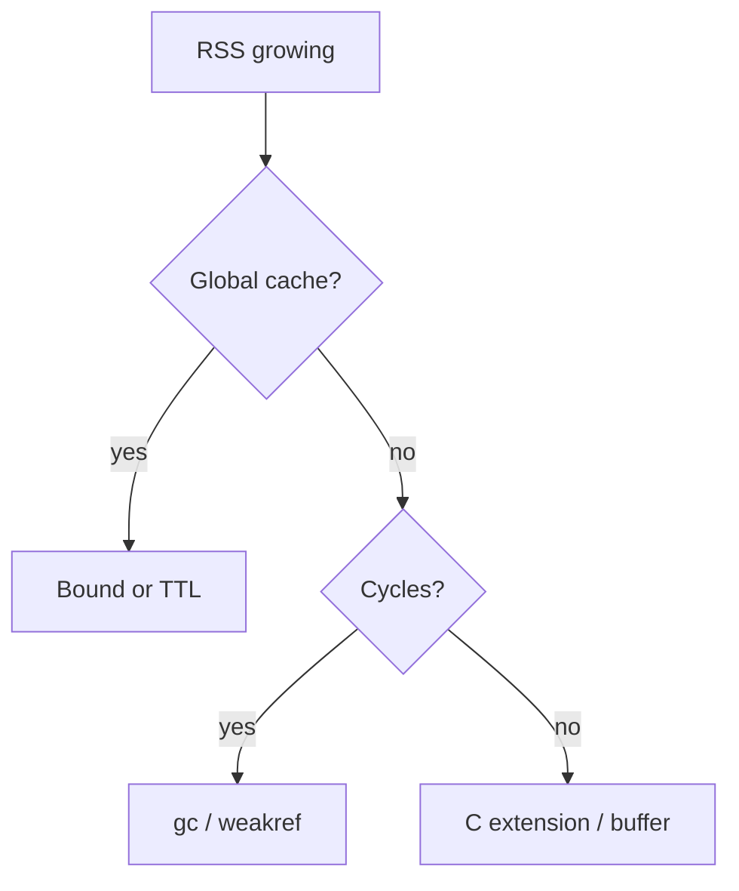

## Quick Revision

- Prefer **generators** and streaming over giant lists.
- Bound caches: `lru_cache(maxsize=...)`, TTL, `weakref`.
- `__slots__` after profiling — see [Object Model](/python-cheatsheet/03-python-internals/object-model/).

## Core Concepts

| Technique | Effect |
| :--- | :--- |
| Generator pipeline | O(1) peak memory for single-pass consumers |
| Bounded cache | Prevents unbounded RSS growth |
| `__slots__` | Smaller instances at scale |
| `weakref` | Break cycles / non-owning registries |

## Internal Working

Peak memory often comes from materializing intermediate collections, not individual object size. [Garbage Collection](/python-cheatsheet/03-python-internals/garbage-collection/) reclaims cycles but does not prevent spikes from large allocations.

## Production Usage

- Stream file/HTTP responses; chunk DB reads.
- Cap in-memory buffers (`deque(maxlen=...)`).
- Monitor RSS alongside Python allocation profilers.

## Troubleshooting

## Common Mistakes

- `lru_cache` without `maxsize` on unbounded key spaces.
- Reading multi-GB files into memory.

## Interview Questions

See [Top 150](/python-cheatsheet/09-interview-guide/top-150-interview-questions/).

---

## See Also

- [Previous: Benchmarking](/python-cheatsheet/05-performance/benchmarking/)
- [Next: Logging](/python-cheatsheet/06-production-python/logging/)
- [Python Handbook Index](/python-cheatsheet/)
- [Top 150 Interview Questions](/python-cheatsheet/09-interview-guide/top-150-interview-questions/)
