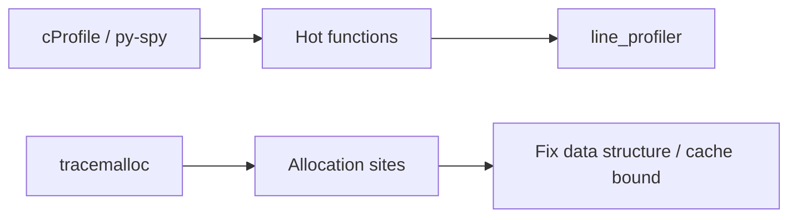

## Quick Revision

- **`cProfile`** — who calls whom; cumulative vs per-call time.
- **`line_profiler`** — line hotspots in one function.
- **`tracemalloc`** / **`memory_profiler`** — allocation sites and RSS drivers.
- **`py-spy`** — sampling profiler for live processes with low overhead.

## Core Concepts

| Tool | Measures | When |
| :--- | :--- | :--- |
| `cProfile` | Function call graph | First pass CPU triage |
| `line_profiler` | Per-line time in one function | Hot function identified |
| `tracemalloc` | Allocations by traceback | Memory growth |
| `memory_profiler` | Line memory (@profile) | Heap churn in one module |
| `py-spy` | Stack samples | Production-safe sampling |

## Internal Working



Deterministic profilers instrument every call — higher overhead. Sampling profilers approximate hotspots with less distortion under load.

## Production Usage

```python
import cProfile
import pstats
import tracemalloc

cProfile.run("main()", "out.prof")
pstats.Stats("out.prof").sort_stats("cumulative").print_stats(20)

tracemalloc.start()
# workload
for stat in tracemalloc.take_snapshot().statistics("lineno")[:10]:
    print(stat)
```

## Performance Considerations

- Profile with production-like data volume and concurrency.
- Compare snapshots (before/after deploy) for memory regressions.

## Troubleshooting

| Pattern | Next step |
| :--- | :--- |
| High cumulative in one helper | `line_profiler` that function |
| RSS up, Python heap flat | C extension or buffer off-heap |
| Spiky latency | Sample with `py-spy` under load |

## Common Mistakes

- Optimizing functions that are not on the critical path.
- Single-run benchmarks without warmup.


## Interview Questions

See [Top 150](/python-cheatsheet/09-interview-guide/top-150-interview-questions/).

---

## See Also

- [Previous: Performance Optimization](/python-cheatsheet/05-performance/performance-optimization/)
- [Next: Benchmarking](/python-cheatsheet/05-performance/benchmarking/)
- [Python Handbook Index](/python-cheatsheet/)
- [Top 150 Interview Questions](/python-cheatsheet/09-interview-guide/top-150-interview-questions/)
