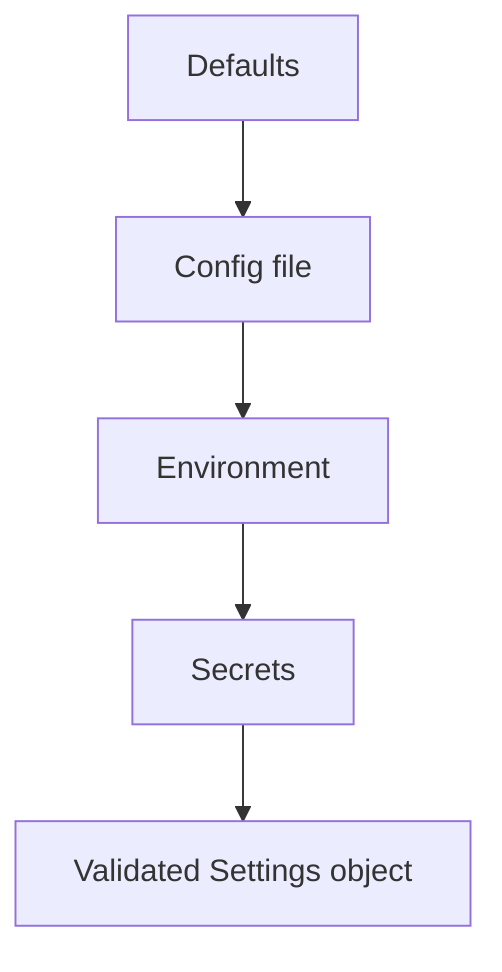

## Quick Revision

- Precedence: **defaults → config file → environment → secrets**.
- Never commit secrets; inject at runtime (vault, K8s secrets).
- `pydantic-settings` for typed, validated config.

## Core Concepts

| Source | Use |
| :--- | :--- |
| Defaults in code | Safe dev experience |
| `.env` / files | Non-secret environment-specific |
| Environment variables | 12-factor override |
| Secret store | Credentials, API keys |

## Internal Working

## Production Usage

- Fail fast on missing required config at startup.
- Separate `DATABASE_URL` secret from feature flags.
- Document every env var in README/runbook.

## Common Mistakes

- Boolean env vars as loose strings (`"false"` is truthy).
- Same secret in repo and production without rotation.

## Interview Questions

See [Top 150](/python-cheatsheet/09-interview-guide/top-150-interview-questions/).

---

## See Also

- [Previous: Logging](/python-cheatsheet/06-production-python/logging/)
- [Next: Observability](/python-cheatsheet/06-production-python/observability/)
- [Python Handbook Index](/python-cheatsheet/)
- [Top 150 Interview Questions](/python-cheatsheet/09-interview-guide/top-150-interview-questions/)
