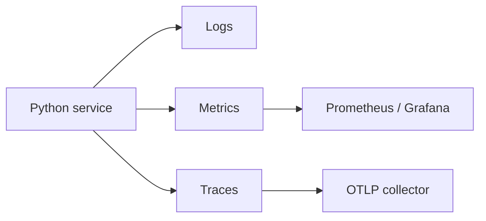
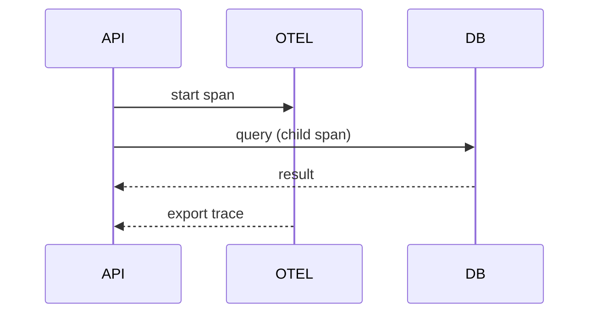

## Quick Revision

- **Logs** — discrete events; **metrics** — aggregates; **traces** — request paths.
- OpenTelemetry for vendor-neutral traces and metrics.
- Propagate trace context across threads and asyncio.

## Core Concepts

| Pillar | Examples |
| :--- | :--- |
| Logs | JSON lines, error rate |
| Metrics | Prometheus RED: rate, errors, duration |
| Traces | Span per outbound call, DB query |

## Internal Working

## Production Usage

- Sample traces under high traffic; always trace errors.
- Align metric labels with SLO dashboards.
- Use `contextvars` + OTEL propagators for async handlers.

## Common Mistakes

- High-cardinality metric labels (user IDs).
- Broken parent span context across thread boundaries.

## Interview Questions

See [Top 150](/python-cheatsheet/09-interview-guide/top-150-interview-questions/).

---

## See Also

- [Previous: Configuration Management](/python-cheatsheet/06-production-python/configuration-management/)
- [Next: Error Handling](/python-cheatsheet/06-production-python/error-handling/)
- [Python Handbook Index](/python-cheatsheet/)
- [Top 150 Interview Questions](/python-cheatsheet/09-interview-guide/top-150-interview-questions/)
