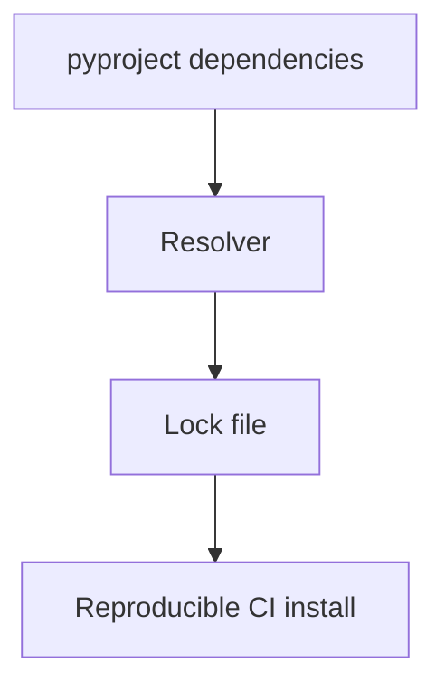

## Quick Revision

- Apps pin with lock files (`uv.lock`, `pip-tools`); libraries specify compatible ranges. Reproducible CI installs.

## Core Concepts

See module topics and [Top 150](/python-cheatsheet/09-interview-guide/top-150-interview-questions/) for interview depth.

## Production Usage

Apply patterns with measurement — profile before optimizing.

## Interview Questions

See [Top 150](/python-cheatsheet/09-interview-guide/top-150-interview-questions/).

---

## See Also

- [Previous: Packaging](/python-cheatsheet/07-packaging-distribution/packaging/)
- [Next: Poetry](/python-cheatsheet/07-packaging-distribution/poetry/)
- [Python Handbook Index](/python-cheatsheet/)
- [Top 150 Interview Questions](/python-cheatsheet/09-interview-guide/top-150-interview-questions/)
