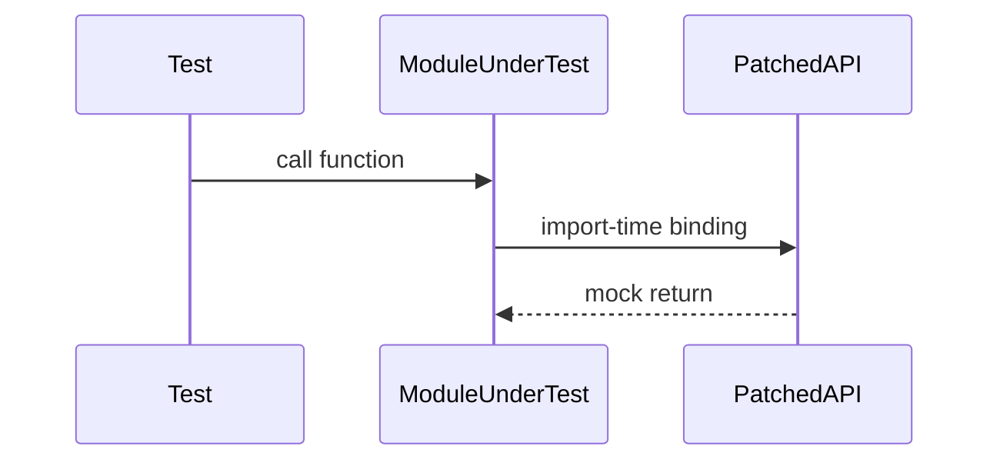

## Quick Revision

- **`patch` where the name is used**, not where defined.
- `Mock` / `MagicMock` for collaborators; `spec` for interface safety.
- Prefer fakes over mocks for complex domain behavior.

## Core Concepts

| Tool | When |
| :--- | :--- |
| `patch("pkg.module.func")` | Replace at import site in module under test |
| `Mock(return_value=...)` | Stub return |
| `side_effect` | Exceptions or dynamic returns |

## Internal Working



## Production Usage

```python
from unittest.mock import patch, MagicMock

@patch("myapp.service.http_client.get")
def test_fetch(mock_get):
    mock_get.return_value = MagicMock(status_code=200, json=lambda: {"ok": True})
    assert fetch_status() == "ok"
```

## Common Mistakes

- Patching `requests.get` when code uses `from requests import get`.
- Mocking so much that test only asserts mock was called.


## Interview Questions

See [Top 150](/python-cheatsheet/09-interview-guide/top-150-interview-questions/).

---

## See Also

- [Previous: Pytest](/python-cheatsheet/08-testing/pytest/)
- [Next: Test Strategies](/python-cheatsheet/08-testing/test-strategies/)
- [Python Handbook Index](/python-cheatsheet/)
- [Top 150 Interview Questions](/python-cheatsheet/09-interview-guide/top-150-interview-questions/)
