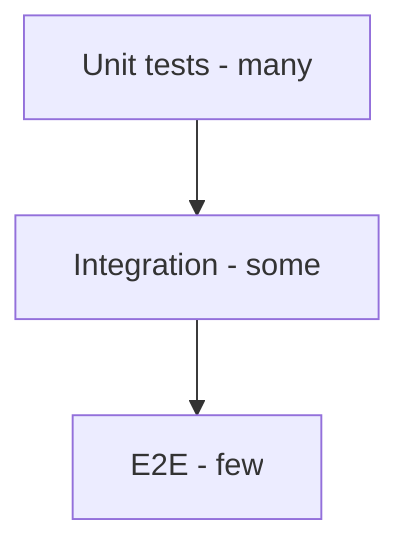

## Quick Revision

- **Pyramid:** many unit, fewer integration, minimal e2e.
- Unit tests: fast, isolated, no network.
- Integration tests: real DB/message broker in containers.

## Core Concepts

| Level | Scope | Speed |
| :--- | :--- | :--- |
| Unit | One module/class | ms |
| Integration | DB, HTTP, queue | seconds |
| E2E | Full stack | minutes |

## Internal Working

## Production Usage

- CI order: lint → typecheck → unit → integration.
- Fail fast; parallelize unit tests.
- Coverage on critical domains — not 100% everywhere.

## Common Mistakes

- Integration tests depending on prod APIs.
- No tests for packaging/import paths.

## Interview Questions

See [Top 150](/python-cheatsheet/09-interview-guide/top-150-interview-questions/).

---

## See Also

- [Previous: Virtual Environments](/python-cheatsheet/07-packaging-distribution/virtual-environments/)
- [Next: Pytest](/python-cheatsheet/08-testing/pytest/)
- [Python Handbook Index](/python-cheatsheet/)
- [Top 150 Interview Questions](/python-cheatsheet/09-interview-guide/top-150-interview-questions/)
