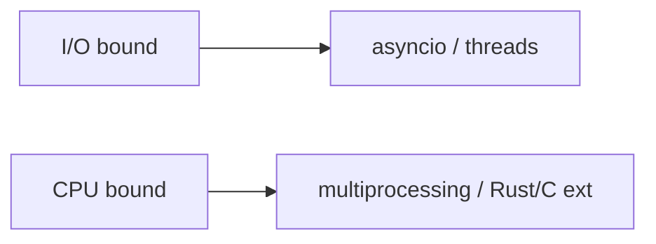

## At a Glance

- CPython GIL: one thread executes Python bytecode at a time per process.
- I/O-bound → `asyncio` or threads; CPU-bound → `multiprocessing` or native extensions.
- Mix models carefully — blocking call in async event loop stalls all tasks.

---

## Reference Tables

| Model | Best for | GIL impact |
| :--- | :--- | :--- |
| `asyncio` | Many concurrent I/O waits | N/A (single thread) |
| `threading` | Blocking I/O libraries | Limited CPU parallelism |
| `multiprocessing` | CPU-bound Python code | Bypass GIL (separate interpreters) |
| `concurrent.futures` | Unified pool API | Thread or process executor |



---

## Snippets

```python
from concurrent.futures import ThreadPoolExecutor, ProcessPoolExecutor, as_completed

with ThreadPoolExecutor(max_workers=8) as pool:
    futures = [pool.submit(fetch, url) for url in urls]
    for fut in as_completed(futures):
        handle(fut.result())
```

---

## Internals & Gotchas

- Async is not faster CPU — it's better scheduling of wait time.
- Thread safety: protect shared mutable state with locks or lock-free structures.
- `asyncio.run()` creates/closes event loop — entry point for scripts.

---

## Production Notes

- Offload blocking IO with `asyncio.to_thread` (3.9+) in async apps.
- Size thread pools from downstream limits (DB connections, API rate).

---

## Interview Probes


{< interview-answer >}
**Q:** When does GIL release?

**A:** Around I/O, many C extension calls, and periodically via bytecode tick — don't rely on tick for correctness.
{< /interview-answer >}

---

## See Also

- [Previous: Dataclasses](/python-cheatsheet/dataclasses/)
- [Next: Asyncio](/python-cheatsheet/asyncio/)
- [Asyncio](/python-cheatsheet/asyncio/)
- [Multithreading](/python-cheatsheet/multithreading/)
- [Multiprocessing](/python-cheatsheet/multiprocessing/)
- [Python Cheatsheet Index](/python-cheatsheet/)
