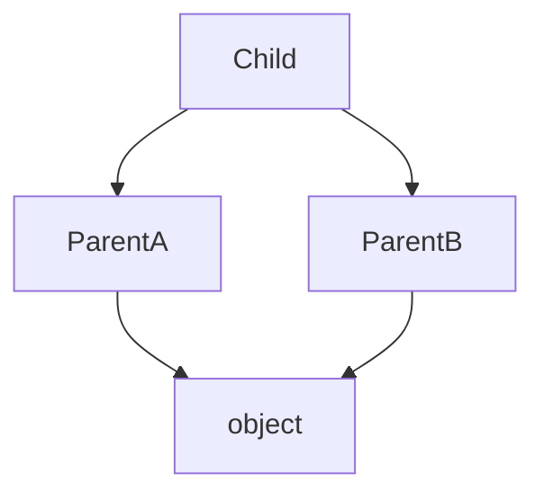

## At a Glance

- Multiple inheritance supported — MRO (C3 linearization) resolves method lookup.
- `super()` follows MRO, not just parent class — critical in diamonds.
- Prefer composition + Protocol typing over deep inheritance hierarchies.

---

## Reference Tables

| Pattern | Mechanism |
| :--- | :--- |
| Inheritance | `class Child(Parent):` |
| MRO | `Child.__mro__` or `help(Child)` |
| Abstract base | `abc.ABC` + `@abstractmethod` |
| Protocol (structural) | `typing.Protocol` — duck typing with types |
| Mixins | Small orthogonal parent classes |



---

## Snippets

```python
from abc import ABC, abstractmethod

class Repository(ABC):
    @abstractmethod
    def get(self, id: str) -> object: ...

class LoggingMixin:
    def log(self, msg: str) -> None:
        print(msg)

class Service(LoggingMixin):
    def run(self) -> None:
        self.log("start")

# cooperative super in multiple inheritance
class A:
    def method(self): return "A" + super().method()
```

---

## Internals & Gotchas

- `super()` in `__init__` must be called in cooperative multiple inheritance.
- Mixins should not define `__init__` without accepting `**kwargs`.
- `isinstance(x, Protocol)` works with `@runtime_checkable` only.

---

## Production Notes

- Favor small ABCs at integration boundaries (ports).
- Document extension points; seal internal classes with leading `_`.

---

## Interview Probes


{< interview-answer >}
**Q:** Explain MRO briefly.

**A:** C3 linearization orders base classes so each class appears before its parents and order is consistent across the hierarchy. Method lookup walks `__mro__`.
{< /interview-answer >}

---

## See Also

- [Previous: Classes](/python-cheatsheet/classes/)
- [Next: Modules](/python-cheatsheet/modules/)
- [Classes](/python-cheatsheet/classes/)
- [Typing](/python-cheatsheet/typing/)
- [Python Cheatsheet Index](/python-cheatsheet/)
