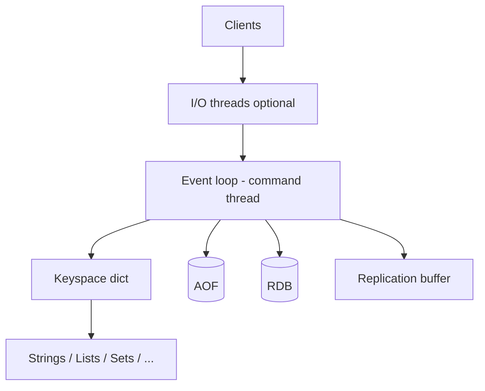

## Quick Revision

- Redis runs command execution on one event loop thread; network I/O threads are optional.
- For memory internals, see [Memory Management](/redis-cheatsheet/03-redis-internals/memory-management/).
- For protocol and pipelining internals, see [Redis Protocol](/redis-cheatsheet/03-redis-internals/redis-protocol/).

## Executive Summary

**Redis** is an in-memory data structure server: one **primary thread** executes commands, optional **I/O threads** handle networking, and data lives in **RAM** with optional RDB/AOF persistence. Clients speak the **RESP** protocol over TCP (or Unix socket).

---

## Core Concepts



| Component | Recap |
| :--- | :--- |
| **Event loop** | Single thread runs commands — no locks on data structures |
| **I/O threads** (6+) | Read/write sockets in parallel; command execution stays single-threaded |
| **Keyspace** | Global hash table: key → typed object (robj) |
| **RESP** | See [Redis Protocol](/redis-cheatsheet/03-redis-internals/redis-protocol/) |
| **Memory** | See [Memory Management](/redis-cheatsheet/03-redis-internals/memory-management/) |
| **Modules** | Redis Stack, RediSearch, RedisJSON extend core via API |

---

## Quick Reference

```bash
redis-cli INFO server
redis-cli INFO memory
redis-cli INFO stats
redis-cli CONFIG GET maxmemory
redis-cli CONFIG GET io-threads
redis-cli CLIENT LIST
redis-cli MONITOR          # debug only — kills prod throughput
```

---

## Snippets

### `redis.conf` essentials

```conf
bind 0.0.0.0
protected-mode yes
port 6379
maxmemory 2gb
maxmemory-policy allkeys-lru
io-threads 4
io-threads-do-reads yes
appendonly yes
appendfsync everysec
```

### Connection from app (Lettuce — Java)

```java
RedisClient client = RedisClient.create("redis://localhost:6379");
StatefulRedisConnection<String, String> conn = client.connect();
conn.sync().set("key", "value");
```

---

## Common Gotchas

| Pitfall | Fix |
| :--- | :--- |
| `KEYS *` in production | Use `SCAN` with cursor |
| `MONITOR` on busy instance | Use [Monitoring](/redis-cheatsheet/06-performance-operations/monitoring/) runbooks |
| Assuming multi-threaded command execution | Only one command thread — offload with sharding (Cluster) |
| No `maxmemory` + no eviction | OOM kill at OS level |

---

## Why does Redis use a single-threaded command execution model, and when do I/O threads change that picture?

### Short Answer
The production-grade Redis answer is using MULTI/EXEC for simple atomic batches and Lua for contested hot keys where WATCH abort rates would be high for: Why does Redis use a single-threaded command execution model, and when do I/O threads change that picture.

### Detailed Explanation
MULTI queues commands; EXEC runs them serially without interleaving — failed commands do not roll back earlier commands in the batch for: Why does Redis use a single-threaded command execution model, and when do I/O threads change that picture.

### Internal Working
WATCH provides optimistic locking by aborting EXEC if watched keys changed; pipelines batch without atomicity for: Why does Redis use a single-threaded command execution model, and when do I/O threads change that picture.

### Production Notes
You justify it by minimizing hot-key blast radius and single-thread CPU contention by keeping transaction blocks short and preferring Lua for compare-and-set on hot keys for: Why does Redis use a single-threaded command execution model, and when do I/O threads change that picture.

### Common Mistakes
Expecting RDBMS-style rollback or long MULTI blocks on hot keys are common production mistakes for: Why does Redis use a single-threaded command execution model, and when do I/O threads change that picture.

### Follow-up Questions
When would Lua replace MULTI/EXEC for: Why does Redis use a single-threaded command execution model, and when do I/O threads change that picture, and what cluster slot constraints apply?

---
## How would you choose between standalone Redis, Sentinel, and Cluster for a new payment-adjacent cache?

### Short Answer
The senior-level decision is deploying an odd number of sentinels with quorum tuned to avoid flapping while enabling automatic failover for: How would you choose between standalone Redis, Sentinel, and Cluster for a new payment-adjacent cache.

### Detailed Explanation
Sentinel marks subjective/objective down states, elects a new primary, and re-points replicas — clients must discover the new primary via Sentinel-aware drivers for: How would you choose between standalone Redis, Sentinel, and Cluster for a new payment-adjacent cache.

### Internal Working
Failover promotes a replica with `REPLICAOF NO ONE` then reconfigures the fleet; brief write unavailability and client reconnect storms are expected for: How would you choose between standalone Redis, Sentinel, and Cluster for a new payment-adjacent cache.

### Production Notes
You justify it by aligning durability settings with business RPO/RTO and client retry contracts by running game-day failover tests with connection pool refresh metrics for: How would you choose between standalone Redis, Sentinel, and Cluster for a new payment-adjacent cache.

### Common Mistakes
Split-brain risk rises with even sentinel counts, stale client caches, and missing `min-replicas-to-write` guards for: How would you choose between standalone Redis, Sentinel, and Cluster for a new payment-adjacent cache.

### Follow-up Questions
What quorum and `down-after-milliseconds` values would you defend in an ADR for: How would you choose between standalone Redis, Sentinel, and Cluster for a new payment-adjacent cache?

---
## What architectural role does Redis play when it is cache versus when it is the primary data store?

### Short Answer
The practical Redis answer is comparing Redis to alternatives on data model, durability, ops model, and failure semantics — not feature checklists for: What architectural role does Redis play when it is cache versus when it is the primary data store.

### Detailed Explanation
Redis offers rich structures and optional persistence; Memcached is simpler cache; Kafka/RabbitMQ excel at durable messaging scale for: What architectural role does Redis play when it is cache versus when it is the primary data store.

### Internal Working
Using Redis as a message bus works for moderate throughput with Streams; very large retention or routing complexity may favor dedicated brokers for: What architectural role does Redis play when it is cache versus when it is the primary data store.

### Production Notes
You justify it by measuring p99 latency, memory headroom, and failover behavior under realistic skew by documenting ADR assumptions and exit strategy if load doubles for: What architectural role does Redis play when it is cache versus when it is the primary data store.

### Common Mistakes
Resume-driven Redis adoption without ops maturity for Sentinel/Cluster causes painful incidents for: What architectural role does Redis play when it is cache versus when it is the primary data store.

### Follow-up Questions
What requirement in: What architectural role does Redis play when it is cache versus when it is the primary data store is decisive if throughput numbers are similar across options?

---
## How does the global keyspace dictionary influence hot-key and big-key failure modes at scale?

### Short Answer
For this question, the architecturally correct Redis answer is matching Redis data type to access pattern — not defaulting everything to JSON strings for: How does the global keyspace dictionary influence hot-key and big-key failure modes at scale.

### Detailed Explanation
Pick strings for counters/cache blobs, hashes for field updates, sets/ZSETs for uniqueness/ranking, Streams for durable queues for: How does the global keyspace dictionary influence hot-key and big-key failure modes at scale.

### Internal Working
Encoding upgrades and command complexity (O(N) vs O(1)) follow from type and size choices for: How does the global keyspace dictionary influence hot-key and big-key failure modes at scale.

### Production Notes
You justify it by proving behavior with INFO, slowlog, and workload replay before changing topology by validating command complexity and memory per key for: How does the global keyspace dictionary influence hot-key and big-key failure modes at scale.

### Common Mistakes
Using `HGETALL` or `SMEMBERS` on large collections blocks the event loop for: How does the global keyspace dictionary influence hot-key and big-key failure modes at scale.

### Follow-up Questions
Which type would you choose for: How does the global keyspace dictionary influence hot-key and big-key failure modes at scale, and what command path proves it under peak cardinality?

---
## How do Redis ACLs change multi-tenant architecture compared to shared-password eras?

### Short Answer
The senior-level decision is using MULTI/EXEC for simple atomic batches and Lua for contested hot keys where WATCH abort rates would be high for: How do Redis ACLs change multi-tenant architecture compared to shared-password eras.

### Detailed Explanation
MULTI queues commands; EXEC runs them serially without interleaving — failed commands do not roll back earlier commands in the batch for: How do Redis ACLs change multi-tenant architecture compared to shared-password eras.

### Internal Working
WATCH provides optimistic locking by aborting EXEC if watched keys changed; pipelines batch without atomicity for: How do Redis ACLs change multi-tenant architecture compared to shared-password eras.

### Production Notes
You justify it by aligning durability settings with business RPO/RTO and client retry contracts by keeping transaction blocks short and preferring Lua for compare-and-set on hot keys for: How do Redis ACLs change multi-tenant architecture compared to shared-password eras.

### Common Mistakes
Expecting RDBMS-style rollback or long MULTI blocks on hot keys are common production mistakes for: How do Redis ACLs change multi-tenant architecture compared to shared-password eras.

### Follow-up Questions
When would Lua replace MULTI/EXEC for: How do Redis ACLs change multi-tenant architecture compared to shared-password eras, and what cluster slot constraints apply?

---
## How would you tune io-threads and io-threads-do-reads for a read-heavy workload?

### Short Answer
For this question, the architecturally correct Redis answer is profiling latency as network RTT + command cost on a single thread, then pipelining and command shaping for: How would you tune io-threads and io-threads-do-reads for a read-heavy workload.

### Detailed Explanation
O(N) commands (`KEYS`, large `HGETALL`, wide `ZRANGE`) block the event loop — replace with SCAN, field picks, and LIMIT for: How would you tune io-threads and io-threads-do-reads for a read-heavy workload.

### Internal Working
I/O threads help socket read/write but do not parallelize command execution for: How would you tune io-threads and io-threads-do-reads for a read-heavy workload.

### Production Notes
You justify it by proving behavior with INFO, slowlog, and workload replay before changing topology using slowlog, latency doctor, and before/after benchmarks for: How would you tune io-threads and io-threads-do-reads for a read-heavy workload.

### Common Mistakes
Chasing hardware scale before fixing big keys, hot keys, or chatty clients rarely fixes p99 for: How would you tune io-threads and io-threads-do-reads for a read-heavy workload.

### Follow-up Questions
What single slowlog entry would convince you to change schema or sharding for: How would you tune io-threads and io-threads-do-reads for a read-heavy workload?

---
## What is the scalability ceiling of single-threaded command processing per core?

### Short Answer
The practical Redis answer is treating Redis as a single-threaded command processor with optional I/O threading, then choosing HA topology to match RPO/RTO for: What is the scalability ceiling of single-threaded command processing per core.

### Detailed Explanation
Redis throughput scales vertically per primary until CPU, memory, or hot-key skew dominates; Sentinel and Cluster solve availability and horizontal scale, not magic parallelism on one key for: What is the scalability ceiling of single-threaded command processing per core.

### Internal Working
Commands execute serially on the event loop, so long operations block all clients on that node — architecture must keep hot paths O(1) and shard before CPU saturates for: What is the scalability ceiling of single-threaded command processing per core.

### Production Notes
You justify it by measuring p99 latency, memory headroom, and failover behavior under realistic skew when comparing standalone, Sentinel, and Cluster for: What is the scalability ceiling of single-threaded command processing per core.

### Common Mistakes
A common mistake is assuming Redis is multi-threaded for commands or colocating unrelated blast-radius workloads on one cluster for: What is the scalability ceiling of single-threaded command processing per core.

### Follow-up Questions
What failover time, durability window, and client retry contract would you document before choosing topology for: What is the scalability ceiling of single-threaded command processing per core?

---
<!-- interview-answers:end -->

---

## Why does Redis use a single-threaded command execution model, and when do I/O threads change that picture?

### Short Answer
The production-grade Redis answer is using MULTI/EXEC for simple atomic batches and Lua for contested hot keys where WATCH abort rates would be high for: Why does Redis use a single-threaded command execution model, and when do I/O threads change that picture.

### Detailed Explanation
MULTI queues commands; EXEC runs them serially without interleaving — failed commands do not roll back earlier commands in the batch for: Why does Redis use a single-threaded command execution model, and when do I/O threads change that picture.

### Internal Working
WATCH provides optimistic locking by aborting EXEC if watched keys changed; pipelines batch without atomicity for: Why does Redis use a single-threaded command execution model, and when do I/O threads change that picture.

### Production Notes
You justify it by minimizing hot-key blast radius and single-thread CPU contention by keeping transaction blocks short and preferring Lua for compare-and-set on hot keys for: Why does Redis use a single-threaded command execution model, and when do I/O threads change that picture.

### Common Mistakes
Expecting RDBMS-style rollback or long MULTI blocks on hot keys are common production mistakes for: Why does Redis use a single-threaded command execution model, and when do I/O threads change that picture.

### Follow-up Questions
When would Lua replace MULTI/EXEC for: Why does Redis use a single-threaded command execution model, and when do I/O threads change that picture, and what cluster slot constraints apply?

---
## How would you choose between standalone Redis, Sentinel, and Cluster for a new payment-adjacent cache?

### Short Answer
The senior-level decision is deploying an odd number of sentinels with quorum tuned to avoid flapping while enabling automatic failover for: How would you choose between standalone Redis, Sentinel, and Cluster for a new payment-adjacent cache.

### Detailed Explanation
Sentinel marks subjective/objective down states, elects a new primary, and re-points replicas — clients must discover the new primary via Sentinel-aware drivers for: How would you choose between standalone Redis, Sentinel, and Cluster for a new payment-adjacent cache.

### Internal Working
Failover promotes a replica with `REPLICAOF NO ONE` then reconfigures the fleet; brief write unavailability and client reconnect storms are expected for: How would you choose between standalone Redis, Sentinel, and Cluster for a new payment-adjacent cache.

### Production Notes
You justify it by aligning durability settings with business RPO/RTO and client retry contracts by running game-day failover tests with connection pool refresh metrics for: How would you choose between standalone Redis, Sentinel, and Cluster for a new payment-adjacent cache.

### Common Mistakes
Split-brain risk rises with even sentinel counts, stale client caches, and missing `min-replicas-to-write` guards for: How would you choose between standalone Redis, Sentinel, and Cluster for a new payment-adjacent cache.

### Follow-up Questions
What quorum and `down-after-milliseconds` values would you defend in an ADR for: How would you choose between standalone Redis, Sentinel, and Cluster for a new payment-adjacent cache?

---
## What architectural role does Redis play when it is cache versus when it is the primary data store?

### Short Answer
The practical Redis answer is comparing Redis to alternatives on data model, durability, ops model, and failure semantics — not feature checklists for: What architectural role does Redis play when it is cache versus when it is the primary data store.

### Detailed Explanation
Redis offers rich structures and optional persistence; Memcached is simpler cache; Kafka/RabbitMQ excel at durable messaging scale for: What architectural role does Redis play when it is cache versus when it is the primary data store.

### Internal Working
Using Redis as a message bus works for moderate throughput with Streams; very large retention or routing complexity may favor dedicated brokers for: What architectural role does Redis play when it is cache versus when it is the primary data store.

### Production Notes
You justify it by measuring p99 latency, memory headroom, and failover behavior under realistic skew by documenting ADR assumptions and exit strategy if load doubles for: What architectural role does Redis play when it is cache versus when it is the primary data store.

### Common Mistakes
Resume-driven Redis adoption without ops maturity for Sentinel/Cluster causes painful incidents for: What architectural role does Redis play when it is cache versus when it is the primary data store.

### Follow-up Questions
What requirement in: What architectural role does Redis play when it is cache versus when it is the primary data store is decisive if throughput numbers are similar across options?

---
## How does the global keyspace dictionary influence hot-key and big-key failure modes at scale?

### Short Answer
For this question, the architecturally correct Redis answer is matching Redis data type to access pattern — not defaulting everything to JSON strings for: How does the global keyspace dictionary influence hot-key and big-key failure modes at scale.

### Detailed Explanation
Pick strings for counters/cache blobs, hashes for field updates, sets/ZSETs for uniqueness/ranking, Streams for durable queues for: How does the global keyspace dictionary influence hot-key and big-key failure modes at scale.

### Internal Working
Encoding upgrades and command complexity (O(N) vs O(1)) follow from type and size choices for: How does the global keyspace dictionary influence hot-key and big-key failure modes at scale.

### Production Notes
You justify it by proving behavior with INFO, slowlog, and workload replay before changing topology by validating command complexity and memory per key for: How does the global keyspace dictionary influence hot-key and big-key failure modes at scale.

### Common Mistakes
Using `HGETALL` or `SMEMBERS` on large collections blocks the event loop for: How does the global keyspace dictionary influence hot-key and big-key failure modes at scale.

### Follow-up Questions
Which type would you choose for: How does the global keyspace dictionary influence hot-key and big-key failure modes at scale, and what command path proves it under peak cardinality?

---
## How do Redis ACLs change multi-tenant architecture compared to shared-password eras?

### Short Answer
The senior-level decision is using MULTI/EXEC for simple atomic batches and Lua for contested hot keys where WATCH abort rates would be high for: How do Redis ACLs change multi-tenant architecture compared to shared-password eras.

### Detailed Explanation
MULTI queues commands; EXEC runs them serially without interleaving — failed commands do not roll back earlier commands in the batch for: How do Redis ACLs change multi-tenant architecture compared to shared-password eras.

### Internal Working
WATCH provides optimistic locking by aborting EXEC if watched keys changed; pipelines batch without atomicity for: How do Redis ACLs change multi-tenant architecture compared to shared-password eras.

### Production Notes
You justify it by aligning durability settings with business RPO/RTO and client retry contracts by keeping transaction blocks short and preferring Lua for compare-and-set on hot keys for: How do Redis ACLs change multi-tenant architecture compared to shared-password eras.

### Common Mistakes
Expecting RDBMS-style rollback or long MULTI blocks on hot keys are common production mistakes for: How do Redis ACLs change multi-tenant architecture compared to shared-password eras.

### Follow-up Questions
When would Lua replace MULTI/EXEC for: How do Redis ACLs change multi-tenant architecture compared to shared-password eras, and what cluster slot constraints apply?

---
## How would you tune io-threads and io-threads-do-reads for a read-heavy workload?

### Short Answer
For this question, the architecturally correct Redis answer is profiling latency as network RTT + command cost on a single thread, then pipelining and command shaping for: How would you tune io-threads and io-threads-do-reads for a read-heavy workload.

### Detailed Explanation
O(N) commands (`KEYS`, large `HGETALL`, wide `ZRANGE`) block the event loop — replace with SCAN, field picks, and LIMIT for: How would you tune io-threads and io-threads-do-reads for a read-heavy workload.

### Internal Working
I/O threads help socket read/write but do not parallelize command execution for: How would you tune io-threads and io-threads-do-reads for a read-heavy workload.

### Production Notes
You justify it by proving behavior with INFO, slowlog, and workload replay before changing topology using slowlog, latency doctor, and before/after benchmarks for: How would you tune io-threads and io-threads-do-reads for a read-heavy workload.

### Common Mistakes
Chasing hardware scale before fixing big keys, hot keys, or chatty clients rarely fixes p99 for: How would you tune io-threads and io-threads-do-reads for a read-heavy workload.

### Follow-up Questions
What single slowlog entry would convince you to change schema or sharding for: How would you tune io-threads and io-threads-do-reads for a read-heavy workload?

---
## What is the scalability ceiling of single-threaded command processing per core?

### Short Answer
The practical Redis answer is treating Redis as a single-threaded command processor with optional I/O threading, then choosing HA topology to match RPO/RTO for: What is the scalability ceiling of single-threaded command processing per core.

### Detailed Explanation
Redis throughput scales vertically per primary until CPU, memory, or hot-key skew dominates; Sentinel and Cluster solve availability and horizontal scale, not magic parallelism on one key for: What is the scalability ceiling of single-threaded command processing per core.

### Internal Working
Commands execute serially on the event loop, so long operations block all clients on that node — architecture must keep hot paths O(1) and shard before CPU saturates for: What is the scalability ceiling of single-threaded command processing per core.

### Production Notes
You justify it by measuring p99 latency, memory headroom, and failover behavior under realistic skew when comparing standalone, Sentinel, and Cluster for: What is the scalability ceiling of single-threaded command processing per core.

### Common Mistakes
A common mistake is assuming Redis is multi-threaded for commands or colocating unrelated blast-radius workloads on one cluster for: What is the scalability ceiling of single-threaded command processing per core.

### Follow-up Questions
What failover time, durability window, and client retry contract would you document before choosing topology for: What is the scalability ceiling of single-threaded command processing per core?

---
<!-- interview-answers:end -->

---

## Why does Redis use a single-threaded command execution model, and when do I/O threads change that picture?

### Short Answer
The production-grade Redis answer is using MULTI/EXEC for simple atomic batches and Lua for contested hot keys where WATCH abort rates would be high for: Why does Redis use a single-threaded command execution model, and when do I/O threads change that picture.

### Detailed Explanation
MULTI queues commands; EXEC runs them serially without interleaving — failed commands do not roll back earlier commands in the batch for: Why does Redis use a single-threaded command execution model, and when do I/O threads change that picture.

### Internal Working
WATCH provides optimistic locking by aborting EXEC if watched keys changed; pipelines batch without atomicity for: Why does Redis use a single-threaded command execution model, and when do I/O threads change that picture.

### Production Notes
You justify it by minimizing hot-key blast radius and single-thread CPU contention by keeping transaction blocks short and preferring Lua for compare-and-set on hot keys for: Why does Redis use a single-threaded command execution model, and when do I/O threads change that picture.

### Common Mistakes
Expecting RDBMS-style rollback or long MULTI blocks on hot keys are common production mistakes for: Why does Redis use a single-threaded command execution model, and when do I/O threads change that picture.

### Follow-up Questions
When would Lua replace MULTI/EXEC for: Why does Redis use a single-threaded command execution model, and when do I/O threads change that picture, and what cluster slot constraints apply?

---
## How would you choose between standalone Redis, Sentinel, and Cluster for a new payment-adjacent cache?

### Short Answer
The senior-level decision is deploying an odd number of sentinels with quorum tuned to avoid flapping while enabling automatic failover for: How would you choose between standalone Redis, Sentinel, and Cluster for a new payment-adjacent cache.

### Detailed Explanation
Sentinel marks subjective/objective down states, elects a new primary, and re-points replicas — clients must discover the new primary via Sentinel-aware drivers for: How would you choose between standalone Redis, Sentinel, and Cluster for a new payment-adjacent cache.

### Internal Working
Failover promotes a replica with `REPLICAOF NO ONE` then reconfigures the fleet; brief write unavailability and client reconnect storms are expected for: How would you choose between standalone Redis, Sentinel, and Cluster for a new payment-adjacent cache.

### Production Notes
You justify it by aligning durability settings with business RPO/RTO and client retry contracts by running game-day failover tests with connection pool refresh metrics for: How would you choose between standalone Redis, Sentinel, and Cluster for a new payment-adjacent cache.

### Common Mistakes
Split-brain risk rises with even sentinel counts, stale client caches, and missing `min-replicas-to-write` guards for: How would you choose between standalone Redis, Sentinel, and Cluster for a new payment-adjacent cache.

### Follow-up Questions
What quorum and `down-after-milliseconds` values would you defend in an ADR for: How would you choose between standalone Redis, Sentinel, and Cluster for a new payment-adjacent cache?

---
## What architectural role does Redis play when it is cache versus when it is the primary data store?

### Short Answer
The practical Redis answer is comparing Redis to alternatives on data model, durability, ops model, and failure semantics — not feature checklists for: What architectural role does Redis play when it is cache versus when it is the primary data store.

### Detailed Explanation
Redis offers rich structures and optional persistence; Memcached is simpler cache; Kafka/RabbitMQ excel at durable messaging scale for: What architectural role does Redis play when it is cache versus when it is the primary data store.

### Internal Working
Using Redis as a message bus works for moderate throughput with Streams; very large retention or routing complexity may favor dedicated brokers for: What architectural role does Redis play when it is cache versus when it is the primary data store.

### Production Notes
You justify it by measuring p99 latency, memory headroom, and failover behavior under realistic skew by documenting ADR assumptions and exit strategy if load doubles for: What architectural role does Redis play when it is cache versus when it is the primary data store.

### Common Mistakes
Resume-driven Redis adoption without ops maturity for Sentinel/Cluster causes painful incidents for: What architectural role does Redis play when it is cache versus when it is the primary data store.

### Follow-up Questions
What requirement in: What architectural role does Redis play when it is cache versus when it is the primary data store is decisive if throughput numbers are similar across options?

---
## How does the global keyspace dictionary influence hot-key and big-key failure modes at scale?

### Short Answer
For this question, the architecturally correct Redis answer is matching Redis data type to access pattern — not defaulting everything to JSON strings for: How does the global keyspace dictionary influence hot-key and big-key failure modes at scale.

### Detailed Explanation
Pick strings for counters/cache blobs, hashes for field updates, sets/ZSETs for uniqueness/ranking, Streams for durable queues for: How does the global keyspace dictionary influence hot-key and big-key failure modes at scale.

### Internal Working
Encoding upgrades and command complexity (O(N) vs O(1)) follow from type and size choices for: How does the global keyspace dictionary influence hot-key and big-key failure modes at scale.

### Production Notes
You justify it by proving behavior with INFO, slowlog, and workload replay before changing topology by validating command complexity and memory per key for: How does the global keyspace dictionary influence hot-key and big-key failure modes at scale.

### Common Mistakes
Using `HGETALL` or `SMEMBERS` on large collections blocks the event loop for: How does the global keyspace dictionary influence hot-key and big-key failure modes at scale.

### Follow-up Questions
Which type would you choose for: How does the global keyspace dictionary influence hot-key and big-key failure modes at scale, and what command path proves it under peak cardinality?

---
## How do Redis ACLs change multi-tenant architecture compared to shared-password eras?

### Short Answer
The senior-level decision is using MULTI/EXEC for simple atomic batches and Lua for contested hot keys where WATCH abort rates would be high for: How do Redis ACLs change multi-tenant architecture compared to shared-password eras.

### Detailed Explanation
MULTI queues commands; EXEC runs them serially without interleaving — failed commands do not roll back earlier commands in the batch for: How do Redis ACLs change multi-tenant architecture compared to shared-password eras.

### Internal Working
WATCH provides optimistic locking by aborting EXEC if watched keys changed; pipelines batch without atomicity for: How do Redis ACLs change multi-tenant architecture compared to shared-password eras.

### Production Notes
You justify it by aligning durability settings with business RPO/RTO and client retry contracts by keeping transaction blocks short and preferring Lua for compare-and-set on hot keys for: How do Redis ACLs change multi-tenant architecture compared to shared-password eras.

### Common Mistakes
Expecting RDBMS-style rollback or long MULTI blocks on hot keys are common production mistakes for: How do Redis ACLs change multi-tenant architecture compared to shared-password eras.

### Follow-up Questions
When would Lua replace MULTI/EXEC for: How do Redis ACLs change multi-tenant architecture compared to shared-password eras, and what cluster slot constraints apply?

---
## How would you tune io-threads and io-threads-do-reads for a read-heavy workload?

### Short Answer
For this question, the architecturally correct Redis answer is profiling latency as network RTT + command cost on a single thread, then pipelining and command shaping for: How would you tune io-threads and io-threads-do-reads for a read-heavy workload.

### Detailed Explanation
O(N) commands (`KEYS`, large `HGETALL`, wide `ZRANGE`) block the event loop — replace with SCAN, field picks, and LIMIT for: How would you tune io-threads and io-threads-do-reads for a read-heavy workload.

### Internal Working
I/O threads help socket read/write but do not parallelize command execution for: How would you tune io-threads and io-threads-do-reads for a read-heavy workload.

### Production Notes
You justify it by proving behavior with INFO, slowlog, and workload replay before changing topology using slowlog, latency doctor, and before/after benchmarks for: How would you tune io-threads and io-threads-do-reads for a read-heavy workload.

### Common Mistakes
Chasing hardware scale before fixing big keys, hot keys, or chatty clients rarely fixes p99 for: How would you tune io-threads and io-threads-do-reads for a read-heavy workload.

### Follow-up Questions
What single slowlog entry would convince you to change schema or sharding for: How would you tune io-threads and io-threads-do-reads for a read-heavy workload?

---
## What is the scalability ceiling of single-threaded command processing per core?

### Short Answer
The practical Redis answer is treating Redis as a single-threaded command processor with optional I/O threading, then choosing HA topology to match RPO/RTO for: What is the scalability ceiling of single-threaded command processing per core.

### Detailed Explanation
Redis throughput scales vertically per primary until CPU, memory, or hot-key skew dominates; Sentinel and Cluster solve availability and horizontal scale, not magic parallelism on one key for: What is the scalability ceiling of single-threaded command processing per core.

### Internal Working
Commands execute serially on the event loop, so long operations block all clients on that node — architecture must keep hot paths O(1) and shard before CPU saturates for: What is the scalability ceiling of single-threaded command processing per core.

### Production Notes
You justify it by measuring p99 latency, memory headroom, and failover behavior under realistic skew when comparing standalone, Sentinel, and Cluster for: What is the scalability ceiling of single-threaded command processing per core.

### Common Mistakes
A common mistake is assuming Redis is multi-threaded for commands or colocating unrelated blast-radius workloads on one cluster for: What is the scalability ceiling of single-threaded command processing per core.

### Follow-up Questions
What failover time, durability window, and client retry contract would you document before choosing topology for: What is the scalability ceiling of single-threaded command processing per core?

---
<!-- interview-answers:end -->

---

## Why does Redis use a single-threaded command execution model, and when do I/O threads change that picture?

### Short Answer
The production-grade Redis answer is using MULTI/EXEC for simple atomic batches and Lua for contested hot keys where WATCH abort rates would be high for: Why does Redis use a single-threaded command execution model, and when do I/O threads change that picture.

### Detailed Explanation
MULTI queues commands; EXEC runs them serially without interleaving — failed commands do not roll back earlier commands in the batch for: Why does Redis use a single-threaded command execution model, and when do I/O threads change that picture.

### Internal Working
WATCH provides optimistic locking by aborting EXEC if watched keys changed; pipelines batch without atomicity for: Why does Redis use a single-threaded command execution model, and when do I/O threads change that picture.

### Production Notes
You justify it by minimizing hot-key blast radius and single-thread CPU contention by keeping transaction blocks short and preferring Lua for compare-and-set on hot keys for: Why does Redis use a single-threaded command execution model, and when do I/O threads change that picture.

### Common Mistakes
Expecting RDBMS-style rollback or long MULTI blocks on hot keys are common production mistakes for: Why does Redis use a single-threaded command execution model, and when do I/O threads change that picture.

### Follow-up Questions
When would Lua replace MULTI/EXEC for: Why does Redis use a single-threaded command execution model, and when do I/O threads change that picture, and what cluster slot constraints apply?

---
## How would you choose between standalone Redis, Sentinel, and Cluster for a new payment-adjacent cache?

### Short Answer
The senior-level decision is deploying an odd number of sentinels with quorum tuned to avoid flapping while enabling automatic failover for: How would you choose between standalone Redis, Sentinel, and Cluster for a new payment-adjacent cache.

### Detailed Explanation
Sentinel marks subjective/objective down states, elects a new primary, and re-points replicas — clients must discover the new primary via Sentinel-aware drivers for: How would you choose between standalone Redis, Sentinel, and Cluster for a new payment-adjacent cache.

### Internal Working
Failover promotes a replica with `REPLICAOF NO ONE` then reconfigures the fleet; brief write unavailability and client reconnect storms are expected for: How would you choose between standalone Redis, Sentinel, and Cluster for a new payment-adjacent cache.

### Production Notes
You justify it by aligning durability settings with business RPO/RTO and client retry contracts by running game-day failover tests with connection pool refresh metrics for: How would you choose between standalone Redis, Sentinel, and Cluster for a new payment-adjacent cache.

### Common Mistakes
Split-brain risk rises with even sentinel counts, stale client caches, and missing `min-replicas-to-write` guards for: How would you choose between standalone Redis, Sentinel, and Cluster for a new payment-adjacent cache.

### Follow-up Questions
What quorum and `down-after-milliseconds` values would you defend in an ADR for: How would you choose between standalone Redis, Sentinel, and Cluster for a new payment-adjacent cache?

---
## What architectural role does Redis play when it is cache versus when it is the primary data store?

### Short Answer
The practical Redis answer is comparing Redis to alternatives on data model, durability, ops model, and failure semantics — not feature checklists for: What architectural role does Redis play when it is cache versus when it is the primary data store.

### Detailed Explanation
Redis offers rich structures and optional persistence; Memcached is simpler cache; Kafka/RabbitMQ excel at durable messaging scale for: What architectural role does Redis play when it is cache versus when it is the primary data store.

### Internal Working
Using Redis as a message bus works for moderate throughput with Streams; very large retention or routing complexity may favor dedicated brokers for: What architectural role does Redis play when it is cache versus when it is the primary data store.

### Production Notes
You justify it by measuring p99 latency, memory headroom, and failover behavior under realistic skew by documenting ADR assumptions and exit strategy if load doubles for: What architectural role does Redis play when it is cache versus when it is the primary data store.

### Common Mistakes
Resume-driven Redis adoption without ops maturity for Sentinel/Cluster causes painful incidents for: What architectural role does Redis play when it is cache versus when it is the primary data store.

### Follow-up Questions
What requirement in: What architectural role does Redis play when it is cache versus when it is the primary data store is decisive if throughput numbers are similar across options?

---
## How does the global keyspace dictionary influence hot-key and big-key failure modes at scale?

### Short Answer
For this question, the architecturally correct Redis answer is matching Redis data type to access pattern — not defaulting everything to JSON strings for: How does the global keyspace dictionary influence hot-key and big-key failure modes at scale.

### Detailed Explanation
Pick strings for counters/cache blobs, hashes for field updates, sets/ZSETs for uniqueness/ranking, Streams for durable queues for: How does the global keyspace dictionary influence hot-key and big-key failure modes at scale.

### Internal Working
Encoding upgrades and command complexity (O(N) vs O(1)) follow from type and size choices for: How does the global keyspace dictionary influence hot-key and big-key failure modes at scale.

### Production Notes
You justify it by proving behavior with INFO, slowlog, and workload replay before changing topology by validating command complexity and memory per key for: How does the global keyspace dictionary influence hot-key and big-key failure modes at scale.

### Common Mistakes
Using `HGETALL` or `SMEMBERS` on large collections blocks the event loop for: How does the global keyspace dictionary influence hot-key and big-key failure modes at scale.

### Follow-up Questions
Which type would you choose for: How does the global keyspace dictionary influence hot-key and big-key failure modes at scale, and what command path proves it under peak cardinality?

---
## How do Redis ACLs change multi-tenant architecture compared to shared-password eras?

### Short Answer
The senior-level decision is using MULTI/EXEC for simple atomic batches and Lua for contested hot keys where WATCH abort rates would be high for: How do Redis ACLs change multi-tenant architecture compared to shared-password eras.

### Detailed Explanation
MULTI queues commands; EXEC runs them serially without interleaving — failed commands do not roll back earlier commands in the batch for: How do Redis ACLs change multi-tenant architecture compared to shared-password eras.

### Internal Working
WATCH provides optimistic locking by aborting EXEC if watched keys changed; pipelines batch without atomicity for: How do Redis ACLs change multi-tenant architecture compared to shared-password eras.

### Production Notes
You justify it by aligning durability settings with business RPO/RTO and client retry contracts by keeping transaction blocks short and preferring Lua for compare-and-set on hot keys for: How do Redis ACLs change multi-tenant architecture compared to shared-password eras.

### Common Mistakes
Expecting RDBMS-style rollback or long MULTI blocks on hot keys are common production mistakes for: How do Redis ACLs change multi-tenant architecture compared to shared-password eras.

### Follow-up Questions
When would Lua replace MULTI/EXEC for: How do Redis ACLs change multi-tenant architecture compared to shared-password eras, and what cluster slot constraints apply?

---
## How would you tune io-threads and io-threads-do-reads for a read-heavy workload?

### Short Answer
For this question, the architecturally correct Redis answer is profiling latency as network RTT + command cost on a single thread, then pipelining and command shaping for: How would you tune io-threads and io-threads-do-reads for a read-heavy workload.

### Detailed Explanation
O(N) commands (`KEYS`, large `HGETALL`, wide `ZRANGE`) block the event loop — replace with SCAN, field picks, and LIMIT for: How would you tune io-threads and io-threads-do-reads for a read-heavy workload.

### Internal Working
I/O threads help socket read/write but do not parallelize command execution for: How would you tune io-threads and io-threads-do-reads for a read-heavy workload.

### Production Notes
You justify it by proving behavior with INFO, slowlog, and workload replay before changing topology using slowlog, latency doctor, and before/after benchmarks for: How would you tune io-threads and io-threads-do-reads for a read-heavy workload.

### Common Mistakes
Chasing hardware scale before fixing big keys, hot keys, or chatty clients rarely fixes p99 for: How would you tune io-threads and io-threads-do-reads for a read-heavy workload.

### Follow-up Questions
What single slowlog entry would convince you to change schema or sharding for: How would you tune io-threads and io-threads-do-reads for a read-heavy workload?

---
## What is the scalability ceiling of single-threaded command processing per core?

### Short Answer
The practical Redis answer is treating Redis as a single-threaded command processor with optional I/O threading, then choosing HA topology to match RPO/RTO for: What is the scalability ceiling of single-threaded command processing per core.

### Detailed Explanation
Redis throughput scales vertically per primary until CPU, memory, or hot-key skew dominates; Sentinel and Cluster solve availability and horizontal scale, not magic parallelism on one key for: What is the scalability ceiling of single-threaded command processing per core.

### Internal Working
Commands execute serially on the event loop, so long operations block all clients on that node — architecture must keep hot paths O(1) and shard before CPU saturates for: What is the scalability ceiling of single-threaded command processing per core.

### Production Notes
You justify it by measuring p99 latency, memory headroom, and failover behavior under realistic skew when comparing standalone, Sentinel, and Cluster for: What is the scalability ceiling of single-threaded command processing per core.

### Common Mistakes
A common mistake is assuming Redis is multi-threaded for commands or colocating unrelated blast-radius workloads on one cluster for: What is the scalability ceiling of single-threaded command processing per core.

### Follow-up Questions
What failover time, durability window, and client retry contract would you document before choosing topology for: What is the scalability ceiling of single-threaded command processing per core?

---
<!-- interview-answers:end -->

---

## See Also

- [Next: Data Structures](/redis-cheatsheet/01-fundamentals/data-structures/)
- [Redis Handbook Index](/redis-cheatsheet/)
- [Top 150 Interview Questions](/redis-cheatsheet/08-interview-guide/top-150-interview-questions/)
