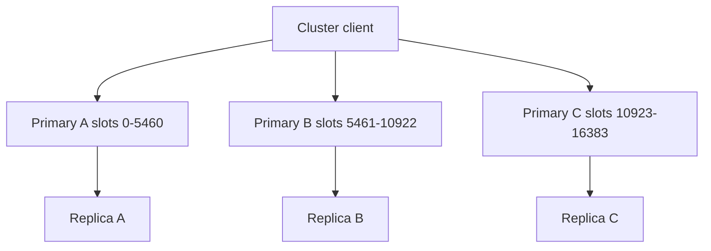

## Executive Summary

**Redis Cluster** shards keys across **16384 hash slots** on multiple primaries — each with replicas. Clients must be **cluster-aware** (`MOVED`/`ASK` redirects).

---

## Core Concepts



| Topic | Detail |
| :--- | :--- |
| **Slot** | `CRC16(key) mod 16384` |
| **Hash tag** | `{user}:profile` and `{user}:orders` → same slot |
| **MOVED** | Permanent redirect — client updates slot map |
| **ASK** | Temporary during resharding |
| **Min nodes** | 3 primaries typical for production |

Multi-key ops require same slot — use hash tags.

---

## Quick Reference

```bash
CLUSTER INFO
CLUSTER NODES
CLUSTER SLOTS
CLUSTER KEYSLOT mykey
redis-cli --cluster create host1:6379 host2:6379 --cluster-replicas 1
redis-cli --cluster reshard host1:6379
redis-cli -c -h host1 -p 6379   # cluster mode
```

---

## Snippets

### Hash tag for multi-key transaction

```bash
MSET {user:42}:name Alice {user:42}:email a@b.com
```

---

## Common Gotchas

| Pitfall | Fix |
| :--- | :--- |
| `MGET` keys on different slots | Cluster rejects — use hash tags or separate calls |
| Non-cluster client | Gets `MOVED` errors |
| Lua with multiple keys | All keys must share slot |

---

## When would you shard with Redis Cluster instead of vertical scaling a single primary?

### Short Answer
The production-grade Redis answer is designing keys around 16384 hash slots, hash tags for multi-key ops, and cluster-aware clients for: When would you shard with Redis Cluster instead of vertical scaling a single primary.

### Detailed Explanation
Slot = CRC16(key) mod 16384; MOVED is permanent redirect, ASK is temporary during migration — resharding moves slot ownership without changing key names for: When would you shard with Redis Cluster instead of vertical scaling a single primary.

### Internal Working
Multi-key commands, Lua, and transactions require all keys in the same slot — `{tag}` hash tags force colocation for: When would you shard with Redis Cluster instead of vertical scaling a single primary.

### Production Notes
You justify it by minimizing hot-key blast radius and single-thread CPU contention by monitoring per-node ops/sec, slot distribution, and MOVED/ASK rates during: When would you shard with Redis Cluster instead of vertical scaling a single primary.

### Common Mistakes
Typical failures: non-cluster clients, cross-slot MGET, and hot slots from poor key choice for: When would you shard with Redis Cluster instead of vertical scaling a single primary.

### Follow-up Questions
How would you rebalance slots or split hot keys if: When would you shard with Redis Cluster instead of vertical scaling a single primary appears in production metrics?

---
## How do hash tags change your key design when you need multi-key atomicity in Cluster?

### Short Answer
The senior-level decision is using MULTI/EXEC for simple atomic batches and Lua for contested hot keys where WATCH abort rates would be high for: How do hash tags change your key design when you need multi-key atomicity in Cluster.

### Detailed Explanation
MULTI queues commands; EXEC runs them serially without interleaving — failed commands do not roll back earlier commands in the batch for: How do hash tags change your key design when you need multi-key atomicity in Cluster.

### Internal Working
WATCH provides optimistic locking by aborting EXEC if watched keys changed; pipelines batch without atomicity for: How do hash tags change your key design when you need multi-key atomicity in Cluster.

### Production Notes
You justify it by aligning durability settings with business RPO/RTO and client retry contracts by keeping transaction blocks short and preferring Lua for compare-and-set on hot keys for: How do hash tags change your key design when you need multi-key atomicity in Cluster.

### Common Mistakes
Expecting RDBMS-style rollback or long MULTI blocks on hot keys are common production mistakes for: How do hash tags change your key design when you need multi-key atomicity in Cluster.

### Follow-up Questions
When would Lua replace MULTI/EXEC for: How do hash tags change your key design when you need multi-key atomicity in Cluster, and what cluster slot constraints apply?

---
## What is the mental model for 16384 hash slots, and why not more or fewer?

### Short Answer
The practical Redis answer is designing keys around 16384 hash slots, hash tags for multi-key ops, and cluster-aware clients for: What is the mental model for 16384 hash slots, and why not more or fewer.

### Detailed Explanation
Slot = CRC16(key) mod 16384; MOVED is permanent redirect, ASK is temporary during migration — resharding moves slot ownership without changing key names for: What is the mental model for 16384 hash slots, and why not more or fewer.

### Internal Working
Multi-key commands, Lua, and transactions require all keys in the same slot — `{tag}` hash tags force colocation for: What is the mental model for 16384 hash slots, and why not more or fewer.

### Production Notes
You justify it by measuring p99 latency, memory headroom, and failover behavior under realistic skew by monitoring per-node ops/sec, slot distribution, and MOVED/ASK rates during: What is the mental model for 16384 hash slots, and why not more or fewer.

### Common Mistakes
Typical failures: non-cluster clients, cross-slot MGET, and hot slots from poor key choice for: What is the mental model for 16384 hash slots, and why not more or fewer.

### Follow-up Questions
How would you rebalance slots or split hot keys if: What is the mental model for 16384 hash slots, and why not more or fewer appears in production metrics?

---
## How would you isolate tenant traffic on a shared Redis cluster without cross-tenant key collisions?

### Short Answer
For this question, the architecturally correct Redis answer is designing keys around 16384 hash slots, hash tags for multi-key ops, and cluster-aware clients for: How would you isolate tenant traffic on a shared Redis cluster without cross-tenant key collisions.

### Detailed Explanation
Slot = CRC16(key) mod 16384; MOVED is permanent redirect, ASK is temporary during migration — resharding moves slot ownership without changing key names for: How would you isolate tenant traffic on a shared Redis cluster without cross-tenant key collisions.

### Internal Working
Multi-key commands, Lua, and transactions require all keys in the same slot — `{tag}` hash tags force colocation for: How would you isolate tenant traffic on a shared Redis cluster without cross-tenant key collisions.

### Production Notes
You justify it by proving behavior with INFO, slowlog, and workload replay before changing topology by monitoring per-node ops/sec, slot distribution, and MOVED/ASK rates during: How would you isolate tenant traffic on a shared Redis cluster without cross-tenant key collisions.

### Common Mistakes
Typical failures: non-cluster clients, cross-slot MGET, and hot slots from poor key choice for: How would you isolate tenant traffic on a shared Redis cluster without cross-tenant key collisions.

### Follow-up Questions
How would you rebalance slots or split hot keys if: How would you isolate tenant traffic on a shared Redis cluster without cross-tenant key collisions appears in production metrics?

---
## How does active-active multi-region Redis differ architecturally from single-region Cluster plus replication?

### Short Answer
The senior-level decision is using MULTI/EXEC for simple atomic batches and Lua for contested hot keys where WATCH abort rates would be high for: How does active-active multi-region Redis differ architecturally from single-region Cluster plus replication.

### Detailed Explanation
MULTI queues commands; EXEC runs them serially without interleaving — failed commands do not roll back earlier commands in the batch for: How does active-active multi-region Redis differ architecturally from single-region Cluster plus replication.

### Internal Working
WATCH provides optimistic locking by aborting EXEC if watched keys changed; pipelines batch without atomicity for: How does active-active multi-region Redis differ architecturally from single-region Cluster plus replication.

### Production Notes
You justify it by aligning durability settings with business RPO/RTO and client retry contracts by keeping transaction blocks short and preferring Lua for compare-and-set on hot keys for: How does active-active multi-region Redis differ architecturally from single-region Cluster plus replication.

### Common Mistakes
Expecting RDBMS-style rollback or long MULTI blocks on hot keys are common production mistakes for: How does active-active multi-region Redis differ architecturally from single-region Cluster plus replication.

### Follow-up Questions
When would Lua replace MULTI/EXEC for: How does active-active multi-region Redis differ architecturally from single-region Cluster plus replication, and what cluster slot constraints apply?

---
## When does sharding with Cluster improve throughput versus larger single-instance hardware?

### Short Answer
The production-grade Redis answer is comparing Redis to alternatives on data model, durability, ops model, and failure semantics — not feature checklists for: When does sharding with Cluster improve throughput versus larger single-instance hardware.

### Detailed Explanation
Redis offers rich structures and optional persistence; Memcached is simpler cache; Kafka/RabbitMQ excel at durable messaging scale for: When does sharding with Cluster improve throughput versus larger single-instance hardware.

### Internal Working
Using Redis as a message bus works for moderate throughput with Streams; very large retention or routing complexity may favor dedicated brokers for: When does sharding with Cluster improve throughput versus larger single-instance hardware.

### Production Notes
You justify it by minimizing hot-key blast radius and single-thread CPU contention by documenting ADR assumptions and exit strategy if load doubles for: When does sharding with Cluster improve throughput versus larger single-instance hardware.

### Common Mistakes
Resume-driven Redis adoption without ops maturity for Sentinel/Cluster causes painful incidents for: When does sharding with Cluster improve throughput versus larger single-instance hardware.

### Follow-up Questions
What requirement in: When does sharding with Cluster improve throughput versus larger single-instance hardware is decisive if throughput numbers are similar across options?

---
## How does Cluster handle primary failure when replicas exist versus when they do not?

### Short Answer
The practical Redis answer is comparing Redis to alternatives on data model, durability, ops model, and failure semantics — not feature checklists for: How does Cluster handle primary failure when replicas exist versus when they do not.

### Detailed Explanation
Redis offers rich structures and optional persistence; Memcached is simpler cache; Kafka/RabbitMQ excel at durable messaging scale for: How does Cluster handle primary failure when replicas exist versus when they do not.

### Internal Working
Using Redis as a message bus works for moderate throughput with Streams; very large retention or routing complexity may favor dedicated brokers for: How does Cluster handle primary failure when replicas exist versus when they do not.

### Production Notes
You justify it by measuring p99 latency, memory headroom, and failover behavior under realistic skew by documenting ADR assumptions and exit strategy if load doubles for: How does Cluster handle primary failure when replicas exist versus when they do not.

### Common Mistakes
Resume-driven Redis adoption without ops maturity for Sentinel/Cluster causes painful incidents for: How does Cluster handle primary failure when replicas exist versus when they do not.

### Follow-up Questions
What requirement in: How does Cluster handle primary failure when replicas exist versus when they do not is decisive if throughput numbers are similar across options?

---
## What reliability risks appear when resharding moves slots during peak traffic?

### Short Answer
For this question, the architecturally correct Redis answer is designing keys around 16384 hash slots, hash tags for multi-key ops, and cluster-aware clients for: What reliability risks appear when resharding moves slots during peak traffic.

### Detailed Explanation
Slot = CRC16(key) mod 16384; MOVED is permanent redirect, ASK is temporary during migration — resharding moves slot ownership without changing key names for: What reliability risks appear when resharding moves slots during peak traffic.

### Internal Working
Multi-key commands, Lua, and transactions require all keys in the same slot — `{tag}` hash tags force colocation for: What reliability risks appear when resharding moves slots during peak traffic.

### Production Notes
You justify it by proving behavior with INFO, slowlog, and workload replay before changing topology by monitoring per-node ops/sec, slot distribution, and MOVED/ASK rates during: What reliability risks appear when resharding moves slots during peak traffic.

### Common Mistakes
Typical failures: non-cluster clients, cross-slot MGET, and hot slots from poor key choice for: What reliability risks appear when resharding moves slots during peak traffic.

### Follow-up Questions
How would you rebalance slots or split hot keys if: What reliability risks appear when resharding moves slots during peak traffic appears in production metrics?

---
## When does horizontal Cluster scaling hit coordination overhead diminishing returns?

### Short Answer
The production-grade Redis answer is designing keys around 16384 hash slots, hash tags for multi-key ops, and cluster-aware clients for: When does horizontal Cluster scaling hit coordination overhead diminishing returns.

### Detailed Explanation
Slot = CRC16(key) mod 16384; MOVED is permanent redirect, ASK is temporary during migration — resharding moves slot ownership without changing key names for: When does horizontal Cluster scaling hit coordination overhead diminishing returns.

### Internal Working
Multi-key commands, Lua, and transactions require all keys in the same slot — `{tag}` hash tags force colocation for: When does horizontal Cluster scaling hit coordination overhead diminishing returns.

### Production Notes
You justify it by minimizing hot-key blast radius and single-thread CPU contention by monitoring per-node ops/sec, slot distribution, and MOVED/ASK rates during: When does horizontal Cluster scaling hit coordination overhead diminishing returns.

### Common Mistakes
Typical failures: non-cluster clients, cross-slot MGET, and hot slots from poor key choice for: When does horizontal Cluster scaling hit coordination overhead diminishing returns.

### Follow-up Questions
How would you rebalance slots or split hot keys if: When does horizontal Cluster scaling hit coordination overhead diminishing returns appears in production metrics?

---
## How would you plan slot migration windows to scale out Cluster without client outages?

### Short Answer
The senior-level decision is designing keys around 16384 hash slots, hash tags for multi-key ops, and cluster-aware clients for: How would you plan slot migration windows to scale out Cluster without client outages.

### Detailed Explanation
Slot = CRC16(key) mod 16384; MOVED is permanent redirect, ASK is temporary during migration — resharding moves slot ownership without changing key names for: How would you plan slot migration windows to scale out Cluster without client outages.

### Internal Working
Multi-key commands, Lua, and transactions require all keys in the same slot — `{tag}` hash tags force colocation for: How would you plan slot migration windows to scale out Cluster without client outages.

### Production Notes
You justify it by aligning durability settings with business RPO/RTO and client retry contracts by monitoring per-node ops/sec, slot distribution, and MOVED/ASK rates during: How would you plan slot migration windows to scale out Cluster without client outages.

### Common Mistakes
Typical failures: non-cluster clients, cross-slot MGET, and hot slots from poor key choice for: How would you plan slot migration windows to scale out Cluster without client outages.

### Follow-up Questions
How would you rebalance slots or split hot keys if: How would you plan slot migration windows to scale out Cluster without client outages appears in production metrics?

---
## How do hash tags enable atomic multi-key updates in Cluster for order line items?

### Short Answer
For this question, the architecturally correct Redis answer is using MULTI/EXEC for simple atomic batches and Lua for contested hot keys where WATCH abort rates would be high for: How do hash tags enable atomic multi-key updates in Cluster for order line items.

### Detailed Explanation
MULTI queues commands; EXEC runs them serially without interleaving — failed commands do not roll back earlier commands in the batch for: How do hash tags enable atomic multi-key updates in Cluster for order line items.

### Internal Working
WATCH provides optimistic locking by aborting EXEC if watched keys changed; pipelines batch without atomicity for: How do hash tags enable atomic multi-key updates in Cluster for order line items.

### Production Notes
You justify it by proving behavior with INFO, slowlog, and workload replay before changing topology by keeping transaction blocks short and preferring Lua for compare-and-set on hot keys for: How do hash tags enable atomic multi-key updates in Cluster for order line items.

### Common Mistakes
Expecting RDBMS-style rollback or long MULTI blocks on hot keys are common production mistakes for: How do hash tags enable atomic multi-key updates in Cluster for order line items.

### Follow-up Questions
When would Lua replace MULTI/EXEC for: How do hash tags enable atomic multi-key updates in Cluster for order line items, and what cluster slot constraints apply?

---
<!-- interview-answers:end -->

---

## When would you shard with Redis Cluster instead of vertical scaling a single primary?

### Short Answer
The production-grade Redis answer is designing keys around 16384 hash slots, hash tags for multi-key ops, and cluster-aware clients for: When would you shard with Redis Cluster instead of vertical scaling a single primary.

### Detailed Explanation
Slot = CRC16(key) mod 16384; MOVED is permanent redirect, ASK is temporary during migration — resharding moves slot ownership without changing key names for: When would you shard with Redis Cluster instead of vertical scaling a single primary.

### Internal Working
Multi-key commands, Lua, and transactions require all keys in the same slot — `{tag}` hash tags force colocation for: When would you shard with Redis Cluster instead of vertical scaling a single primary.

### Production Notes
You justify it by minimizing hot-key blast radius and single-thread CPU contention by monitoring per-node ops/sec, slot distribution, and MOVED/ASK rates during: When would you shard with Redis Cluster instead of vertical scaling a single primary.

### Common Mistakes
Typical failures: non-cluster clients, cross-slot MGET, and hot slots from poor key choice for: When would you shard with Redis Cluster instead of vertical scaling a single primary.

### Follow-up Questions
How would you rebalance slots or split hot keys if: When would you shard with Redis Cluster instead of vertical scaling a single primary appears in production metrics?

---
## How do hash tags change your key design when you need multi-key atomicity in Cluster?

### Short Answer
The senior-level decision is using MULTI/EXEC for simple atomic batches and Lua for contested hot keys where WATCH abort rates would be high for: How do hash tags change your key design when you need multi-key atomicity in Cluster.

### Detailed Explanation
MULTI queues commands; EXEC runs them serially without interleaving — failed commands do not roll back earlier commands in the batch for: How do hash tags change your key design when you need multi-key atomicity in Cluster.

### Internal Working
WATCH provides optimistic locking by aborting EXEC if watched keys changed; pipelines batch without atomicity for: How do hash tags change your key design when you need multi-key atomicity in Cluster.

### Production Notes
You justify it by aligning durability settings with business RPO/RTO and client retry contracts by keeping transaction blocks short and preferring Lua for compare-and-set on hot keys for: How do hash tags change your key design when you need multi-key atomicity in Cluster.

### Common Mistakes
Expecting RDBMS-style rollback or long MULTI blocks on hot keys are common production mistakes for: How do hash tags change your key design when you need multi-key atomicity in Cluster.

### Follow-up Questions
When would Lua replace MULTI/EXEC for: How do hash tags change your key design when you need multi-key atomicity in Cluster, and what cluster slot constraints apply?

---
## What is the mental model for 16384 hash slots, and why not more or fewer?

### Short Answer
The practical Redis answer is designing keys around 16384 hash slots, hash tags for multi-key ops, and cluster-aware clients for: What is the mental model for 16384 hash slots, and why not more or fewer.

### Detailed Explanation
Slot = CRC16(key) mod 16384; MOVED is permanent redirect, ASK is temporary during migration — resharding moves slot ownership without changing key names for: What is the mental model for 16384 hash slots, and why not more or fewer.

### Internal Working
Multi-key commands, Lua, and transactions require all keys in the same slot — `{tag}` hash tags force colocation for: What is the mental model for 16384 hash slots, and why not more or fewer.

### Production Notes
You justify it by measuring p99 latency, memory headroom, and failover behavior under realistic skew by monitoring per-node ops/sec, slot distribution, and MOVED/ASK rates during: What is the mental model for 16384 hash slots, and why not more or fewer.

### Common Mistakes
Typical failures: non-cluster clients, cross-slot MGET, and hot slots from poor key choice for: What is the mental model for 16384 hash slots, and why not more or fewer.

### Follow-up Questions
How would you rebalance slots or split hot keys if: What is the mental model for 16384 hash slots, and why not more or fewer appears in production metrics?

---
## How would you isolate tenant traffic on a shared Redis cluster without cross-tenant key collisions?

### Short Answer
For this question, the architecturally correct Redis answer is designing keys around 16384 hash slots, hash tags for multi-key ops, and cluster-aware clients for: How would you isolate tenant traffic on a shared Redis cluster without cross-tenant key collisions.

### Detailed Explanation
Slot = CRC16(key) mod 16384; MOVED is permanent redirect, ASK is temporary during migration — resharding moves slot ownership without changing key names for: How would you isolate tenant traffic on a shared Redis cluster without cross-tenant key collisions.

### Internal Working
Multi-key commands, Lua, and transactions require all keys in the same slot — `{tag}` hash tags force colocation for: How would you isolate tenant traffic on a shared Redis cluster without cross-tenant key collisions.

### Production Notes
You justify it by proving behavior with INFO, slowlog, and workload replay before changing topology by monitoring per-node ops/sec, slot distribution, and MOVED/ASK rates during: How would you isolate tenant traffic on a shared Redis cluster without cross-tenant key collisions.

### Common Mistakes
Typical failures: non-cluster clients, cross-slot MGET, and hot slots from poor key choice for: How would you isolate tenant traffic on a shared Redis cluster without cross-tenant key collisions.

### Follow-up Questions
How would you rebalance slots or split hot keys if: How would you isolate tenant traffic on a shared Redis cluster without cross-tenant key collisions appears in production metrics?

---
## How does active-active multi-region Redis differ architecturally from single-region Cluster plus replication?

### Short Answer
The senior-level decision is using MULTI/EXEC for simple atomic batches and Lua for contested hot keys where WATCH abort rates would be high for: How does active-active multi-region Redis differ architecturally from single-region Cluster plus replication.

### Detailed Explanation
MULTI queues commands; EXEC runs them serially without interleaving — failed commands do not roll back earlier commands in the batch for: How does active-active multi-region Redis differ architecturally from single-region Cluster plus replication.

### Internal Working
WATCH provides optimistic locking by aborting EXEC if watched keys changed; pipelines batch without atomicity for: How does active-active multi-region Redis differ architecturally from single-region Cluster plus replication.

### Production Notes
You justify it by aligning durability settings with business RPO/RTO and client retry contracts by keeping transaction blocks short and preferring Lua for compare-and-set on hot keys for: How does active-active multi-region Redis differ architecturally from single-region Cluster plus replication.

### Common Mistakes
Expecting RDBMS-style rollback or long MULTI blocks on hot keys are common production mistakes for: How does active-active multi-region Redis differ architecturally from single-region Cluster plus replication.

### Follow-up Questions
When would Lua replace MULTI/EXEC for: How does active-active multi-region Redis differ architecturally from single-region Cluster plus replication, and what cluster slot constraints apply?

---
## When does sharding with Cluster improve throughput versus larger single-instance hardware?

### Short Answer
The production-grade Redis answer is comparing Redis to alternatives on data model, durability, ops model, and failure semantics — not feature checklists for: When does sharding with Cluster improve throughput versus larger single-instance hardware.

### Detailed Explanation
Redis offers rich structures and optional persistence; Memcached is simpler cache; Kafka/RabbitMQ excel at durable messaging scale for: When does sharding with Cluster improve throughput versus larger single-instance hardware.

### Internal Working
Using Redis as a message bus works for moderate throughput with Streams; very large retention or routing complexity may favor dedicated brokers for: When does sharding with Cluster improve throughput versus larger single-instance hardware.

### Production Notes
You justify it by minimizing hot-key blast radius and single-thread CPU contention by documenting ADR assumptions and exit strategy if load doubles for: When does sharding with Cluster improve throughput versus larger single-instance hardware.

### Common Mistakes
Resume-driven Redis adoption without ops maturity for Sentinel/Cluster causes painful incidents for: When does sharding with Cluster improve throughput versus larger single-instance hardware.

### Follow-up Questions
What requirement in: When does sharding with Cluster improve throughput versus larger single-instance hardware is decisive if throughput numbers are similar across options?

---
## How does Cluster handle primary failure when replicas exist versus when they do not?

### Short Answer
The practical Redis answer is comparing Redis to alternatives on data model, durability, ops model, and failure semantics — not feature checklists for: How does Cluster handle primary failure when replicas exist versus when they do not.

### Detailed Explanation
Redis offers rich structures and optional persistence; Memcached is simpler cache; Kafka/RabbitMQ excel at durable messaging scale for: How does Cluster handle primary failure when replicas exist versus when they do not.

### Internal Working
Using Redis as a message bus works for moderate throughput with Streams; very large retention or routing complexity may favor dedicated brokers for: How does Cluster handle primary failure when replicas exist versus when they do not.

### Production Notes
You justify it by measuring p99 latency, memory headroom, and failover behavior under realistic skew by documenting ADR assumptions and exit strategy if load doubles for: How does Cluster handle primary failure when replicas exist versus when they do not.

### Common Mistakes
Resume-driven Redis adoption without ops maturity for Sentinel/Cluster causes painful incidents for: How does Cluster handle primary failure when replicas exist versus when they do not.

### Follow-up Questions
What requirement in: How does Cluster handle primary failure when replicas exist versus when they do not is decisive if throughput numbers are similar across options?

---
## What reliability risks appear when resharding moves slots during peak traffic?

### Short Answer
For this question, the architecturally correct Redis answer is designing keys around 16384 hash slots, hash tags for multi-key ops, and cluster-aware clients for: What reliability risks appear when resharding moves slots during peak traffic.

### Detailed Explanation
Slot = CRC16(key) mod 16384; MOVED is permanent redirect, ASK is temporary during migration — resharding moves slot ownership without changing key names for: What reliability risks appear when resharding moves slots during peak traffic.

### Internal Working
Multi-key commands, Lua, and transactions require all keys in the same slot — `{tag}` hash tags force colocation for: What reliability risks appear when resharding moves slots during peak traffic.

### Production Notes
You justify it by proving behavior with INFO, slowlog, and workload replay before changing topology by monitoring per-node ops/sec, slot distribution, and MOVED/ASK rates during: What reliability risks appear when resharding moves slots during peak traffic.

### Common Mistakes
Typical failures: non-cluster clients, cross-slot MGET, and hot slots from poor key choice for: What reliability risks appear when resharding moves slots during peak traffic.

### Follow-up Questions
How would you rebalance slots or split hot keys if: What reliability risks appear when resharding moves slots during peak traffic appears in production metrics?

---
## When does horizontal Cluster scaling hit coordination overhead diminishing returns?

### Short Answer
The production-grade Redis answer is designing keys around 16384 hash slots, hash tags for multi-key ops, and cluster-aware clients for: When does horizontal Cluster scaling hit coordination overhead diminishing returns.

### Detailed Explanation
Slot = CRC16(key) mod 16384; MOVED is permanent redirect, ASK is temporary during migration — resharding moves slot ownership without changing key names for: When does horizontal Cluster scaling hit coordination overhead diminishing returns.

### Internal Working
Multi-key commands, Lua, and transactions require all keys in the same slot — `{tag}` hash tags force colocation for: When does horizontal Cluster scaling hit coordination overhead diminishing returns.

### Production Notes
You justify it by minimizing hot-key blast radius and single-thread CPU contention by monitoring per-node ops/sec, slot distribution, and MOVED/ASK rates during: When does horizontal Cluster scaling hit coordination overhead diminishing returns.

### Common Mistakes
Typical failures: non-cluster clients, cross-slot MGET, and hot slots from poor key choice for: When does horizontal Cluster scaling hit coordination overhead diminishing returns.

### Follow-up Questions
How would you rebalance slots or split hot keys if: When does horizontal Cluster scaling hit coordination overhead diminishing returns appears in production metrics?

---
## How would you plan slot migration windows to scale out Cluster without client outages?

### Short Answer
The senior-level decision is designing keys around 16384 hash slots, hash tags for multi-key ops, and cluster-aware clients for: How would you plan slot migration windows to scale out Cluster without client outages.

### Detailed Explanation
Slot = CRC16(key) mod 16384; MOVED is permanent redirect, ASK is temporary during migration — resharding moves slot ownership without changing key names for: How would you plan slot migration windows to scale out Cluster without client outages.

### Internal Working
Multi-key commands, Lua, and transactions require all keys in the same slot — `{tag}` hash tags force colocation for: How would you plan slot migration windows to scale out Cluster without client outages.

### Production Notes
You justify it by aligning durability settings with business RPO/RTO and client retry contracts by monitoring per-node ops/sec, slot distribution, and MOVED/ASK rates during: How would you plan slot migration windows to scale out Cluster without client outages.

### Common Mistakes
Typical failures: non-cluster clients, cross-slot MGET, and hot slots from poor key choice for: How would you plan slot migration windows to scale out Cluster without client outages.

### Follow-up Questions
How would you rebalance slots or split hot keys if: How would you plan slot migration windows to scale out Cluster without client outages appears in production metrics?

---
## How do hash tags enable atomic multi-key updates in Cluster for order line items?

### Short Answer
For this question, the architecturally correct Redis answer is using MULTI/EXEC for simple atomic batches and Lua for contested hot keys where WATCH abort rates would be high for: How do hash tags enable atomic multi-key updates in Cluster for order line items.

### Detailed Explanation
MULTI queues commands; EXEC runs them serially without interleaving — failed commands do not roll back earlier commands in the batch for: How do hash tags enable atomic multi-key updates in Cluster for order line items.

### Internal Working
WATCH provides optimistic locking by aborting EXEC if watched keys changed; pipelines batch without atomicity for: How do hash tags enable atomic multi-key updates in Cluster for order line items.

### Production Notes
You justify it by proving behavior with INFO, slowlog, and workload replay before changing topology by keeping transaction blocks short and preferring Lua for compare-and-set on hot keys for: How do hash tags enable atomic multi-key updates in Cluster for order line items.

### Common Mistakes
Expecting RDBMS-style rollback or long MULTI blocks on hot keys are common production mistakes for: How do hash tags enable atomic multi-key updates in Cluster for order line items.

### Follow-up Questions
When would Lua replace MULTI/EXEC for: How do hash tags enable atomic multi-key updates in Cluster for order line items, and what cluster slot constraints apply?

---
<!-- interview-answers:end -->

---

## When would you shard with Redis Cluster instead of vertical scaling a single primary?

### Short Answer
The production-grade Redis answer is designing keys around 16384 hash slots, hash tags for multi-key ops, and cluster-aware clients for: When would you shard with Redis Cluster instead of vertical scaling a single primary.

### Detailed Explanation
Slot = CRC16(key) mod 16384; MOVED is permanent redirect, ASK is temporary during migration — resharding moves slot ownership without changing key names for: When would you shard with Redis Cluster instead of vertical scaling a single primary.

### Internal Working
Multi-key commands, Lua, and transactions require all keys in the same slot — `{tag}` hash tags force colocation for: When would you shard with Redis Cluster instead of vertical scaling a single primary.

### Production Notes
You justify it by minimizing hot-key blast radius and single-thread CPU contention by monitoring per-node ops/sec, slot distribution, and MOVED/ASK rates during: When would you shard with Redis Cluster instead of vertical scaling a single primary.

### Common Mistakes
Typical failures: non-cluster clients, cross-slot MGET, and hot slots from poor key choice for: When would you shard with Redis Cluster instead of vertical scaling a single primary.

### Follow-up Questions
How would you rebalance slots or split hot keys if: When would you shard with Redis Cluster instead of vertical scaling a single primary appears in production metrics?

---
## How do hash tags change your key design when you need multi-key atomicity in Cluster?

### Short Answer
The senior-level decision is using MULTI/EXEC for simple atomic batches and Lua for contested hot keys where WATCH abort rates would be high for: How do hash tags change your key design when you need multi-key atomicity in Cluster.

### Detailed Explanation
MULTI queues commands; EXEC runs them serially without interleaving — failed commands do not roll back earlier commands in the batch for: How do hash tags change your key design when you need multi-key atomicity in Cluster.

### Internal Working
WATCH provides optimistic locking by aborting EXEC if watched keys changed; pipelines batch without atomicity for: How do hash tags change your key design when you need multi-key atomicity in Cluster.

### Production Notes
You justify it by aligning durability settings with business RPO/RTO and client retry contracts by keeping transaction blocks short and preferring Lua for compare-and-set on hot keys for: How do hash tags change your key design when you need multi-key atomicity in Cluster.

### Common Mistakes
Expecting RDBMS-style rollback or long MULTI blocks on hot keys are common production mistakes for: How do hash tags change your key design when you need multi-key atomicity in Cluster.

### Follow-up Questions
When would Lua replace MULTI/EXEC for: How do hash tags change your key design when you need multi-key atomicity in Cluster, and what cluster slot constraints apply?

---
## What is the mental model for 16384 hash slots, and why not more or fewer?

### Short Answer
The practical Redis answer is designing keys around 16384 hash slots, hash tags for multi-key ops, and cluster-aware clients for: What is the mental model for 16384 hash slots, and why not more or fewer.

### Detailed Explanation
Slot = CRC16(key) mod 16384; MOVED is permanent redirect, ASK is temporary during migration — resharding moves slot ownership without changing key names for: What is the mental model for 16384 hash slots, and why not more or fewer.

### Internal Working
Multi-key commands, Lua, and transactions require all keys in the same slot — `{tag}` hash tags force colocation for: What is the mental model for 16384 hash slots, and why not more or fewer.

### Production Notes
You justify it by measuring p99 latency, memory headroom, and failover behavior under realistic skew by monitoring per-node ops/sec, slot distribution, and MOVED/ASK rates during: What is the mental model for 16384 hash slots, and why not more or fewer.

### Common Mistakes
Typical failures: non-cluster clients, cross-slot MGET, and hot slots from poor key choice for: What is the mental model for 16384 hash slots, and why not more or fewer.

### Follow-up Questions
How would you rebalance slots or split hot keys if: What is the mental model for 16384 hash slots, and why not more or fewer appears in production metrics?

---
## How would you isolate tenant traffic on a shared Redis cluster without cross-tenant key collisions?

### Short Answer
For this question, the architecturally correct Redis answer is designing keys around 16384 hash slots, hash tags for multi-key ops, and cluster-aware clients for: How would you isolate tenant traffic on a shared Redis cluster without cross-tenant key collisions.

### Detailed Explanation
Slot = CRC16(key) mod 16384; MOVED is permanent redirect, ASK is temporary during migration — resharding moves slot ownership without changing key names for: How would you isolate tenant traffic on a shared Redis cluster without cross-tenant key collisions.

### Internal Working
Multi-key commands, Lua, and transactions require all keys in the same slot — `{tag}` hash tags force colocation for: How would you isolate tenant traffic on a shared Redis cluster without cross-tenant key collisions.

### Production Notes
You justify it by proving behavior with INFO, slowlog, and workload replay before changing topology by monitoring per-node ops/sec, slot distribution, and MOVED/ASK rates during: How would you isolate tenant traffic on a shared Redis cluster without cross-tenant key collisions.

### Common Mistakes
Typical failures: non-cluster clients, cross-slot MGET, and hot slots from poor key choice for: How would you isolate tenant traffic on a shared Redis cluster without cross-tenant key collisions.

### Follow-up Questions
How would you rebalance slots or split hot keys if: How would you isolate tenant traffic on a shared Redis cluster without cross-tenant key collisions appears in production metrics?

---
## How does active-active multi-region Redis differ architecturally from single-region Cluster plus replication?

### Short Answer
The senior-level decision is using MULTI/EXEC for simple atomic batches and Lua for contested hot keys where WATCH abort rates would be high for: How does active-active multi-region Redis differ architecturally from single-region Cluster plus replication.

### Detailed Explanation
MULTI queues commands; EXEC runs them serially without interleaving — failed commands do not roll back earlier commands in the batch for: How does active-active multi-region Redis differ architecturally from single-region Cluster plus replication.

### Internal Working
WATCH provides optimistic locking by aborting EXEC if watched keys changed; pipelines batch without atomicity for: How does active-active multi-region Redis differ architecturally from single-region Cluster plus replication.

### Production Notes
You justify it by aligning durability settings with business RPO/RTO and client retry contracts by keeping transaction blocks short and preferring Lua for compare-and-set on hot keys for: How does active-active multi-region Redis differ architecturally from single-region Cluster plus replication.

### Common Mistakes
Expecting RDBMS-style rollback or long MULTI blocks on hot keys are common production mistakes for: How does active-active multi-region Redis differ architecturally from single-region Cluster plus replication.

### Follow-up Questions
When would Lua replace MULTI/EXEC for: How does active-active multi-region Redis differ architecturally from single-region Cluster plus replication, and what cluster slot constraints apply?

---
## When does sharding with Cluster improve throughput versus larger single-instance hardware?

### Short Answer
The production-grade Redis answer is comparing Redis to alternatives on data model, durability, ops model, and failure semantics — not feature checklists for: When does sharding with Cluster improve throughput versus larger single-instance hardware.

### Detailed Explanation
Redis offers rich structures and optional persistence; Memcached is simpler cache; Kafka/RabbitMQ excel at durable messaging scale for: When does sharding with Cluster improve throughput versus larger single-instance hardware.

### Internal Working
Using Redis as a message bus works for moderate throughput with Streams; very large retention or routing complexity may favor dedicated brokers for: When does sharding with Cluster improve throughput versus larger single-instance hardware.

### Production Notes
You justify it by minimizing hot-key blast radius and single-thread CPU contention by documenting ADR assumptions and exit strategy if load doubles for: When does sharding with Cluster improve throughput versus larger single-instance hardware.

### Common Mistakes
Resume-driven Redis adoption without ops maturity for Sentinel/Cluster causes painful incidents for: When does sharding with Cluster improve throughput versus larger single-instance hardware.

### Follow-up Questions
What requirement in: When does sharding with Cluster improve throughput versus larger single-instance hardware is decisive if throughput numbers are similar across options?

---
## How does Cluster handle primary failure when replicas exist versus when they do not?

### Short Answer
The practical Redis answer is comparing Redis to alternatives on data model, durability, ops model, and failure semantics — not feature checklists for: How does Cluster handle primary failure when replicas exist versus when they do not.

### Detailed Explanation
Redis offers rich structures and optional persistence; Memcached is simpler cache; Kafka/RabbitMQ excel at durable messaging scale for: How does Cluster handle primary failure when replicas exist versus when they do not.

### Internal Working
Using Redis as a message bus works for moderate throughput with Streams; very large retention or routing complexity may favor dedicated brokers for: How does Cluster handle primary failure when replicas exist versus when they do not.

### Production Notes
You justify it by measuring p99 latency, memory headroom, and failover behavior under realistic skew by documenting ADR assumptions and exit strategy if load doubles for: How does Cluster handle primary failure when replicas exist versus when they do not.

### Common Mistakes
Resume-driven Redis adoption without ops maturity for Sentinel/Cluster causes painful incidents for: How does Cluster handle primary failure when replicas exist versus when they do not.

### Follow-up Questions
What requirement in: How does Cluster handle primary failure when replicas exist versus when they do not is decisive if throughput numbers are similar across options?

---
## What reliability risks appear when resharding moves slots during peak traffic?

### Short Answer
For this question, the architecturally correct Redis answer is designing keys around 16384 hash slots, hash tags for multi-key ops, and cluster-aware clients for: What reliability risks appear when resharding moves slots during peak traffic.

### Detailed Explanation
Slot = CRC16(key) mod 16384; MOVED is permanent redirect, ASK is temporary during migration — resharding moves slot ownership without changing key names for: What reliability risks appear when resharding moves slots during peak traffic.

### Internal Working
Multi-key commands, Lua, and transactions require all keys in the same slot — `{tag}` hash tags force colocation for: What reliability risks appear when resharding moves slots during peak traffic.

### Production Notes
You justify it by proving behavior with INFO, slowlog, and workload replay before changing topology by monitoring per-node ops/sec, slot distribution, and MOVED/ASK rates during: What reliability risks appear when resharding moves slots during peak traffic.

### Common Mistakes
Typical failures: non-cluster clients, cross-slot MGET, and hot slots from poor key choice for: What reliability risks appear when resharding moves slots during peak traffic.

### Follow-up Questions
How would you rebalance slots or split hot keys if: What reliability risks appear when resharding moves slots during peak traffic appears in production metrics?

---
## When does horizontal Cluster scaling hit coordination overhead diminishing returns?

### Short Answer
The production-grade Redis answer is designing keys around 16384 hash slots, hash tags for multi-key ops, and cluster-aware clients for: When does horizontal Cluster scaling hit coordination overhead diminishing returns.

### Detailed Explanation
Slot = CRC16(key) mod 16384; MOVED is permanent redirect, ASK is temporary during migration — resharding moves slot ownership without changing key names for: When does horizontal Cluster scaling hit coordination overhead diminishing returns.

### Internal Working
Multi-key commands, Lua, and transactions require all keys in the same slot — `{tag}` hash tags force colocation for: When does horizontal Cluster scaling hit coordination overhead diminishing returns.

### Production Notes
You justify it by minimizing hot-key blast radius and single-thread CPU contention by monitoring per-node ops/sec, slot distribution, and MOVED/ASK rates during: When does horizontal Cluster scaling hit coordination overhead diminishing returns.

### Common Mistakes
Typical failures: non-cluster clients, cross-slot MGET, and hot slots from poor key choice for: When does horizontal Cluster scaling hit coordination overhead diminishing returns.

### Follow-up Questions
How would you rebalance slots or split hot keys if: When does horizontal Cluster scaling hit coordination overhead diminishing returns appears in production metrics?

---
## How would you plan slot migration windows to scale out Cluster without client outages?

### Short Answer
The senior-level decision is designing keys around 16384 hash slots, hash tags for multi-key ops, and cluster-aware clients for: How would you plan slot migration windows to scale out Cluster without client outages.

### Detailed Explanation
Slot = CRC16(key) mod 16384; MOVED is permanent redirect, ASK is temporary during migration — resharding moves slot ownership without changing key names for: How would you plan slot migration windows to scale out Cluster without client outages.

### Internal Working
Multi-key commands, Lua, and transactions require all keys in the same slot — `{tag}` hash tags force colocation for: How would you plan slot migration windows to scale out Cluster without client outages.

### Production Notes
You justify it by aligning durability settings with business RPO/RTO and client retry contracts by monitoring per-node ops/sec, slot distribution, and MOVED/ASK rates during: How would you plan slot migration windows to scale out Cluster without client outages.

### Common Mistakes
Typical failures: non-cluster clients, cross-slot MGET, and hot slots from poor key choice for: How would you plan slot migration windows to scale out Cluster without client outages.

### Follow-up Questions
How would you rebalance slots or split hot keys if: How would you plan slot migration windows to scale out Cluster without client outages appears in production metrics?

---
## How do hash tags enable atomic multi-key updates in Cluster for order line items?

### Short Answer
For this question, the architecturally correct Redis answer is using MULTI/EXEC for simple atomic batches and Lua for contested hot keys where WATCH abort rates would be high for: How do hash tags enable atomic multi-key updates in Cluster for order line items.

### Detailed Explanation
MULTI queues commands; EXEC runs them serially without interleaving — failed commands do not roll back earlier commands in the batch for: How do hash tags enable atomic multi-key updates in Cluster for order line items.

### Internal Working
WATCH provides optimistic locking by aborting EXEC if watched keys changed; pipelines batch without atomicity for: How do hash tags enable atomic multi-key updates in Cluster for order line items.

### Production Notes
You justify it by proving behavior with INFO, slowlog, and workload replay before changing topology by keeping transaction blocks short and preferring Lua for compare-and-set on hot keys for: How do hash tags enable atomic multi-key updates in Cluster for order line items.

### Common Mistakes
Expecting RDBMS-style rollback or long MULTI blocks on hot keys are common production mistakes for: How do hash tags enable atomic multi-key updates in Cluster for order line items.

### Follow-up Questions
When would Lua replace MULTI/EXEC for: How do hash tags enable atomic multi-key updates in Cluster for order line items, and what cluster slot constraints apply?

---
<!-- interview-answers:end -->

---

## When would you shard with Redis Cluster instead of vertical scaling a single primary?

### Short Answer
The production-grade Redis answer is designing keys around 16384 hash slots, hash tags for multi-key ops, and cluster-aware clients for: When would you shard with Redis Cluster instead of vertical scaling a single primary.

### Detailed Explanation
Slot = CRC16(key) mod 16384; MOVED is permanent redirect, ASK is temporary during migration — resharding moves slot ownership without changing key names for: When would you shard with Redis Cluster instead of vertical scaling a single primary.

### Internal Working
Multi-key commands, Lua, and transactions require all keys in the same slot — `{tag}` hash tags force colocation for: When would you shard with Redis Cluster instead of vertical scaling a single primary.

### Production Notes
You justify it by minimizing hot-key blast radius and single-thread CPU contention by monitoring per-node ops/sec, slot distribution, and MOVED/ASK rates during: When would you shard with Redis Cluster instead of vertical scaling a single primary.

### Common Mistakes
Typical failures: non-cluster clients, cross-slot MGET, and hot slots from poor key choice for: When would you shard with Redis Cluster instead of vertical scaling a single primary.

### Follow-up Questions
How would you rebalance slots or split hot keys if: When would you shard with Redis Cluster instead of vertical scaling a single primary appears in production metrics?

---
## How do hash tags change your key design when you need multi-key atomicity in Cluster?

### Short Answer
The senior-level decision is using MULTI/EXEC for simple atomic batches and Lua for contested hot keys where WATCH abort rates would be high for: How do hash tags change your key design when you need multi-key atomicity in Cluster.

### Detailed Explanation
MULTI queues commands; EXEC runs them serially without interleaving — failed commands do not roll back earlier commands in the batch for: How do hash tags change your key design when you need multi-key atomicity in Cluster.

### Internal Working
WATCH provides optimistic locking by aborting EXEC if watched keys changed; pipelines batch without atomicity for: How do hash tags change your key design when you need multi-key atomicity in Cluster.

### Production Notes
You justify it by aligning durability settings with business RPO/RTO and client retry contracts by keeping transaction blocks short and preferring Lua for compare-and-set on hot keys for: How do hash tags change your key design when you need multi-key atomicity in Cluster.

### Common Mistakes
Expecting RDBMS-style rollback or long MULTI blocks on hot keys are common production mistakes for: How do hash tags change your key design when you need multi-key atomicity in Cluster.

### Follow-up Questions
When would Lua replace MULTI/EXEC for: How do hash tags change your key design when you need multi-key atomicity in Cluster, and what cluster slot constraints apply?

---
## What is the mental model for 16384 hash slots, and why not more or fewer?

### Short Answer
The practical Redis answer is designing keys around 16384 hash slots, hash tags for multi-key ops, and cluster-aware clients for: What is the mental model for 16384 hash slots, and why not more or fewer.

### Detailed Explanation
Slot = CRC16(key) mod 16384; MOVED is permanent redirect, ASK is temporary during migration — resharding moves slot ownership without changing key names for: What is the mental model for 16384 hash slots, and why not more or fewer.

### Internal Working
Multi-key commands, Lua, and transactions require all keys in the same slot — `{tag}` hash tags force colocation for: What is the mental model for 16384 hash slots, and why not more or fewer.

### Production Notes
You justify it by measuring p99 latency, memory headroom, and failover behavior under realistic skew by monitoring per-node ops/sec, slot distribution, and MOVED/ASK rates during: What is the mental model for 16384 hash slots, and why not more or fewer.

### Common Mistakes
Typical failures: non-cluster clients, cross-slot MGET, and hot slots from poor key choice for: What is the mental model for 16384 hash slots, and why not more or fewer.

### Follow-up Questions
How would you rebalance slots or split hot keys if: What is the mental model for 16384 hash slots, and why not more or fewer appears in production metrics?

---
## How would you isolate tenant traffic on a shared Redis cluster without cross-tenant key collisions?

### Short Answer
For this question, the architecturally correct Redis answer is designing keys around 16384 hash slots, hash tags for multi-key ops, and cluster-aware clients for: How would you isolate tenant traffic on a shared Redis cluster without cross-tenant key collisions.

### Detailed Explanation
Slot = CRC16(key) mod 16384; MOVED is permanent redirect, ASK is temporary during migration — resharding moves slot ownership without changing key names for: How would you isolate tenant traffic on a shared Redis cluster without cross-tenant key collisions.

### Internal Working
Multi-key commands, Lua, and transactions require all keys in the same slot — `{tag}` hash tags force colocation for: How would you isolate tenant traffic on a shared Redis cluster without cross-tenant key collisions.

### Production Notes
You justify it by proving behavior with INFO, slowlog, and workload replay before changing topology by monitoring per-node ops/sec, slot distribution, and MOVED/ASK rates during: How would you isolate tenant traffic on a shared Redis cluster without cross-tenant key collisions.

### Common Mistakes
Typical failures: non-cluster clients, cross-slot MGET, and hot slots from poor key choice for: How would you isolate tenant traffic on a shared Redis cluster without cross-tenant key collisions.

### Follow-up Questions
How would you rebalance slots or split hot keys if: How would you isolate tenant traffic on a shared Redis cluster without cross-tenant key collisions appears in production metrics?

---
## How does active-active multi-region Redis differ architecturally from single-region Cluster plus replication?

### Short Answer
The senior-level decision is using MULTI/EXEC for simple atomic batches and Lua for contested hot keys where WATCH abort rates would be high for: How does active-active multi-region Redis differ architecturally from single-region Cluster plus replication.

### Detailed Explanation
MULTI queues commands; EXEC runs them serially without interleaving — failed commands do not roll back earlier commands in the batch for: How does active-active multi-region Redis differ architecturally from single-region Cluster plus replication.

### Internal Working
WATCH provides optimistic locking by aborting EXEC if watched keys changed; pipelines batch without atomicity for: How does active-active multi-region Redis differ architecturally from single-region Cluster plus replication.

### Production Notes
You justify it by aligning durability settings with business RPO/RTO and client retry contracts by keeping transaction blocks short and preferring Lua for compare-and-set on hot keys for: How does active-active multi-region Redis differ architecturally from single-region Cluster plus replication.

### Common Mistakes
Expecting RDBMS-style rollback or long MULTI blocks on hot keys are common production mistakes for: How does active-active multi-region Redis differ architecturally from single-region Cluster plus replication.

### Follow-up Questions
When would Lua replace MULTI/EXEC for: How does active-active multi-region Redis differ architecturally from single-region Cluster plus replication, and what cluster slot constraints apply?

---
## When does sharding with Cluster improve throughput versus larger single-instance hardware?

### Short Answer
The production-grade Redis answer is comparing Redis to alternatives on data model, durability, ops model, and failure semantics — not feature checklists for: When does sharding with Cluster improve throughput versus larger single-instance hardware.

### Detailed Explanation
Redis offers rich structures and optional persistence; Memcached is simpler cache; Kafka/RabbitMQ excel at durable messaging scale for: When does sharding with Cluster improve throughput versus larger single-instance hardware.

### Internal Working
Using Redis as a message bus works for moderate throughput with Streams; very large retention or routing complexity may favor dedicated brokers for: When does sharding with Cluster improve throughput versus larger single-instance hardware.

### Production Notes
You justify it by minimizing hot-key blast radius and single-thread CPU contention by documenting ADR assumptions and exit strategy if load doubles for: When does sharding with Cluster improve throughput versus larger single-instance hardware.

### Common Mistakes
Resume-driven Redis adoption without ops maturity for Sentinel/Cluster causes painful incidents for: When does sharding with Cluster improve throughput versus larger single-instance hardware.

### Follow-up Questions
What requirement in: When does sharding with Cluster improve throughput versus larger single-instance hardware is decisive if throughput numbers are similar across options?

---
## How does Cluster handle primary failure when replicas exist versus when they do not?

### Short Answer
The practical Redis answer is comparing Redis to alternatives on data model, durability, ops model, and failure semantics — not feature checklists for: How does Cluster handle primary failure when replicas exist versus when they do not.

### Detailed Explanation
Redis offers rich structures and optional persistence; Memcached is simpler cache; Kafka/RabbitMQ excel at durable messaging scale for: How does Cluster handle primary failure when replicas exist versus when they do not.

### Internal Working
Using Redis as a message bus works for moderate throughput with Streams; very large retention or routing complexity may favor dedicated brokers for: How does Cluster handle primary failure when replicas exist versus when they do not.

### Production Notes
You justify it by measuring p99 latency, memory headroom, and failover behavior under realistic skew by documenting ADR assumptions and exit strategy if load doubles for: How does Cluster handle primary failure when replicas exist versus when they do not.

### Common Mistakes
Resume-driven Redis adoption without ops maturity for Sentinel/Cluster causes painful incidents for: How does Cluster handle primary failure when replicas exist versus when they do not.

### Follow-up Questions
What requirement in: How does Cluster handle primary failure when replicas exist versus when they do not is decisive if throughput numbers are similar across options?

---
## What reliability risks appear when resharding moves slots during peak traffic?

### Short Answer
For this question, the architecturally correct Redis answer is designing keys around 16384 hash slots, hash tags for multi-key ops, and cluster-aware clients for: What reliability risks appear when resharding moves slots during peak traffic.

### Detailed Explanation
Slot = CRC16(key) mod 16384; MOVED is permanent redirect, ASK is temporary during migration — resharding moves slot ownership without changing key names for: What reliability risks appear when resharding moves slots during peak traffic.

### Internal Working
Multi-key commands, Lua, and transactions require all keys in the same slot — `{tag}` hash tags force colocation for: What reliability risks appear when resharding moves slots during peak traffic.

### Production Notes
You justify it by proving behavior with INFO, slowlog, and workload replay before changing topology by monitoring per-node ops/sec, slot distribution, and MOVED/ASK rates during: What reliability risks appear when resharding moves slots during peak traffic.

### Common Mistakes
Typical failures: non-cluster clients, cross-slot MGET, and hot slots from poor key choice for: What reliability risks appear when resharding moves slots during peak traffic.

### Follow-up Questions
How would you rebalance slots or split hot keys if: What reliability risks appear when resharding moves slots during peak traffic appears in production metrics?

---
## When does horizontal Cluster scaling hit coordination overhead diminishing returns?

### Short Answer
The production-grade Redis answer is designing keys around 16384 hash slots, hash tags for multi-key ops, and cluster-aware clients for: When does horizontal Cluster scaling hit coordination overhead diminishing returns.

### Detailed Explanation
Slot = CRC16(key) mod 16384; MOVED is permanent redirect, ASK is temporary during migration — resharding moves slot ownership without changing key names for: When does horizontal Cluster scaling hit coordination overhead diminishing returns.

### Internal Working
Multi-key commands, Lua, and transactions require all keys in the same slot — `{tag}` hash tags force colocation for: When does horizontal Cluster scaling hit coordination overhead diminishing returns.

### Production Notes
You justify it by minimizing hot-key blast radius and single-thread CPU contention by monitoring per-node ops/sec, slot distribution, and MOVED/ASK rates during: When does horizontal Cluster scaling hit coordination overhead diminishing returns.

### Common Mistakes
Typical failures: non-cluster clients, cross-slot MGET, and hot slots from poor key choice for: When does horizontal Cluster scaling hit coordination overhead diminishing returns.

### Follow-up Questions
How would you rebalance slots or split hot keys if: When does horizontal Cluster scaling hit coordination overhead diminishing returns appears in production metrics?

---
## How would you plan slot migration windows to scale out Cluster without client outages?

### Short Answer
The senior-level decision is designing keys around 16384 hash slots, hash tags for multi-key ops, and cluster-aware clients for: How would you plan slot migration windows to scale out Cluster without client outages.

### Detailed Explanation
Slot = CRC16(key) mod 16384; MOVED is permanent redirect, ASK is temporary during migration — resharding moves slot ownership without changing key names for: How would you plan slot migration windows to scale out Cluster without client outages.

### Internal Working
Multi-key commands, Lua, and transactions require all keys in the same slot — `{tag}` hash tags force colocation for: How would you plan slot migration windows to scale out Cluster without client outages.

### Production Notes
You justify it by aligning durability settings with business RPO/RTO and client retry contracts by monitoring per-node ops/sec, slot distribution, and MOVED/ASK rates during: How would you plan slot migration windows to scale out Cluster without client outages.

### Common Mistakes
Typical failures: non-cluster clients, cross-slot MGET, and hot slots from poor key choice for: How would you plan slot migration windows to scale out Cluster without client outages.

### Follow-up Questions
How would you rebalance slots or split hot keys if: How would you plan slot migration windows to scale out Cluster without client outages appears in production metrics?

---
## How do hash tags enable atomic multi-key updates in Cluster for order line items?

### Short Answer
For this question, the architecturally correct Redis answer is using MULTI/EXEC for simple atomic batches and Lua for contested hot keys where WATCH abort rates would be high for: How do hash tags enable atomic multi-key updates in Cluster for order line items.

### Detailed Explanation
MULTI queues commands; EXEC runs them serially without interleaving — failed commands do not roll back earlier commands in the batch for: How do hash tags enable atomic multi-key updates in Cluster for order line items.

### Internal Working
WATCH provides optimistic locking by aborting EXEC if watched keys changed; pipelines batch without atomicity for: How do hash tags enable atomic multi-key updates in Cluster for order line items.

### Production Notes
You justify it by proving behavior with INFO, slowlog, and workload replay before changing topology by keeping transaction blocks short and preferring Lua for compare-and-set on hot keys for: How do hash tags enable atomic multi-key updates in Cluster for order line items.

### Common Mistakes
Expecting RDBMS-style rollback or long MULTI blocks on hot keys are common production mistakes for: How do hash tags enable atomic multi-key updates in Cluster for order line items.

### Follow-up Questions
When would Lua replace MULTI/EXEC for: How do hash tags enable atomic multi-key updates in Cluster for order line items, and what cluster slot constraints apply?

---
<!-- interview-answers:end -->

---

## See Also

- [Previous: Sentinel](/redis-cheatsheet/03-redis-internals/sentinel/)
- [Next: Distributed Lock](/redis-cheatsheet/04-distributed-systems/distributed-lock/)
- [Redis Handbook Index](/redis-cheatsheet/)
- [Top 150 Interview Questions](/redis-cheatsheet/08-interview-guide/top-150-interview-questions/)
