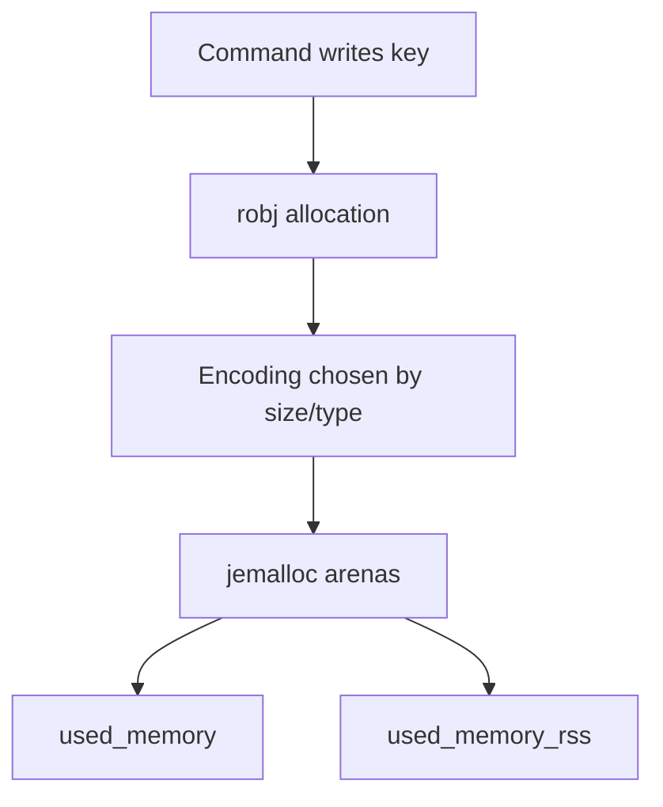
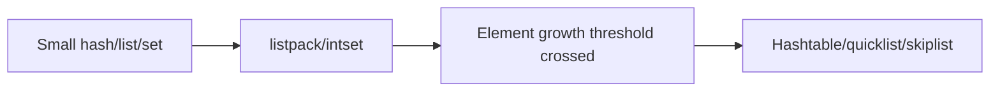

## Quick Revision

- Redis memory behavior is shaped by object encoding, allocator fragmentation, and key cardinality.
- Observe `used_memory`, `used_memory_rss`, and `mem_fragmentation_ratio` together.
- Plan remediation by separating object growth from allocator overhead.

## Core Concepts

| Concept | Why it matters |
| :--- | :--- |
| `robj` + encoding | Determines memory footprint and command complexity |
| `used_memory` | Redis allocator bytes |
| `used_memory_rss` | OS resident memory |
| Fragmentation ratio | Helps identify reclaim vs workload growth |
| Active defrag | Reduces fragmentation at CPU cost |

## Internal Working

## Architecture

Memory internals drive cluster sizing and eviction strategy; treat this page as canonical for encoding and allocator topics.

## Design Tradeoffs

| Decision | Tradeoff |
| :--- | :--- |
| Smaller values | Better cache density, extra app serialization cost |
| Active defrag on | Lower RSS drift, extra CPU |
| Aggressive TTL | Lower memory pressure, potential hit-rate drop |

## Production Patterns

- Track top key prefixes by memory and cardinality.
- Cap value sizes for hot keys used by latency-sensitive paths.

## Scalability

As key count grows, metadata overhead can dominate value bytes; capacity plans must include overhead factors.

## Reliability

Fork-based persistence can amplify memory pressure via copy-on-write; reserve memory headroom before snapshots.

## Observability

- `INFO memory`
- `MEMORY STATS`
- `MEMORY USAGE <key>`

## Troubleshooting

If ratio rises while key count is stable, evaluate fragmentation first before rewriting data model.

## Common Mistakes

- Reading `mem_fragmentation_ratio` in isolation.
- Ignoring key overhead when planning memory budgets.

## Architect Notes

Memory decisions should be codified in ADRs because they directly impact cost, latency, and failover safety.

## What causes mem_fragmentation_ratio to climb and when is active defrag appropriate?

### Short Answer
For this question, the architecturally correct Redis answer is separating logical key growth from allocator overhead using `used_memory`, RSS, and encoding inspection for: What causes mem_fragmentation_ratio to climb and when is active defrag appropriate.

### Detailed Explanation
Redis picks compact encodings (listpack, intset) for small values and upgrades to hashtable/skiplist structures as data grows — memory cliffs often appear at encoding thresholds for: What causes mem_fragmentation_ratio to climb and when is active defrag appropriate.

### Internal Working
`robj` wraps values with type metadata; jemalloc arenas and copy-on-write during persistence amplify RSS beyond `used_memory` for: What causes mem_fragmentation_ratio to climb and when is active defrag appropriate.

### Production Notes
You justify it by proving behavior with INFO, slowlog, and workload replay before changing topology after sampling top keys with `MEMORY USAGE` and reviewing fragmentation ratio trends for: What causes mem_fragmentation_ratio to climb and when is active defrag appropriate.

### Common Mistakes
Teams often optimize value bytes while ignoring metadata overhead, fragmentation, and fork-related RSS spikes for: What causes mem_fragmentation_ratio to climb and when is active defrag appropriate.

### Follow-up Questions
Which encoding upgrade or key-shape change would you test first to reduce memory for: What causes mem_fragmentation_ratio to climb and when is active defrag appropriate?

---
## What encoding upgrades cause latency cliffs as small hashes grow past listpack thresholds?

### Short Answer
The production-grade Redis answer is separating logical key growth from allocator overhead using `used_memory`, RSS, and encoding inspection for: What encoding upgrades cause latency cliffs as small hashes grow past listpack thresholds.

### Detailed Explanation
Redis picks compact encodings (listpack, intset) for small values and upgrades to hashtable/skiplist structures as data grows — memory cliffs often appear at encoding thresholds for: What encoding upgrades cause latency cliffs as small hashes grow past listpack thresholds.

### Internal Working
`robj` wraps values with type metadata; jemalloc arenas and copy-on-write during persistence amplify RSS beyond `used_memory` for: What encoding upgrades cause latency cliffs as small hashes grow past listpack thresholds.

### Production Notes
You justify it by minimizing hot-key blast radius and single-thread CPU contention after sampling top keys with `MEMORY USAGE` and reviewing fragmentation ratio trends for: What encoding upgrades cause latency cliffs as small hashes grow past listpack thresholds.

### Common Mistakes
Teams often optimize value bytes while ignoring metadata overhead, fragmentation, and fork-related RSS spikes for: What encoding upgrades cause latency cliffs as small hashes grow past listpack thresholds.

### Follow-up Questions
Which encoding upgrade or key-shape change would you test first to reduce memory for: What encoding upgrades cause latency cliffs as small hashes grow past listpack thresholds?

---
<!-- interview-answers:end -->

---

## What causes mem_fragmentation_ratio to climb and when is active defrag appropriate?

### Short Answer
For this question, the architecturally correct Redis answer is separating logical key growth from allocator overhead using `used_memory`, RSS, and encoding inspection for: What causes mem_fragmentation_ratio to climb and when is active defrag appropriate.

### Detailed Explanation
Redis picks compact encodings (listpack, intset) for small values and upgrades to hashtable/skiplist structures as data grows — memory cliffs often appear at encoding thresholds for: What causes mem_fragmentation_ratio to climb and when is active defrag appropriate.

### Internal Working
`robj` wraps values with type metadata; jemalloc arenas and copy-on-write during persistence amplify RSS beyond `used_memory` for: What causes mem_fragmentation_ratio to climb and when is active defrag appropriate.

### Production Notes
You justify it by proving behavior with INFO, slowlog, and workload replay before changing topology after sampling top keys with `MEMORY USAGE` and reviewing fragmentation ratio trends for: What causes mem_fragmentation_ratio to climb and when is active defrag appropriate.

### Common Mistakes
Teams often optimize value bytes while ignoring metadata overhead, fragmentation, and fork-related RSS spikes for: What causes mem_fragmentation_ratio to climb and when is active defrag appropriate.

### Follow-up Questions
Which encoding upgrade or key-shape change would you test first to reduce memory for: What causes mem_fragmentation_ratio to climb and when is active defrag appropriate?

---
## What encoding upgrades cause latency cliffs as small hashes grow past listpack thresholds?

### Short Answer
The production-grade Redis answer is separating logical key growth from allocator overhead using `used_memory`, RSS, and encoding inspection for: What encoding upgrades cause latency cliffs as small hashes grow past listpack thresholds.

### Detailed Explanation
Redis picks compact encodings (listpack, intset) for small values and upgrades to hashtable/skiplist structures as data grows — memory cliffs often appear at encoding thresholds for: What encoding upgrades cause latency cliffs as small hashes grow past listpack thresholds.

### Internal Working
`robj` wraps values with type metadata; jemalloc arenas and copy-on-write during persistence amplify RSS beyond `used_memory` for: What encoding upgrades cause latency cliffs as small hashes grow past listpack thresholds.

### Production Notes
You justify it by minimizing hot-key blast radius and single-thread CPU contention after sampling top keys with `MEMORY USAGE` and reviewing fragmentation ratio trends for: What encoding upgrades cause latency cliffs as small hashes grow past listpack thresholds.

### Common Mistakes
Teams often optimize value bytes while ignoring metadata overhead, fragmentation, and fork-related RSS spikes for: What encoding upgrades cause latency cliffs as small hashes grow past listpack thresholds.

### Follow-up Questions
Which encoding upgrade or key-shape change would you test first to reduce memory for: What encoding upgrades cause latency cliffs as small hashes grow past listpack thresholds?

---
<!-- interview-answers:end -->

---

## What causes mem_fragmentation_ratio to climb and when is active defrag appropriate?

### Short Answer
For this question, the architecturally correct Redis answer is separating logical key growth from allocator overhead using `used_memory`, RSS, and encoding inspection for: What causes mem_fragmentation_ratio to climb and when is active defrag appropriate.

### Detailed Explanation
Redis picks compact encodings (listpack, intset) for small values and upgrades to hashtable/skiplist structures as data grows — memory cliffs often appear at encoding thresholds for: What causes mem_fragmentation_ratio to climb and when is active defrag appropriate.

### Internal Working
`robj` wraps values with type metadata; jemalloc arenas and copy-on-write during persistence amplify RSS beyond `used_memory` for: What causes mem_fragmentation_ratio to climb and when is active defrag appropriate.

### Production Notes
You justify it by proving behavior with INFO, slowlog, and workload replay before changing topology after sampling top keys with `MEMORY USAGE` and reviewing fragmentation ratio trends for: What causes mem_fragmentation_ratio to climb and when is active defrag appropriate.

### Common Mistakes
Teams often optimize value bytes while ignoring metadata overhead, fragmentation, and fork-related RSS spikes for: What causes mem_fragmentation_ratio to climb and when is active defrag appropriate.

### Follow-up Questions
Which encoding upgrade or key-shape change would you test first to reduce memory for: What causes mem_fragmentation_ratio to climb and when is active defrag appropriate?

---
## What encoding upgrades cause latency cliffs as small hashes grow past listpack thresholds?

### Short Answer
The production-grade Redis answer is separating logical key growth from allocator overhead using `used_memory`, RSS, and encoding inspection for: What encoding upgrades cause latency cliffs as small hashes grow past listpack thresholds.

### Detailed Explanation
Redis picks compact encodings (listpack, intset) for small values and upgrades to hashtable/skiplist structures as data grows — memory cliffs often appear at encoding thresholds for: What encoding upgrades cause latency cliffs as small hashes grow past listpack thresholds.

### Internal Working
`robj` wraps values with type metadata; jemalloc arenas and copy-on-write during persistence amplify RSS beyond `used_memory` for: What encoding upgrades cause latency cliffs as small hashes grow past listpack thresholds.

### Production Notes
You justify it by minimizing hot-key blast radius and single-thread CPU contention after sampling top keys with `MEMORY USAGE` and reviewing fragmentation ratio trends for: What encoding upgrades cause latency cliffs as small hashes grow past listpack thresholds.

### Common Mistakes
Teams often optimize value bytes while ignoring metadata overhead, fragmentation, and fork-related RSS spikes for: What encoding upgrades cause latency cliffs as small hashes grow past listpack thresholds.

### Follow-up Questions
Which encoding upgrade or key-shape change would you test first to reduce memory for: What encoding upgrades cause latency cliffs as small hashes grow past listpack thresholds?

---
<!-- interview-answers:end -->

---

## What causes mem_fragmentation_ratio to climb and when is active defrag appropriate?

### Short Answer
For this question, the architecturally correct Redis answer is separating logical key growth from allocator overhead using `used_memory`, RSS, and encoding inspection for: What causes mem_fragmentation_ratio to climb and when is active defrag appropriate.

### Detailed Explanation
Redis picks compact encodings (listpack, intset) for small values and upgrades to hashtable/skiplist structures as data grows — memory cliffs often appear at encoding thresholds for: What causes mem_fragmentation_ratio to climb and when is active defrag appropriate.

### Internal Working
`robj` wraps values with type metadata; jemalloc arenas and copy-on-write during persistence amplify RSS beyond `used_memory` for: What causes mem_fragmentation_ratio to climb and when is active defrag appropriate.

### Production Notes
You justify it by proving behavior with INFO, slowlog, and workload replay before changing topology after sampling top keys with `MEMORY USAGE` and reviewing fragmentation ratio trends for: What causes mem_fragmentation_ratio to climb and when is active defrag appropriate.

### Common Mistakes
Teams often optimize value bytes while ignoring metadata overhead, fragmentation, and fork-related RSS spikes for: What causes mem_fragmentation_ratio to climb and when is active defrag appropriate.

### Follow-up Questions
Which encoding upgrade or key-shape change would you test first to reduce memory for: What causes mem_fragmentation_ratio to climb and when is active defrag appropriate?

---
## What encoding upgrades cause latency cliffs as small hashes grow past listpack thresholds?

### Short Answer
The production-grade Redis answer is separating logical key growth from allocator overhead using `used_memory`, RSS, and encoding inspection for: What encoding upgrades cause latency cliffs as small hashes grow past listpack thresholds.

### Detailed Explanation
Redis picks compact encodings (listpack, intset) for small values and upgrades to hashtable/skiplist structures as data grows — memory cliffs often appear at encoding thresholds for: What encoding upgrades cause latency cliffs as small hashes grow past listpack thresholds.

### Internal Working
`robj` wraps values with type metadata; jemalloc arenas and copy-on-write during persistence amplify RSS beyond `used_memory` for: What encoding upgrades cause latency cliffs as small hashes grow past listpack thresholds.

### Production Notes
You justify it by minimizing hot-key blast radius and single-thread CPU contention after sampling top keys with `MEMORY USAGE` and reviewing fragmentation ratio trends for: What encoding upgrades cause latency cliffs as small hashes grow past listpack thresholds.

### Common Mistakes
Teams often optimize value bytes while ignoring metadata overhead, fragmentation, and fork-related RSS spikes for: What encoding upgrades cause latency cliffs as small hashes grow past listpack thresholds.

### Follow-up Questions
Which encoding upgrade or key-shape change would you test first to reduce memory for: What encoding upgrades cause latency cliffs as small hashes grow past listpack thresholds?

---
<!-- interview-answers:end -->

---

## See Also

- [Previous: Hyperloglog](/redis-cheatsheet/02-core-redis/hyperloglog/)
- [Next: Redis Protocol](/redis-cheatsheet/03-redis-internals/redis-protocol/)
- [Redis Handbook Index](/redis-cheatsheet/)
- [Top 150 Interview Questions](/redis-cheatsheet/08-interview-guide/top-150-interview-questions/)
