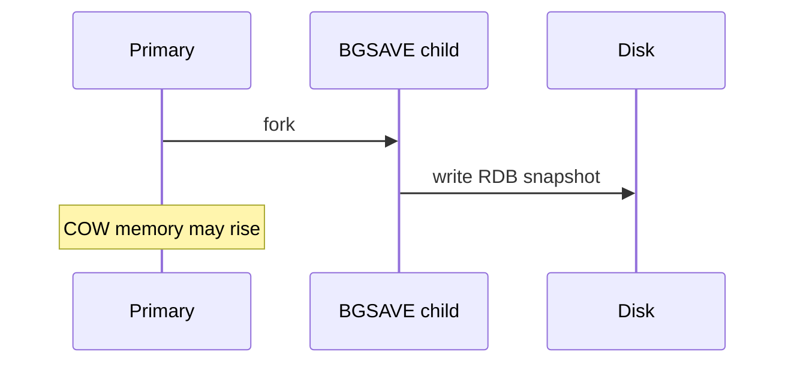

## Executive Summary

Redis offers **RDB** (point-in-time snapshots) and **AOF** (append-only command log). Production often uses **both**: RDB for fast restarts, AOF for finer durability.

---

## Core Concepts



| Mode | Mechanism | Trade-off |
| :--- | :--- | :--- |
| **RDB** | `SAVE` / `BGSAVE` fork + dump | Compact; may lose data since last snapshot |
| **AOF** | Log every write | `always` / `everysec` / `no` fsync |
| **Hybrid** | RDB preamble in AOF rewrite | Best of both |
| **none** | Pure cache | Fastest; data lost on restart |

`fork` for BGSAVE causes copy-on-write memory spike.

---

## Quick Reference

```bash
SAVE                    # blocking — avoid prod
BGSAVE
LASTSAVE
CONFIG GET save
CONFIG GET appendonly
CONFIG GET appendfsync
BGREWRITEAOF
```

---

## Snippets

```conf
save 900 1
save 300 10
save 60 10000
appendonly yes
appendfsync everysec
no-appendfsync-on-rewrite yes
auto-aof-rewrite-percentage 100
```

---

## Common Gotchas

| Pitfall | Fix |
| :--- | :--- |
| `appendfsync always` | Durability max; throughput min |
| `everysec` | Up to ~1s loss on crash |
| BGSAVE during memory pressure | Monitor COW — tune `save` rules |

---

## How do persistence settings change the architecture story when Redis is marketed as a cache only?

### Short Answer
The senior-level decision is matching RDB/AOF hybrid settings to acceptable data-loss window and restart time for: How do persistence settings change the architecture story when Redis is marketed as a cache only.

### Detailed Explanation
RDB gives compact snapshots; AOF gives finer durability with `appendfsync` tradeoffs — `everysec` is common but can lose ~1s on crash for: How do persistence settings change the architecture story when Redis is marketed as a cache only.

### Internal Working
BGSAVE/AOF rewrite forks the process; copy-on-write can double memory pressure during snapshots, affecting latency for: How do persistence settings change the architecture story when Redis is marketed as a cache only.

### Production Notes
You justify it by aligning durability settings with business RPO/RTO and client retry contracts by testing crash-recovery drills and measuring fork latency under peak write load for: How do persistence settings change the architecture story when Redis is marketed as a cache only.

### Common Mistakes
Dangerous patterns include `SAVE` in production, `appendfsync always` without throughput headroom, and ignoring COW during maintenance for: How do persistence settings change the architecture story when Redis is marketed as a cache only.

### Follow-up Questions
What RPO does your chosen persistence mode actually guarantee for: How do persistence settings change the architecture story when Redis is marketed as a cache only after a hard kill test?

---
## What is the architectural impact of running Redis in Kubernetes with ephemeral versus persistent volumes?

### Short Answer
The practical Redis answer is comparing Redis to alternatives on data model, durability, ops model, and failure semantics — not feature checklists for: What is the architectural impact of running Redis in Kubernetes with ephemeral versus persistent volumes.

### Detailed Explanation
Redis offers rich structures and optional persistence; Memcached is simpler cache; Kafka/RabbitMQ excel at durable messaging scale for: What is the architectural impact of running Redis in Kubernetes with ephemeral versus persistent volumes.

### Internal Working
Using Redis as a message bus works for moderate throughput with Streams; very large retention or routing complexity may favor dedicated brokers for: What is the architectural impact of running Redis in Kubernetes with ephemeral versus persistent volumes.

### Production Notes
You justify it by measuring p99 latency, memory headroom, and failover behavior under realistic skew by documenting ADR assumptions and exit strategy if load doubles for: What is the architectural impact of running Redis in Kubernetes with ephemeral versus persistent volumes.

### Common Mistakes
Resume-driven Redis adoption without ops maturity for Sentinel/Cluster causes painful incidents for: What is the architectural impact of running Redis in Kubernetes with ephemeral versus persistent volumes.

### Follow-up Questions
What requirement in: What is the architectural impact of running Redis in Kubernetes with ephemeral versus persistent volumes is decisive if throughput numbers are similar across options?

---
## What forensic steps follow a partial AOF rewrite failure on restart?

### Short Answer
For this question, the architecturally correct Redis answer is matching RDB/AOF hybrid settings to acceptable data-loss window and restart time for: What forensic steps follow a partial AOF rewrite failure on restart.

### Detailed Explanation
RDB gives compact snapshots; AOF gives finer durability with `appendfsync` tradeoffs — `everysec` is common but can lose ~1s on crash for: What forensic steps follow a partial AOF rewrite failure on restart.

### Internal Working
BGSAVE/AOF rewrite forks the process; copy-on-write can double memory pressure during snapshots, affecting latency for: What forensic steps follow a partial AOF rewrite failure on restart.

### Production Notes
You justify it by proving behavior with INFO, slowlog, and workload replay before changing topology by testing crash-recovery drills and measuring fork latency under peak write load for: What forensic steps follow a partial AOF rewrite failure on restart.

### Common Mistakes
Dangerous patterns include `SAVE` in production, `appendfsync always` without throughput headroom, and ignoring COW during maintenance for: What forensic steps follow a partial AOF rewrite failure on restart.

### Follow-up Questions
What RPO does your chosen persistence mode actually guarantee for: What forensic steps follow a partial AOF rewrite failure on restart after a hard kill test?

---
## What would you check when BGSAVE consistently fails during memory pressure events?

### Short Answer
The senior-level decision is matching RDB/AOF hybrid settings to acceptable data-loss window and restart time for: What would you check when BGSAVE consistently fails during memory pressure events.

### Detailed Explanation
RDB gives compact snapshots; AOF gives finer durability with `appendfsync` tradeoffs — `everysec` is common but can lose ~1s on crash for: What would you check when BGSAVE consistently fails during memory pressure events.

### Internal Working
BGSAVE/AOF rewrite forks the process; copy-on-write can double memory pressure during snapshots, affecting latency for: What would you check when BGSAVE consistently fails during memory pressure events.

### Production Notes
You justify it by aligning durability settings with business RPO/RTO and client retry contracts by testing crash-recovery drills and measuring fork latency under peak write load for: What would you check when BGSAVE consistently fails during memory pressure events.

### Common Mistakes
Dangerous patterns include `SAVE` in production, `appendfsync always` without throughput headroom, and ignoring COW during maintenance for: What would you check when BGSAVE consistently fails during memory pressure events.

### Follow-up Questions
What RPO does your chosen persistence mode actually guarantee for: What would you check when BGSAVE consistently fails during memory pressure events after a hard kill test?

---
## What steps validate AOF integrity before promoting a rebuilt replica?

### Short Answer
For this question, the architecturally correct Redis answer is matching RDB/AOF hybrid settings to acceptable data-loss window and restart time for: What steps validate AOF integrity before promoting a rebuilt replica.

### Detailed Explanation
RDB gives compact snapshots; AOF gives finer durability with `appendfsync` tradeoffs — `everysec` is common but can lose ~1s on crash for: What steps validate AOF integrity before promoting a rebuilt replica.

### Internal Working
BGSAVE/AOF rewrite forks the process; copy-on-write can double memory pressure during snapshots, affecting latency for: What steps validate AOF integrity before promoting a rebuilt replica.

### Production Notes
You justify it by proving behavior with INFO, slowlog, and workload replay before changing topology by testing crash-recovery drills and measuring fork latency under peak write load for: What steps validate AOF integrity before promoting a rebuilt replica.

### Common Mistakes
Dangerous patterns include `SAVE` in production, `appendfsync always` without throughput headroom, and ignoring COW during maintenance for: What steps validate AOF integrity before promoting a rebuilt replica.

### Follow-up Questions
What RPO does your chosen persistence mode actually guarantee for: What steps validate AOF integrity before promoting a rebuilt replica after a hard kill test?

---
## What is the performance impact of appendfsync always versus everysec for write-heavy caches?

### Short Answer
The production-grade Redis answer is comparing Redis to alternatives on data model, durability, ops model, and failure semantics — not feature checklists for: What is the performance impact of appendfsync always versus everysec for write-heavy caches.

### Detailed Explanation
Redis offers rich structures and optional persistence; Memcached is simpler cache; Kafka/RabbitMQ excel at durable messaging scale for: What is the performance impact of appendfsync always versus everysec for write-heavy caches.

### Internal Working
Using Redis as a message bus works for moderate throughput with Streams; very large retention or routing complexity may favor dedicated brokers for: What is the performance impact of appendfsync always versus everysec for write-heavy caches.

### Production Notes
You justify it by minimizing hot-key blast radius and single-thread CPU contention by documenting ADR assumptions and exit strategy if load doubles for: What is the performance impact of appendfsync always versus everysec for write-heavy caches.

### Common Mistakes
Resume-driven Redis adoption without ops maturity for Sentinel/Cluster causes painful incidents for: What is the performance impact of appendfsync always versus everysec for write-heavy caches.

### Follow-up Questions
What requirement in: What is the performance impact of appendfsync always versus everysec for write-heavy caches is decisive if throughput numbers are similar across options?

---
## How does RDB fork latency interact with memory overcommit and COW during BGSAVE?

### Short Answer
The senior-level decision is matching RDB/AOF hybrid settings to acceptable data-loss window and restart time for: How does RDB fork latency interact with memory overcommit and COW during BGSAVE.

### Detailed Explanation
RDB gives compact snapshots; AOF gives finer durability with `appendfsync` tradeoffs — `everysec` is common but can lose ~1s on crash for: How does RDB fork latency interact with memory overcommit and COW during BGSAVE.

### Internal Working
BGSAVE/AOF rewrite forks the process; copy-on-write can double memory pressure during snapshots, affecting latency for: How does RDB fork latency interact with memory overcommit and COW during BGSAVE.

### Production Notes
You justify it by aligning durability settings with business RPO/RTO and client retry contracts by testing crash-recovery drills and measuring fork latency under peak write load for: How does RDB fork latency interact with memory overcommit and COW during BGSAVE.

### Common Mistakes
Dangerous patterns include `SAVE` in production, `appendfsync always` without throughput headroom, and ignoring COW during maintenance for: How does RDB fork latency interact with memory overcommit and COW during BGSAVE.

### Follow-up Questions
What RPO does your chosen persistence mode actually guarantee for: How does RDB fork latency interact with memory overcommit and COW during BGSAVE after a hard kill test?

---
## What data loss window exists with appendfsync everysec if the process crashes mid-second?

### Short Answer
For this question, the architecturally correct Redis answer is matching RDB/AOF hybrid settings to acceptable data-loss window and restart time for: What data loss window exists with appendfsync everysec if the process crashes mid-second.

### Detailed Explanation
RDB gives compact snapshots; AOF gives finer durability with `appendfsync` tradeoffs — `everysec` is common but can lose ~1s on crash for: What data loss window exists with appendfsync everysec if the process crashes mid-second.

### Internal Working
BGSAVE/AOF rewrite forks the process; copy-on-write can double memory pressure during snapshots, affecting latency for: What data loss window exists with appendfsync everysec if the process crashes mid-second.

### Production Notes
You justify it by proving behavior with INFO, slowlog, and workload replay before changing topology by testing crash-recovery drills and measuring fork latency under peak write load for: What data loss window exists with appendfsync everysec if the process crashes mid-second.

### Common Mistakes
Dangerous patterns include `SAVE` in production, `appendfsync always` without throughput headroom, and ignoring COW during maintenance for: What data loss window exists with appendfsync everysec if the process crashes mid-second.

### Follow-up Questions
What RPO does your chosen persistence mode actually guarantee for: What data loss window exists with appendfsync everysec if the process crashes mid-second after a hard kill test?

---
## How do RDB snapshots complement AOF for faster restarts in hybrid persistence?

### Short Answer
The production-grade Redis answer is matching RDB/AOF hybrid settings to acceptable data-loss window and restart time for: How do RDB snapshots complement AOF for faster restarts in hybrid persistence.

### Detailed Explanation
RDB gives compact snapshots; AOF gives finer durability with `appendfsync` tradeoffs — `everysec` is common but can lose ~1s on crash for: How do RDB snapshots complement AOF for faster restarts in hybrid persistence.

### Internal Working
BGSAVE/AOF rewrite forks the process; copy-on-write can double memory pressure during snapshots, affecting latency for: How do RDB snapshots complement AOF for faster restarts in hybrid persistence.

### Production Notes
You justify it by minimizing hot-key blast radius and single-thread CPU contention by testing crash-recovery drills and measuring fork latency under peak write load for: How do RDB snapshots complement AOF for faster restarts in hybrid persistence.

### Common Mistakes
Dangerous patterns include `SAVE` in production, `appendfsync always` without throughput headroom, and ignoring COW during maintenance for: How do RDB snapshots complement AOF for faster restarts in hybrid persistence.

### Follow-up Questions
What RPO does your chosen persistence mode actually guarantee for: How do RDB snapshots complement AOF for faster restarts in hybrid persistence after a hard kill test?

---
## When would you disable persistence entirely, and what failure modes remain acceptable?

### Short Answer
The senior-level decision is matching RDB/AOF hybrid settings to acceptable data-loss window and restart time for: When would you disable persistence entirely, and what failure modes remain acceptable.

### Detailed Explanation
RDB gives compact snapshots; AOF gives finer durability with `appendfsync` tradeoffs — `everysec` is common but can lose ~1s on crash for: When would you disable persistence entirely, and what failure modes remain acceptable.

### Internal Working
BGSAVE/AOF rewrite forks the process; copy-on-write can double memory pressure during snapshots, affecting latency for: When would you disable persistence entirely, and what failure modes remain acceptable.

### Production Notes
You justify it by aligning durability settings with business RPO/RTO and client retry contracts by testing crash-recovery drills and measuring fork latency under peak write load for: When would you disable persistence entirely, and what failure modes remain acceptable.

### Common Mistakes
Dangerous patterns include `SAVE` in production, `appendfsync always` without throughput headroom, and ignoring COW during maintenance for: When would you disable persistence entirely, and what failure modes remain acceptable.

### Follow-up Questions
What RPO does your chosen persistence mode actually guarantee for: When would you disable persistence entirely, and what failure modes remain acceptable after a hard kill test?

---
## What disaster recovery RPO do you get from hourly RDB plus AOF everysec combined?

### Short Answer
The senior-level decision is matching RDB/AOF hybrid settings to acceptable data-loss window and restart time for: What disaster recovery RPO do you get from hourly RDB plus AOF everysec combined.

### Detailed Explanation
RDB gives compact snapshots; AOF gives finer durability with `appendfsync` tradeoffs — `everysec` is common but can lose ~1s on crash for: What disaster recovery RPO do you get from hourly RDB plus AOF everysec combined.

### Internal Working
BGSAVE/AOF rewrite forks the process; copy-on-write can double memory pressure during snapshots, affecting latency for: What disaster recovery RPO do you get from hourly RDB plus AOF everysec combined.

### Production Notes
You justify it by aligning durability settings with business RPO/RTO and client retry contracts by testing crash-recovery drills and measuring fork latency under peak write load for: What disaster recovery RPO do you get from hourly RDB plus AOF everysec combined.

### Common Mistakes
Dangerous patterns include `SAVE` in production, `appendfsync always` without throughput headroom, and ignoring COW during maintenance for: What disaster recovery RPO do you get from hourly RDB plus AOF everysec combined.

### Follow-up Questions
What RPO does your chosen persistence mode actually guarantee for: What disaster recovery RPO do you get from hourly RDB plus AOF everysec combined after a hard kill test?

---
## How would you validate backup restores for AOF rewrite corruption edge cases?

### Short Answer
The practical Redis answer is matching RDB/AOF hybrid settings to acceptable data-loss window and restart time for: How would you validate backup restores for AOF rewrite corruption edge cases.

### Detailed Explanation
RDB gives compact snapshots; AOF gives finer durability with `appendfsync` tradeoffs — `everysec` is common but can lose ~1s on crash for: How would you validate backup restores for AOF rewrite corruption edge cases.

### Internal Working
BGSAVE/AOF rewrite forks the process; copy-on-write can double memory pressure during snapshots, affecting latency for: How would you validate backup restores for AOF rewrite corruption edge cases.

### Production Notes
You justify it by measuring p99 latency, memory headroom, and failover behavior under realistic skew by testing crash-recovery drills and measuring fork latency under peak write load for: How would you validate backup restores for AOF rewrite corruption edge cases.

### Common Mistakes
Dangerous patterns include `SAVE` in production, `appendfsync always` without throughput headroom, and ignoring COW during maintenance for: How would you validate backup restores for AOF rewrite corruption edge cases.

### Follow-up Questions
What RPO does your chosen persistence mode actually guarantee for: How would you validate backup restores for AOF rewrite corruption edge cases after a hard kill test?

---
<!-- interview-answers:end -->

---

## How do persistence settings change the architecture story when Redis is marketed as a cache only?

### Short Answer
The senior-level decision is matching RDB/AOF hybrid settings to acceptable data-loss window and restart time for: How do persistence settings change the architecture story when Redis is marketed as a cache only.

### Detailed Explanation
RDB gives compact snapshots; AOF gives finer durability with `appendfsync` tradeoffs — `everysec` is common but can lose ~1s on crash for: How do persistence settings change the architecture story when Redis is marketed as a cache only.

### Internal Working
BGSAVE/AOF rewrite forks the process; copy-on-write can double memory pressure during snapshots, affecting latency for: How do persistence settings change the architecture story when Redis is marketed as a cache only.

### Production Notes
You justify it by aligning durability settings with business RPO/RTO and client retry contracts by testing crash-recovery drills and measuring fork latency under peak write load for: How do persistence settings change the architecture story when Redis is marketed as a cache only.

### Common Mistakes
Dangerous patterns include `SAVE` in production, `appendfsync always` without throughput headroom, and ignoring COW during maintenance for: How do persistence settings change the architecture story when Redis is marketed as a cache only.

### Follow-up Questions
What RPO does your chosen persistence mode actually guarantee for: How do persistence settings change the architecture story when Redis is marketed as a cache only after a hard kill test?

---
## What is the architectural impact of running Redis in Kubernetes with ephemeral versus persistent volumes?

### Short Answer
The practical Redis answer is comparing Redis to alternatives on data model, durability, ops model, and failure semantics — not feature checklists for: What is the architectural impact of running Redis in Kubernetes with ephemeral versus persistent volumes.

### Detailed Explanation
Redis offers rich structures and optional persistence; Memcached is simpler cache; Kafka/RabbitMQ excel at durable messaging scale for: What is the architectural impact of running Redis in Kubernetes with ephemeral versus persistent volumes.

### Internal Working
Using Redis as a message bus works for moderate throughput with Streams; very large retention or routing complexity may favor dedicated brokers for: What is the architectural impact of running Redis in Kubernetes with ephemeral versus persistent volumes.

### Production Notes
You justify it by measuring p99 latency, memory headroom, and failover behavior under realistic skew by documenting ADR assumptions and exit strategy if load doubles for: What is the architectural impact of running Redis in Kubernetes with ephemeral versus persistent volumes.

### Common Mistakes
Resume-driven Redis adoption without ops maturity for Sentinel/Cluster causes painful incidents for: What is the architectural impact of running Redis in Kubernetes with ephemeral versus persistent volumes.

### Follow-up Questions
What requirement in: What is the architectural impact of running Redis in Kubernetes with ephemeral versus persistent volumes is decisive if throughput numbers are similar across options?

---
## What forensic steps follow a partial AOF rewrite failure on restart?

### Short Answer
For this question, the architecturally correct Redis answer is matching RDB/AOF hybrid settings to acceptable data-loss window and restart time for: What forensic steps follow a partial AOF rewrite failure on restart.

### Detailed Explanation
RDB gives compact snapshots; AOF gives finer durability with `appendfsync` tradeoffs — `everysec` is common but can lose ~1s on crash for: What forensic steps follow a partial AOF rewrite failure on restart.

### Internal Working
BGSAVE/AOF rewrite forks the process; copy-on-write can double memory pressure during snapshots, affecting latency for: What forensic steps follow a partial AOF rewrite failure on restart.

### Production Notes
You justify it by proving behavior with INFO, slowlog, and workload replay before changing topology by testing crash-recovery drills and measuring fork latency under peak write load for: What forensic steps follow a partial AOF rewrite failure on restart.

### Common Mistakes
Dangerous patterns include `SAVE` in production, `appendfsync always` without throughput headroom, and ignoring COW during maintenance for: What forensic steps follow a partial AOF rewrite failure on restart.

### Follow-up Questions
What RPO does your chosen persistence mode actually guarantee for: What forensic steps follow a partial AOF rewrite failure on restart after a hard kill test?

---
## What would you check when BGSAVE consistently fails during memory pressure events?

### Short Answer
The senior-level decision is matching RDB/AOF hybrid settings to acceptable data-loss window and restart time for: What would you check when BGSAVE consistently fails during memory pressure events.

### Detailed Explanation
RDB gives compact snapshots; AOF gives finer durability with `appendfsync` tradeoffs — `everysec` is common but can lose ~1s on crash for: What would you check when BGSAVE consistently fails during memory pressure events.

### Internal Working
BGSAVE/AOF rewrite forks the process; copy-on-write can double memory pressure during snapshots, affecting latency for: What would you check when BGSAVE consistently fails during memory pressure events.

### Production Notes
You justify it by aligning durability settings with business RPO/RTO and client retry contracts by testing crash-recovery drills and measuring fork latency under peak write load for: What would you check when BGSAVE consistently fails during memory pressure events.

### Common Mistakes
Dangerous patterns include `SAVE` in production, `appendfsync always` without throughput headroom, and ignoring COW during maintenance for: What would you check when BGSAVE consistently fails during memory pressure events.

### Follow-up Questions
What RPO does your chosen persistence mode actually guarantee for: What would you check when BGSAVE consistently fails during memory pressure events after a hard kill test?

---
## What steps validate AOF integrity before promoting a rebuilt replica?

### Short Answer
For this question, the architecturally correct Redis answer is matching RDB/AOF hybrid settings to acceptable data-loss window and restart time for: What steps validate AOF integrity before promoting a rebuilt replica.

### Detailed Explanation
RDB gives compact snapshots; AOF gives finer durability with `appendfsync` tradeoffs — `everysec` is common but can lose ~1s on crash for: What steps validate AOF integrity before promoting a rebuilt replica.

### Internal Working
BGSAVE/AOF rewrite forks the process; copy-on-write can double memory pressure during snapshots, affecting latency for: What steps validate AOF integrity before promoting a rebuilt replica.

### Production Notes
You justify it by proving behavior with INFO, slowlog, and workload replay before changing topology by testing crash-recovery drills and measuring fork latency under peak write load for: What steps validate AOF integrity before promoting a rebuilt replica.

### Common Mistakes
Dangerous patterns include `SAVE` in production, `appendfsync always` without throughput headroom, and ignoring COW during maintenance for: What steps validate AOF integrity before promoting a rebuilt replica.

### Follow-up Questions
What RPO does your chosen persistence mode actually guarantee for: What steps validate AOF integrity before promoting a rebuilt replica after a hard kill test?

---
## What is the performance impact of appendfsync always versus everysec for write-heavy caches?

### Short Answer
The production-grade Redis answer is comparing Redis to alternatives on data model, durability, ops model, and failure semantics — not feature checklists for: What is the performance impact of appendfsync always versus everysec for write-heavy caches.

### Detailed Explanation
Redis offers rich structures and optional persistence; Memcached is simpler cache; Kafka/RabbitMQ excel at durable messaging scale for: What is the performance impact of appendfsync always versus everysec for write-heavy caches.

### Internal Working
Using Redis as a message bus works for moderate throughput with Streams; very large retention or routing complexity may favor dedicated brokers for: What is the performance impact of appendfsync always versus everysec for write-heavy caches.

### Production Notes
You justify it by minimizing hot-key blast radius and single-thread CPU contention by documenting ADR assumptions and exit strategy if load doubles for: What is the performance impact of appendfsync always versus everysec for write-heavy caches.

### Common Mistakes
Resume-driven Redis adoption without ops maturity for Sentinel/Cluster causes painful incidents for: What is the performance impact of appendfsync always versus everysec for write-heavy caches.

### Follow-up Questions
What requirement in: What is the performance impact of appendfsync always versus everysec for write-heavy caches is decisive if throughput numbers are similar across options?

---
## How does RDB fork latency interact with memory overcommit and COW during BGSAVE?

### Short Answer
The senior-level decision is matching RDB/AOF hybrid settings to acceptable data-loss window and restart time for: How does RDB fork latency interact with memory overcommit and COW during BGSAVE.

### Detailed Explanation
RDB gives compact snapshots; AOF gives finer durability with `appendfsync` tradeoffs — `everysec` is common but can lose ~1s on crash for: How does RDB fork latency interact with memory overcommit and COW during BGSAVE.

### Internal Working
BGSAVE/AOF rewrite forks the process; copy-on-write can double memory pressure during snapshots, affecting latency for: How does RDB fork latency interact with memory overcommit and COW during BGSAVE.

### Production Notes
You justify it by aligning durability settings with business RPO/RTO and client retry contracts by testing crash-recovery drills and measuring fork latency under peak write load for: How does RDB fork latency interact with memory overcommit and COW during BGSAVE.

### Common Mistakes
Dangerous patterns include `SAVE` in production, `appendfsync always` without throughput headroom, and ignoring COW during maintenance for: How does RDB fork latency interact with memory overcommit and COW during BGSAVE.

### Follow-up Questions
What RPO does your chosen persistence mode actually guarantee for: How does RDB fork latency interact with memory overcommit and COW during BGSAVE after a hard kill test?

---
## What data loss window exists with appendfsync everysec if the process crashes mid-second?

### Short Answer
For this question, the architecturally correct Redis answer is matching RDB/AOF hybrid settings to acceptable data-loss window and restart time for: What data loss window exists with appendfsync everysec if the process crashes mid-second.

### Detailed Explanation
RDB gives compact snapshots; AOF gives finer durability with `appendfsync` tradeoffs — `everysec` is common but can lose ~1s on crash for: What data loss window exists with appendfsync everysec if the process crashes mid-second.

### Internal Working
BGSAVE/AOF rewrite forks the process; copy-on-write can double memory pressure during snapshots, affecting latency for: What data loss window exists with appendfsync everysec if the process crashes mid-second.

### Production Notes
You justify it by proving behavior with INFO, slowlog, and workload replay before changing topology by testing crash-recovery drills and measuring fork latency under peak write load for: What data loss window exists with appendfsync everysec if the process crashes mid-second.

### Common Mistakes
Dangerous patterns include `SAVE` in production, `appendfsync always` without throughput headroom, and ignoring COW during maintenance for: What data loss window exists with appendfsync everysec if the process crashes mid-second.

### Follow-up Questions
What RPO does your chosen persistence mode actually guarantee for: What data loss window exists with appendfsync everysec if the process crashes mid-second after a hard kill test?

---
## How do RDB snapshots complement AOF for faster restarts in hybrid persistence?

### Short Answer
The production-grade Redis answer is matching RDB/AOF hybrid settings to acceptable data-loss window and restart time for: How do RDB snapshots complement AOF for faster restarts in hybrid persistence.

### Detailed Explanation
RDB gives compact snapshots; AOF gives finer durability with `appendfsync` tradeoffs — `everysec` is common but can lose ~1s on crash for: How do RDB snapshots complement AOF for faster restarts in hybrid persistence.

### Internal Working
BGSAVE/AOF rewrite forks the process; copy-on-write can double memory pressure during snapshots, affecting latency for: How do RDB snapshots complement AOF for faster restarts in hybrid persistence.

### Production Notes
You justify it by minimizing hot-key blast radius and single-thread CPU contention by testing crash-recovery drills and measuring fork latency under peak write load for: How do RDB snapshots complement AOF for faster restarts in hybrid persistence.

### Common Mistakes
Dangerous patterns include `SAVE` in production, `appendfsync always` without throughput headroom, and ignoring COW during maintenance for: How do RDB snapshots complement AOF for faster restarts in hybrid persistence.

### Follow-up Questions
What RPO does your chosen persistence mode actually guarantee for: How do RDB snapshots complement AOF for faster restarts in hybrid persistence after a hard kill test?

---
## When would you disable persistence entirely, and what failure modes remain acceptable?

### Short Answer
The senior-level decision is matching RDB/AOF hybrid settings to acceptable data-loss window and restart time for: When would you disable persistence entirely, and what failure modes remain acceptable.

### Detailed Explanation
RDB gives compact snapshots; AOF gives finer durability with `appendfsync` tradeoffs — `everysec` is common but can lose ~1s on crash for: When would you disable persistence entirely, and what failure modes remain acceptable.

### Internal Working
BGSAVE/AOF rewrite forks the process; copy-on-write can double memory pressure during snapshots, affecting latency for: When would you disable persistence entirely, and what failure modes remain acceptable.

### Production Notes
You justify it by aligning durability settings with business RPO/RTO and client retry contracts by testing crash-recovery drills and measuring fork latency under peak write load for: When would you disable persistence entirely, and what failure modes remain acceptable.

### Common Mistakes
Dangerous patterns include `SAVE` in production, `appendfsync always` without throughput headroom, and ignoring COW during maintenance for: When would you disable persistence entirely, and what failure modes remain acceptable.

### Follow-up Questions
What RPO does your chosen persistence mode actually guarantee for: When would you disable persistence entirely, and what failure modes remain acceptable after a hard kill test?

---
## What disaster recovery RPO do you get from hourly RDB plus AOF everysec combined?

### Short Answer
The senior-level decision is matching RDB/AOF hybrid settings to acceptable data-loss window and restart time for: What disaster recovery RPO do you get from hourly RDB plus AOF everysec combined.

### Detailed Explanation
RDB gives compact snapshots; AOF gives finer durability with `appendfsync` tradeoffs — `everysec` is common but can lose ~1s on crash for: What disaster recovery RPO do you get from hourly RDB plus AOF everysec combined.

### Internal Working
BGSAVE/AOF rewrite forks the process; copy-on-write can double memory pressure during snapshots, affecting latency for: What disaster recovery RPO do you get from hourly RDB plus AOF everysec combined.

### Production Notes
You justify it by aligning durability settings with business RPO/RTO and client retry contracts by testing crash-recovery drills and measuring fork latency under peak write load for: What disaster recovery RPO do you get from hourly RDB plus AOF everysec combined.

### Common Mistakes
Dangerous patterns include `SAVE` in production, `appendfsync always` without throughput headroom, and ignoring COW during maintenance for: What disaster recovery RPO do you get from hourly RDB plus AOF everysec combined.

### Follow-up Questions
What RPO does your chosen persistence mode actually guarantee for: What disaster recovery RPO do you get from hourly RDB plus AOF everysec combined after a hard kill test?

---
## How would you validate backup restores for AOF rewrite corruption edge cases?

### Short Answer
The practical Redis answer is matching RDB/AOF hybrid settings to acceptable data-loss window and restart time for: How would you validate backup restores for AOF rewrite corruption edge cases.

### Detailed Explanation
RDB gives compact snapshots; AOF gives finer durability with `appendfsync` tradeoffs — `everysec` is common but can lose ~1s on crash for: How would you validate backup restores for AOF rewrite corruption edge cases.

### Internal Working
BGSAVE/AOF rewrite forks the process; copy-on-write can double memory pressure during snapshots, affecting latency for: How would you validate backup restores for AOF rewrite corruption edge cases.

### Production Notes
You justify it by measuring p99 latency, memory headroom, and failover behavior under realistic skew by testing crash-recovery drills and measuring fork latency under peak write load for: How would you validate backup restores for AOF rewrite corruption edge cases.

### Common Mistakes
Dangerous patterns include `SAVE` in production, `appendfsync always` without throughput headroom, and ignoring COW during maintenance for: How would you validate backup restores for AOF rewrite corruption edge cases.

### Follow-up Questions
What RPO does your chosen persistence mode actually guarantee for: How would you validate backup restores for AOF rewrite corruption edge cases after a hard kill test?

---
<!-- interview-answers:end -->

---

## How do persistence settings change the architecture story when Redis is marketed as a cache only?

### Short Answer
The senior-level decision is matching RDB/AOF hybrid settings to acceptable data-loss window and restart time for: How do persistence settings change the architecture story when Redis is marketed as a cache only.

### Detailed Explanation
RDB gives compact snapshots; AOF gives finer durability with `appendfsync` tradeoffs — `everysec` is common but can lose ~1s on crash for: How do persistence settings change the architecture story when Redis is marketed as a cache only.

### Internal Working
BGSAVE/AOF rewrite forks the process; copy-on-write can double memory pressure during snapshots, affecting latency for: How do persistence settings change the architecture story when Redis is marketed as a cache only.

### Production Notes
You justify it by aligning durability settings with business RPO/RTO and client retry contracts by testing crash-recovery drills and measuring fork latency under peak write load for: How do persistence settings change the architecture story when Redis is marketed as a cache only.

### Common Mistakes
Dangerous patterns include `SAVE` in production, `appendfsync always` without throughput headroom, and ignoring COW during maintenance for: How do persistence settings change the architecture story when Redis is marketed as a cache only.

### Follow-up Questions
What RPO does your chosen persistence mode actually guarantee for: How do persistence settings change the architecture story when Redis is marketed as a cache only after a hard kill test?

---
## What is the architectural impact of running Redis in Kubernetes with ephemeral versus persistent volumes?

### Short Answer
The practical Redis answer is comparing Redis to alternatives on data model, durability, ops model, and failure semantics — not feature checklists for: What is the architectural impact of running Redis in Kubernetes with ephemeral versus persistent volumes.

### Detailed Explanation
Redis offers rich structures and optional persistence; Memcached is simpler cache; Kafka/RabbitMQ excel at durable messaging scale for: What is the architectural impact of running Redis in Kubernetes with ephemeral versus persistent volumes.

### Internal Working
Using Redis as a message bus works for moderate throughput with Streams; very large retention or routing complexity may favor dedicated brokers for: What is the architectural impact of running Redis in Kubernetes with ephemeral versus persistent volumes.

### Production Notes
You justify it by measuring p99 latency, memory headroom, and failover behavior under realistic skew by documenting ADR assumptions and exit strategy if load doubles for: What is the architectural impact of running Redis in Kubernetes with ephemeral versus persistent volumes.

### Common Mistakes
Resume-driven Redis adoption without ops maturity for Sentinel/Cluster causes painful incidents for: What is the architectural impact of running Redis in Kubernetes with ephemeral versus persistent volumes.

### Follow-up Questions
What requirement in: What is the architectural impact of running Redis in Kubernetes with ephemeral versus persistent volumes is decisive if throughput numbers are similar across options?

---
## What forensic steps follow a partial AOF rewrite failure on restart?

### Short Answer
For this question, the architecturally correct Redis answer is matching RDB/AOF hybrid settings to acceptable data-loss window and restart time for: What forensic steps follow a partial AOF rewrite failure on restart.

### Detailed Explanation
RDB gives compact snapshots; AOF gives finer durability with `appendfsync` tradeoffs — `everysec` is common but can lose ~1s on crash for: What forensic steps follow a partial AOF rewrite failure on restart.

### Internal Working
BGSAVE/AOF rewrite forks the process; copy-on-write can double memory pressure during snapshots, affecting latency for: What forensic steps follow a partial AOF rewrite failure on restart.

### Production Notes
You justify it by proving behavior with INFO, slowlog, and workload replay before changing topology by testing crash-recovery drills and measuring fork latency under peak write load for: What forensic steps follow a partial AOF rewrite failure on restart.

### Common Mistakes
Dangerous patterns include `SAVE` in production, `appendfsync always` without throughput headroom, and ignoring COW during maintenance for: What forensic steps follow a partial AOF rewrite failure on restart.

### Follow-up Questions
What RPO does your chosen persistence mode actually guarantee for: What forensic steps follow a partial AOF rewrite failure on restart after a hard kill test?

---
## What would you check when BGSAVE consistently fails during memory pressure events?

### Short Answer
The senior-level decision is matching RDB/AOF hybrid settings to acceptable data-loss window and restart time for: What would you check when BGSAVE consistently fails during memory pressure events.

### Detailed Explanation
RDB gives compact snapshots; AOF gives finer durability with `appendfsync` tradeoffs — `everysec` is common but can lose ~1s on crash for: What would you check when BGSAVE consistently fails during memory pressure events.

### Internal Working
BGSAVE/AOF rewrite forks the process; copy-on-write can double memory pressure during snapshots, affecting latency for: What would you check when BGSAVE consistently fails during memory pressure events.

### Production Notes
You justify it by aligning durability settings with business RPO/RTO and client retry contracts by testing crash-recovery drills and measuring fork latency under peak write load for: What would you check when BGSAVE consistently fails during memory pressure events.

### Common Mistakes
Dangerous patterns include `SAVE` in production, `appendfsync always` without throughput headroom, and ignoring COW during maintenance for: What would you check when BGSAVE consistently fails during memory pressure events.

### Follow-up Questions
What RPO does your chosen persistence mode actually guarantee for: What would you check when BGSAVE consistently fails during memory pressure events after a hard kill test?

---
## What steps validate AOF integrity before promoting a rebuilt replica?

### Short Answer
For this question, the architecturally correct Redis answer is matching RDB/AOF hybrid settings to acceptable data-loss window and restart time for: What steps validate AOF integrity before promoting a rebuilt replica.

### Detailed Explanation
RDB gives compact snapshots; AOF gives finer durability with `appendfsync` tradeoffs — `everysec` is common but can lose ~1s on crash for: What steps validate AOF integrity before promoting a rebuilt replica.

### Internal Working
BGSAVE/AOF rewrite forks the process; copy-on-write can double memory pressure during snapshots, affecting latency for: What steps validate AOF integrity before promoting a rebuilt replica.

### Production Notes
You justify it by proving behavior with INFO, slowlog, and workload replay before changing topology by testing crash-recovery drills and measuring fork latency under peak write load for: What steps validate AOF integrity before promoting a rebuilt replica.

### Common Mistakes
Dangerous patterns include `SAVE` in production, `appendfsync always` without throughput headroom, and ignoring COW during maintenance for: What steps validate AOF integrity before promoting a rebuilt replica.

### Follow-up Questions
What RPO does your chosen persistence mode actually guarantee for: What steps validate AOF integrity before promoting a rebuilt replica after a hard kill test?

---
## What is the performance impact of appendfsync always versus everysec for write-heavy caches?

### Short Answer
The production-grade Redis answer is comparing Redis to alternatives on data model, durability, ops model, and failure semantics — not feature checklists for: What is the performance impact of appendfsync always versus everysec for write-heavy caches.

### Detailed Explanation
Redis offers rich structures and optional persistence; Memcached is simpler cache; Kafka/RabbitMQ excel at durable messaging scale for: What is the performance impact of appendfsync always versus everysec for write-heavy caches.

### Internal Working
Using Redis as a message bus works for moderate throughput with Streams; very large retention or routing complexity may favor dedicated brokers for: What is the performance impact of appendfsync always versus everysec for write-heavy caches.

### Production Notes
You justify it by minimizing hot-key blast radius and single-thread CPU contention by documenting ADR assumptions and exit strategy if load doubles for: What is the performance impact of appendfsync always versus everysec for write-heavy caches.

### Common Mistakes
Resume-driven Redis adoption without ops maturity for Sentinel/Cluster causes painful incidents for: What is the performance impact of appendfsync always versus everysec for write-heavy caches.

### Follow-up Questions
What requirement in: What is the performance impact of appendfsync always versus everysec for write-heavy caches is decisive if throughput numbers are similar across options?

---
## How does RDB fork latency interact with memory overcommit and COW during BGSAVE?

### Short Answer
The senior-level decision is matching RDB/AOF hybrid settings to acceptable data-loss window and restart time for: How does RDB fork latency interact with memory overcommit and COW during BGSAVE.

### Detailed Explanation
RDB gives compact snapshots; AOF gives finer durability with `appendfsync` tradeoffs — `everysec` is common but can lose ~1s on crash for: How does RDB fork latency interact with memory overcommit and COW during BGSAVE.

### Internal Working
BGSAVE/AOF rewrite forks the process; copy-on-write can double memory pressure during snapshots, affecting latency for: How does RDB fork latency interact with memory overcommit and COW during BGSAVE.

### Production Notes
You justify it by aligning durability settings with business RPO/RTO and client retry contracts by testing crash-recovery drills and measuring fork latency under peak write load for: How does RDB fork latency interact with memory overcommit and COW during BGSAVE.

### Common Mistakes
Dangerous patterns include `SAVE` in production, `appendfsync always` without throughput headroom, and ignoring COW during maintenance for: How does RDB fork latency interact with memory overcommit and COW during BGSAVE.

### Follow-up Questions
What RPO does your chosen persistence mode actually guarantee for: How does RDB fork latency interact with memory overcommit and COW during BGSAVE after a hard kill test?

---
## What data loss window exists with appendfsync everysec if the process crashes mid-second?

### Short Answer
For this question, the architecturally correct Redis answer is matching RDB/AOF hybrid settings to acceptable data-loss window and restart time for: What data loss window exists with appendfsync everysec if the process crashes mid-second.

### Detailed Explanation
RDB gives compact snapshots; AOF gives finer durability with `appendfsync` tradeoffs — `everysec` is common but can lose ~1s on crash for: What data loss window exists with appendfsync everysec if the process crashes mid-second.

### Internal Working
BGSAVE/AOF rewrite forks the process; copy-on-write can double memory pressure during snapshots, affecting latency for: What data loss window exists with appendfsync everysec if the process crashes mid-second.

### Production Notes
You justify it by proving behavior with INFO, slowlog, and workload replay before changing topology by testing crash-recovery drills and measuring fork latency under peak write load for: What data loss window exists with appendfsync everysec if the process crashes mid-second.

### Common Mistakes
Dangerous patterns include `SAVE` in production, `appendfsync always` without throughput headroom, and ignoring COW during maintenance for: What data loss window exists with appendfsync everysec if the process crashes mid-second.

### Follow-up Questions
What RPO does your chosen persistence mode actually guarantee for: What data loss window exists with appendfsync everysec if the process crashes mid-second after a hard kill test?

---
## How do RDB snapshots complement AOF for faster restarts in hybrid persistence?

### Short Answer
The production-grade Redis answer is matching RDB/AOF hybrid settings to acceptable data-loss window and restart time for: How do RDB snapshots complement AOF for faster restarts in hybrid persistence.

### Detailed Explanation
RDB gives compact snapshots; AOF gives finer durability with `appendfsync` tradeoffs — `everysec` is common but can lose ~1s on crash for: How do RDB snapshots complement AOF for faster restarts in hybrid persistence.

### Internal Working
BGSAVE/AOF rewrite forks the process; copy-on-write can double memory pressure during snapshots, affecting latency for: How do RDB snapshots complement AOF for faster restarts in hybrid persistence.

### Production Notes
You justify it by minimizing hot-key blast radius and single-thread CPU contention by testing crash-recovery drills and measuring fork latency under peak write load for: How do RDB snapshots complement AOF for faster restarts in hybrid persistence.

### Common Mistakes
Dangerous patterns include `SAVE` in production, `appendfsync always` without throughput headroom, and ignoring COW during maintenance for: How do RDB snapshots complement AOF for faster restarts in hybrid persistence.

### Follow-up Questions
What RPO does your chosen persistence mode actually guarantee for: How do RDB snapshots complement AOF for faster restarts in hybrid persistence after a hard kill test?

---
## When would you disable persistence entirely, and what failure modes remain acceptable?

### Short Answer
The senior-level decision is matching RDB/AOF hybrid settings to acceptable data-loss window and restart time for: When would you disable persistence entirely, and what failure modes remain acceptable.

### Detailed Explanation
RDB gives compact snapshots; AOF gives finer durability with `appendfsync` tradeoffs — `everysec` is common but can lose ~1s on crash for: When would you disable persistence entirely, and what failure modes remain acceptable.

### Internal Working
BGSAVE/AOF rewrite forks the process; copy-on-write can double memory pressure during snapshots, affecting latency for: When would you disable persistence entirely, and what failure modes remain acceptable.

### Production Notes
You justify it by aligning durability settings with business RPO/RTO and client retry contracts by testing crash-recovery drills and measuring fork latency under peak write load for: When would you disable persistence entirely, and what failure modes remain acceptable.

### Common Mistakes
Dangerous patterns include `SAVE` in production, `appendfsync always` without throughput headroom, and ignoring COW during maintenance for: When would you disable persistence entirely, and what failure modes remain acceptable.

### Follow-up Questions
What RPO does your chosen persistence mode actually guarantee for: When would you disable persistence entirely, and what failure modes remain acceptable after a hard kill test?

---
## What disaster recovery RPO do you get from hourly RDB plus AOF everysec combined?

### Short Answer
The senior-level decision is matching RDB/AOF hybrid settings to acceptable data-loss window and restart time for: What disaster recovery RPO do you get from hourly RDB plus AOF everysec combined.

### Detailed Explanation
RDB gives compact snapshots; AOF gives finer durability with `appendfsync` tradeoffs — `everysec` is common but can lose ~1s on crash for: What disaster recovery RPO do you get from hourly RDB plus AOF everysec combined.

### Internal Working
BGSAVE/AOF rewrite forks the process; copy-on-write can double memory pressure during snapshots, affecting latency for: What disaster recovery RPO do you get from hourly RDB plus AOF everysec combined.

### Production Notes
You justify it by aligning durability settings with business RPO/RTO and client retry contracts by testing crash-recovery drills and measuring fork latency under peak write load for: What disaster recovery RPO do you get from hourly RDB plus AOF everysec combined.

### Common Mistakes
Dangerous patterns include `SAVE` in production, `appendfsync always` without throughput headroom, and ignoring COW during maintenance for: What disaster recovery RPO do you get from hourly RDB plus AOF everysec combined.

### Follow-up Questions
What RPO does your chosen persistence mode actually guarantee for: What disaster recovery RPO do you get from hourly RDB plus AOF everysec combined after a hard kill test?

---
## How would you validate backup restores for AOF rewrite corruption edge cases?

### Short Answer
The practical Redis answer is matching RDB/AOF hybrid settings to acceptable data-loss window and restart time for: How would you validate backup restores for AOF rewrite corruption edge cases.

### Detailed Explanation
RDB gives compact snapshots; AOF gives finer durability with `appendfsync` tradeoffs — `everysec` is common but can lose ~1s on crash for: How would you validate backup restores for AOF rewrite corruption edge cases.

### Internal Working
BGSAVE/AOF rewrite forks the process; copy-on-write can double memory pressure during snapshots, affecting latency for: How would you validate backup restores for AOF rewrite corruption edge cases.

### Production Notes
You justify it by measuring p99 latency, memory headroom, and failover behavior under realistic skew by testing crash-recovery drills and measuring fork latency under peak write load for: How would you validate backup restores for AOF rewrite corruption edge cases.

### Common Mistakes
Dangerous patterns include `SAVE` in production, `appendfsync always` without throughput headroom, and ignoring COW during maintenance for: How would you validate backup restores for AOF rewrite corruption edge cases.

### Follow-up Questions
What RPO does your chosen persistence mode actually guarantee for: How would you validate backup restores for AOF rewrite corruption edge cases after a hard kill test?

---
<!-- interview-answers:end -->

---

## How do persistence settings change the architecture story when Redis is marketed as a cache only?

### Short Answer
The senior-level decision is matching RDB/AOF hybrid settings to acceptable data-loss window and restart time for: How do persistence settings change the architecture story when Redis is marketed as a cache only.

### Detailed Explanation
RDB gives compact snapshots; AOF gives finer durability with `appendfsync` tradeoffs — `everysec` is common but can lose ~1s on crash for: How do persistence settings change the architecture story when Redis is marketed as a cache only.

### Internal Working
BGSAVE/AOF rewrite forks the process; copy-on-write can double memory pressure during snapshots, affecting latency for: How do persistence settings change the architecture story when Redis is marketed as a cache only.

### Production Notes
You justify it by aligning durability settings with business RPO/RTO and client retry contracts by testing crash-recovery drills and measuring fork latency under peak write load for: How do persistence settings change the architecture story when Redis is marketed as a cache only.

### Common Mistakes
Dangerous patterns include `SAVE` in production, `appendfsync always` without throughput headroom, and ignoring COW during maintenance for: How do persistence settings change the architecture story when Redis is marketed as a cache only.

### Follow-up Questions
What RPO does your chosen persistence mode actually guarantee for: How do persistence settings change the architecture story when Redis is marketed as a cache only after a hard kill test?

---
## What is the architectural impact of running Redis in Kubernetes with ephemeral versus persistent volumes?

### Short Answer
The practical Redis answer is comparing Redis to alternatives on data model, durability, ops model, and failure semantics — not feature checklists for: What is the architectural impact of running Redis in Kubernetes with ephemeral versus persistent volumes.

### Detailed Explanation
Redis offers rich structures and optional persistence; Memcached is simpler cache; Kafka/RabbitMQ excel at durable messaging scale for: What is the architectural impact of running Redis in Kubernetes with ephemeral versus persistent volumes.

### Internal Working
Using Redis as a message bus works for moderate throughput with Streams; very large retention or routing complexity may favor dedicated brokers for: What is the architectural impact of running Redis in Kubernetes with ephemeral versus persistent volumes.

### Production Notes
You justify it by measuring p99 latency, memory headroom, and failover behavior under realistic skew by documenting ADR assumptions and exit strategy if load doubles for: What is the architectural impact of running Redis in Kubernetes with ephemeral versus persistent volumes.

### Common Mistakes
Resume-driven Redis adoption without ops maturity for Sentinel/Cluster causes painful incidents for: What is the architectural impact of running Redis in Kubernetes with ephemeral versus persistent volumes.

### Follow-up Questions
What requirement in: What is the architectural impact of running Redis in Kubernetes with ephemeral versus persistent volumes is decisive if throughput numbers are similar across options?

---
## What forensic steps follow a partial AOF rewrite failure on restart?

### Short Answer
For this question, the architecturally correct Redis answer is matching RDB/AOF hybrid settings to acceptable data-loss window and restart time for: What forensic steps follow a partial AOF rewrite failure on restart.

### Detailed Explanation
RDB gives compact snapshots; AOF gives finer durability with `appendfsync` tradeoffs — `everysec` is common but can lose ~1s on crash for: What forensic steps follow a partial AOF rewrite failure on restart.

### Internal Working
BGSAVE/AOF rewrite forks the process; copy-on-write can double memory pressure during snapshots, affecting latency for: What forensic steps follow a partial AOF rewrite failure on restart.

### Production Notes
You justify it by proving behavior with INFO, slowlog, and workload replay before changing topology by testing crash-recovery drills and measuring fork latency under peak write load for: What forensic steps follow a partial AOF rewrite failure on restart.

### Common Mistakes
Dangerous patterns include `SAVE` in production, `appendfsync always` without throughput headroom, and ignoring COW during maintenance for: What forensic steps follow a partial AOF rewrite failure on restart.

### Follow-up Questions
What RPO does your chosen persistence mode actually guarantee for: What forensic steps follow a partial AOF rewrite failure on restart after a hard kill test?

---
## What would you check when BGSAVE consistently fails during memory pressure events?

### Short Answer
The senior-level decision is matching RDB/AOF hybrid settings to acceptable data-loss window and restart time for: What would you check when BGSAVE consistently fails during memory pressure events.

### Detailed Explanation
RDB gives compact snapshots; AOF gives finer durability with `appendfsync` tradeoffs — `everysec` is common but can lose ~1s on crash for: What would you check when BGSAVE consistently fails during memory pressure events.

### Internal Working
BGSAVE/AOF rewrite forks the process; copy-on-write can double memory pressure during snapshots, affecting latency for: What would you check when BGSAVE consistently fails during memory pressure events.

### Production Notes
You justify it by aligning durability settings with business RPO/RTO and client retry contracts by testing crash-recovery drills and measuring fork latency under peak write load for: What would you check when BGSAVE consistently fails during memory pressure events.

### Common Mistakes
Dangerous patterns include `SAVE` in production, `appendfsync always` without throughput headroom, and ignoring COW during maintenance for: What would you check when BGSAVE consistently fails during memory pressure events.

### Follow-up Questions
What RPO does your chosen persistence mode actually guarantee for: What would you check when BGSAVE consistently fails during memory pressure events after a hard kill test?

---
## What steps validate AOF integrity before promoting a rebuilt replica?

### Short Answer
For this question, the architecturally correct Redis answer is matching RDB/AOF hybrid settings to acceptable data-loss window and restart time for: What steps validate AOF integrity before promoting a rebuilt replica.

### Detailed Explanation
RDB gives compact snapshots; AOF gives finer durability with `appendfsync` tradeoffs — `everysec` is common but can lose ~1s on crash for: What steps validate AOF integrity before promoting a rebuilt replica.

### Internal Working
BGSAVE/AOF rewrite forks the process; copy-on-write can double memory pressure during snapshots, affecting latency for: What steps validate AOF integrity before promoting a rebuilt replica.

### Production Notes
You justify it by proving behavior with INFO, slowlog, and workload replay before changing topology by testing crash-recovery drills and measuring fork latency under peak write load for: What steps validate AOF integrity before promoting a rebuilt replica.

### Common Mistakes
Dangerous patterns include `SAVE` in production, `appendfsync always` without throughput headroom, and ignoring COW during maintenance for: What steps validate AOF integrity before promoting a rebuilt replica.

### Follow-up Questions
What RPO does your chosen persistence mode actually guarantee for: What steps validate AOF integrity before promoting a rebuilt replica after a hard kill test?

---
## What is the performance impact of appendfsync always versus everysec for write-heavy caches?

### Short Answer
The production-grade Redis answer is comparing Redis to alternatives on data model, durability, ops model, and failure semantics — not feature checklists for: What is the performance impact of appendfsync always versus everysec for write-heavy caches.

### Detailed Explanation
Redis offers rich structures and optional persistence; Memcached is simpler cache; Kafka/RabbitMQ excel at durable messaging scale for: What is the performance impact of appendfsync always versus everysec for write-heavy caches.

### Internal Working
Using Redis as a message bus works for moderate throughput with Streams; very large retention or routing complexity may favor dedicated brokers for: What is the performance impact of appendfsync always versus everysec for write-heavy caches.

### Production Notes
You justify it by minimizing hot-key blast radius and single-thread CPU contention by documenting ADR assumptions and exit strategy if load doubles for: What is the performance impact of appendfsync always versus everysec for write-heavy caches.

### Common Mistakes
Resume-driven Redis adoption without ops maturity for Sentinel/Cluster causes painful incidents for: What is the performance impact of appendfsync always versus everysec for write-heavy caches.

### Follow-up Questions
What requirement in: What is the performance impact of appendfsync always versus everysec for write-heavy caches is decisive if throughput numbers are similar across options?

---
## How does RDB fork latency interact with memory overcommit and COW during BGSAVE?

### Short Answer
The senior-level decision is matching RDB/AOF hybrid settings to acceptable data-loss window and restart time for: How does RDB fork latency interact with memory overcommit and COW during BGSAVE.

### Detailed Explanation
RDB gives compact snapshots; AOF gives finer durability with `appendfsync` tradeoffs — `everysec` is common but can lose ~1s on crash for: How does RDB fork latency interact with memory overcommit and COW during BGSAVE.

### Internal Working
BGSAVE/AOF rewrite forks the process; copy-on-write can double memory pressure during snapshots, affecting latency for: How does RDB fork latency interact with memory overcommit and COW during BGSAVE.

### Production Notes
You justify it by aligning durability settings with business RPO/RTO and client retry contracts by testing crash-recovery drills and measuring fork latency under peak write load for: How does RDB fork latency interact with memory overcommit and COW during BGSAVE.

### Common Mistakes
Dangerous patterns include `SAVE` in production, `appendfsync always` without throughput headroom, and ignoring COW during maintenance for: How does RDB fork latency interact with memory overcommit and COW during BGSAVE.

### Follow-up Questions
What RPO does your chosen persistence mode actually guarantee for: How does RDB fork latency interact with memory overcommit and COW during BGSAVE after a hard kill test?

---
## What data loss window exists with appendfsync everysec if the process crashes mid-second?

### Short Answer
For this question, the architecturally correct Redis answer is matching RDB/AOF hybrid settings to acceptable data-loss window and restart time for: What data loss window exists with appendfsync everysec if the process crashes mid-second.

### Detailed Explanation
RDB gives compact snapshots; AOF gives finer durability with `appendfsync` tradeoffs — `everysec` is common but can lose ~1s on crash for: What data loss window exists with appendfsync everysec if the process crashes mid-second.

### Internal Working
BGSAVE/AOF rewrite forks the process; copy-on-write can double memory pressure during snapshots, affecting latency for: What data loss window exists with appendfsync everysec if the process crashes mid-second.

### Production Notes
You justify it by proving behavior with INFO, slowlog, and workload replay before changing topology by testing crash-recovery drills and measuring fork latency under peak write load for: What data loss window exists with appendfsync everysec if the process crashes mid-second.

### Common Mistakes
Dangerous patterns include `SAVE` in production, `appendfsync always` without throughput headroom, and ignoring COW during maintenance for: What data loss window exists with appendfsync everysec if the process crashes mid-second.

### Follow-up Questions
What RPO does your chosen persistence mode actually guarantee for: What data loss window exists with appendfsync everysec if the process crashes mid-second after a hard kill test?

---
## How do RDB snapshots complement AOF for faster restarts in hybrid persistence?

### Short Answer
The production-grade Redis answer is matching RDB/AOF hybrid settings to acceptable data-loss window and restart time for: How do RDB snapshots complement AOF for faster restarts in hybrid persistence.

### Detailed Explanation
RDB gives compact snapshots; AOF gives finer durability with `appendfsync` tradeoffs — `everysec` is common but can lose ~1s on crash for: How do RDB snapshots complement AOF for faster restarts in hybrid persistence.

### Internal Working
BGSAVE/AOF rewrite forks the process; copy-on-write can double memory pressure during snapshots, affecting latency for: How do RDB snapshots complement AOF for faster restarts in hybrid persistence.

### Production Notes
You justify it by minimizing hot-key blast radius and single-thread CPU contention by testing crash-recovery drills and measuring fork latency under peak write load for: How do RDB snapshots complement AOF for faster restarts in hybrid persistence.

### Common Mistakes
Dangerous patterns include `SAVE` in production, `appendfsync always` without throughput headroom, and ignoring COW during maintenance for: How do RDB snapshots complement AOF for faster restarts in hybrid persistence.

### Follow-up Questions
What RPO does your chosen persistence mode actually guarantee for: How do RDB snapshots complement AOF for faster restarts in hybrid persistence after a hard kill test?

---
## When would you disable persistence entirely, and what failure modes remain acceptable?

### Short Answer
The senior-level decision is matching RDB/AOF hybrid settings to acceptable data-loss window and restart time for: When would you disable persistence entirely, and what failure modes remain acceptable.

### Detailed Explanation
RDB gives compact snapshots; AOF gives finer durability with `appendfsync` tradeoffs — `everysec` is common but can lose ~1s on crash for: When would you disable persistence entirely, and what failure modes remain acceptable.

### Internal Working
BGSAVE/AOF rewrite forks the process; copy-on-write can double memory pressure during snapshots, affecting latency for: When would you disable persistence entirely, and what failure modes remain acceptable.

### Production Notes
You justify it by aligning durability settings with business RPO/RTO and client retry contracts by testing crash-recovery drills and measuring fork latency under peak write load for: When would you disable persistence entirely, and what failure modes remain acceptable.

### Common Mistakes
Dangerous patterns include `SAVE` in production, `appendfsync always` without throughput headroom, and ignoring COW during maintenance for: When would you disable persistence entirely, and what failure modes remain acceptable.

### Follow-up Questions
What RPO does your chosen persistence mode actually guarantee for: When would you disable persistence entirely, and what failure modes remain acceptable after a hard kill test?

---
## What disaster recovery RPO do you get from hourly RDB plus AOF everysec combined?

### Short Answer
The senior-level decision is matching RDB/AOF hybrid settings to acceptable data-loss window and restart time for: What disaster recovery RPO do you get from hourly RDB plus AOF everysec combined.

### Detailed Explanation
RDB gives compact snapshots; AOF gives finer durability with `appendfsync` tradeoffs — `everysec` is common but can lose ~1s on crash for: What disaster recovery RPO do you get from hourly RDB plus AOF everysec combined.

### Internal Working
BGSAVE/AOF rewrite forks the process; copy-on-write can double memory pressure during snapshots, affecting latency for: What disaster recovery RPO do you get from hourly RDB plus AOF everysec combined.

### Production Notes
You justify it by aligning durability settings with business RPO/RTO and client retry contracts by testing crash-recovery drills and measuring fork latency under peak write load for: What disaster recovery RPO do you get from hourly RDB plus AOF everysec combined.

### Common Mistakes
Dangerous patterns include `SAVE` in production, `appendfsync always` without throughput headroom, and ignoring COW during maintenance for: What disaster recovery RPO do you get from hourly RDB plus AOF everysec combined.

### Follow-up Questions
What RPO does your chosen persistence mode actually guarantee for: What disaster recovery RPO do you get from hourly RDB plus AOF everysec combined after a hard kill test?

---
## How would you validate backup restores for AOF rewrite corruption edge cases?

### Short Answer
The practical Redis answer is matching RDB/AOF hybrid settings to acceptable data-loss window and restart time for: How would you validate backup restores for AOF rewrite corruption edge cases.

### Detailed Explanation
RDB gives compact snapshots; AOF gives finer durability with `appendfsync` tradeoffs — `everysec` is common but can lose ~1s on crash for: How would you validate backup restores for AOF rewrite corruption edge cases.

### Internal Working
BGSAVE/AOF rewrite forks the process; copy-on-write can double memory pressure during snapshots, affecting latency for: How would you validate backup restores for AOF rewrite corruption edge cases.

### Production Notes
You justify it by measuring p99 latency, memory headroom, and failover behavior under realistic skew by testing crash-recovery drills and measuring fork latency under peak write load for: How would you validate backup restores for AOF rewrite corruption edge cases.

### Common Mistakes
Dangerous patterns include `SAVE` in production, `appendfsync always` without throughput headroom, and ignoring COW during maintenance for: How would you validate backup restores for AOF rewrite corruption edge cases.

### Follow-up Questions
What RPO does your chosen persistence mode actually guarantee for: How would you validate backup restores for AOF rewrite corruption edge cases after a hard kill test?

---
<!-- interview-answers:end -->

---

## See Also

- [Previous: Redis Protocol](/redis-cheatsheet/03-redis-internals/redis-protocol/)
- [Next: Replication](/redis-cheatsheet/03-redis-internals/replication/)
- [Redis Handbook Index](/redis-cheatsheet/)
- [Top 150 Interview Questions](/redis-cheatsheet/08-interview-guide/top-150-interview-questions/)
