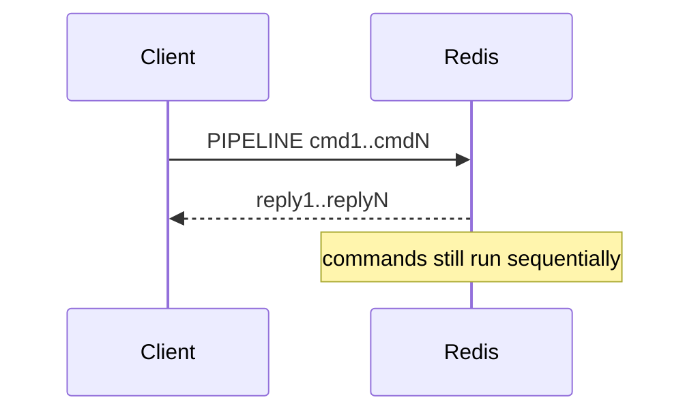
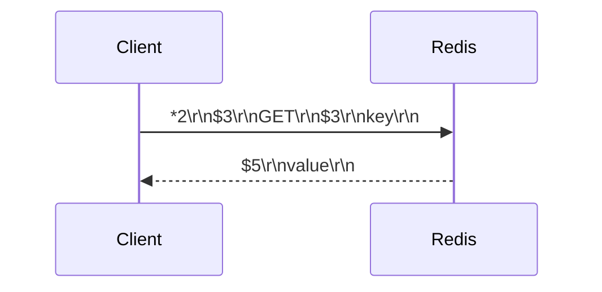
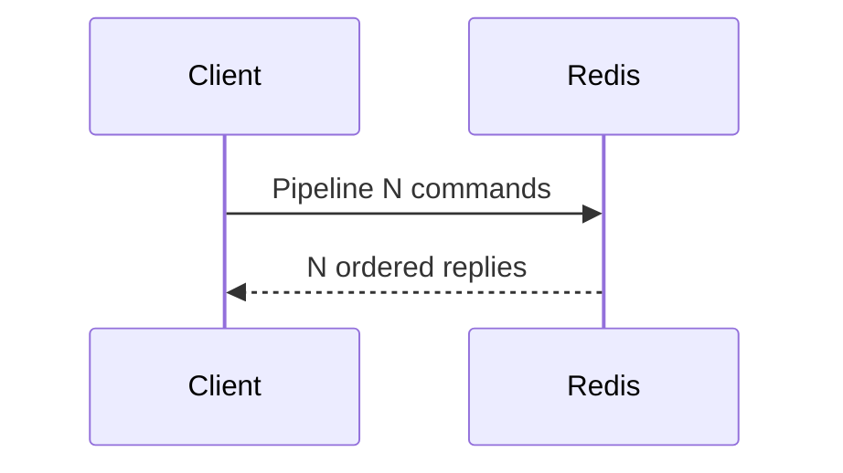

## Quick Revision

- Redis clients speak RESP over TCP/Unix sockets.
- Pipelining reduces round trips; execution still remains single-threaded.
- Cluster redirects (`MOVED`/`ASK`) are protocol-level client responsibilities.

## Core Concepts

| Item | Purpose |
| :--- | :--- |
| RESP2/RESP3 | Request/response serialization |
| Pipeline | Batch commands in one network RTT window |
| MOVED | Permanent slot redirect |
| ASK | Temporary redirect during slot migration |

## Internal Working

## Architecture

Protocol behavior defines client library requirements for pooling, retries, and redirect handling in Cluster deployments.

## Design Tradeoffs

| Choice | Tradeoff |
| :--- | :--- |
| Deep pipelines | Higher throughput, harder per-command timeout handling |
| Strict timeouts | Faster failover, more retry noise |
| TLS everywhere | Better transport security, extra latency overhead |

## Production Patterns

- Separate pooled command connections from dedicated pub/sub connections.
- Tune pipeline size by p99 latency budget instead of max throughput only.

## Scalability

Protocol efficiency is often the first tuning lever before horizontal shard expansion.

## Reliability

Client retry policy must be idempotent-aware to avoid duplicated writes.

## Observability

- Connection counts, command rates, timeout rates.
- Redirect rate (`MOVED`/`ASK`) during reshard windows.

## Troubleshooting

Frequent redirect storms usually indicate slot migration drift or stale client topology caches.

## Common Mistakes

- Treating pipelining as parallel command execution.
- Sharing one socket for pub/sub and normal command workloads.

## Architect Notes

Client protocol behavior is part of system architecture, not an implementation detail.

## How do MOVED and ASK redirects differ in client architecture during normal ops versus resharding?

### Short Answer
For this question, the architecturally correct Redis answer is comparing Redis to alternatives on data model, durability, ops model, and failure semantics — not feature checklists for: How do MOVED and ASK redirects differ in client architecture during normal ops versus resharding.

### Detailed Explanation
Redis offers rich structures and optional persistence; Memcached is simpler cache; Kafka/RabbitMQ excel at durable messaging scale for: How do MOVED and ASK redirects differ in client architecture during normal ops versus resharding.

### Internal Working
Using Redis as a message bus works for moderate throughput with Streams; very large retention or routing complexity may favor dedicated brokers for: How do MOVED and ASK redirects differ in client architecture during normal ops versus resharding.

### Production Notes
You justify it by proving behavior with INFO, slowlog, and workload replay before changing topology by documenting ADR assumptions and exit strategy if load doubles for: How do MOVED and ASK redirects differ in client architecture during normal ops versus resharding.

### Common Mistakes
Resume-driven Redis adoption without ops maturity for Sentinel/Cluster causes painful incidents for: How do MOVED and ASK redirects differ in client architecture during normal ops versus resharding.

### Follow-up Questions
What requirement in: How do MOVED and ASK redirects differ in client architecture during normal ops versus resharding is decisive if throughput numbers are similar across options?

---
## How would you diagram request flow from application through connection pool to Redis command thread?

### Short Answer
The senior-level decision is matching Redis data type to access pattern — not defaulting everything to JSON strings for: How would you diagram request flow from application through connection pool to Redis command thread.

### Detailed Explanation
Pick strings for counters/cache blobs, hashes for field updates, sets/ZSETs for uniqueness/ranking, Streams for durable queues for: How would you diagram request flow from application through connection pool to Redis command thread.

### Internal Working
Encoding upgrades and command complexity (O(N) vs O(1)) follow from type and size choices for: How would you diagram request flow from application through connection pool to Redis command thread.

### Production Notes
You justify it by aligning durability settings with business RPO/RTO and client retry contracts by validating command complexity and memory per key for: How would you diagram request flow from application through connection pool to Redis command thread.

### Common Mistakes
Using `HGETALL` or `SMEMBERS` on large collections blocks the event loop for: How would you diagram request flow from application through connection pool to Redis command thread.

### Follow-up Questions
Which type would you choose for: How would you diagram request flow from application through connection pool to Redis command thread, and what command path proves it under peak cardinality?

---
## When does TLS termination at proxy versus Redis native TLS change trust boundaries?

### Short Answer
The production-grade Redis answer is comparing Redis to alternatives on data model, durability, ops model, and failure semantics — not feature checklists for: When does TLS termination at proxy versus Redis native TLS change trust boundaries.

### Detailed Explanation
Redis offers rich structures and optional persistence; Memcached is simpler cache; Kafka/RabbitMQ excel at durable messaging scale for: When does TLS termination at proxy versus Redis native TLS change trust boundaries.

### Internal Working
Using Redis as a message bus works for moderate throughput with Streams; very large retention or routing complexity may favor dedicated brokers for: When does TLS termination at proxy versus Redis native TLS change trust boundaries.

### Production Notes
You justify it by minimizing hot-key blast radius and single-thread CPU contention by documenting ADR assumptions and exit strategy if load doubles for: When does TLS termination at proxy versus Redis native TLS change trust boundaries.

### Common Mistakes
Resume-driven Redis adoption without ops maturity for Sentinel/Cluster causes painful incidents for: When does TLS termination at proxy versus Redis native TLS change trust boundaries.

### Follow-up Questions
What requirement in: When does TLS termination at proxy versus Redis native TLS change trust boundaries is decisive if throughput numbers are similar across options?

---
## How does TLS add latency, and where would you terminate TLS for cache workloads?

### Short Answer
For this question, the architecturally correct Redis answer is profiling latency as network RTT + command cost on a single thread, then pipelining and command shaping for: How does TLS add latency, and where would you terminate TLS for cache workloads.

### Detailed Explanation
O(N) commands (`KEYS`, large `HGETALL`, wide `ZRANGE`) block the event loop — replace with SCAN, field picks, and LIMIT for: How does TLS add latency, and where would you terminate TLS for cache workloads.

### Internal Working
I/O threads help socket read/write but do not parallelize command execution for: How does TLS add latency, and where would you terminate TLS for cache workloads.

### Production Notes
You justify it by proving behavior with INFO, slowlog, and workload replay before changing topology using slowlog, latency doctor, and before/after benchmarks for: How does TLS add latency, and where would you terminate TLS for cache workloads.

### Common Mistakes
Chasing hardware scale before fixing big keys, hot keys, or chatty clients rarely fixes p99 for: How does TLS add latency, and where would you terminate TLS for cache workloads.

### Follow-up Questions
What single slowlog entry would convince you to change schema or sharding for: How does TLS add latency, and where would you terminate TLS for cache workloads?

---
<!-- interview-answers:end -->

---

## How do MOVED and ASK redirects differ in client architecture during normal ops versus resharding?

### Short Answer
For this question, the architecturally correct Redis answer is comparing Redis to alternatives on data model, durability, ops model, and failure semantics — not feature checklists for: How do MOVED and ASK redirects differ in client architecture during normal ops versus resharding.

### Detailed Explanation
Redis offers rich structures and optional persistence; Memcached is simpler cache; Kafka/RabbitMQ excel at durable messaging scale for: How do MOVED and ASK redirects differ in client architecture during normal ops versus resharding.

### Internal Working
Using Redis as a message bus works for moderate throughput with Streams; very large retention or routing complexity may favor dedicated brokers for: How do MOVED and ASK redirects differ in client architecture during normal ops versus resharding.

### Production Notes
You justify it by proving behavior with INFO, slowlog, and workload replay before changing topology by documenting ADR assumptions and exit strategy if load doubles for: How do MOVED and ASK redirects differ in client architecture during normal ops versus resharding.

### Common Mistakes
Resume-driven Redis adoption without ops maturity for Sentinel/Cluster causes painful incidents for: How do MOVED and ASK redirects differ in client architecture during normal ops versus resharding.

### Follow-up Questions
What requirement in: How do MOVED and ASK redirects differ in client architecture during normal ops versus resharding is decisive if throughput numbers are similar across options?

---
## How would you diagram request flow from application through connection pool to Redis command thread?

### Short Answer
The senior-level decision is matching Redis data type to access pattern — not defaulting everything to JSON strings for: How would you diagram request flow from application through connection pool to Redis command thread.

### Detailed Explanation
Pick strings for counters/cache blobs, hashes for field updates, sets/ZSETs for uniqueness/ranking, Streams for durable queues for: How would you diagram request flow from application through connection pool to Redis command thread.

### Internal Working
Encoding upgrades and command complexity (O(N) vs O(1)) follow from type and size choices for: How would you diagram request flow from application through connection pool to Redis command thread.

### Production Notes
You justify it by aligning durability settings with business RPO/RTO and client retry contracts by validating command complexity and memory per key for: How would you diagram request flow from application through connection pool to Redis command thread.

### Common Mistakes
Using `HGETALL` or `SMEMBERS` on large collections blocks the event loop for: How would you diagram request flow from application through connection pool to Redis command thread.

### Follow-up Questions
Which type would you choose for: How would you diagram request flow from application through connection pool to Redis command thread, and what command path proves it under peak cardinality?

---
## When does TLS termination at proxy versus Redis native TLS change trust boundaries?

### Short Answer
The production-grade Redis answer is comparing Redis to alternatives on data model, durability, ops model, and failure semantics — not feature checklists for: When does TLS termination at proxy versus Redis native TLS change trust boundaries.

### Detailed Explanation
Redis offers rich structures and optional persistence; Memcached is simpler cache; Kafka/RabbitMQ excel at durable messaging scale for: When does TLS termination at proxy versus Redis native TLS change trust boundaries.

### Internal Working
Using Redis as a message bus works for moderate throughput with Streams; very large retention or routing complexity may favor dedicated brokers for: When does TLS termination at proxy versus Redis native TLS change trust boundaries.

### Production Notes
You justify it by minimizing hot-key blast radius and single-thread CPU contention by documenting ADR assumptions and exit strategy if load doubles for: When does TLS termination at proxy versus Redis native TLS change trust boundaries.

### Common Mistakes
Resume-driven Redis adoption without ops maturity for Sentinel/Cluster causes painful incidents for: When does TLS termination at proxy versus Redis native TLS change trust boundaries.

### Follow-up Questions
What requirement in: When does TLS termination at proxy versus Redis native TLS change trust boundaries is decisive if throughput numbers are similar across options?

---
## How does TLS add latency, and where would you terminate TLS for cache workloads?

### Short Answer
For this question, the architecturally correct Redis answer is profiling latency as network RTT + command cost on a single thread, then pipelining and command shaping for: How does TLS add latency, and where would you terminate TLS for cache workloads.

### Detailed Explanation
O(N) commands (`KEYS`, large `HGETALL`, wide `ZRANGE`) block the event loop — replace with SCAN, field picks, and LIMIT for: How does TLS add latency, and where would you terminate TLS for cache workloads.

### Internal Working
I/O threads help socket read/write but do not parallelize command execution for: How does TLS add latency, and where would you terminate TLS for cache workloads.

### Production Notes
You justify it by proving behavior with INFO, slowlog, and workload replay before changing topology using slowlog, latency doctor, and before/after benchmarks for: How does TLS add latency, and where would you terminate TLS for cache workloads.

### Common Mistakes
Chasing hardware scale before fixing big keys, hot keys, or chatty clients rarely fixes p99 for: How does TLS add latency, and where would you terminate TLS for cache workloads.

### Follow-up Questions
What single slowlog entry would convince you to change schema or sharding for: How does TLS add latency, and where would you terminate TLS for cache workloads?

---
<!-- interview-answers:end -->

---

## How do MOVED and ASK redirects differ in client architecture during normal ops versus resharding?

### Short Answer
For this question, the architecturally correct Redis answer is comparing Redis to alternatives on data model, durability, ops model, and failure semantics — not feature checklists for: How do MOVED and ASK redirects differ in client architecture during normal ops versus resharding.

### Detailed Explanation
Redis offers rich structures and optional persistence; Memcached is simpler cache; Kafka/RabbitMQ excel at durable messaging scale for: How do MOVED and ASK redirects differ in client architecture during normal ops versus resharding.

### Internal Working
Using Redis as a message bus works for moderate throughput with Streams; very large retention or routing complexity may favor dedicated brokers for: How do MOVED and ASK redirects differ in client architecture during normal ops versus resharding.

### Production Notes
You justify it by proving behavior with INFO, slowlog, and workload replay before changing topology by documenting ADR assumptions and exit strategy if load doubles for: How do MOVED and ASK redirects differ in client architecture during normal ops versus resharding.

### Common Mistakes
Resume-driven Redis adoption without ops maturity for Sentinel/Cluster causes painful incidents for: How do MOVED and ASK redirects differ in client architecture during normal ops versus resharding.

### Follow-up Questions
What requirement in: How do MOVED and ASK redirects differ in client architecture during normal ops versus resharding is decisive if throughput numbers are similar across options?

---
## How would you diagram request flow from application through connection pool to Redis command thread?

### Short Answer
The senior-level decision is matching Redis data type to access pattern — not defaulting everything to JSON strings for: How would you diagram request flow from application through connection pool to Redis command thread.

### Detailed Explanation
Pick strings for counters/cache blobs, hashes for field updates, sets/ZSETs for uniqueness/ranking, Streams for durable queues for: How would you diagram request flow from application through connection pool to Redis command thread.

### Internal Working
Encoding upgrades and command complexity (O(N) vs O(1)) follow from type and size choices for: How would you diagram request flow from application through connection pool to Redis command thread.

### Production Notes
You justify it by aligning durability settings with business RPO/RTO and client retry contracts by validating command complexity and memory per key for: How would you diagram request flow from application through connection pool to Redis command thread.

### Common Mistakes
Using `HGETALL` or `SMEMBERS` on large collections blocks the event loop for: How would you diagram request flow from application through connection pool to Redis command thread.

### Follow-up Questions
Which type would you choose for: How would you diagram request flow from application through connection pool to Redis command thread, and what command path proves it under peak cardinality?

---
## When does TLS termination at proxy versus Redis native TLS change trust boundaries?

### Short Answer
The production-grade Redis answer is comparing Redis to alternatives on data model, durability, ops model, and failure semantics — not feature checklists for: When does TLS termination at proxy versus Redis native TLS change trust boundaries.

### Detailed Explanation
Redis offers rich structures and optional persistence; Memcached is simpler cache; Kafka/RabbitMQ excel at durable messaging scale for: When does TLS termination at proxy versus Redis native TLS change trust boundaries.

### Internal Working
Using Redis as a message bus works for moderate throughput with Streams; very large retention or routing complexity may favor dedicated brokers for: When does TLS termination at proxy versus Redis native TLS change trust boundaries.

### Production Notes
You justify it by minimizing hot-key blast radius and single-thread CPU contention by documenting ADR assumptions and exit strategy if load doubles for: When does TLS termination at proxy versus Redis native TLS change trust boundaries.

### Common Mistakes
Resume-driven Redis adoption without ops maturity for Sentinel/Cluster causes painful incidents for: When does TLS termination at proxy versus Redis native TLS change trust boundaries.

### Follow-up Questions
What requirement in: When does TLS termination at proxy versus Redis native TLS change trust boundaries is decisive if throughput numbers are similar across options?

---
## How does TLS add latency, and where would you terminate TLS for cache workloads?

### Short Answer
For this question, the architecturally correct Redis answer is profiling latency as network RTT + command cost on a single thread, then pipelining and command shaping for: How does TLS add latency, and where would you terminate TLS for cache workloads.

### Detailed Explanation
O(N) commands (`KEYS`, large `HGETALL`, wide `ZRANGE`) block the event loop — replace with SCAN, field picks, and LIMIT for: How does TLS add latency, and where would you terminate TLS for cache workloads.

### Internal Working
I/O threads help socket read/write but do not parallelize command execution for: How does TLS add latency, and where would you terminate TLS for cache workloads.

### Production Notes
You justify it by proving behavior with INFO, slowlog, and workload replay before changing topology using slowlog, latency doctor, and before/after benchmarks for: How does TLS add latency, and where would you terminate TLS for cache workloads.

### Common Mistakes
Chasing hardware scale before fixing big keys, hot keys, or chatty clients rarely fixes p99 for: How does TLS add latency, and where would you terminate TLS for cache workloads.

### Follow-up Questions
What single slowlog entry would convince you to change schema or sharding for: How does TLS add latency, and where would you terminate TLS for cache workloads?

---
<!-- interview-answers:end -->

---

## How do MOVED and ASK redirects differ in client architecture during normal ops versus resharding?

### Short Answer
For this question, the architecturally correct Redis answer is comparing Redis to alternatives on data model, durability, ops model, and failure semantics — not feature checklists for: How do MOVED and ASK redirects differ in client architecture during normal ops versus resharding.

### Detailed Explanation
Redis offers rich structures and optional persistence; Memcached is simpler cache; Kafka/RabbitMQ excel at durable messaging scale for: How do MOVED and ASK redirects differ in client architecture during normal ops versus resharding.

### Internal Working
Using Redis as a message bus works for moderate throughput with Streams; very large retention or routing complexity may favor dedicated brokers for: How do MOVED and ASK redirects differ in client architecture during normal ops versus resharding.

### Production Notes
You justify it by proving behavior with INFO, slowlog, and workload replay before changing topology by documenting ADR assumptions and exit strategy if load doubles for: How do MOVED and ASK redirects differ in client architecture during normal ops versus resharding.

### Common Mistakes
Resume-driven Redis adoption without ops maturity for Sentinel/Cluster causes painful incidents for: How do MOVED and ASK redirects differ in client architecture during normal ops versus resharding.

### Follow-up Questions
What requirement in: How do MOVED and ASK redirects differ in client architecture during normal ops versus resharding is decisive if throughput numbers are similar across options?

---
## How would you diagram request flow from application through connection pool to Redis command thread?

### Short Answer
The senior-level decision is matching Redis data type to access pattern — not defaulting everything to JSON strings for: How would you diagram request flow from application through connection pool to Redis command thread.

### Detailed Explanation
Pick strings for counters/cache blobs, hashes for field updates, sets/ZSETs for uniqueness/ranking, Streams for durable queues for: How would you diagram request flow from application through connection pool to Redis command thread.

### Internal Working
Encoding upgrades and command complexity (O(N) vs O(1)) follow from type and size choices for: How would you diagram request flow from application through connection pool to Redis command thread.

### Production Notes
You justify it by aligning durability settings with business RPO/RTO and client retry contracts by validating command complexity and memory per key for: How would you diagram request flow from application through connection pool to Redis command thread.

### Common Mistakes
Using `HGETALL` or `SMEMBERS` on large collections blocks the event loop for: How would you diagram request flow from application through connection pool to Redis command thread.

### Follow-up Questions
Which type would you choose for: How would you diagram request flow from application through connection pool to Redis command thread, and what command path proves it under peak cardinality?

---
## When does TLS termination at proxy versus Redis native TLS change trust boundaries?

### Short Answer
The production-grade Redis answer is comparing Redis to alternatives on data model, durability, ops model, and failure semantics — not feature checklists for: When does TLS termination at proxy versus Redis native TLS change trust boundaries.

### Detailed Explanation
Redis offers rich structures and optional persistence; Memcached is simpler cache; Kafka/RabbitMQ excel at durable messaging scale for: When does TLS termination at proxy versus Redis native TLS change trust boundaries.

### Internal Working
Using Redis as a message bus works for moderate throughput with Streams; very large retention or routing complexity may favor dedicated brokers for: When does TLS termination at proxy versus Redis native TLS change trust boundaries.

### Production Notes
You justify it by minimizing hot-key blast radius and single-thread CPU contention by documenting ADR assumptions and exit strategy if load doubles for: When does TLS termination at proxy versus Redis native TLS change trust boundaries.

### Common Mistakes
Resume-driven Redis adoption without ops maturity for Sentinel/Cluster causes painful incidents for: When does TLS termination at proxy versus Redis native TLS change trust boundaries.

### Follow-up Questions
What requirement in: When does TLS termination at proxy versus Redis native TLS change trust boundaries is decisive if throughput numbers are similar across options?

---
## How does TLS add latency, and where would you terminate TLS for cache workloads?

### Short Answer
For this question, the architecturally correct Redis answer is profiling latency as network RTT + command cost on a single thread, then pipelining and command shaping for: How does TLS add latency, and where would you terminate TLS for cache workloads.

### Detailed Explanation
O(N) commands (`KEYS`, large `HGETALL`, wide `ZRANGE`) block the event loop — replace with SCAN, field picks, and LIMIT for: How does TLS add latency, and where would you terminate TLS for cache workloads.

### Internal Working
I/O threads help socket read/write but do not parallelize command execution for: How does TLS add latency, and where would you terminate TLS for cache workloads.

### Production Notes
You justify it by proving behavior with INFO, slowlog, and workload replay before changing topology using slowlog, latency doctor, and before/after benchmarks for: How does TLS add latency, and where would you terminate TLS for cache workloads.

### Common Mistakes
Chasing hardware scale before fixing big keys, hot keys, or chatty clients rarely fixes p99 for: How does TLS add latency, and where would you terminate TLS for cache workloads.

### Follow-up Questions
What single slowlog entry would convince you to change schema or sharding for: How does TLS add latency, and where would you terminate TLS for cache workloads?

---
<!-- interview-answers:end -->

---

## See Also

- [Previous: Memory Management](/redis-cheatsheet/03-redis-internals/memory-management/)
- [Next: Persistence](/redis-cheatsheet/03-redis-internals/persistence/)
- [Redis Handbook Index](/redis-cheatsheet/)
- [Top 150 Interview Questions](/redis-cheatsheet/08-interview-guide/top-150-interview-questions/)
