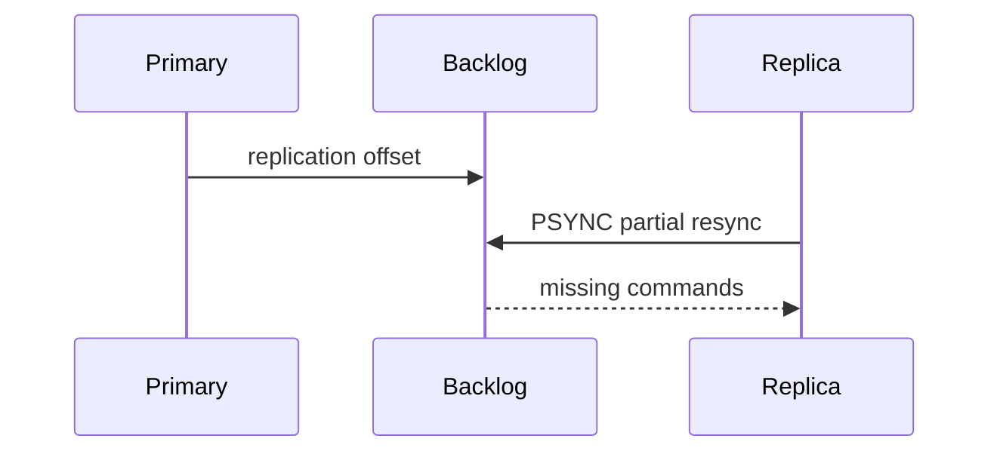
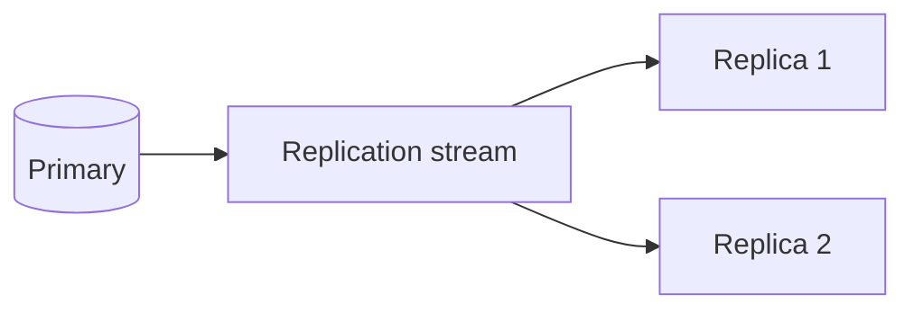

## Executive Summary

**Primary → replica** async replication. Replicas serve **reads** (optional) and provide failover candidates. **Partial resync** via replication backlog on short disconnects.

---

## Core Concepts





| Setting | Purpose |
| :--- | :--- |
| `REPLICAOF host port` | Join as replica |
| `INFO replication` | Lag, offset, role |
| `replica-read-only yes` | Block writes on replica |
| `min-replicas-to-write` | Quorum write safety |

---

## Quick Reference

```bash
INFO replication
ROLE
REPLICAOF 10.0.0.1 6379
REPLICAOF NO ONE    # promote manually
CONFIG GET repl-backlog-size
```

---

## Snippets

### Read from replica (Spring Lettuce)

```java
// configure ReadFrom.REPLICA_PREFERRED for read scaling
```

Monitor `master_repl_offset` vs `slave_repl_offset` for lag.

---

## Common Gotchas

| Pitfall | Fix |
| :--- | :--- |
| Stale reads on replica | `WAIT numreplicas timeout` after write if needed |
| Replica writable | Keep `replica-read-only yes` |
| Full resync after long outage | Increase `repl-backlog-size` |

---

## When is replica read scaling architecturally safe, and when does it violate freshness requirements?

### Short Answer
The production-grade Redis answer is treating replication as async by default and using `WAIT` or app-level checks only when stronger durability is required for: When is replica read scaling architecturally safe, and when does it violate freshness requirements.

### Detailed Explanation
Replicas tail the replication stream; lag appears when network, disk, or apply speed falls behind write rate — partial resync needs adequate `repl-backlog-size` for: When is replica read scaling architecturally safe, and when does it violate freshness requirements.

### Internal Working
Read-your-writes is not automatic on replicas; clients using replica reads must accept staleness or use primary reads after writes for: When is replica read scaling architecturally safe, and when does it violate freshness requirements.

### Production Notes
You justify it by minimizing hot-key blast radius and single-thread CPU contention by correlating `master_repl_offset` with replica offsets and write spikes for: When is replica read scaling architecturally safe, and when does it violate freshness requirements.

### Common Mistakes
Common mistakes include writable replicas, ignoring lag during incidents, and assuming replica reads are fresh for: When is replica read scaling architecturally safe, and when does it violate freshness requirements.

### Follow-up Questions
Which writes in: When is replica read scaling architecturally safe, and when does it violate freshness requirements require synchronous acknowledgment, and how will clients handle failover mid-transaction?

---
## What cross-datacenter replication options would you compare before choosing Redis Cluster only?

### Short Answer
The practical Redis answer is treating replication as async by default and using `WAIT` or app-level checks only when stronger durability is required for: What cross-datacenter replication options would you compare before choosing Redis Cluster only.

### Detailed Explanation
Replicas tail the replication stream; lag appears when network, disk, or apply speed falls behind write rate — partial resync needs adequate `repl-backlog-size` for: What cross-datacenter replication options would you compare before choosing Redis Cluster only.

### Internal Working
Read-your-writes is not automatic on replicas; clients using replica reads must accept staleness or use primary reads after writes for: What cross-datacenter replication options would you compare before choosing Redis Cluster only.

### Production Notes
You justify it by measuring p99 latency, memory headroom, and failover behavior under realistic skew by correlating `master_repl_offset` with replica offsets and write spikes for: What cross-datacenter replication options would you compare before choosing Redis Cluster only.

### Common Mistakes
Common mistakes include writable replicas, ignoring lag during incidents, and assuming replica reads are fresh for: What cross-datacenter replication options would you compare before choosing Redis Cluster only.

### Follow-up Questions
Which writes in: What cross-datacenter replication options would you compare before choosing Redis Cluster only require synchronous acknowledgment, and how will clients handle failover mid-transaction?

---
## How do you detect and fix replica serving stale reads that break business rules?

### Short Answer
The production-grade Redis answer is treating replication as async by default and using `WAIT` or app-level checks only when stronger durability is required for: How do you detect and fix replica serving stale reads that break business rules.

### Detailed Explanation
Replicas tail the replication stream; lag appears when network, disk, or apply speed falls behind write rate — partial resync needs adequate `repl-backlog-size` for: How do you detect and fix replica serving stale reads that break business rules.

### Internal Working
Read-your-writes is not automatic on replicas; clients using replica reads must accept staleness or use primary reads after writes for: How do you detect and fix replica serving stale reads that break business rules.

### Production Notes
You justify it by minimizing hot-key blast radius and single-thread CPU contention by correlating `master_repl_offset` with replica offsets and write spikes for: How do you detect and fix replica serving stale reads that break business rules.

### Common Mistakes
Common mistakes include writable replicas, ignoring lag during incidents, and assuming replica reads are fresh for: How do you detect and fix replica serving stale reads that break business rules.

### Follow-up Questions
Which writes in: How do you detect and fix replica serving stale reads that break business rules require synchronous acknowledgment, and how will clients handle failover mid-transaction?

---
## How does replication backlog sizing affect partial resync performance after brief outages?

### Short Answer
The senior-level decision is treating replication as async by default and using `WAIT` or app-level checks only when stronger durability is required for: How does replication backlog sizing affect partial resync performance after brief outages.

### Detailed Explanation
Replicas tail the replication stream; lag appears when network, disk, or apply speed falls behind write rate — partial resync needs adequate `repl-backlog-size` for: How does replication backlog sizing affect partial resync performance after brief outages.

### Internal Working
Read-your-writes is not automatic on replicas; clients using replica reads must accept staleness or use primary reads after writes for: How does replication backlog sizing affect partial resync performance after brief outages.

### Production Notes
You justify it by aligning durability settings with business RPO/RTO and client retry contracts by correlating `master_repl_offset` with replica offsets and write spikes for: How does replication backlog sizing affect partial resync performance after brief outages.

### Common Mistakes
Common mistakes include writable replicas, ignoring lag during incidents, and assuming replica reads are fresh for: How does replication backlog sizing affect partial resync performance after brief outages.

### Follow-up Questions
Which writes in: How does replication backlog sizing affect partial resync performance after brief outages require synchronous acknowledgment, and how will clients handle failover mid-transaction?

---
## How does min-replicas-to-write protect against write loss during partition events?

### Short Answer
The practical Redis answer is treating replication as async by default and using `WAIT` or app-level checks only when stronger durability is required for: How does min-replicas-to-write protect against write loss during partition events.

### Detailed Explanation
Replicas tail the replication stream; lag appears when network, disk, or apply speed falls behind write rate — partial resync needs adequate `repl-backlog-size` for: How does min-replicas-to-write protect against write loss during partition events.

### Internal Working
Read-your-writes is not automatic on replicas; clients using replica reads must accept staleness or use primary reads after writes for: How does min-replicas-to-write protect against write loss during partition events.

### Production Notes
You justify it by measuring p99 latency, memory headroom, and failover behavior under realistic skew by correlating `master_repl_offset` with replica offsets and write spikes for: How does min-replicas-to-write protect against write loss during partition events.

### Common Mistakes
Common mistakes include writable replicas, ignoring lag during incidents, and assuming replica reads are fresh for: How does min-replicas-to-write protect against write loss during partition events.

### Follow-up Questions
Which writes in: How does min-replicas-to-write protect against write loss during partition events require synchronous acknowledgment, and how will clients handle failover mid-transaction?

---
## What is the role of WAIT after a write when clients require stronger durability than async replication?

### Short Answer
For this question, the architecturally correct Redis answer is treating replication as async by default and using `WAIT` or app-level checks only when stronger durability is required for: What is the role of WAIT after a write when clients require stronger durability than async replication.

### Detailed Explanation
Replicas tail the replication stream; lag appears when network, disk, or apply speed falls behind write rate — partial resync needs adequate `repl-backlog-size` for: What is the role of WAIT after a write when clients require stronger durability than async replication.

### Internal Working
Read-your-writes is not automatic on replicas; clients using replica reads must accept staleness or use primary reads after writes for: What is the role of WAIT after a write when clients require stronger durability than async replication.

### Production Notes
You justify it by proving behavior with INFO, slowlog, and workload replay before changing topology by correlating `master_repl_offset` with replica offsets and write spikes for: What is the role of WAIT after a write when clients require stronger durability than async replication.

### Common Mistakes
Common mistakes include writable replicas, ignoring lag during incidents, and assuming replica reads are fresh for: What is the role of WAIT after a write when clients require stronger durability than async replication.

### Follow-up Questions
Which writes in: What is the role of WAIT after a write when clients require stronger durability than async replication require synchronous acknowledgment, and how will clients handle failover mid-transaction?

---
## How do replica-read-only and ACLs combine to prevent accidental writes to secondaries?

### Short Answer
The practical Redis answer is treating replication as async by default and using `WAIT` or app-level checks only when stronger durability is required for: How do replica-read-only and ACLs combine to prevent accidental writes to secondaries.

### Detailed Explanation
Replicas tail the replication stream; lag appears when network, disk, or apply speed falls behind write rate — partial resync needs adequate `repl-backlog-size` for: How do replica-read-only and ACLs combine to prevent accidental writes to secondaries.

### Internal Working
Read-your-writes is not automatic on replicas; clients using replica reads must accept staleness or use primary reads after writes for: How do replica-read-only and ACLs combine to prevent accidental writes to secondaries.

### Production Notes
You justify it by measuring p99 latency, memory headroom, and failover behavior under realistic skew by correlating `master_repl_offset` with replica offsets and write spikes for: How do replica-read-only and ACLs combine to prevent accidental writes to secondaries.

### Common Mistakes
Common mistakes include writable replicas, ignoring lag during incidents, and assuming replica reads are fresh for: How do replica-read-only and ACLs combine to prevent accidental writes to secondaries.

### Follow-up Questions
Which writes in: How do replica-read-only and ACLs combine to prevent accidental writes to secondaries require synchronous acknowledgment, and how will clients handle failover mid-transaction?

---
## When does adding replicas stop helping read scale because the primary is still the bottleneck?

### Short Answer
The production-grade Redis answer is treating replication as async by default and using `WAIT` or app-level checks only when stronger durability is required for: When does adding replicas stop helping read scale because the primary is still the bottleneck.

### Detailed Explanation
Replicas tail the replication stream; lag appears when network, disk, or apply speed falls behind write rate — partial resync needs adequate `repl-backlog-size` for: When does adding replicas stop helping read scale because the primary is still the bottleneck.

### Internal Working
Read-your-writes is not automatic on replicas; clients using replica reads must accept staleness or use primary reads after writes for: When does adding replicas stop helping read scale because the primary is still the bottleneck.

### Production Notes
You justify it by minimizing hot-key blast radius and single-thread CPU contention by correlating `master_repl_offset` with replica offsets and write spikes for: When does adding replicas stop helping read scale because the primary is still the bottleneck.

### Common Mistakes
Common mistakes include writable replicas, ignoring lag during incidents, and assuming replica reads are fresh for: When does adding replicas stop helping read scale because the primary is still the bottleneck.

### Follow-up Questions
Which writes in: When does adding replicas stop helping read scale because the primary is still the bottleneck require synchronous acknowledgment, and how will clients handle failover mid-transaction?

---
## How does replication factor affect memory and network costs at 10x data growth?

### Short Answer
For this question, the architecturally correct Redis answer is treating replication as async by default and using `WAIT` or app-level checks only when stronger durability is required for: How does replication factor affect memory and network costs at 10x data growth.

### Detailed Explanation
Replicas tail the replication stream; lag appears when network, disk, or apply speed falls behind write rate — partial resync needs adequate `repl-backlog-size` for: How does replication factor affect memory and network costs at 10x data growth.

### Internal Working
Read-your-writes is not automatic on replicas; clients using replica reads must accept staleness or use primary reads after writes for: How does replication factor affect memory and network costs at 10x data growth.

### Production Notes
You justify it by proving behavior with INFO, slowlog, and workload replay before changing topology by correlating `master_repl_offset` with replica offsets and write spikes for: How does replication factor affect memory and network costs at 10x data growth.

### Common Mistakes
Common mistakes include writable replicas, ignoring lag during incidents, and assuming replica reads are fresh for: How does replication factor affect memory and network costs at 10x data growth.

### Follow-up Questions
Which writes in: How does replication factor affect memory and network costs at 10x data growth require synchronous acknowledgment, and how will clients handle failover mid-transaction?

---
<!-- interview-answers:end -->

---

## When is replica read scaling architecturally safe, and when does it violate freshness requirements?

### Short Answer
The production-grade Redis answer is treating replication as async by default and using `WAIT` or app-level checks only when stronger durability is required for: When is replica read scaling architecturally safe, and when does it violate freshness requirements.

### Detailed Explanation
Replicas tail the replication stream; lag appears when network, disk, or apply speed falls behind write rate — partial resync needs adequate `repl-backlog-size` for: When is replica read scaling architecturally safe, and when does it violate freshness requirements.

### Internal Working
Read-your-writes is not automatic on replicas; clients using replica reads must accept staleness or use primary reads after writes for: When is replica read scaling architecturally safe, and when does it violate freshness requirements.

### Production Notes
You justify it by minimizing hot-key blast radius and single-thread CPU contention by correlating `master_repl_offset` with replica offsets and write spikes for: When is replica read scaling architecturally safe, and when does it violate freshness requirements.

### Common Mistakes
Common mistakes include writable replicas, ignoring lag during incidents, and assuming replica reads are fresh for: When is replica read scaling architecturally safe, and when does it violate freshness requirements.

### Follow-up Questions
Which writes in: When is replica read scaling architecturally safe, and when does it violate freshness requirements require synchronous acknowledgment, and how will clients handle failover mid-transaction?

---
## What cross-datacenter replication options would you compare before choosing Redis Cluster only?

### Short Answer
The practical Redis answer is treating replication as async by default and using `WAIT` or app-level checks only when stronger durability is required for: What cross-datacenter replication options would you compare before choosing Redis Cluster only.

### Detailed Explanation
Replicas tail the replication stream; lag appears when network, disk, or apply speed falls behind write rate — partial resync needs adequate `repl-backlog-size` for: What cross-datacenter replication options would you compare before choosing Redis Cluster only.

### Internal Working
Read-your-writes is not automatic on replicas; clients using replica reads must accept staleness or use primary reads after writes for: What cross-datacenter replication options would you compare before choosing Redis Cluster only.

### Production Notes
You justify it by measuring p99 latency, memory headroom, and failover behavior under realistic skew by correlating `master_repl_offset` with replica offsets and write spikes for: What cross-datacenter replication options would you compare before choosing Redis Cluster only.

### Common Mistakes
Common mistakes include writable replicas, ignoring lag during incidents, and assuming replica reads are fresh for: What cross-datacenter replication options would you compare before choosing Redis Cluster only.

### Follow-up Questions
Which writes in: What cross-datacenter replication options would you compare before choosing Redis Cluster only require synchronous acknowledgment, and how will clients handle failover mid-transaction?

---
## How do you detect and fix replica serving stale reads that break business rules?

### Short Answer
The production-grade Redis answer is treating replication as async by default and using `WAIT` or app-level checks only when stronger durability is required for: How do you detect and fix replica serving stale reads that break business rules.

### Detailed Explanation
Replicas tail the replication stream; lag appears when network, disk, or apply speed falls behind write rate — partial resync needs adequate `repl-backlog-size` for: How do you detect and fix replica serving stale reads that break business rules.

### Internal Working
Read-your-writes is not automatic on replicas; clients using replica reads must accept staleness or use primary reads after writes for: How do you detect and fix replica serving stale reads that break business rules.

### Production Notes
You justify it by minimizing hot-key blast radius and single-thread CPU contention by correlating `master_repl_offset` with replica offsets and write spikes for: How do you detect and fix replica serving stale reads that break business rules.

### Common Mistakes
Common mistakes include writable replicas, ignoring lag during incidents, and assuming replica reads are fresh for: How do you detect and fix replica serving stale reads that break business rules.

### Follow-up Questions
Which writes in: How do you detect and fix replica serving stale reads that break business rules require synchronous acknowledgment, and how will clients handle failover mid-transaction?

---
## How does replication backlog sizing affect partial resync performance after brief outages?

### Short Answer
The senior-level decision is treating replication as async by default and using `WAIT` or app-level checks only when stronger durability is required for: How does replication backlog sizing affect partial resync performance after brief outages.

### Detailed Explanation
Replicas tail the replication stream; lag appears when network, disk, or apply speed falls behind write rate — partial resync needs adequate `repl-backlog-size` for: How does replication backlog sizing affect partial resync performance after brief outages.

### Internal Working
Read-your-writes is not automatic on replicas; clients using replica reads must accept staleness or use primary reads after writes for: How does replication backlog sizing affect partial resync performance after brief outages.

### Production Notes
You justify it by aligning durability settings with business RPO/RTO and client retry contracts by correlating `master_repl_offset` with replica offsets and write spikes for: How does replication backlog sizing affect partial resync performance after brief outages.

### Common Mistakes
Common mistakes include writable replicas, ignoring lag during incidents, and assuming replica reads are fresh for: How does replication backlog sizing affect partial resync performance after brief outages.

### Follow-up Questions
Which writes in: How does replication backlog sizing affect partial resync performance after brief outages require synchronous acknowledgment, and how will clients handle failover mid-transaction?

---
## How does min-replicas-to-write protect against write loss during partition events?

### Short Answer
The practical Redis answer is treating replication as async by default and using `WAIT` or app-level checks only when stronger durability is required for: How does min-replicas-to-write protect against write loss during partition events.

### Detailed Explanation
Replicas tail the replication stream; lag appears when network, disk, or apply speed falls behind write rate — partial resync needs adequate `repl-backlog-size` for: How does min-replicas-to-write protect against write loss during partition events.

### Internal Working
Read-your-writes is not automatic on replicas; clients using replica reads must accept staleness or use primary reads after writes for: How does min-replicas-to-write protect against write loss during partition events.

### Production Notes
You justify it by measuring p99 latency, memory headroom, and failover behavior under realistic skew by correlating `master_repl_offset` with replica offsets and write spikes for: How does min-replicas-to-write protect against write loss during partition events.

### Common Mistakes
Common mistakes include writable replicas, ignoring lag during incidents, and assuming replica reads are fresh for: How does min-replicas-to-write protect against write loss during partition events.

### Follow-up Questions
Which writes in: How does min-replicas-to-write protect against write loss during partition events require synchronous acknowledgment, and how will clients handle failover mid-transaction?

---
## What is the role of WAIT after a write when clients require stronger durability than async replication?

### Short Answer
For this question, the architecturally correct Redis answer is treating replication as async by default and using `WAIT` or app-level checks only when stronger durability is required for: What is the role of WAIT after a write when clients require stronger durability than async replication.

### Detailed Explanation
Replicas tail the replication stream; lag appears when network, disk, or apply speed falls behind write rate — partial resync needs adequate `repl-backlog-size` for: What is the role of WAIT after a write when clients require stronger durability than async replication.

### Internal Working
Read-your-writes is not automatic on replicas; clients using replica reads must accept staleness or use primary reads after writes for: What is the role of WAIT after a write when clients require stronger durability than async replication.

### Production Notes
You justify it by proving behavior with INFO, slowlog, and workload replay before changing topology by correlating `master_repl_offset` with replica offsets and write spikes for: What is the role of WAIT after a write when clients require stronger durability than async replication.

### Common Mistakes
Common mistakes include writable replicas, ignoring lag during incidents, and assuming replica reads are fresh for: What is the role of WAIT after a write when clients require stronger durability than async replication.

### Follow-up Questions
Which writes in: What is the role of WAIT after a write when clients require stronger durability than async replication require synchronous acknowledgment, and how will clients handle failover mid-transaction?

---
## How do replica-read-only and ACLs combine to prevent accidental writes to secondaries?

### Short Answer
The practical Redis answer is treating replication as async by default and using `WAIT` or app-level checks only when stronger durability is required for: How do replica-read-only and ACLs combine to prevent accidental writes to secondaries.

### Detailed Explanation
Replicas tail the replication stream; lag appears when network, disk, or apply speed falls behind write rate — partial resync needs adequate `repl-backlog-size` for: How do replica-read-only and ACLs combine to prevent accidental writes to secondaries.

### Internal Working
Read-your-writes is not automatic on replicas; clients using replica reads must accept staleness or use primary reads after writes for: How do replica-read-only and ACLs combine to prevent accidental writes to secondaries.

### Production Notes
You justify it by measuring p99 latency, memory headroom, and failover behavior under realistic skew by correlating `master_repl_offset` with replica offsets and write spikes for: How do replica-read-only and ACLs combine to prevent accidental writes to secondaries.

### Common Mistakes
Common mistakes include writable replicas, ignoring lag during incidents, and assuming replica reads are fresh for: How do replica-read-only and ACLs combine to prevent accidental writes to secondaries.

### Follow-up Questions
Which writes in: How do replica-read-only and ACLs combine to prevent accidental writes to secondaries require synchronous acknowledgment, and how will clients handle failover mid-transaction?

---
## When does adding replicas stop helping read scale because the primary is still the bottleneck?

### Short Answer
The production-grade Redis answer is treating replication as async by default and using `WAIT` or app-level checks only when stronger durability is required for: When does adding replicas stop helping read scale because the primary is still the bottleneck.

### Detailed Explanation
Replicas tail the replication stream; lag appears when network, disk, or apply speed falls behind write rate — partial resync needs adequate `repl-backlog-size` for: When does adding replicas stop helping read scale because the primary is still the bottleneck.

### Internal Working
Read-your-writes is not automatic on replicas; clients using replica reads must accept staleness or use primary reads after writes for: When does adding replicas stop helping read scale because the primary is still the bottleneck.

### Production Notes
You justify it by minimizing hot-key blast radius and single-thread CPU contention by correlating `master_repl_offset` with replica offsets and write spikes for: When does adding replicas stop helping read scale because the primary is still the bottleneck.

### Common Mistakes
Common mistakes include writable replicas, ignoring lag during incidents, and assuming replica reads are fresh for: When does adding replicas stop helping read scale because the primary is still the bottleneck.

### Follow-up Questions
Which writes in: When does adding replicas stop helping read scale because the primary is still the bottleneck require synchronous acknowledgment, and how will clients handle failover mid-transaction?

---
## How does replication factor affect memory and network costs at 10x data growth?

### Short Answer
For this question, the architecturally correct Redis answer is treating replication as async by default and using `WAIT` or app-level checks only when stronger durability is required for: How does replication factor affect memory and network costs at 10x data growth.

### Detailed Explanation
Replicas tail the replication stream; lag appears when network, disk, or apply speed falls behind write rate — partial resync needs adequate `repl-backlog-size` for: How does replication factor affect memory and network costs at 10x data growth.

### Internal Working
Read-your-writes is not automatic on replicas; clients using replica reads must accept staleness or use primary reads after writes for: How does replication factor affect memory and network costs at 10x data growth.

### Production Notes
You justify it by proving behavior with INFO, slowlog, and workload replay before changing topology by correlating `master_repl_offset` with replica offsets and write spikes for: How does replication factor affect memory and network costs at 10x data growth.

### Common Mistakes
Common mistakes include writable replicas, ignoring lag during incidents, and assuming replica reads are fresh for: How does replication factor affect memory and network costs at 10x data growth.

### Follow-up Questions
Which writes in: How does replication factor affect memory and network costs at 10x data growth require synchronous acknowledgment, and how will clients handle failover mid-transaction?

---
<!-- interview-answers:end -->

---

## When is replica read scaling architecturally safe, and when does it violate freshness requirements?

### Short Answer
The production-grade Redis answer is treating replication as async by default and using `WAIT` or app-level checks only when stronger durability is required for: When is replica read scaling architecturally safe, and when does it violate freshness requirements.

### Detailed Explanation
Replicas tail the replication stream; lag appears when network, disk, or apply speed falls behind write rate — partial resync needs adequate `repl-backlog-size` for: When is replica read scaling architecturally safe, and when does it violate freshness requirements.

### Internal Working
Read-your-writes is not automatic on replicas; clients using replica reads must accept staleness or use primary reads after writes for: When is replica read scaling architecturally safe, and when does it violate freshness requirements.

### Production Notes
You justify it by minimizing hot-key blast radius and single-thread CPU contention by correlating `master_repl_offset` with replica offsets and write spikes for: When is replica read scaling architecturally safe, and when does it violate freshness requirements.

### Common Mistakes
Common mistakes include writable replicas, ignoring lag during incidents, and assuming replica reads are fresh for: When is replica read scaling architecturally safe, and when does it violate freshness requirements.

### Follow-up Questions
Which writes in: When is replica read scaling architecturally safe, and when does it violate freshness requirements require synchronous acknowledgment, and how will clients handle failover mid-transaction?

---
## What cross-datacenter replication options would you compare before choosing Redis Cluster only?

### Short Answer
The practical Redis answer is treating replication as async by default and using `WAIT` or app-level checks only when stronger durability is required for: What cross-datacenter replication options would you compare before choosing Redis Cluster only.

### Detailed Explanation
Replicas tail the replication stream; lag appears when network, disk, or apply speed falls behind write rate — partial resync needs adequate `repl-backlog-size` for: What cross-datacenter replication options would you compare before choosing Redis Cluster only.

### Internal Working
Read-your-writes is not automatic on replicas; clients using replica reads must accept staleness or use primary reads after writes for: What cross-datacenter replication options would you compare before choosing Redis Cluster only.

### Production Notes
You justify it by measuring p99 latency, memory headroom, and failover behavior under realistic skew by correlating `master_repl_offset` with replica offsets and write spikes for: What cross-datacenter replication options would you compare before choosing Redis Cluster only.

### Common Mistakes
Common mistakes include writable replicas, ignoring lag during incidents, and assuming replica reads are fresh for: What cross-datacenter replication options would you compare before choosing Redis Cluster only.

### Follow-up Questions
Which writes in: What cross-datacenter replication options would you compare before choosing Redis Cluster only require synchronous acknowledgment, and how will clients handle failover mid-transaction?

---
## How do you detect and fix replica serving stale reads that break business rules?

### Short Answer
The production-grade Redis answer is treating replication as async by default and using `WAIT` or app-level checks only when stronger durability is required for: How do you detect and fix replica serving stale reads that break business rules.

### Detailed Explanation
Replicas tail the replication stream; lag appears when network, disk, or apply speed falls behind write rate — partial resync needs adequate `repl-backlog-size` for: How do you detect and fix replica serving stale reads that break business rules.

### Internal Working
Read-your-writes is not automatic on replicas; clients using replica reads must accept staleness or use primary reads after writes for: How do you detect and fix replica serving stale reads that break business rules.

### Production Notes
You justify it by minimizing hot-key blast radius and single-thread CPU contention by correlating `master_repl_offset` with replica offsets and write spikes for: How do you detect and fix replica serving stale reads that break business rules.

### Common Mistakes
Common mistakes include writable replicas, ignoring lag during incidents, and assuming replica reads are fresh for: How do you detect and fix replica serving stale reads that break business rules.

### Follow-up Questions
Which writes in: How do you detect and fix replica serving stale reads that break business rules require synchronous acknowledgment, and how will clients handle failover mid-transaction?

---
## How does replication backlog sizing affect partial resync performance after brief outages?

### Short Answer
The senior-level decision is treating replication as async by default and using `WAIT` or app-level checks only when stronger durability is required for: How does replication backlog sizing affect partial resync performance after brief outages.

### Detailed Explanation
Replicas tail the replication stream; lag appears when network, disk, or apply speed falls behind write rate — partial resync needs adequate `repl-backlog-size` for: How does replication backlog sizing affect partial resync performance after brief outages.

### Internal Working
Read-your-writes is not automatic on replicas; clients using replica reads must accept staleness or use primary reads after writes for: How does replication backlog sizing affect partial resync performance after brief outages.

### Production Notes
You justify it by aligning durability settings with business RPO/RTO and client retry contracts by correlating `master_repl_offset` with replica offsets and write spikes for: How does replication backlog sizing affect partial resync performance after brief outages.

### Common Mistakes
Common mistakes include writable replicas, ignoring lag during incidents, and assuming replica reads are fresh for: How does replication backlog sizing affect partial resync performance after brief outages.

### Follow-up Questions
Which writes in: How does replication backlog sizing affect partial resync performance after brief outages require synchronous acknowledgment, and how will clients handle failover mid-transaction?

---
## How does min-replicas-to-write protect against write loss during partition events?

### Short Answer
The practical Redis answer is treating replication as async by default and using `WAIT` or app-level checks only when stronger durability is required for: How does min-replicas-to-write protect against write loss during partition events.

### Detailed Explanation
Replicas tail the replication stream; lag appears when network, disk, or apply speed falls behind write rate — partial resync needs adequate `repl-backlog-size` for: How does min-replicas-to-write protect against write loss during partition events.

### Internal Working
Read-your-writes is not automatic on replicas; clients using replica reads must accept staleness or use primary reads after writes for: How does min-replicas-to-write protect against write loss during partition events.

### Production Notes
You justify it by measuring p99 latency, memory headroom, and failover behavior under realistic skew by correlating `master_repl_offset` with replica offsets and write spikes for: How does min-replicas-to-write protect against write loss during partition events.

### Common Mistakes
Common mistakes include writable replicas, ignoring lag during incidents, and assuming replica reads are fresh for: How does min-replicas-to-write protect against write loss during partition events.

### Follow-up Questions
Which writes in: How does min-replicas-to-write protect against write loss during partition events require synchronous acknowledgment, and how will clients handle failover mid-transaction?

---
## What is the role of WAIT after a write when clients require stronger durability than async replication?

### Short Answer
For this question, the architecturally correct Redis answer is treating replication as async by default and using `WAIT` or app-level checks only when stronger durability is required for: What is the role of WAIT after a write when clients require stronger durability than async replication.

### Detailed Explanation
Replicas tail the replication stream; lag appears when network, disk, or apply speed falls behind write rate — partial resync needs adequate `repl-backlog-size` for: What is the role of WAIT after a write when clients require stronger durability than async replication.

### Internal Working
Read-your-writes is not automatic on replicas; clients using replica reads must accept staleness or use primary reads after writes for: What is the role of WAIT after a write when clients require stronger durability than async replication.

### Production Notes
You justify it by proving behavior with INFO, slowlog, and workload replay before changing topology by correlating `master_repl_offset` with replica offsets and write spikes for: What is the role of WAIT after a write when clients require stronger durability than async replication.

### Common Mistakes
Common mistakes include writable replicas, ignoring lag during incidents, and assuming replica reads are fresh for: What is the role of WAIT after a write when clients require stronger durability than async replication.

### Follow-up Questions
Which writes in: What is the role of WAIT after a write when clients require stronger durability than async replication require synchronous acknowledgment, and how will clients handle failover mid-transaction?

---
## How do replica-read-only and ACLs combine to prevent accidental writes to secondaries?

### Short Answer
The practical Redis answer is treating replication as async by default and using `WAIT` or app-level checks only when stronger durability is required for: How do replica-read-only and ACLs combine to prevent accidental writes to secondaries.

### Detailed Explanation
Replicas tail the replication stream; lag appears when network, disk, or apply speed falls behind write rate — partial resync needs adequate `repl-backlog-size` for: How do replica-read-only and ACLs combine to prevent accidental writes to secondaries.

### Internal Working
Read-your-writes is not automatic on replicas; clients using replica reads must accept staleness or use primary reads after writes for: How do replica-read-only and ACLs combine to prevent accidental writes to secondaries.

### Production Notes
You justify it by measuring p99 latency, memory headroom, and failover behavior under realistic skew by correlating `master_repl_offset` with replica offsets and write spikes for: How do replica-read-only and ACLs combine to prevent accidental writes to secondaries.

### Common Mistakes
Common mistakes include writable replicas, ignoring lag during incidents, and assuming replica reads are fresh for: How do replica-read-only and ACLs combine to prevent accidental writes to secondaries.

### Follow-up Questions
Which writes in: How do replica-read-only and ACLs combine to prevent accidental writes to secondaries require synchronous acknowledgment, and how will clients handle failover mid-transaction?

---
## When does adding replicas stop helping read scale because the primary is still the bottleneck?

### Short Answer
The production-grade Redis answer is treating replication as async by default and using `WAIT` or app-level checks only when stronger durability is required for: When does adding replicas stop helping read scale because the primary is still the bottleneck.

### Detailed Explanation
Replicas tail the replication stream; lag appears when network, disk, or apply speed falls behind write rate — partial resync needs adequate `repl-backlog-size` for: When does adding replicas stop helping read scale because the primary is still the bottleneck.

### Internal Working
Read-your-writes is not automatic on replicas; clients using replica reads must accept staleness or use primary reads after writes for: When does adding replicas stop helping read scale because the primary is still the bottleneck.

### Production Notes
You justify it by minimizing hot-key blast radius and single-thread CPU contention by correlating `master_repl_offset` with replica offsets and write spikes for: When does adding replicas stop helping read scale because the primary is still the bottleneck.

### Common Mistakes
Common mistakes include writable replicas, ignoring lag during incidents, and assuming replica reads are fresh for: When does adding replicas stop helping read scale because the primary is still the bottleneck.

### Follow-up Questions
Which writes in: When does adding replicas stop helping read scale because the primary is still the bottleneck require synchronous acknowledgment, and how will clients handle failover mid-transaction?

---
## How does replication factor affect memory and network costs at 10x data growth?

### Short Answer
For this question, the architecturally correct Redis answer is treating replication as async by default and using `WAIT` or app-level checks only when stronger durability is required for: How does replication factor affect memory and network costs at 10x data growth.

### Detailed Explanation
Replicas tail the replication stream; lag appears when network, disk, or apply speed falls behind write rate — partial resync needs adequate `repl-backlog-size` for: How does replication factor affect memory and network costs at 10x data growth.

### Internal Working
Read-your-writes is not automatic on replicas; clients using replica reads must accept staleness or use primary reads after writes for: How does replication factor affect memory and network costs at 10x data growth.

### Production Notes
You justify it by proving behavior with INFO, slowlog, and workload replay before changing topology by correlating `master_repl_offset` with replica offsets and write spikes for: How does replication factor affect memory and network costs at 10x data growth.

### Common Mistakes
Common mistakes include writable replicas, ignoring lag during incidents, and assuming replica reads are fresh for: How does replication factor affect memory and network costs at 10x data growth.

### Follow-up Questions
Which writes in: How does replication factor affect memory and network costs at 10x data growth require synchronous acknowledgment, and how will clients handle failover mid-transaction?

---
<!-- interview-answers:end -->

---

## When is replica read scaling architecturally safe, and when does it violate freshness requirements?

### Short Answer
The production-grade Redis answer is treating replication as async by default and using `WAIT` or app-level checks only when stronger durability is required for: When is replica read scaling architecturally safe, and when does it violate freshness requirements.

### Detailed Explanation
Replicas tail the replication stream; lag appears when network, disk, or apply speed falls behind write rate — partial resync needs adequate `repl-backlog-size` for: When is replica read scaling architecturally safe, and when does it violate freshness requirements.

### Internal Working
Read-your-writes is not automatic on replicas; clients using replica reads must accept staleness or use primary reads after writes for: When is replica read scaling architecturally safe, and when does it violate freshness requirements.

### Production Notes
You justify it by minimizing hot-key blast radius and single-thread CPU contention by correlating `master_repl_offset` with replica offsets and write spikes for: When is replica read scaling architecturally safe, and when does it violate freshness requirements.

### Common Mistakes
Common mistakes include writable replicas, ignoring lag during incidents, and assuming replica reads are fresh for: When is replica read scaling architecturally safe, and when does it violate freshness requirements.

### Follow-up Questions
Which writes in: When is replica read scaling architecturally safe, and when does it violate freshness requirements require synchronous acknowledgment, and how will clients handle failover mid-transaction?

---
## What cross-datacenter replication options would you compare before choosing Redis Cluster only?

### Short Answer
The practical Redis answer is treating replication as async by default and using `WAIT` or app-level checks only when stronger durability is required for: What cross-datacenter replication options would you compare before choosing Redis Cluster only.

### Detailed Explanation
Replicas tail the replication stream; lag appears when network, disk, or apply speed falls behind write rate — partial resync needs adequate `repl-backlog-size` for: What cross-datacenter replication options would you compare before choosing Redis Cluster only.

### Internal Working
Read-your-writes is not automatic on replicas; clients using replica reads must accept staleness or use primary reads after writes for: What cross-datacenter replication options would you compare before choosing Redis Cluster only.

### Production Notes
You justify it by measuring p99 latency, memory headroom, and failover behavior under realistic skew by correlating `master_repl_offset` with replica offsets and write spikes for: What cross-datacenter replication options would you compare before choosing Redis Cluster only.

### Common Mistakes
Common mistakes include writable replicas, ignoring lag during incidents, and assuming replica reads are fresh for: What cross-datacenter replication options would you compare before choosing Redis Cluster only.

### Follow-up Questions
Which writes in: What cross-datacenter replication options would you compare before choosing Redis Cluster only require synchronous acknowledgment, and how will clients handle failover mid-transaction?

---
## How do you detect and fix replica serving stale reads that break business rules?

### Short Answer
The production-grade Redis answer is treating replication as async by default and using `WAIT` or app-level checks only when stronger durability is required for: How do you detect and fix replica serving stale reads that break business rules.

### Detailed Explanation
Replicas tail the replication stream; lag appears when network, disk, or apply speed falls behind write rate — partial resync needs adequate `repl-backlog-size` for: How do you detect and fix replica serving stale reads that break business rules.

### Internal Working
Read-your-writes is not automatic on replicas; clients using replica reads must accept staleness or use primary reads after writes for: How do you detect and fix replica serving stale reads that break business rules.

### Production Notes
You justify it by minimizing hot-key blast radius and single-thread CPU contention by correlating `master_repl_offset` with replica offsets and write spikes for: How do you detect and fix replica serving stale reads that break business rules.

### Common Mistakes
Common mistakes include writable replicas, ignoring lag during incidents, and assuming replica reads are fresh for: How do you detect and fix replica serving stale reads that break business rules.

### Follow-up Questions
Which writes in: How do you detect and fix replica serving stale reads that break business rules require synchronous acknowledgment, and how will clients handle failover mid-transaction?

---
## How does replication backlog sizing affect partial resync performance after brief outages?

### Short Answer
The senior-level decision is treating replication as async by default and using `WAIT` or app-level checks only when stronger durability is required for: How does replication backlog sizing affect partial resync performance after brief outages.

### Detailed Explanation
Replicas tail the replication stream; lag appears when network, disk, or apply speed falls behind write rate — partial resync needs adequate `repl-backlog-size` for: How does replication backlog sizing affect partial resync performance after brief outages.

### Internal Working
Read-your-writes is not automatic on replicas; clients using replica reads must accept staleness or use primary reads after writes for: How does replication backlog sizing affect partial resync performance after brief outages.

### Production Notes
You justify it by aligning durability settings with business RPO/RTO and client retry contracts by correlating `master_repl_offset` with replica offsets and write spikes for: How does replication backlog sizing affect partial resync performance after brief outages.

### Common Mistakes
Common mistakes include writable replicas, ignoring lag during incidents, and assuming replica reads are fresh for: How does replication backlog sizing affect partial resync performance after brief outages.

### Follow-up Questions
Which writes in: How does replication backlog sizing affect partial resync performance after brief outages require synchronous acknowledgment, and how will clients handle failover mid-transaction?

---
## How does min-replicas-to-write protect against write loss during partition events?

### Short Answer
The practical Redis answer is treating replication as async by default and using `WAIT` or app-level checks only when stronger durability is required for: How does min-replicas-to-write protect against write loss during partition events.

### Detailed Explanation
Replicas tail the replication stream; lag appears when network, disk, or apply speed falls behind write rate — partial resync needs adequate `repl-backlog-size` for: How does min-replicas-to-write protect against write loss during partition events.

### Internal Working
Read-your-writes is not automatic on replicas; clients using replica reads must accept staleness or use primary reads after writes for: How does min-replicas-to-write protect against write loss during partition events.

### Production Notes
You justify it by measuring p99 latency, memory headroom, and failover behavior under realistic skew by correlating `master_repl_offset` with replica offsets and write spikes for: How does min-replicas-to-write protect against write loss during partition events.

### Common Mistakes
Common mistakes include writable replicas, ignoring lag during incidents, and assuming replica reads are fresh for: How does min-replicas-to-write protect against write loss during partition events.

### Follow-up Questions
Which writes in: How does min-replicas-to-write protect against write loss during partition events require synchronous acknowledgment, and how will clients handle failover mid-transaction?

---
## What is the role of WAIT after a write when clients require stronger durability than async replication?

### Short Answer
For this question, the architecturally correct Redis answer is treating replication as async by default and using `WAIT` or app-level checks only when stronger durability is required for: What is the role of WAIT after a write when clients require stronger durability than async replication.

### Detailed Explanation
Replicas tail the replication stream; lag appears when network, disk, or apply speed falls behind write rate — partial resync needs adequate `repl-backlog-size` for: What is the role of WAIT after a write when clients require stronger durability than async replication.

### Internal Working
Read-your-writes is not automatic on replicas; clients using replica reads must accept staleness or use primary reads after writes for: What is the role of WAIT after a write when clients require stronger durability than async replication.

### Production Notes
You justify it by proving behavior with INFO, slowlog, and workload replay before changing topology by correlating `master_repl_offset` with replica offsets and write spikes for: What is the role of WAIT after a write when clients require stronger durability than async replication.

### Common Mistakes
Common mistakes include writable replicas, ignoring lag during incidents, and assuming replica reads are fresh for: What is the role of WAIT after a write when clients require stronger durability than async replication.

### Follow-up Questions
Which writes in: What is the role of WAIT after a write when clients require stronger durability than async replication require synchronous acknowledgment, and how will clients handle failover mid-transaction?

---
## How do replica-read-only and ACLs combine to prevent accidental writes to secondaries?

### Short Answer
The practical Redis answer is treating replication as async by default and using `WAIT` or app-level checks only when stronger durability is required for: How do replica-read-only and ACLs combine to prevent accidental writes to secondaries.

### Detailed Explanation
Replicas tail the replication stream; lag appears when network, disk, or apply speed falls behind write rate — partial resync needs adequate `repl-backlog-size` for: How do replica-read-only and ACLs combine to prevent accidental writes to secondaries.

### Internal Working
Read-your-writes is not automatic on replicas; clients using replica reads must accept staleness or use primary reads after writes for: How do replica-read-only and ACLs combine to prevent accidental writes to secondaries.

### Production Notes
You justify it by measuring p99 latency, memory headroom, and failover behavior under realistic skew by correlating `master_repl_offset` with replica offsets and write spikes for: How do replica-read-only and ACLs combine to prevent accidental writes to secondaries.

### Common Mistakes
Common mistakes include writable replicas, ignoring lag during incidents, and assuming replica reads are fresh for: How do replica-read-only and ACLs combine to prevent accidental writes to secondaries.

### Follow-up Questions
Which writes in: How do replica-read-only and ACLs combine to prevent accidental writes to secondaries require synchronous acknowledgment, and how will clients handle failover mid-transaction?

---
## When does adding replicas stop helping read scale because the primary is still the bottleneck?

### Short Answer
The production-grade Redis answer is treating replication as async by default and using `WAIT` or app-level checks only when stronger durability is required for: When does adding replicas stop helping read scale because the primary is still the bottleneck.

### Detailed Explanation
Replicas tail the replication stream; lag appears when network, disk, or apply speed falls behind write rate — partial resync needs adequate `repl-backlog-size` for: When does adding replicas stop helping read scale because the primary is still the bottleneck.

### Internal Working
Read-your-writes is not automatic on replicas; clients using replica reads must accept staleness or use primary reads after writes for: When does adding replicas stop helping read scale because the primary is still the bottleneck.

### Production Notes
You justify it by minimizing hot-key blast radius and single-thread CPU contention by correlating `master_repl_offset` with replica offsets and write spikes for: When does adding replicas stop helping read scale because the primary is still the bottleneck.

### Common Mistakes
Common mistakes include writable replicas, ignoring lag during incidents, and assuming replica reads are fresh for: When does adding replicas stop helping read scale because the primary is still the bottleneck.

### Follow-up Questions
Which writes in: When does adding replicas stop helping read scale because the primary is still the bottleneck require synchronous acknowledgment, and how will clients handle failover mid-transaction?

---
## How does replication factor affect memory and network costs at 10x data growth?

### Short Answer
For this question, the architecturally correct Redis answer is treating replication as async by default and using `WAIT` or app-level checks only when stronger durability is required for: How does replication factor affect memory and network costs at 10x data growth.

### Detailed Explanation
Replicas tail the replication stream; lag appears when network, disk, or apply speed falls behind write rate — partial resync needs adequate `repl-backlog-size` for: How does replication factor affect memory and network costs at 10x data growth.

### Internal Working
Read-your-writes is not automatic on replicas; clients using replica reads must accept staleness or use primary reads after writes for: How does replication factor affect memory and network costs at 10x data growth.

### Production Notes
You justify it by proving behavior with INFO, slowlog, and workload replay before changing topology by correlating `master_repl_offset` with replica offsets and write spikes for: How does replication factor affect memory and network costs at 10x data growth.

### Common Mistakes
Common mistakes include writable replicas, ignoring lag during incidents, and assuming replica reads are fresh for: How does replication factor affect memory and network costs at 10x data growth.

### Follow-up Questions
Which writes in: How does replication factor affect memory and network costs at 10x data growth require synchronous acknowledgment, and how will clients handle failover mid-transaction?

---
<!-- interview-answers:end -->

---

## See Also

- [Previous: Persistence](/redis-cheatsheet/03-redis-internals/persistence/)
- [Next: Sentinel](/redis-cheatsheet/03-redis-internals/sentinel/)
- [Redis Handbook Index](/redis-cheatsheet/)
- [Top 150 Interview Questions](/redis-cheatsheet/08-interview-guide/top-150-interview-questions/)
