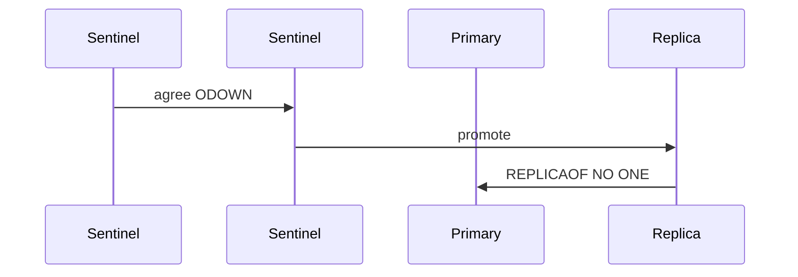

## Executive Summary

**Sentinel** monitors primaries/replicas, performs **automatic failover**, and acts as a **configuration provider** for clients — typically 3+ sentinel processes for quorum.

---

## Core Concepts



| Concept | Detail |
| :--- | :--- |
| **Quorum** | `sentinel monitor mymaster ... 2` — 2 sentinels to agree on failover |
| **SDOWN/ODOWN** | Subjective vs objective down |
| **Failover** | Elect replica → `REPLICAOF NO ONE` → re-point others |
| **Client** | Ask Sentinel for current primary address |

Sentinel runs as separate processes (or K8s sidecars), not inside `redis-server`.

---

## Quick Reference

```bash
redis-cli -p 26379 SENTINEL masters
redis-cli -p 26379 SENTINEL replicas mymaster
redis-cli -p 26379 SENTINEL get-master-addr-by-name mymaster
redis-cli -p 26379 SENTINEL failover mymaster
```

---

## Snippets

```conf
sentinel monitor mymaster 127.0.0.1 6379 2
sentinel down-after-milliseconds mymaster 5000
sentinel failover-timeout mymaster 60000
```

---

## Common Gotchas

| Pitfall | Fix |
| :--- | :--- |
| Even number of sentinels | Use odd count (3, 5) for split-brain |
| Client cache stale primary | Use sentinel-aware driver with refresh |
| Failover during high write load | `min-replicas-to-write` guard |

---

## When is Sentinel the right HA layer versus managed cloud failover you do not operate?

### Short Answer
The production-grade Redis answer is comparing Redis to alternatives on data model, durability, ops model, and failure semantics — not feature checklists for: When is Sentinel the right HA layer versus managed cloud failover you do not operate.

### Detailed Explanation
Redis offers rich structures and optional persistence; Memcached is simpler cache; Kafka/RabbitMQ excel at durable messaging scale for: When is Sentinel the right HA layer versus managed cloud failover you do not operate.

### Internal Working
Using Redis as a message bus works for moderate throughput with Streams; very large retention or routing complexity may favor dedicated brokers for: When is Sentinel the right HA layer versus managed cloud failover you do not operate.

### Production Notes
You justify it by minimizing hot-key blast radius and single-thread CPU contention by documenting ADR assumptions and exit strategy if load doubles for: When is Sentinel the right HA layer versus managed cloud failover you do not operate.

### Common Mistakes
Resume-driven Redis adoption without ops maturity for Sentinel/Cluster causes painful incidents for: When is Sentinel the right HA layer versus managed cloud failover you do not operate.

### Follow-up Questions
What requirement in: When is Sentinel the right HA layer versus managed cloud failover you do not operate is decisive if throughput numbers are similar across options?

---
## What client topology changes when applications must be Sentinel-aware versus Cluster-aware?

### Short Answer
The practical Redis answer is comparing Redis to alternatives on data model, durability, ops model, and failure semantics — not feature checklists for: What client topology changes when applications must be Sentinel-aware versus Cluster-aware.

### Detailed Explanation
Redis offers rich structures and optional persistence; Memcached is simpler cache; Kafka/RabbitMQ excel at durable messaging scale for: What client topology changes when applications must be Sentinel-aware versus Cluster-aware.

### Internal Working
Using Redis as a message bus works for moderate throughput with Streams; very large retention or routing complexity may favor dedicated brokers for: What client topology changes when applications must be Sentinel-aware versus Cluster-aware.

### Production Notes
You justify it by measuring p99 latency, memory headroom, and failover behavior under realistic skew by documenting ADR assumptions and exit strategy if load doubles for: What client topology changes when applications must be Sentinel-aware versus Cluster-aware.

### Common Mistakes
Resume-driven Redis adoption without ops maturity for Sentinel/Cluster causes painful incidents for: What client topology changes when applications must be Sentinel-aware versus Cluster-aware.

### Follow-up Questions
What requirement in: What client topology changes when applications must be Sentinel-aware versus Cluster-aware is decisive if throughput numbers are similar across options?

---
## How would you blueprint replica count and sentinel quorum in an ADR for 99.95% cache availability?

### Short Answer
For this question, the architecturally correct Redis answer is treating replication as async by default and using `WAIT` or app-level checks only when stronger durability is required for: How would you blueprint replica count and sentinel quorum in an ADR for 99.95% cache availability.

### Detailed Explanation
Replicas tail the replication stream; lag appears when network, disk, or apply speed falls behind write rate — partial resync needs adequate `repl-backlog-size` for: How would you blueprint replica count and sentinel quorum in an ADR for 99.95% cache availability.

### Internal Working
Read-your-writes is not automatic on replicas; clients using replica reads must accept staleness or use primary reads after writes for: How would you blueprint replica count and sentinel quorum in an ADR for 99.95% cache availability.

### Production Notes
You justify it by proving behavior with INFO, slowlog, and workload replay before changing topology by correlating `master_repl_offset` with replica offsets and write spikes for: How would you blueprint replica count and sentinel quorum in an ADR for 99.95% cache availability.

### Common Mistakes
Common mistakes include writable replicas, ignoring lag during incidents, and assuming replica reads are fresh for: How would you blueprint replica count and sentinel quorum in an ADR for 99.95% cache availability.

### Follow-up Questions
Which writes in: How would you blueprint replica count and sentinel quorum in an ADR for 99.95% cache availability require synchronous acknowledgment, and how will clients handle failover mid-transaction?

---
## How does connection pooling architecture prevent thundering herd on Redis reconnect after failover?

### Short Answer
The senior-level decision is combining TTL jitter, singleflight locks, and stale-while-revalidate to protect origin during: How does connection pooling architecture prevent thundering herd on Redis reconnect after failover.

### Detailed Explanation
Breakdown hits when a hot key expires; avalanche when many keys expire together; penetration when misses flood DB for absent keys for: How does connection pooling architecture prevent thundering herd on Redis reconnect after failover.

### Internal Working
Mitigations include probabilistic early refresh, Bloom filters or short negative TTL, and request coalescing for: How does connection pooling architecture prevent thundering herd on Redis reconnect after failover.

### Production Notes
You justify it by aligning durability settings with business RPO/RTO and client retry contracts by load-testing synchronized expiry and hot-key miss scenarios for: How does connection pooling architecture prevent thundering herd on Redis reconnect after failover.

### Common Mistakes
Same TTL on all keys and caching null forever are classic self-inflicted outages for: How does connection pooling architecture prevent thundering herd on Redis reconnect after failover.

### Follow-up Questions
Which mitigation layer (jitter, lock, Bloom, local cache) is first-line for: How does connection pooling architecture prevent thundering herd on Redis reconnect after failover in your architecture?

---
## How would you design failover testing for Sentinel without corrupting production data?

### Short Answer
The production-grade Redis answer is deploying an odd number of sentinels with quorum tuned to avoid flapping while enabling automatic failover for: How would you design failover testing for Sentinel without corrupting production data.

### Detailed Explanation
Sentinel marks subjective/objective down states, elects a new primary, and re-points replicas — clients must discover the new primary via Sentinel-aware drivers for: How would you design failover testing for Sentinel without corrupting production data.

### Internal Working
Failover promotes a replica with `REPLICAOF NO ONE` then reconfigures the fleet; brief write unavailability and client reconnect storms are expected for: How would you design failover testing for Sentinel without corrupting production data.

### Production Notes
You justify it by minimizing hot-key blast radius and single-thread CPU contention by running game-day failover tests with connection pool refresh metrics for: How would you design failover testing for Sentinel without corrupting production data.

### Common Mistakes
Split-brain risk rises with even sentinel counts, stale client caches, and missing `min-replicas-to-write` guards for: How would you design failover testing for Sentinel without corrupting production data.

### Follow-up Questions
What quorum and `down-after-milliseconds` values would you defend in an ADR for: How would you design failover testing for Sentinel without corrupting production data?

---
## What split-brain scenarios can occur with misconfigured Sentinel quorum?

### Short Answer
The senior-level decision is deploying an odd number of sentinels with quorum tuned to avoid flapping while enabling automatic failover for: What split-brain scenarios can occur with misconfigured Sentinel quorum.

### Detailed Explanation
Sentinel marks subjective/objective down states, elects a new primary, and re-points replicas — clients must discover the new primary via Sentinel-aware drivers for: What split-brain scenarios can occur with misconfigured Sentinel quorum.

### Internal Working
Failover promotes a replica with `REPLICAOF NO ONE` then reconfigures the fleet; brief write unavailability and client reconnect storms are expected for: What split-brain scenarios can occur with misconfigured Sentinel quorum.

### Production Notes
You justify it by aligning durability settings with business RPO/RTO and client retry contracts by running game-day failover tests with connection pool refresh metrics for: What split-brain scenarios can occur with misconfigured Sentinel quorum.

### Common Mistakes
Split-brain risk rises with even sentinel counts, stale client caches, and missing `min-replicas-to-write` guards for: What split-brain scenarios can occur with misconfigured Sentinel quorum.

### Follow-up Questions
What quorum and `down-after-milliseconds` values would you defend in an ADR for: What split-brain scenarios can occur with misconfigured Sentinel quorum?

---
<!-- interview-answers:end -->

---

## When is Sentinel the right HA layer versus managed cloud failover you do not operate?

### Short Answer
The production-grade Redis answer is comparing Redis to alternatives on data model, durability, ops model, and failure semantics — not feature checklists for: When is Sentinel the right HA layer versus managed cloud failover you do not operate.

### Detailed Explanation
Redis offers rich structures and optional persistence; Memcached is simpler cache; Kafka/RabbitMQ excel at durable messaging scale for: When is Sentinel the right HA layer versus managed cloud failover you do not operate.

### Internal Working
Using Redis as a message bus works for moderate throughput with Streams; very large retention or routing complexity may favor dedicated brokers for: When is Sentinel the right HA layer versus managed cloud failover you do not operate.

### Production Notes
You justify it by minimizing hot-key blast radius and single-thread CPU contention by documenting ADR assumptions and exit strategy if load doubles for: When is Sentinel the right HA layer versus managed cloud failover you do not operate.

### Common Mistakes
Resume-driven Redis adoption without ops maturity for Sentinel/Cluster causes painful incidents for: When is Sentinel the right HA layer versus managed cloud failover you do not operate.

### Follow-up Questions
What requirement in: When is Sentinel the right HA layer versus managed cloud failover you do not operate is decisive if throughput numbers are similar across options?

---
## What client topology changes when applications must be Sentinel-aware versus Cluster-aware?

### Short Answer
The practical Redis answer is comparing Redis to alternatives on data model, durability, ops model, and failure semantics — not feature checklists for: What client topology changes when applications must be Sentinel-aware versus Cluster-aware.

### Detailed Explanation
Redis offers rich structures and optional persistence; Memcached is simpler cache; Kafka/RabbitMQ excel at durable messaging scale for: What client topology changes when applications must be Sentinel-aware versus Cluster-aware.

### Internal Working
Using Redis as a message bus works for moderate throughput with Streams; very large retention or routing complexity may favor dedicated brokers for: What client topology changes when applications must be Sentinel-aware versus Cluster-aware.

### Production Notes
You justify it by measuring p99 latency, memory headroom, and failover behavior under realistic skew by documenting ADR assumptions and exit strategy if load doubles for: What client topology changes when applications must be Sentinel-aware versus Cluster-aware.

### Common Mistakes
Resume-driven Redis adoption without ops maturity for Sentinel/Cluster causes painful incidents for: What client topology changes when applications must be Sentinel-aware versus Cluster-aware.

### Follow-up Questions
What requirement in: What client topology changes when applications must be Sentinel-aware versus Cluster-aware is decisive if throughput numbers are similar across options?

---
## How would you blueprint replica count and sentinel quorum in an ADR for 99.95% cache availability?

### Short Answer
For this question, the architecturally correct Redis answer is treating replication as async by default and using `WAIT` or app-level checks only when stronger durability is required for: How would you blueprint replica count and sentinel quorum in an ADR for 99.95% cache availability.

### Detailed Explanation
Replicas tail the replication stream; lag appears when network, disk, or apply speed falls behind write rate — partial resync needs adequate `repl-backlog-size` for: How would you blueprint replica count and sentinel quorum in an ADR for 99.95% cache availability.

### Internal Working
Read-your-writes is not automatic on replicas; clients using replica reads must accept staleness or use primary reads after writes for: How would you blueprint replica count and sentinel quorum in an ADR for 99.95% cache availability.

### Production Notes
You justify it by proving behavior with INFO, slowlog, and workload replay before changing topology by correlating `master_repl_offset` with replica offsets and write spikes for: How would you blueprint replica count and sentinel quorum in an ADR for 99.95% cache availability.

### Common Mistakes
Common mistakes include writable replicas, ignoring lag during incidents, and assuming replica reads are fresh for: How would you blueprint replica count and sentinel quorum in an ADR for 99.95% cache availability.

### Follow-up Questions
Which writes in: How would you blueprint replica count and sentinel quorum in an ADR for 99.95% cache availability require synchronous acknowledgment, and how will clients handle failover mid-transaction?

---
## How does connection pooling architecture prevent thundering herd on Redis reconnect after failover?

### Short Answer
The senior-level decision is combining TTL jitter, singleflight locks, and stale-while-revalidate to protect origin during: How does connection pooling architecture prevent thundering herd on Redis reconnect after failover.

### Detailed Explanation
Breakdown hits when a hot key expires; avalanche when many keys expire together; penetration when misses flood DB for absent keys for: How does connection pooling architecture prevent thundering herd on Redis reconnect after failover.

### Internal Working
Mitigations include probabilistic early refresh, Bloom filters or short negative TTL, and request coalescing for: How does connection pooling architecture prevent thundering herd on Redis reconnect after failover.

### Production Notes
You justify it by aligning durability settings with business RPO/RTO and client retry contracts by load-testing synchronized expiry and hot-key miss scenarios for: How does connection pooling architecture prevent thundering herd on Redis reconnect after failover.

### Common Mistakes
Same TTL on all keys and caching null forever are classic self-inflicted outages for: How does connection pooling architecture prevent thundering herd on Redis reconnect after failover.

### Follow-up Questions
Which mitigation layer (jitter, lock, Bloom, local cache) is first-line for: How does connection pooling architecture prevent thundering herd on Redis reconnect after failover in your architecture?

---
## How would you design failover testing for Sentinel without corrupting production data?

### Short Answer
The production-grade Redis answer is deploying an odd number of sentinels with quorum tuned to avoid flapping while enabling automatic failover for: How would you design failover testing for Sentinel without corrupting production data.

### Detailed Explanation
Sentinel marks subjective/objective down states, elects a new primary, and re-points replicas — clients must discover the new primary via Sentinel-aware drivers for: How would you design failover testing for Sentinel without corrupting production data.

### Internal Working
Failover promotes a replica with `REPLICAOF NO ONE` then reconfigures the fleet; brief write unavailability and client reconnect storms are expected for: How would you design failover testing for Sentinel without corrupting production data.

### Production Notes
You justify it by minimizing hot-key blast radius and single-thread CPU contention by running game-day failover tests with connection pool refresh metrics for: How would you design failover testing for Sentinel without corrupting production data.

### Common Mistakes
Split-brain risk rises with even sentinel counts, stale client caches, and missing `min-replicas-to-write` guards for: How would you design failover testing for Sentinel without corrupting production data.

### Follow-up Questions
What quorum and `down-after-milliseconds` values would you defend in an ADR for: How would you design failover testing for Sentinel without corrupting production data?

---
## What split-brain scenarios can occur with misconfigured Sentinel quorum?

### Short Answer
The senior-level decision is deploying an odd number of sentinels with quorum tuned to avoid flapping while enabling automatic failover for: What split-brain scenarios can occur with misconfigured Sentinel quorum.

### Detailed Explanation
Sentinel marks subjective/objective down states, elects a new primary, and re-points replicas — clients must discover the new primary via Sentinel-aware drivers for: What split-brain scenarios can occur with misconfigured Sentinel quorum.

### Internal Working
Failover promotes a replica with `REPLICAOF NO ONE` then reconfigures the fleet; brief write unavailability and client reconnect storms are expected for: What split-brain scenarios can occur with misconfigured Sentinel quorum.

### Production Notes
You justify it by aligning durability settings with business RPO/RTO and client retry contracts by running game-day failover tests with connection pool refresh metrics for: What split-brain scenarios can occur with misconfigured Sentinel quorum.

### Common Mistakes
Split-brain risk rises with even sentinel counts, stale client caches, and missing `min-replicas-to-write` guards for: What split-brain scenarios can occur with misconfigured Sentinel quorum.

### Follow-up Questions
What quorum and `down-after-milliseconds` values would you defend in an ADR for: What split-brain scenarios can occur with misconfigured Sentinel quorum?

---
<!-- interview-answers:end -->

---

## When is Sentinel the right HA layer versus managed cloud failover you do not operate?

### Short Answer
The production-grade Redis answer is comparing Redis to alternatives on data model, durability, ops model, and failure semantics — not feature checklists for: When is Sentinel the right HA layer versus managed cloud failover you do not operate.

### Detailed Explanation
Redis offers rich structures and optional persistence; Memcached is simpler cache; Kafka/RabbitMQ excel at durable messaging scale for: When is Sentinel the right HA layer versus managed cloud failover you do not operate.

### Internal Working
Using Redis as a message bus works for moderate throughput with Streams; very large retention or routing complexity may favor dedicated brokers for: When is Sentinel the right HA layer versus managed cloud failover you do not operate.

### Production Notes
You justify it by minimizing hot-key blast radius and single-thread CPU contention by documenting ADR assumptions and exit strategy if load doubles for: When is Sentinel the right HA layer versus managed cloud failover you do not operate.

### Common Mistakes
Resume-driven Redis adoption without ops maturity for Sentinel/Cluster causes painful incidents for: When is Sentinel the right HA layer versus managed cloud failover you do not operate.

### Follow-up Questions
What requirement in: When is Sentinel the right HA layer versus managed cloud failover you do not operate is decisive if throughput numbers are similar across options?

---
## What client topology changes when applications must be Sentinel-aware versus Cluster-aware?

### Short Answer
The practical Redis answer is comparing Redis to alternatives on data model, durability, ops model, and failure semantics — not feature checklists for: What client topology changes when applications must be Sentinel-aware versus Cluster-aware.

### Detailed Explanation
Redis offers rich structures and optional persistence; Memcached is simpler cache; Kafka/RabbitMQ excel at durable messaging scale for: What client topology changes when applications must be Sentinel-aware versus Cluster-aware.

### Internal Working
Using Redis as a message bus works for moderate throughput with Streams; very large retention or routing complexity may favor dedicated brokers for: What client topology changes when applications must be Sentinel-aware versus Cluster-aware.

### Production Notes
You justify it by measuring p99 latency, memory headroom, and failover behavior under realistic skew by documenting ADR assumptions and exit strategy if load doubles for: What client topology changes when applications must be Sentinel-aware versus Cluster-aware.

### Common Mistakes
Resume-driven Redis adoption without ops maturity for Sentinel/Cluster causes painful incidents for: What client topology changes when applications must be Sentinel-aware versus Cluster-aware.

### Follow-up Questions
What requirement in: What client topology changes when applications must be Sentinel-aware versus Cluster-aware is decisive if throughput numbers are similar across options?

---
## How would you blueprint replica count and sentinel quorum in an ADR for 99.95% cache availability?

### Short Answer
For this question, the architecturally correct Redis answer is treating replication as async by default and using `WAIT` or app-level checks only when stronger durability is required for: How would you blueprint replica count and sentinel quorum in an ADR for 99.95% cache availability.

### Detailed Explanation
Replicas tail the replication stream; lag appears when network, disk, or apply speed falls behind write rate — partial resync needs adequate `repl-backlog-size` for: How would you blueprint replica count and sentinel quorum in an ADR for 99.95% cache availability.

### Internal Working
Read-your-writes is not automatic on replicas; clients using replica reads must accept staleness or use primary reads after writes for: How would you blueprint replica count and sentinel quorum in an ADR for 99.95% cache availability.

### Production Notes
You justify it by proving behavior with INFO, slowlog, and workload replay before changing topology by correlating `master_repl_offset` with replica offsets and write spikes for: How would you blueprint replica count and sentinel quorum in an ADR for 99.95% cache availability.

### Common Mistakes
Common mistakes include writable replicas, ignoring lag during incidents, and assuming replica reads are fresh for: How would you blueprint replica count and sentinel quorum in an ADR for 99.95% cache availability.

### Follow-up Questions
Which writes in: How would you blueprint replica count and sentinel quorum in an ADR for 99.95% cache availability require synchronous acknowledgment, and how will clients handle failover mid-transaction?

---
## How does connection pooling architecture prevent thundering herd on Redis reconnect after failover?

### Short Answer
The senior-level decision is combining TTL jitter, singleflight locks, and stale-while-revalidate to protect origin during: How does connection pooling architecture prevent thundering herd on Redis reconnect after failover.

### Detailed Explanation
Breakdown hits when a hot key expires; avalanche when many keys expire together; penetration when misses flood DB for absent keys for: How does connection pooling architecture prevent thundering herd on Redis reconnect after failover.

### Internal Working
Mitigations include probabilistic early refresh, Bloom filters or short negative TTL, and request coalescing for: How does connection pooling architecture prevent thundering herd on Redis reconnect after failover.

### Production Notes
You justify it by aligning durability settings with business RPO/RTO and client retry contracts by load-testing synchronized expiry and hot-key miss scenarios for: How does connection pooling architecture prevent thundering herd on Redis reconnect after failover.

### Common Mistakes
Same TTL on all keys and caching null forever are classic self-inflicted outages for: How does connection pooling architecture prevent thundering herd on Redis reconnect after failover.

### Follow-up Questions
Which mitigation layer (jitter, lock, Bloom, local cache) is first-line for: How does connection pooling architecture prevent thundering herd on Redis reconnect after failover in your architecture?

---
## How would you design failover testing for Sentinel without corrupting production data?

### Short Answer
The production-grade Redis answer is deploying an odd number of sentinels with quorum tuned to avoid flapping while enabling automatic failover for: How would you design failover testing for Sentinel without corrupting production data.

### Detailed Explanation
Sentinel marks subjective/objective down states, elects a new primary, and re-points replicas — clients must discover the new primary via Sentinel-aware drivers for: How would you design failover testing for Sentinel without corrupting production data.

### Internal Working
Failover promotes a replica with `REPLICAOF NO ONE` then reconfigures the fleet; brief write unavailability and client reconnect storms are expected for: How would you design failover testing for Sentinel without corrupting production data.

### Production Notes
You justify it by minimizing hot-key blast radius and single-thread CPU contention by running game-day failover tests with connection pool refresh metrics for: How would you design failover testing for Sentinel without corrupting production data.

### Common Mistakes
Split-brain risk rises with even sentinel counts, stale client caches, and missing `min-replicas-to-write` guards for: How would you design failover testing for Sentinel without corrupting production data.

### Follow-up Questions
What quorum and `down-after-milliseconds` values would you defend in an ADR for: How would you design failover testing for Sentinel without corrupting production data?

---
## What split-brain scenarios can occur with misconfigured Sentinel quorum?

### Short Answer
The senior-level decision is deploying an odd number of sentinels with quorum tuned to avoid flapping while enabling automatic failover for: What split-brain scenarios can occur with misconfigured Sentinel quorum.

### Detailed Explanation
Sentinel marks subjective/objective down states, elects a new primary, and re-points replicas — clients must discover the new primary via Sentinel-aware drivers for: What split-brain scenarios can occur with misconfigured Sentinel quorum.

### Internal Working
Failover promotes a replica with `REPLICAOF NO ONE` then reconfigures the fleet; brief write unavailability and client reconnect storms are expected for: What split-brain scenarios can occur with misconfigured Sentinel quorum.

### Production Notes
You justify it by aligning durability settings with business RPO/RTO and client retry contracts by running game-day failover tests with connection pool refresh metrics for: What split-brain scenarios can occur with misconfigured Sentinel quorum.

### Common Mistakes
Split-brain risk rises with even sentinel counts, stale client caches, and missing `min-replicas-to-write` guards for: What split-brain scenarios can occur with misconfigured Sentinel quorum.

### Follow-up Questions
What quorum and `down-after-milliseconds` values would you defend in an ADR for: What split-brain scenarios can occur with misconfigured Sentinel quorum?

---
<!-- interview-answers:end -->

---

## When is Sentinel the right HA layer versus managed cloud failover you do not operate?

### Short Answer
The production-grade Redis answer is comparing Redis to alternatives on data model, durability, ops model, and failure semantics — not feature checklists for: When is Sentinel the right HA layer versus managed cloud failover you do not operate.

### Detailed Explanation
Redis offers rich structures and optional persistence; Memcached is simpler cache; Kafka/RabbitMQ excel at durable messaging scale for: When is Sentinel the right HA layer versus managed cloud failover you do not operate.

### Internal Working
Using Redis as a message bus works for moderate throughput with Streams; very large retention or routing complexity may favor dedicated brokers for: When is Sentinel the right HA layer versus managed cloud failover you do not operate.

### Production Notes
You justify it by minimizing hot-key blast radius and single-thread CPU contention by documenting ADR assumptions and exit strategy if load doubles for: When is Sentinel the right HA layer versus managed cloud failover you do not operate.

### Common Mistakes
Resume-driven Redis adoption without ops maturity for Sentinel/Cluster causes painful incidents for: When is Sentinel the right HA layer versus managed cloud failover you do not operate.

### Follow-up Questions
What requirement in: When is Sentinel the right HA layer versus managed cloud failover you do not operate is decisive if throughput numbers are similar across options?

---
## What client topology changes when applications must be Sentinel-aware versus Cluster-aware?

### Short Answer
The practical Redis answer is comparing Redis to alternatives on data model, durability, ops model, and failure semantics — not feature checklists for: What client topology changes when applications must be Sentinel-aware versus Cluster-aware.

### Detailed Explanation
Redis offers rich structures and optional persistence; Memcached is simpler cache; Kafka/RabbitMQ excel at durable messaging scale for: What client topology changes when applications must be Sentinel-aware versus Cluster-aware.

### Internal Working
Using Redis as a message bus works for moderate throughput with Streams; very large retention or routing complexity may favor dedicated brokers for: What client topology changes when applications must be Sentinel-aware versus Cluster-aware.

### Production Notes
You justify it by measuring p99 latency, memory headroom, and failover behavior under realistic skew by documenting ADR assumptions and exit strategy if load doubles for: What client topology changes when applications must be Sentinel-aware versus Cluster-aware.

### Common Mistakes
Resume-driven Redis adoption without ops maturity for Sentinel/Cluster causes painful incidents for: What client topology changes when applications must be Sentinel-aware versus Cluster-aware.

### Follow-up Questions
What requirement in: What client topology changes when applications must be Sentinel-aware versus Cluster-aware is decisive if throughput numbers are similar across options?

---
## How would you blueprint replica count and sentinel quorum in an ADR for 99.95% cache availability?

### Short Answer
For this question, the architecturally correct Redis answer is treating replication as async by default and using `WAIT` or app-level checks only when stronger durability is required for: How would you blueprint replica count and sentinel quorum in an ADR for 99.95% cache availability.

### Detailed Explanation
Replicas tail the replication stream; lag appears when network, disk, or apply speed falls behind write rate — partial resync needs adequate `repl-backlog-size` for: How would you blueprint replica count and sentinel quorum in an ADR for 99.95% cache availability.

### Internal Working
Read-your-writes is not automatic on replicas; clients using replica reads must accept staleness or use primary reads after writes for: How would you blueprint replica count and sentinel quorum in an ADR for 99.95% cache availability.

### Production Notes
You justify it by proving behavior with INFO, slowlog, and workload replay before changing topology by correlating `master_repl_offset` with replica offsets and write spikes for: How would you blueprint replica count and sentinel quorum in an ADR for 99.95% cache availability.

### Common Mistakes
Common mistakes include writable replicas, ignoring lag during incidents, and assuming replica reads are fresh for: How would you blueprint replica count and sentinel quorum in an ADR for 99.95% cache availability.

### Follow-up Questions
Which writes in: How would you blueprint replica count and sentinel quorum in an ADR for 99.95% cache availability require synchronous acknowledgment, and how will clients handle failover mid-transaction?

---
## How does connection pooling architecture prevent thundering herd on Redis reconnect after failover?

### Short Answer
The senior-level decision is combining TTL jitter, singleflight locks, and stale-while-revalidate to protect origin during: How does connection pooling architecture prevent thundering herd on Redis reconnect after failover.

### Detailed Explanation
Breakdown hits when a hot key expires; avalanche when many keys expire together; penetration when misses flood DB for absent keys for: How does connection pooling architecture prevent thundering herd on Redis reconnect after failover.

### Internal Working
Mitigations include probabilistic early refresh, Bloom filters or short negative TTL, and request coalescing for: How does connection pooling architecture prevent thundering herd on Redis reconnect after failover.

### Production Notes
You justify it by aligning durability settings with business RPO/RTO and client retry contracts by load-testing synchronized expiry and hot-key miss scenarios for: How does connection pooling architecture prevent thundering herd on Redis reconnect after failover.

### Common Mistakes
Same TTL on all keys and caching null forever are classic self-inflicted outages for: How does connection pooling architecture prevent thundering herd on Redis reconnect after failover.

### Follow-up Questions
Which mitigation layer (jitter, lock, Bloom, local cache) is first-line for: How does connection pooling architecture prevent thundering herd on Redis reconnect after failover in your architecture?

---
## How would you design failover testing for Sentinel without corrupting production data?

### Short Answer
The production-grade Redis answer is deploying an odd number of sentinels with quorum tuned to avoid flapping while enabling automatic failover for: How would you design failover testing for Sentinel without corrupting production data.

### Detailed Explanation
Sentinel marks subjective/objective down states, elects a new primary, and re-points replicas — clients must discover the new primary via Sentinel-aware drivers for: How would you design failover testing for Sentinel without corrupting production data.

### Internal Working
Failover promotes a replica with `REPLICAOF NO ONE` then reconfigures the fleet; brief write unavailability and client reconnect storms are expected for: How would you design failover testing for Sentinel without corrupting production data.

### Production Notes
You justify it by minimizing hot-key blast radius and single-thread CPU contention by running game-day failover tests with connection pool refresh metrics for: How would you design failover testing for Sentinel without corrupting production data.

### Common Mistakes
Split-brain risk rises with even sentinel counts, stale client caches, and missing `min-replicas-to-write` guards for: How would you design failover testing for Sentinel without corrupting production data.

### Follow-up Questions
What quorum and `down-after-milliseconds` values would you defend in an ADR for: How would you design failover testing for Sentinel without corrupting production data?

---
## What split-brain scenarios can occur with misconfigured Sentinel quorum?

### Short Answer
The senior-level decision is deploying an odd number of sentinels with quorum tuned to avoid flapping while enabling automatic failover for: What split-brain scenarios can occur with misconfigured Sentinel quorum.

### Detailed Explanation
Sentinel marks subjective/objective down states, elects a new primary, and re-points replicas — clients must discover the new primary via Sentinel-aware drivers for: What split-brain scenarios can occur with misconfigured Sentinel quorum.

### Internal Working
Failover promotes a replica with `REPLICAOF NO ONE` then reconfigures the fleet; brief write unavailability and client reconnect storms are expected for: What split-brain scenarios can occur with misconfigured Sentinel quorum.

### Production Notes
You justify it by aligning durability settings with business RPO/RTO and client retry contracts by running game-day failover tests with connection pool refresh metrics for: What split-brain scenarios can occur with misconfigured Sentinel quorum.

### Common Mistakes
Split-brain risk rises with even sentinel counts, stale client caches, and missing `min-replicas-to-write` guards for: What split-brain scenarios can occur with misconfigured Sentinel quorum.

### Follow-up Questions
What quorum and `down-after-milliseconds` values would you defend in an ADR for: What split-brain scenarios can occur with misconfigured Sentinel quorum?

---
<!-- interview-answers:end -->

---

## See Also

- [Previous: Replication](/redis-cheatsheet/03-redis-internals/replication/)
- [Next: Cluster](/redis-cheatsheet/03-redis-internals/cluster/)
- [Redis Handbook Index](/redis-cheatsheet/)
- [Top 150 Interview Questions](/redis-cheatsheet/08-interview-guide/top-150-interview-questions/)
