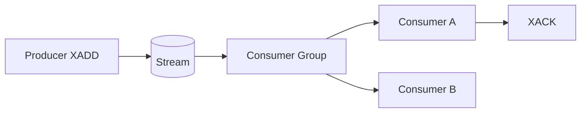

## Executive Summary

**Streams** are append-only logs with **auto IDs** (`milliseconds-sequence`). **Consumer groups** give at-least-once delivery, pending entries, and acknowledgment — Redis's replacement for list-based queues.

---

## Core Concepts



| Command | Purpose |
| :--- | :--- |
| `XADD` | Append entry |
| `XREAD` | Read from ID |
| `XGROUP CREATE` | Consumer group |
| `XREADGROUP` | Group read |
| `XACK` | Ack processed |
| `XPENDING` | Unacked messages |
| `XCLAIM` | Reclaim stale pending |

---

## Quick Reference

```bash
XADD orders * userId 42 amount 99.99
XREAD COUNT 10 STREAMS orders 0
XGROUP CREATE orders processors $ MKSTREAM
XREADGROUP GROUP processors c1 COUNT 1 STREAMS orders >
XACK orders processors 1690000000000-0
XPENDING orders processors
XTRIM orders MAXLEN ~ 10000
```

---

## Snippets

### Producer / consumer sketch

```bash
# producer
XADD events * type ORDER_PLACED id 42
# consumer
XREADGROUP GROUP workers w1 BLOCK 5000 COUNT 10 STREAMS events >
XACK events workers <message-id>
```

---

## Common Gotchas

| Pitfall | Fix |
| :--- | :--- |
| No `XACK` after read | Message stays pending — monitor `XPENDING` |
| Consumer crash | Use `XAUTOCLAIM` / `XCLAIM` with idle time |
| Unbounded stream | `XTRIM` or `MAXLEN ~` on `XADD` |

---

## What architectural constraints does Redis impose on exactly-once processing semantics?

### Short Answer
The practical Redis answer is matching Redis data type to access pattern — not defaulting everything to JSON strings for: What architectural constraints does Redis impose on exactly-once processing semantics.

### Detailed Explanation
Pick strings for counters/cache blobs, hashes for field updates, sets/ZSETs for uniqueness/ranking, Streams for durable queues for: What architectural constraints does Redis impose on exactly-once processing semantics.

### Internal Working
Encoding upgrades and command complexity (O(N) vs O(1)) follow from type and size choices for: What architectural constraints does Redis impose on exactly-once processing semantics.

### Production Notes
You justify it by measuring p99 latency, memory headroom, and failover behavior under realistic skew by validating command complexity and memory per key for: What architectural constraints does Redis impose on exactly-once processing semantics.

### Common Mistakes
Using `HGETALL` or `SMEMBERS` on large collections blocks the event loop for: What architectural constraints does Redis impose on exactly-once processing semantics.

### Follow-up Questions
Which type would you choose for: What architectural constraints does Redis impose on exactly-once processing semantics, and what command path proves it under peak cardinality?

---
## What explains consumer group pending entries growing without XPENDING visibility in dashboards?

### Short Answer
The senior-level decision is using consumer groups for at-least-once work queues with explicit XACK and pending reclaim for: What explains consumer group pending entries growing without XPENDING visibility in dashboards.

### Detailed Explanation
Streams append entries with auto IDs; consumer groups track per-consumer progress and pending entries for: What explains consumer group pending entries growing without XPENDING visibility in dashboards.

### Internal Working
Without XACK, messages stay pending; crashed consumers require XCLAIM/XAUTOCLAIM after idle threshold for: What explains consumer group pending entries growing without XPENDING visibility in dashboards.

### Production Notes
You justify it by aligning durability settings with business RPO/RTO and client retry contracts by monitoring XPENDING depth and trimming with MAXLEN ~ for: What explains consumer group pending entries growing without XPENDING visibility in dashboards.

### Common Mistakes
Treating Streams as exactly-once without idempotent handlers is a common correctness gap for: What explains consumer group pending entries growing without XPENDING visibility in dashboards.

### Follow-up Questions
What idempotency key and poison-message policy would you pair with: What explains consumer group pending entries growing without XPENDING visibility in dashboards?

---
## How do Streams MAXLEN approximate trimming trade memory for ingestion throughput?

### Short Answer
The senior-level decision is using consumer groups for at-least-once work queues with explicit XACK and pending reclaim for: How do Streams MAXLEN approximate trimming trade memory for ingestion throughput.

### Detailed Explanation
Streams append entries with auto IDs; consumer groups track per-consumer progress and pending entries for: How do Streams MAXLEN approximate trimming trade memory for ingestion throughput.

### Internal Working
Without XACK, messages stay pending; crashed consumers require XCLAIM/XAUTOCLAIM after idle threshold for: How do Streams MAXLEN approximate trimming trade memory for ingestion throughput.

### Production Notes
You justify it by aligning durability settings with business RPO/RTO and client retry contracts by monitoring XPENDING depth and trimming with MAXLEN ~ for: How do Streams MAXLEN approximate trimming trade memory for ingestion throughput.

### Common Mistakes
Treating Streams as exactly-once without idempotent handlers is a common correctness gap for: How do Streams MAXLEN approximate trimming trade memory for ingestion throughput.

### Follow-up Questions
What idempotency key and poison-message policy would you pair with: How do Streams MAXLEN approximate trimming trade memory for ingestion throughput?

---
## How do consumer groups provide at-least-once delivery, and what idempotency must apps implement?

### Short Answer
The production-grade Redis answer is using consumer groups for at-least-once work queues with explicit XACK and pending reclaim for: How do consumer groups provide at-least-once delivery, and what idempotency must apps implement.

### Detailed Explanation
Streams append entries with auto IDs; consumer groups track per-consumer progress and pending entries for: How do consumer groups provide at-least-once delivery, and what idempotency must apps implement.

### Internal Working
Without XACK, messages stay pending; crashed consumers require XCLAIM/XAUTOCLAIM after idle threshold for: How do consumer groups provide at-least-once delivery, and what idempotency must apps implement.

### Production Notes
You justify it by minimizing hot-key blast radius and single-thread CPU contention by monitoring XPENDING depth and trimming with MAXLEN ~ for: How do consumer groups provide at-least-once delivery, and what idempotency must apps implement.

### Common Mistakes
Treating Streams as exactly-once without idempotent handlers is a common correctness gap for: How do consumer groups provide at-least-once delivery, and what idempotency must apps implement.

### Follow-up Questions
What idempotency key and poison-message policy would you pair with: How do consumer groups provide at-least-once delivery, and what idempotency must apps implement?

---
## How does XREADGROUP BLOCK behave differently from BLPOP for worker pools?

### Short Answer
The senior-level decision is using consumer groups for at-least-once work queues with explicit XACK and pending reclaim for: How does XREADGROUP BLOCK behave differently from BLPOP for worker pools.

### Detailed Explanation
Streams append entries with auto IDs; consumer groups track per-consumer progress and pending entries for: How does XREADGROUP BLOCK behave differently from BLPOP for worker pools.

### Internal Working
Without XACK, messages stay pending; crashed consumers require XCLAIM/XAUTOCLAIM after idle threshold for: How does XREADGROUP BLOCK behave differently from BLPOP for worker pools.

### Production Notes
You justify it by aligning durability settings with business RPO/RTO and client retry contracts by monitoring XPENDING depth and trimming with MAXLEN ~ for: How does XREADGROUP BLOCK behave differently from BLPOP for worker pools.

### Common Mistakes
Treating Streams as exactly-once without idempotent handlers is a common correctness gap for: How does XREADGROUP BLOCK behave differently from BLPOP for worker pools.

### Follow-up Questions
What idempotency key and poison-message policy would you pair with: How does XREADGROUP BLOCK behave differently from BLPOP for worker pools?

---
## What is the recovery procedure for poison messages stuck in XPENDING?

### Short Answer
The practical Redis answer is using consumer groups for at-least-once work queues with explicit XACK and pending reclaim for: What is the recovery procedure for poison messages stuck in XPENDING.

### Detailed Explanation
Streams append entries with auto IDs; consumer groups track per-consumer progress and pending entries for: What is the recovery procedure for poison messages stuck in XPENDING.

### Internal Working
Without XACK, messages stay pending; crashed consumers require XCLAIM/XAUTOCLAIM after idle threshold for: What is the recovery procedure for poison messages stuck in XPENDING.

### Production Notes
You justify it by measuring p99 latency, memory headroom, and failover behavior under realistic skew by monitoring XPENDING depth and trimming with MAXLEN ~ for: What is the recovery procedure for poison messages stuck in XPENDING.

### Common Mistakes
Treating Streams as exactly-once without idempotent handlers is a common correctness gap for: What is the recovery procedure for poison messages stuck in XPENDING.

### Follow-up Questions
What idempotency key and poison-message policy would you pair with: What is the recovery procedure for poison messages stuck in XPENDING?

---
## How do you prevent double consumption when a consumer crashes before XACK?

### Short Answer
For this question, the architecturally correct Redis answer is using consumer groups for at-least-once work queues with explicit XACK and pending reclaim for: How do you prevent double consumption when a consumer crashes before XACK.

### Detailed Explanation
Streams append entries with auto IDs; consumer groups track per-consumer progress and pending entries for: How do you prevent double consumption when a consumer crashes before XACK.

### Internal Working
Without XACK, messages stay pending; crashed consumers require XCLAIM/XAUTOCLAIM after idle threshold for: How do you prevent double consumption when a consumer crashes before XACK.

### Production Notes
You justify it by proving behavior with INFO, slowlog, and workload replay before changing topology by monitoring XPENDING depth and trimming with MAXLEN ~ for: How do you prevent double consumption when a consumer crashes before XACK.

### Common Mistakes
Treating Streams as exactly-once without idempotent handlers is a common correctness gap for: How do you prevent double consumption when a consumer crashes before XACK.

### Follow-up Questions
What idempotency key and poison-message policy would you pair with: How do you prevent double consumption when a consumer crashes before XACK?

---
<!-- interview-answers:end -->

---

## What architectural constraints does Redis impose on exactly-once processing semantics?

### Short Answer
The practical Redis answer is matching Redis data type to access pattern — not defaulting everything to JSON strings for: What architectural constraints does Redis impose on exactly-once processing semantics.

### Detailed Explanation
Pick strings for counters/cache blobs, hashes for field updates, sets/ZSETs for uniqueness/ranking, Streams for durable queues for: What architectural constraints does Redis impose on exactly-once processing semantics.

### Internal Working
Encoding upgrades and command complexity (O(N) vs O(1)) follow from type and size choices for: What architectural constraints does Redis impose on exactly-once processing semantics.

### Production Notes
You justify it by measuring p99 latency, memory headroom, and failover behavior under realistic skew by validating command complexity and memory per key for: What architectural constraints does Redis impose on exactly-once processing semantics.

### Common Mistakes
Using `HGETALL` or `SMEMBERS` on large collections blocks the event loop for: What architectural constraints does Redis impose on exactly-once processing semantics.

### Follow-up Questions
Which type would you choose for: What architectural constraints does Redis impose on exactly-once processing semantics, and what command path proves it under peak cardinality?

---
## What explains consumer group pending entries growing without XPENDING visibility in dashboards?

### Short Answer
The senior-level decision is using consumer groups for at-least-once work queues with explicit XACK and pending reclaim for: What explains consumer group pending entries growing without XPENDING visibility in dashboards.

### Detailed Explanation
Streams append entries with auto IDs; consumer groups track per-consumer progress and pending entries for: What explains consumer group pending entries growing without XPENDING visibility in dashboards.

### Internal Working
Without XACK, messages stay pending; crashed consumers require XCLAIM/XAUTOCLAIM after idle threshold for: What explains consumer group pending entries growing without XPENDING visibility in dashboards.

### Production Notes
You justify it by aligning durability settings with business RPO/RTO and client retry contracts by monitoring XPENDING depth and trimming with MAXLEN ~ for: What explains consumer group pending entries growing without XPENDING visibility in dashboards.

### Common Mistakes
Treating Streams as exactly-once without idempotent handlers is a common correctness gap for: What explains consumer group pending entries growing without XPENDING visibility in dashboards.

### Follow-up Questions
What idempotency key and poison-message policy would you pair with: What explains consumer group pending entries growing without XPENDING visibility in dashboards?

---
## How do Streams MAXLEN approximate trimming trade memory for ingestion throughput?

### Short Answer
The senior-level decision is using consumer groups for at-least-once work queues with explicit XACK and pending reclaim for: How do Streams MAXLEN approximate trimming trade memory for ingestion throughput.

### Detailed Explanation
Streams append entries with auto IDs; consumer groups track per-consumer progress and pending entries for: How do Streams MAXLEN approximate trimming trade memory for ingestion throughput.

### Internal Working
Without XACK, messages stay pending; crashed consumers require XCLAIM/XAUTOCLAIM after idle threshold for: How do Streams MAXLEN approximate trimming trade memory for ingestion throughput.

### Production Notes
You justify it by aligning durability settings with business RPO/RTO and client retry contracts by monitoring XPENDING depth and trimming with MAXLEN ~ for: How do Streams MAXLEN approximate trimming trade memory for ingestion throughput.

### Common Mistakes
Treating Streams as exactly-once without idempotent handlers is a common correctness gap for: How do Streams MAXLEN approximate trimming trade memory for ingestion throughput.

### Follow-up Questions
What idempotency key and poison-message policy would you pair with: How do Streams MAXLEN approximate trimming trade memory for ingestion throughput?

---
## How do consumer groups provide at-least-once delivery, and what idempotency must apps implement?

### Short Answer
The production-grade Redis answer is using consumer groups for at-least-once work queues with explicit XACK and pending reclaim for: How do consumer groups provide at-least-once delivery, and what idempotency must apps implement.

### Detailed Explanation
Streams append entries with auto IDs; consumer groups track per-consumer progress and pending entries for: How do consumer groups provide at-least-once delivery, and what idempotency must apps implement.

### Internal Working
Without XACK, messages stay pending; crashed consumers require XCLAIM/XAUTOCLAIM after idle threshold for: How do consumer groups provide at-least-once delivery, and what idempotency must apps implement.

### Production Notes
You justify it by minimizing hot-key blast radius and single-thread CPU contention by monitoring XPENDING depth and trimming with MAXLEN ~ for: How do consumer groups provide at-least-once delivery, and what idempotency must apps implement.

### Common Mistakes
Treating Streams as exactly-once without idempotent handlers is a common correctness gap for: How do consumer groups provide at-least-once delivery, and what idempotency must apps implement.

### Follow-up Questions
What idempotency key and poison-message policy would you pair with: How do consumer groups provide at-least-once delivery, and what idempotency must apps implement?

---
## How does XREADGROUP BLOCK behave differently from BLPOP for worker pools?

### Short Answer
The senior-level decision is using consumer groups for at-least-once work queues with explicit XACK and pending reclaim for: How does XREADGROUP BLOCK behave differently from BLPOP for worker pools.

### Detailed Explanation
Streams append entries with auto IDs; consumer groups track per-consumer progress and pending entries for: How does XREADGROUP BLOCK behave differently from BLPOP for worker pools.

### Internal Working
Without XACK, messages stay pending; crashed consumers require XCLAIM/XAUTOCLAIM after idle threshold for: How does XREADGROUP BLOCK behave differently from BLPOP for worker pools.

### Production Notes
You justify it by aligning durability settings with business RPO/RTO and client retry contracts by monitoring XPENDING depth and trimming with MAXLEN ~ for: How does XREADGROUP BLOCK behave differently from BLPOP for worker pools.

### Common Mistakes
Treating Streams as exactly-once without idempotent handlers is a common correctness gap for: How does XREADGROUP BLOCK behave differently from BLPOP for worker pools.

### Follow-up Questions
What idempotency key and poison-message policy would you pair with: How does XREADGROUP BLOCK behave differently from BLPOP for worker pools?

---
## What is the recovery procedure for poison messages stuck in XPENDING?

### Short Answer
The practical Redis answer is using consumer groups for at-least-once work queues with explicit XACK and pending reclaim for: What is the recovery procedure for poison messages stuck in XPENDING.

### Detailed Explanation
Streams append entries with auto IDs; consumer groups track per-consumer progress and pending entries for: What is the recovery procedure for poison messages stuck in XPENDING.

### Internal Working
Without XACK, messages stay pending; crashed consumers require XCLAIM/XAUTOCLAIM after idle threshold for: What is the recovery procedure for poison messages stuck in XPENDING.

### Production Notes
You justify it by measuring p99 latency, memory headroom, and failover behavior under realistic skew by monitoring XPENDING depth and trimming with MAXLEN ~ for: What is the recovery procedure for poison messages stuck in XPENDING.

### Common Mistakes
Treating Streams as exactly-once without idempotent handlers is a common correctness gap for: What is the recovery procedure for poison messages stuck in XPENDING.

### Follow-up Questions
What idempotency key and poison-message policy would you pair with: What is the recovery procedure for poison messages stuck in XPENDING?

---
## How do you prevent double consumption when a consumer crashes before XACK?

### Short Answer
For this question, the architecturally correct Redis answer is using consumer groups for at-least-once work queues with explicit XACK and pending reclaim for: How do you prevent double consumption when a consumer crashes before XACK.

### Detailed Explanation
Streams append entries with auto IDs; consumer groups track per-consumer progress and pending entries for: How do you prevent double consumption when a consumer crashes before XACK.

### Internal Working
Without XACK, messages stay pending; crashed consumers require XCLAIM/XAUTOCLAIM after idle threshold for: How do you prevent double consumption when a consumer crashes before XACK.

### Production Notes
You justify it by proving behavior with INFO, slowlog, and workload replay before changing topology by monitoring XPENDING depth and trimming with MAXLEN ~ for: How do you prevent double consumption when a consumer crashes before XACK.

### Common Mistakes
Treating Streams as exactly-once without idempotent handlers is a common correctness gap for: How do you prevent double consumption when a consumer crashes before XACK.

### Follow-up Questions
What idempotency key and poison-message policy would you pair with: How do you prevent double consumption when a consumer crashes before XACK?

---
<!-- interview-answers:end -->

---

## What architectural constraints does Redis impose on exactly-once processing semantics?

### Short Answer
The practical Redis answer is matching Redis data type to access pattern — not defaulting everything to JSON strings for: What architectural constraints does Redis impose on exactly-once processing semantics.

### Detailed Explanation
Pick strings for counters/cache blobs, hashes for field updates, sets/ZSETs for uniqueness/ranking, Streams for durable queues for: What architectural constraints does Redis impose on exactly-once processing semantics.

### Internal Working
Encoding upgrades and command complexity (O(N) vs O(1)) follow from type and size choices for: What architectural constraints does Redis impose on exactly-once processing semantics.

### Production Notes
You justify it by measuring p99 latency, memory headroom, and failover behavior under realistic skew by validating command complexity and memory per key for: What architectural constraints does Redis impose on exactly-once processing semantics.

### Common Mistakes
Using `HGETALL` or `SMEMBERS` on large collections blocks the event loop for: What architectural constraints does Redis impose on exactly-once processing semantics.

### Follow-up Questions
Which type would you choose for: What architectural constraints does Redis impose on exactly-once processing semantics, and what command path proves it under peak cardinality?

---
## What explains consumer group pending entries growing without XPENDING visibility in dashboards?

### Short Answer
The senior-level decision is using consumer groups for at-least-once work queues with explicit XACK and pending reclaim for: What explains consumer group pending entries growing without XPENDING visibility in dashboards.

### Detailed Explanation
Streams append entries with auto IDs; consumer groups track per-consumer progress and pending entries for: What explains consumer group pending entries growing without XPENDING visibility in dashboards.

### Internal Working
Without XACK, messages stay pending; crashed consumers require XCLAIM/XAUTOCLAIM after idle threshold for: What explains consumer group pending entries growing without XPENDING visibility in dashboards.

### Production Notes
You justify it by aligning durability settings with business RPO/RTO and client retry contracts by monitoring XPENDING depth and trimming with MAXLEN ~ for: What explains consumer group pending entries growing without XPENDING visibility in dashboards.

### Common Mistakes
Treating Streams as exactly-once without idempotent handlers is a common correctness gap for: What explains consumer group pending entries growing without XPENDING visibility in dashboards.

### Follow-up Questions
What idempotency key and poison-message policy would you pair with: What explains consumer group pending entries growing without XPENDING visibility in dashboards?

---
## How do Streams MAXLEN approximate trimming trade memory for ingestion throughput?

### Short Answer
The senior-level decision is using consumer groups for at-least-once work queues with explicit XACK and pending reclaim for: How do Streams MAXLEN approximate trimming trade memory for ingestion throughput.

### Detailed Explanation
Streams append entries with auto IDs; consumer groups track per-consumer progress and pending entries for: How do Streams MAXLEN approximate trimming trade memory for ingestion throughput.

### Internal Working
Without XACK, messages stay pending; crashed consumers require XCLAIM/XAUTOCLAIM after idle threshold for: How do Streams MAXLEN approximate trimming trade memory for ingestion throughput.

### Production Notes
You justify it by aligning durability settings with business RPO/RTO and client retry contracts by monitoring XPENDING depth and trimming with MAXLEN ~ for: How do Streams MAXLEN approximate trimming trade memory for ingestion throughput.

### Common Mistakes
Treating Streams as exactly-once without idempotent handlers is a common correctness gap for: How do Streams MAXLEN approximate trimming trade memory for ingestion throughput.

### Follow-up Questions
What idempotency key and poison-message policy would you pair with: How do Streams MAXLEN approximate trimming trade memory for ingestion throughput?

---
## How do consumer groups provide at-least-once delivery, and what idempotency must apps implement?

### Short Answer
The production-grade Redis answer is using consumer groups for at-least-once work queues with explicit XACK and pending reclaim for: How do consumer groups provide at-least-once delivery, and what idempotency must apps implement.

### Detailed Explanation
Streams append entries with auto IDs; consumer groups track per-consumer progress and pending entries for: How do consumer groups provide at-least-once delivery, and what idempotency must apps implement.

### Internal Working
Without XACK, messages stay pending; crashed consumers require XCLAIM/XAUTOCLAIM after idle threshold for: How do consumer groups provide at-least-once delivery, and what idempotency must apps implement.

### Production Notes
You justify it by minimizing hot-key blast radius and single-thread CPU contention by monitoring XPENDING depth and trimming with MAXLEN ~ for: How do consumer groups provide at-least-once delivery, and what idempotency must apps implement.

### Common Mistakes
Treating Streams as exactly-once without idempotent handlers is a common correctness gap for: How do consumer groups provide at-least-once delivery, and what idempotency must apps implement.

### Follow-up Questions
What idempotency key and poison-message policy would you pair with: How do consumer groups provide at-least-once delivery, and what idempotency must apps implement?

---
## How does XREADGROUP BLOCK behave differently from BLPOP for worker pools?

### Short Answer
The senior-level decision is using consumer groups for at-least-once work queues with explicit XACK and pending reclaim for: How does XREADGROUP BLOCK behave differently from BLPOP for worker pools.

### Detailed Explanation
Streams append entries with auto IDs; consumer groups track per-consumer progress and pending entries for: How does XREADGROUP BLOCK behave differently from BLPOP for worker pools.

### Internal Working
Without XACK, messages stay pending; crashed consumers require XCLAIM/XAUTOCLAIM after idle threshold for: How does XREADGROUP BLOCK behave differently from BLPOP for worker pools.

### Production Notes
You justify it by aligning durability settings with business RPO/RTO and client retry contracts by monitoring XPENDING depth and trimming with MAXLEN ~ for: How does XREADGROUP BLOCK behave differently from BLPOP for worker pools.

### Common Mistakes
Treating Streams as exactly-once without idempotent handlers is a common correctness gap for: How does XREADGROUP BLOCK behave differently from BLPOP for worker pools.

### Follow-up Questions
What idempotency key and poison-message policy would you pair with: How does XREADGROUP BLOCK behave differently from BLPOP for worker pools?

---
## What is the recovery procedure for poison messages stuck in XPENDING?

### Short Answer
The practical Redis answer is using consumer groups for at-least-once work queues with explicit XACK and pending reclaim for: What is the recovery procedure for poison messages stuck in XPENDING.

### Detailed Explanation
Streams append entries with auto IDs; consumer groups track per-consumer progress and pending entries for: What is the recovery procedure for poison messages stuck in XPENDING.

### Internal Working
Without XACK, messages stay pending; crashed consumers require XCLAIM/XAUTOCLAIM after idle threshold for: What is the recovery procedure for poison messages stuck in XPENDING.

### Production Notes
You justify it by measuring p99 latency, memory headroom, and failover behavior under realistic skew by monitoring XPENDING depth and trimming with MAXLEN ~ for: What is the recovery procedure for poison messages stuck in XPENDING.

### Common Mistakes
Treating Streams as exactly-once without idempotent handlers is a common correctness gap for: What is the recovery procedure for poison messages stuck in XPENDING.

### Follow-up Questions
What idempotency key and poison-message policy would you pair with: What is the recovery procedure for poison messages stuck in XPENDING?

---
## How do you prevent double consumption when a consumer crashes before XACK?

### Short Answer
For this question, the architecturally correct Redis answer is using consumer groups for at-least-once work queues with explicit XACK and pending reclaim for: How do you prevent double consumption when a consumer crashes before XACK.

### Detailed Explanation
Streams append entries with auto IDs; consumer groups track per-consumer progress and pending entries for: How do you prevent double consumption when a consumer crashes before XACK.

### Internal Working
Without XACK, messages stay pending; crashed consumers require XCLAIM/XAUTOCLAIM after idle threshold for: How do you prevent double consumption when a consumer crashes before XACK.

### Production Notes
You justify it by proving behavior with INFO, slowlog, and workload replay before changing topology by monitoring XPENDING depth and trimming with MAXLEN ~ for: How do you prevent double consumption when a consumer crashes before XACK.

### Common Mistakes
Treating Streams as exactly-once without idempotent handlers is a common correctness gap for: How do you prevent double consumption when a consumer crashes before XACK.

### Follow-up Questions
What idempotency key and poison-message policy would you pair with: How do you prevent double consumption when a consumer crashes before XACK?

---
<!-- interview-answers:end -->

---

## What architectural constraints does Redis impose on exactly-once processing semantics?

### Short Answer
The practical Redis answer is matching Redis data type to access pattern — not defaulting everything to JSON strings for: What architectural constraints does Redis impose on exactly-once processing semantics.

### Detailed Explanation
Pick strings for counters/cache blobs, hashes for field updates, sets/ZSETs for uniqueness/ranking, Streams for durable queues for: What architectural constraints does Redis impose on exactly-once processing semantics.

### Internal Working
Encoding upgrades and command complexity (O(N) vs O(1)) follow from type and size choices for: What architectural constraints does Redis impose on exactly-once processing semantics.

### Production Notes
You justify it by measuring p99 latency, memory headroom, and failover behavior under realistic skew by validating command complexity and memory per key for: What architectural constraints does Redis impose on exactly-once processing semantics.

### Common Mistakes
Using `HGETALL` or `SMEMBERS` on large collections blocks the event loop for: What architectural constraints does Redis impose on exactly-once processing semantics.

### Follow-up Questions
Which type would you choose for: What architectural constraints does Redis impose on exactly-once processing semantics, and what command path proves it under peak cardinality?

---
## What explains consumer group pending entries growing without XPENDING visibility in dashboards?

### Short Answer
The senior-level decision is using consumer groups for at-least-once work queues with explicit XACK and pending reclaim for: What explains consumer group pending entries growing without XPENDING visibility in dashboards.

### Detailed Explanation
Streams append entries with auto IDs; consumer groups track per-consumer progress and pending entries for: What explains consumer group pending entries growing without XPENDING visibility in dashboards.

### Internal Working
Without XACK, messages stay pending; crashed consumers require XCLAIM/XAUTOCLAIM after idle threshold for: What explains consumer group pending entries growing without XPENDING visibility in dashboards.

### Production Notes
You justify it by aligning durability settings with business RPO/RTO and client retry contracts by monitoring XPENDING depth and trimming with MAXLEN ~ for: What explains consumer group pending entries growing without XPENDING visibility in dashboards.

### Common Mistakes
Treating Streams as exactly-once without idempotent handlers is a common correctness gap for: What explains consumer group pending entries growing without XPENDING visibility in dashboards.

### Follow-up Questions
What idempotency key and poison-message policy would you pair with: What explains consumer group pending entries growing without XPENDING visibility in dashboards?

---
## How do Streams MAXLEN approximate trimming trade memory for ingestion throughput?

### Short Answer
The senior-level decision is using consumer groups for at-least-once work queues with explicit XACK and pending reclaim for: How do Streams MAXLEN approximate trimming trade memory for ingestion throughput.

### Detailed Explanation
Streams append entries with auto IDs; consumer groups track per-consumer progress and pending entries for: How do Streams MAXLEN approximate trimming trade memory for ingestion throughput.

### Internal Working
Without XACK, messages stay pending; crashed consumers require XCLAIM/XAUTOCLAIM after idle threshold for: How do Streams MAXLEN approximate trimming trade memory for ingestion throughput.

### Production Notes
You justify it by aligning durability settings with business RPO/RTO and client retry contracts by monitoring XPENDING depth and trimming with MAXLEN ~ for: How do Streams MAXLEN approximate trimming trade memory for ingestion throughput.

### Common Mistakes
Treating Streams as exactly-once without idempotent handlers is a common correctness gap for: How do Streams MAXLEN approximate trimming trade memory for ingestion throughput.

### Follow-up Questions
What idempotency key and poison-message policy would you pair with: How do Streams MAXLEN approximate trimming trade memory for ingestion throughput?

---
## How do consumer groups provide at-least-once delivery, and what idempotency must apps implement?

### Short Answer
The production-grade Redis answer is using consumer groups for at-least-once work queues with explicit XACK and pending reclaim for: How do consumer groups provide at-least-once delivery, and what idempotency must apps implement.

### Detailed Explanation
Streams append entries with auto IDs; consumer groups track per-consumer progress and pending entries for: How do consumer groups provide at-least-once delivery, and what idempotency must apps implement.

### Internal Working
Without XACK, messages stay pending; crashed consumers require XCLAIM/XAUTOCLAIM after idle threshold for: How do consumer groups provide at-least-once delivery, and what idempotency must apps implement.

### Production Notes
You justify it by minimizing hot-key blast radius and single-thread CPU contention by monitoring XPENDING depth and trimming with MAXLEN ~ for: How do consumer groups provide at-least-once delivery, and what idempotency must apps implement.

### Common Mistakes
Treating Streams as exactly-once without idempotent handlers is a common correctness gap for: How do consumer groups provide at-least-once delivery, and what idempotency must apps implement.

### Follow-up Questions
What idempotency key and poison-message policy would you pair with: How do consumer groups provide at-least-once delivery, and what idempotency must apps implement?

---
## How does XREADGROUP BLOCK behave differently from BLPOP for worker pools?

### Short Answer
The senior-level decision is using consumer groups for at-least-once work queues with explicit XACK and pending reclaim for: How does XREADGROUP BLOCK behave differently from BLPOP for worker pools.

### Detailed Explanation
Streams append entries with auto IDs; consumer groups track per-consumer progress and pending entries for: How does XREADGROUP BLOCK behave differently from BLPOP for worker pools.

### Internal Working
Without XACK, messages stay pending; crashed consumers require XCLAIM/XAUTOCLAIM after idle threshold for: How does XREADGROUP BLOCK behave differently from BLPOP for worker pools.

### Production Notes
You justify it by aligning durability settings with business RPO/RTO and client retry contracts by monitoring XPENDING depth and trimming with MAXLEN ~ for: How does XREADGROUP BLOCK behave differently from BLPOP for worker pools.

### Common Mistakes
Treating Streams as exactly-once without idempotent handlers is a common correctness gap for: How does XREADGROUP BLOCK behave differently from BLPOP for worker pools.

### Follow-up Questions
What idempotency key and poison-message policy would you pair with: How does XREADGROUP BLOCK behave differently from BLPOP for worker pools?

---
## What is the recovery procedure for poison messages stuck in XPENDING?

### Short Answer
The practical Redis answer is using consumer groups for at-least-once work queues with explicit XACK and pending reclaim for: What is the recovery procedure for poison messages stuck in XPENDING.

### Detailed Explanation
Streams append entries with auto IDs; consumer groups track per-consumer progress and pending entries for: What is the recovery procedure for poison messages stuck in XPENDING.

### Internal Working
Without XACK, messages stay pending; crashed consumers require XCLAIM/XAUTOCLAIM after idle threshold for: What is the recovery procedure for poison messages stuck in XPENDING.

### Production Notes
You justify it by measuring p99 latency, memory headroom, and failover behavior under realistic skew by monitoring XPENDING depth and trimming with MAXLEN ~ for: What is the recovery procedure for poison messages stuck in XPENDING.

### Common Mistakes
Treating Streams as exactly-once without idempotent handlers is a common correctness gap for: What is the recovery procedure for poison messages stuck in XPENDING.

### Follow-up Questions
What idempotency key and poison-message policy would you pair with: What is the recovery procedure for poison messages stuck in XPENDING?

---
## How do you prevent double consumption when a consumer crashes before XACK?

### Short Answer
For this question, the architecturally correct Redis answer is using consumer groups for at-least-once work queues with explicit XACK and pending reclaim for: How do you prevent double consumption when a consumer crashes before XACK.

### Detailed Explanation
Streams append entries with auto IDs; consumer groups track per-consumer progress and pending entries for: How do you prevent double consumption when a consumer crashes before XACK.

### Internal Working
Without XACK, messages stay pending; crashed consumers require XCLAIM/XAUTOCLAIM after idle threshold for: How do you prevent double consumption when a consumer crashes before XACK.

### Production Notes
You justify it by proving behavior with INFO, slowlog, and workload replay before changing topology by monitoring XPENDING depth and trimming with MAXLEN ~ for: How do you prevent double consumption when a consumer crashes before XACK.

### Common Mistakes
Treating Streams as exactly-once without idempotent handlers is a common correctness gap for: How do you prevent double consumption when a consumer crashes before XACK.

### Follow-up Questions
What idempotency key and poison-message policy would you pair with: How do you prevent double consumption when a consumer crashes before XACK?

---
<!-- interview-answers:end -->

---

## See Also

- [Previous: Pub Sub](/redis-cheatsheet/04-distributed-systems/pub-sub/)
- [Next: Lua Scripts](/redis-cheatsheet/04-distributed-systems/lua-scripts/)
- [Redis Handbook Index](/redis-cheatsheet/)
- [Top 150 Interview Questions](/redis-cheatsheet/08-interview-guide/top-150-interview-questions/)
