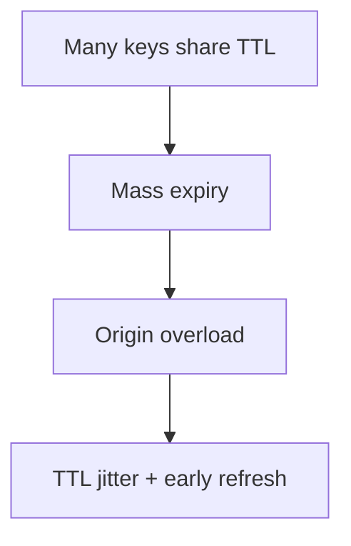
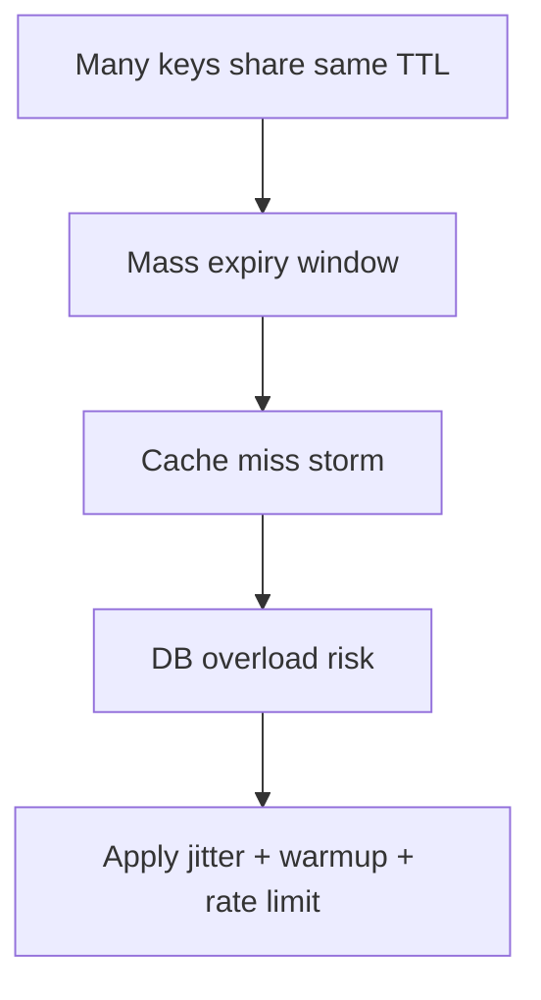

## Quick Revision

- Cache avalanche is synchronized expiry across many keys causing origin surge.
- Stagger TTLs, warm critical keys, and protect origin with bulkhead controls.
- Validate mitigation with expiry-distribution telemetry.

## Core Concepts

| Trigger | Mitigation |
| :--- | :--- |
| Same TTL cohort | Add TTL jitter |
| Cold restart | Warm high-value keys first |
| Broad invalidation | Batch and phase eviction |

## Internal Working

## Architecture

Design key TTL strategy as part of release planning for large batch writes.

## Design Tradeoffs

| Choice | Tradeoff |
| :--- | :--- |
| Larger TTL jitter | Better smoothing, less predictability |
| Aggressive warmup | Better hit rate, startup cost |

## Production Patterns

- Jitter TTL by cohort and business criticality.
- Warm top traffic keys during deploy/startup windows.

## Scalability

Avalanche frequency grows with key cohort size and synchronized deployments.

## Reliability

Use origin rate limiting and circuit breakers to survive expiry storms.

## Observability

Monitor key expiry distribution histograms and miss-rate spikes.

## Troubleshooting

If misses spike in narrow windows, inspect TTL batching and deployment timing.

## Common Mistakes

- Uniform TTL for all cache keys.
- Evicting wide keyspaces during peak hours.

## Architect Notes

Avalanche control is a workload-shaping discipline that spans app and platform teams.

## How would you troubleshoot cache stampede after a popular key expires simultaneously?

### Short Answer
The practical Redis answer is combining TTL jitter, singleflight locks, and stale-while-revalidate to protect origin during: How would you troubleshoot cache stampede after a popular key expires simultaneously.

### Detailed Explanation
Breakdown hits when a hot key expires; avalanche when many keys expire together; penetration when misses flood DB for absent keys for: How would you troubleshoot cache stampede after a popular key expires simultaneously.

### Internal Working
Mitigations include probabilistic early refresh, Bloom filters or short negative TTL, and request coalescing for: How would you troubleshoot cache stampede after a popular key expires simultaneously.

### Production Notes
You justify it by measuring p99 latency, memory headroom, and failover behavior under realistic skew by load-testing synchronized expiry and hot-key miss scenarios for: How would you troubleshoot cache stampede after a popular key expires simultaneously.

### Common Mistakes
Same TTL on all keys and caching null forever are classic self-inflicted outages for: How would you troubleshoot cache stampede after a popular key expires simultaneously.

### Follow-up Questions
Which mitigation layer (jitter, lock, Bloom, local cache) is first-line for: How would you troubleshoot cache stampede after a popular key expires simultaneously in your architecture?

---
## When does probabilistic early expiration improve tail latency versus naive TTL refresh?

### Short Answer
The production-grade Redis answer is comparing Redis to alternatives on data model, durability, ops model, and failure semantics — not feature checklists for: When does probabilistic early expiration improve tail latency versus naive TTL refresh.

### Detailed Explanation
Redis offers rich structures and optional persistence; Memcached is simpler cache; Kafka/RabbitMQ excel at durable messaging scale for: When does probabilistic early expiration improve tail latency versus naive TTL refresh.

### Internal Working
Using Redis as a message bus works for moderate throughput with Streams; very large retention or routing complexity may favor dedicated brokers for: When does probabilistic early expiration improve tail latency versus naive TTL refresh.

### Production Notes
You justify it by minimizing hot-key blast radius and single-thread CPU contention by documenting ADR assumptions and exit strategy if load doubles for: When does probabilistic early expiration improve tail latency versus naive TTL refresh.

### Common Mistakes
Resume-driven Redis adoption without ops maturity for Sentinel/Cluster causes painful incidents for: When does probabilistic early expiration improve tail latency versus naive TTL refresh.

### Follow-up Questions
What requirement in: When does probabilistic early expiration improve tail latency versus naive TTL refresh is decisive if throughput numbers are similar across options?

---
## How would you implement TTL jitter to mitigate synchronized expiry avalanches?

### Short Answer
The senior-level decision is combining TTL jitter, singleflight locks, and stale-while-revalidate to protect origin during: How would you implement TTL jitter to mitigate synchronized expiry avalanches.

### Detailed Explanation
Breakdown hits when a hot key expires; avalanche when many keys expire together; penetration when misses flood DB for absent keys for: How would you implement TTL jitter to mitigate synchronized expiry avalanches.

### Internal Working
Mitigations include probabilistic early refresh, Bloom filters or short negative TTL, and request coalescing for: How would you implement TTL jitter to mitigate synchronized expiry avalanches.

### Production Notes
You justify it by aligning durability settings with business RPO/RTO and client retry contracts by load-testing synchronized expiry and hot-key miss scenarios for: How would you implement TTL jitter to mitigate synchronized expiry avalanches.

### Common Mistakes
Same TTL on all keys and caching null forever are classic self-inflicted outages for: How would you implement TTL jitter to mitigate synchronized expiry avalanches.

### Follow-up Questions
Which mitigation layer (jitter, lock, Bloom, local cache) is first-line for: How would you implement TTL jitter to mitigate synchronized expiry avalanches in your architecture?

---
<!-- interview-answers:end -->

---

## How would you troubleshoot cache stampede after a popular key expires simultaneously?

### Short Answer
The practical Redis answer is combining TTL jitter, singleflight locks, and stale-while-revalidate to protect origin during: How would you troubleshoot cache stampede after a popular key expires simultaneously.

### Detailed Explanation
Breakdown hits when a hot key expires; avalanche when many keys expire together; penetration when misses flood DB for absent keys for: How would you troubleshoot cache stampede after a popular key expires simultaneously.

### Internal Working
Mitigations include probabilistic early refresh, Bloom filters or short negative TTL, and request coalescing for: How would you troubleshoot cache stampede after a popular key expires simultaneously.

### Production Notes
You justify it by measuring p99 latency, memory headroom, and failover behavior under realistic skew by load-testing synchronized expiry and hot-key miss scenarios for: How would you troubleshoot cache stampede after a popular key expires simultaneously.

### Common Mistakes
Same TTL on all keys and caching null forever are classic self-inflicted outages for: How would you troubleshoot cache stampede after a popular key expires simultaneously.

### Follow-up Questions
Which mitigation layer (jitter, lock, Bloom, local cache) is first-line for: How would you troubleshoot cache stampede after a popular key expires simultaneously in your architecture?

---
## When does probabilistic early expiration improve tail latency versus naive TTL refresh?

### Short Answer
The production-grade Redis answer is comparing Redis to alternatives on data model, durability, ops model, and failure semantics — not feature checklists for: When does probabilistic early expiration improve tail latency versus naive TTL refresh.

### Detailed Explanation
Redis offers rich structures and optional persistence; Memcached is simpler cache; Kafka/RabbitMQ excel at durable messaging scale for: When does probabilistic early expiration improve tail latency versus naive TTL refresh.

### Internal Working
Using Redis as a message bus works for moderate throughput with Streams; very large retention or routing complexity may favor dedicated brokers for: When does probabilistic early expiration improve tail latency versus naive TTL refresh.

### Production Notes
You justify it by minimizing hot-key blast radius and single-thread CPU contention by documenting ADR assumptions and exit strategy if load doubles for: When does probabilistic early expiration improve tail latency versus naive TTL refresh.

### Common Mistakes
Resume-driven Redis adoption without ops maturity for Sentinel/Cluster causes painful incidents for: When does probabilistic early expiration improve tail latency versus naive TTL refresh.

### Follow-up Questions
What requirement in: When does probabilistic early expiration improve tail latency versus naive TTL refresh is decisive if throughput numbers are similar across options?

---
## How would you implement TTL jitter to mitigate synchronized expiry avalanches?

### Short Answer
The senior-level decision is combining TTL jitter, singleflight locks, and stale-while-revalidate to protect origin during: How would you implement TTL jitter to mitigate synchronized expiry avalanches.

### Detailed Explanation
Breakdown hits when a hot key expires; avalanche when many keys expire together; penetration when misses flood DB for absent keys for: How would you implement TTL jitter to mitigate synchronized expiry avalanches.

### Internal Working
Mitigations include probabilistic early refresh, Bloom filters or short negative TTL, and request coalescing for: How would you implement TTL jitter to mitigate synchronized expiry avalanches.

### Production Notes
You justify it by aligning durability settings with business RPO/RTO and client retry contracts by load-testing synchronized expiry and hot-key miss scenarios for: How would you implement TTL jitter to mitigate synchronized expiry avalanches.

### Common Mistakes
Same TTL on all keys and caching null forever are classic self-inflicted outages for: How would you implement TTL jitter to mitigate synchronized expiry avalanches.

### Follow-up Questions
Which mitigation layer (jitter, lock, Bloom, local cache) is first-line for: How would you implement TTL jitter to mitigate synchronized expiry avalanches in your architecture?

---
<!-- interview-answers:end -->

---

## How would you troubleshoot cache stampede after a popular key expires simultaneously?

### Short Answer
The practical Redis answer is combining TTL jitter, singleflight locks, and stale-while-revalidate to protect origin during: How would you troubleshoot cache stampede after a popular key expires simultaneously.

### Detailed Explanation
Breakdown hits when a hot key expires; avalanche when many keys expire together; penetration when misses flood DB for absent keys for: How would you troubleshoot cache stampede after a popular key expires simultaneously.

### Internal Working
Mitigations include probabilistic early refresh, Bloom filters or short negative TTL, and request coalescing for: How would you troubleshoot cache stampede after a popular key expires simultaneously.

### Production Notes
You justify it by measuring p99 latency, memory headroom, and failover behavior under realistic skew by load-testing synchronized expiry and hot-key miss scenarios for: How would you troubleshoot cache stampede after a popular key expires simultaneously.

### Common Mistakes
Same TTL on all keys and caching null forever are classic self-inflicted outages for: How would you troubleshoot cache stampede after a popular key expires simultaneously.

### Follow-up Questions
Which mitigation layer (jitter, lock, Bloom, local cache) is first-line for: How would you troubleshoot cache stampede after a popular key expires simultaneously in your architecture?

---
## When does probabilistic early expiration improve tail latency versus naive TTL refresh?

### Short Answer
The production-grade Redis answer is comparing Redis to alternatives on data model, durability, ops model, and failure semantics — not feature checklists for: When does probabilistic early expiration improve tail latency versus naive TTL refresh.

### Detailed Explanation
Redis offers rich structures and optional persistence; Memcached is simpler cache; Kafka/RabbitMQ excel at durable messaging scale for: When does probabilistic early expiration improve tail latency versus naive TTL refresh.

### Internal Working
Using Redis as a message bus works for moderate throughput with Streams; very large retention or routing complexity may favor dedicated brokers for: When does probabilistic early expiration improve tail latency versus naive TTL refresh.

### Production Notes
You justify it by minimizing hot-key blast radius and single-thread CPU contention by documenting ADR assumptions and exit strategy if load doubles for: When does probabilistic early expiration improve tail latency versus naive TTL refresh.

### Common Mistakes
Resume-driven Redis adoption without ops maturity for Sentinel/Cluster causes painful incidents for: When does probabilistic early expiration improve tail latency versus naive TTL refresh.

### Follow-up Questions
What requirement in: When does probabilistic early expiration improve tail latency versus naive TTL refresh is decisive if throughput numbers are similar across options?

---
## How would you implement TTL jitter to mitigate synchronized expiry avalanches?

### Short Answer
The senior-level decision is combining TTL jitter, singleflight locks, and stale-while-revalidate to protect origin during: How would you implement TTL jitter to mitigate synchronized expiry avalanches.

### Detailed Explanation
Breakdown hits when a hot key expires; avalanche when many keys expire together; penetration when misses flood DB for absent keys for: How would you implement TTL jitter to mitigate synchronized expiry avalanches.

### Internal Working
Mitigations include probabilistic early refresh, Bloom filters or short negative TTL, and request coalescing for: How would you implement TTL jitter to mitigate synchronized expiry avalanches.

### Production Notes
You justify it by aligning durability settings with business RPO/RTO and client retry contracts by load-testing synchronized expiry and hot-key miss scenarios for: How would you implement TTL jitter to mitigate synchronized expiry avalanches.

### Common Mistakes
Same TTL on all keys and caching null forever are classic self-inflicted outages for: How would you implement TTL jitter to mitigate synchronized expiry avalanches.

### Follow-up Questions
Which mitigation layer (jitter, lock, Bloom, local cache) is first-line for: How would you implement TTL jitter to mitigate synchronized expiry avalanches in your architecture?

---
<!-- interview-answers:end -->

---

## How would you troubleshoot cache stampede after a popular key expires simultaneously?

### Short Answer
The practical Redis answer is combining TTL jitter, singleflight locks, and stale-while-revalidate to protect origin during: How would you troubleshoot cache stampede after a popular key expires simultaneously.

### Detailed Explanation
Breakdown hits when a hot key expires; avalanche when many keys expire together; penetration when misses flood DB for absent keys for: How would you troubleshoot cache stampede after a popular key expires simultaneously.

### Internal Working
Mitigations include probabilistic early refresh, Bloom filters or short negative TTL, and request coalescing for: How would you troubleshoot cache stampede after a popular key expires simultaneously.

### Production Notes
You justify it by measuring p99 latency, memory headroom, and failover behavior under realistic skew by load-testing synchronized expiry and hot-key miss scenarios for: How would you troubleshoot cache stampede after a popular key expires simultaneously.

### Common Mistakes
Same TTL on all keys and caching null forever are classic self-inflicted outages for: How would you troubleshoot cache stampede after a popular key expires simultaneously.

### Follow-up Questions
Which mitigation layer (jitter, lock, Bloom, local cache) is first-line for: How would you troubleshoot cache stampede after a popular key expires simultaneously in your architecture?

---
## When does probabilistic early expiration improve tail latency versus naive TTL refresh?

### Short Answer
The production-grade Redis answer is comparing Redis to alternatives on data model, durability, ops model, and failure semantics — not feature checklists for: When does probabilistic early expiration improve tail latency versus naive TTL refresh.

### Detailed Explanation
Redis offers rich structures and optional persistence; Memcached is simpler cache; Kafka/RabbitMQ excel at durable messaging scale for: When does probabilistic early expiration improve tail latency versus naive TTL refresh.

### Internal Working
Using Redis as a message bus works for moderate throughput with Streams; very large retention or routing complexity may favor dedicated brokers for: When does probabilistic early expiration improve tail latency versus naive TTL refresh.

### Production Notes
You justify it by minimizing hot-key blast radius and single-thread CPU contention by documenting ADR assumptions and exit strategy if load doubles for: When does probabilistic early expiration improve tail latency versus naive TTL refresh.

### Common Mistakes
Resume-driven Redis adoption without ops maturity for Sentinel/Cluster causes painful incidents for: When does probabilistic early expiration improve tail latency versus naive TTL refresh.

### Follow-up Questions
What requirement in: When does probabilistic early expiration improve tail latency versus naive TTL refresh is decisive if throughput numbers are similar across options?

---
## How would you implement TTL jitter to mitigate synchronized expiry avalanches?

### Short Answer
The senior-level decision is combining TTL jitter, singleflight locks, and stale-while-revalidate to protect origin during: How would you implement TTL jitter to mitigate synchronized expiry avalanches.

### Detailed Explanation
Breakdown hits when a hot key expires; avalanche when many keys expire together; penetration when misses flood DB for absent keys for: How would you implement TTL jitter to mitigate synchronized expiry avalanches.

### Internal Working
Mitigations include probabilistic early refresh, Bloom filters or short negative TTL, and request coalescing for: How would you implement TTL jitter to mitigate synchronized expiry avalanches.

### Production Notes
You justify it by aligning durability settings with business RPO/RTO and client retry contracts by load-testing synchronized expiry and hot-key miss scenarios for: How would you implement TTL jitter to mitigate synchronized expiry avalanches.

### Common Mistakes
Same TTL on all keys and caching null forever are classic self-inflicted outages for: How would you implement TTL jitter to mitigate synchronized expiry avalanches.

### Follow-up Questions
Which mitigation layer (jitter, lock, Bloom, local cache) is first-line for: How would you implement TTL jitter to mitigate synchronized expiry avalanches in your architecture?

---
<!-- interview-answers:end -->

---

## See Also

- [Previous: Cache Breakdown](/redis-cheatsheet/05-production-patterns/cache-breakdown/)
- [Next: Cache Penetration](/redis-cheatsheet/05-production-patterns/cache-penetration/)
- [Redis Handbook Index](/redis-cheatsheet/)
- [Top 150 Interview Questions](/redis-cheatsheet/08-interview-guide/top-150-interview-questions/)
