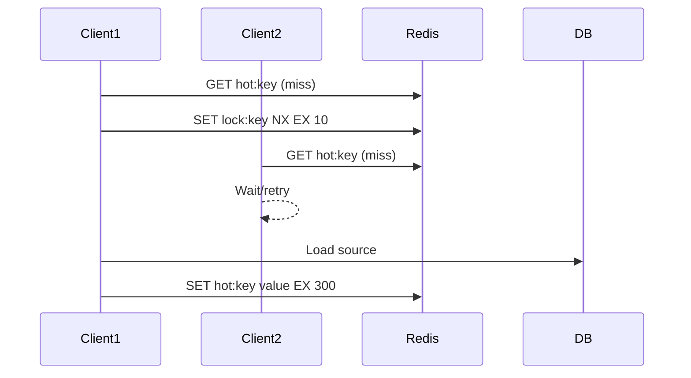

## Quick Revision

- Cache breakdown occurs when a single hot key expires and thundering-herd traffic hits origin.
- Use request coalescing, lock/singleflight, and stale-while-revalidate patterns.
- Keep rebuild path bounded and observable.

## Core Concepts

| Pattern | Goal |
| :--- | :--- |
| Singleflight lock | One rebuilder, many waiters |
| Stale-while-revalidate | Serve stale safely while refresh runs |
| Early refresh threshold | Refresh before hard expiry |

## Internal Working

## Architecture

Hot-key protection should be part of API design for high-fanout endpoints.

## Design Tradeoffs

| Choice | Tradeoff |
| :--- | :--- |
| Locking | Extra latency for waiters |
| Serve stale | Slight staleness vs origin protection |
| No guard | Simpler code, origin overload risk |

## Production Patterns

- Apply hot-key dashboards per endpoint.
- Keep lock TTL short and release-safe.

## Scalability

Breakdown risk increases with fanout growth even when total QPS is stable.

## Reliability

Ensure rebuild path degrades gracefully if origin is slow.

## Observability

Track lock contention and miss burst size.

## Troubleshooting

If DB spikes on key expiry, validate singleflight effectiveness and retry behavior.

## Common Mistakes

- Locking without timeout.
- Refresh logic that can deadlock under failures.

## Architect Notes

Breakdown prevention is a system-protection mechanism, not only a cache optimization.

## What key design choices cause one Cluster shard to absorb disproportionate traffic?

### Short Answer
The practical Redis answer is designing keys around 16384 hash slots, hash tags for multi-key ops, and cluster-aware clients for: What key design choices cause one Cluster shard to absorb disproportionate traffic.

### Detailed Explanation
Slot = CRC16(key) mod 16384; MOVED is permanent redirect, ASK is temporary during migration — resharding moves slot ownership without changing key names for: What key design choices cause one Cluster shard to absorb disproportionate traffic.

### Internal Working
Multi-key commands, Lua, and transactions require all keys in the same slot — `{tag}` hash tags force colocation for: What key design choices cause one Cluster shard to absorb disproportionate traffic.

### Production Notes
You justify it by measuring p99 latency, memory headroom, and failover behavior under realistic skew by monitoring per-node ops/sec, slot distribution, and MOVED/ASK rates during: What key design choices cause one Cluster shard to absorb disproportionate traffic.

### Common Mistakes
Typical failures: non-cluster clients, cross-slot MGET, and hot slots from poor key choice for: What key design choices cause one Cluster shard to absorb disproportionate traffic.

### Follow-up Questions
How would you rebalance slots or split hot keys if: What key design choices cause one Cluster shard to absorb disproportionate traffic appears in production metrics?

---
## How would you split a hot key across logical shards at the application layer?

### Short Answer
For this question, the architecturally correct Redis answer is combining TTL jitter, singleflight locks, and stale-while-revalidate to protect origin during: How would you split a hot key across logical shards at the application layer.

### Detailed Explanation
Breakdown hits when a hot key expires; avalanche when many keys expire together; penetration when misses flood DB for absent keys for: How would you split a hot key across logical shards at the application layer.

### Internal Working
Mitigations include probabilistic early refresh, Bloom filters or short negative TTL, and request coalescing for: How would you split a hot key across logical shards at the application layer.

### Production Notes
You justify it by proving behavior with INFO, slowlog, and workload replay before changing topology by load-testing synchronized expiry and hot-key miss scenarios for: How would you split a hot key across logical shards at the application layer.

### Common Mistakes
Same TTL on all keys and caching null forever are classic self-inflicted outages for: How would you split a hot key across logical shards at the application layer.

### Follow-up Questions
Which mitigation layer (jitter, lock, Bloom, local cache) is first-line for: How would you split a hot key across logical shards at the application layer in your architecture?

---
## What singleflight or lock pattern prevents rebuild stampede on a popular cache miss?

### Short Answer
The production-grade Redis answer is combining TTL jitter, singleflight locks, and stale-while-revalidate to protect origin during: What singleflight or lock pattern prevents rebuild stampede on a popular cache miss.

### Detailed Explanation
Breakdown hits when a hot key expires; avalanche when many keys expire together; penetration when misses flood DB for absent keys for: What singleflight or lock pattern prevents rebuild stampede on a popular cache miss.

### Internal Working
Mitigations include probabilistic early refresh, Bloom filters or short negative TTL, and request coalescing for: What singleflight or lock pattern prevents rebuild stampede on a popular cache miss.

### Production Notes
You justify it by minimizing hot-key blast radius and single-thread CPU contention by load-testing synchronized expiry and hot-key miss scenarios for: What singleflight or lock pattern prevents rebuild stampede on a popular cache miss.

### Common Mistakes
Same TTL on all keys and caching null forever are classic self-inflicted outages for: What singleflight or lock pattern prevents rebuild stampede on a popular cache miss.

### Follow-up Questions
Which mitigation layer (jitter, lock, Bloom, local cache) is first-line for: What singleflight or lock pattern prevents rebuild stampede on a popular cache miss in your architecture?

---
<!-- interview-answers:end -->

---

## What key design choices cause one Cluster shard to absorb disproportionate traffic?

### Short Answer
The practical Redis answer is designing keys around 16384 hash slots, hash tags for multi-key ops, and cluster-aware clients for: What key design choices cause one Cluster shard to absorb disproportionate traffic.

### Detailed Explanation
Slot = CRC16(key) mod 16384; MOVED is permanent redirect, ASK is temporary during migration — resharding moves slot ownership without changing key names for: What key design choices cause one Cluster shard to absorb disproportionate traffic.

### Internal Working
Multi-key commands, Lua, and transactions require all keys in the same slot — `{tag}` hash tags force colocation for: What key design choices cause one Cluster shard to absorb disproportionate traffic.

### Production Notes
You justify it by measuring p99 latency, memory headroom, and failover behavior under realistic skew by monitoring per-node ops/sec, slot distribution, and MOVED/ASK rates during: What key design choices cause one Cluster shard to absorb disproportionate traffic.

### Common Mistakes
Typical failures: non-cluster clients, cross-slot MGET, and hot slots from poor key choice for: What key design choices cause one Cluster shard to absorb disproportionate traffic.

### Follow-up Questions
How would you rebalance slots or split hot keys if: What key design choices cause one Cluster shard to absorb disproportionate traffic appears in production metrics?

---
## How would you split a hot key across logical shards at the application layer?

### Short Answer
For this question, the architecturally correct Redis answer is combining TTL jitter, singleflight locks, and stale-while-revalidate to protect origin during: How would you split a hot key across logical shards at the application layer.

### Detailed Explanation
Breakdown hits when a hot key expires; avalanche when many keys expire together; penetration when misses flood DB for absent keys for: How would you split a hot key across logical shards at the application layer.

### Internal Working
Mitigations include probabilistic early refresh, Bloom filters or short negative TTL, and request coalescing for: How would you split a hot key across logical shards at the application layer.

### Production Notes
You justify it by proving behavior with INFO, slowlog, and workload replay before changing topology by load-testing synchronized expiry and hot-key miss scenarios for: How would you split a hot key across logical shards at the application layer.

### Common Mistakes
Same TTL on all keys and caching null forever are classic self-inflicted outages for: How would you split a hot key across logical shards at the application layer.

### Follow-up Questions
Which mitigation layer (jitter, lock, Bloom, local cache) is first-line for: How would you split a hot key across logical shards at the application layer in your architecture?

---
## What singleflight or lock pattern prevents rebuild stampede on a popular cache miss?

### Short Answer
The production-grade Redis answer is combining TTL jitter, singleflight locks, and stale-while-revalidate to protect origin during: What singleflight or lock pattern prevents rebuild stampede on a popular cache miss.

### Detailed Explanation
Breakdown hits when a hot key expires; avalanche when many keys expire together; penetration when misses flood DB for absent keys for: What singleflight or lock pattern prevents rebuild stampede on a popular cache miss.

### Internal Working
Mitigations include probabilistic early refresh, Bloom filters or short negative TTL, and request coalescing for: What singleflight or lock pattern prevents rebuild stampede on a popular cache miss.

### Production Notes
You justify it by minimizing hot-key blast radius and single-thread CPU contention by load-testing synchronized expiry and hot-key miss scenarios for: What singleflight or lock pattern prevents rebuild stampede on a popular cache miss.

### Common Mistakes
Same TTL on all keys and caching null forever are classic self-inflicted outages for: What singleflight or lock pattern prevents rebuild stampede on a popular cache miss.

### Follow-up Questions
Which mitigation layer (jitter, lock, Bloom, local cache) is first-line for: What singleflight or lock pattern prevents rebuild stampede on a popular cache miss in your architecture?

---
<!-- interview-answers:end -->

---

## What key design choices cause one Cluster shard to absorb disproportionate traffic?

### Short Answer
The practical Redis answer is designing keys around 16384 hash slots, hash tags for multi-key ops, and cluster-aware clients for: What key design choices cause one Cluster shard to absorb disproportionate traffic.

### Detailed Explanation
Slot = CRC16(key) mod 16384; MOVED is permanent redirect, ASK is temporary during migration — resharding moves slot ownership without changing key names for: What key design choices cause one Cluster shard to absorb disproportionate traffic.

### Internal Working
Multi-key commands, Lua, and transactions require all keys in the same slot — `{tag}` hash tags force colocation for: What key design choices cause one Cluster shard to absorb disproportionate traffic.

### Production Notes
You justify it by measuring p99 latency, memory headroom, and failover behavior under realistic skew by monitoring per-node ops/sec, slot distribution, and MOVED/ASK rates during: What key design choices cause one Cluster shard to absorb disproportionate traffic.

### Common Mistakes
Typical failures: non-cluster clients, cross-slot MGET, and hot slots from poor key choice for: What key design choices cause one Cluster shard to absorb disproportionate traffic.

### Follow-up Questions
How would you rebalance slots or split hot keys if: What key design choices cause one Cluster shard to absorb disproportionate traffic appears in production metrics?

---
## How would you split a hot key across logical shards at the application layer?

### Short Answer
For this question, the architecturally correct Redis answer is combining TTL jitter, singleflight locks, and stale-while-revalidate to protect origin during: How would you split a hot key across logical shards at the application layer.

### Detailed Explanation
Breakdown hits when a hot key expires; avalanche when many keys expire together; penetration when misses flood DB for absent keys for: How would you split a hot key across logical shards at the application layer.

### Internal Working
Mitigations include probabilistic early refresh, Bloom filters or short negative TTL, and request coalescing for: How would you split a hot key across logical shards at the application layer.

### Production Notes
You justify it by proving behavior with INFO, slowlog, and workload replay before changing topology by load-testing synchronized expiry and hot-key miss scenarios for: How would you split a hot key across logical shards at the application layer.

### Common Mistakes
Same TTL on all keys and caching null forever are classic self-inflicted outages for: How would you split a hot key across logical shards at the application layer.

### Follow-up Questions
Which mitigation layer (jitter, lock, Bloom, local cache) is first-line for: How would you split a hot key across logical shards at the application layer in your architecture?

---
## What singleflight or lock pattern prevents rebuild stampede on a popular cache miss?

### Short Answer
The production-grade Redis answer is combining TTL jitter, singleflight locks, and stale-while-revalidate to protect origin during: What singleflight or lock pattern prevents rebuild stampede on a popular cache miss.

### Detailed Explanation
Breakdown hits when a hot key expires; avalanche when many keys expire together; penetration when misses flood DB for absent keys for: What singleflight or lock pattern prevents rebuild stampede on a popular cache miss.

### Internal Working
Mitigations include probabilistic early refresh, Bloom filters or short negative TTL, and request coalescing for: What singleflight or lock pattern prevents rebuild stampede on a popular cache miss.

### Production Notes
You justify it by minimizing hot-key blast radius and single-thread CPU contention by load-testing synchronized expiry and hot-key miss scenarios for: What singleflight or lock pattern prevents rebuild stampede on a popular cache miss.

### Common Mistakes
Same TTL on all keys and caching null forever are classic self-inflicted outages for: What singleflight or lock pattern prevents rebuild stampede on a popular cache miss.

### Follow-up Questions
Which mitigation layer (jitter, lock, Bloom, local cache) is first-line for: What singleflight or lock pattern prevents rebuild stampede on a popular cache miss in your architecture?

---
<!-- interview-answers:end -->

---

## What key design choices cause one Cluster shard to absorb disproportionate traffic?

### Short Answer
The practical Redis answer is designing keys around 16384 hash slots, hash tags for multi-key ops, and cluster-aware clients for: What key design choices cause one Cluster shard to absorb disproportionate traffic.

### Detailed Explanation
Slot = CRC16(key) mod 16384; MOVED is permanent redirect, ASK is temporary during migration — resharding moves slot ownership without changing key names for: What key design choices cause one Cluster shard to absorb disproportionate traffic.

### Internal Working
Multi-key commands, Lua, and transactions require all keys in the same slot — `{tag}` hash tags force colocation for: What key design choices cause one Cluster shard to absorb disproportionate traffic.

### Production Notes
You justify it by measuring p99 latency, memory headroom, and failover behavior under realistic skew by monitoring per-node ops/sec, slot distribution, and MOVED/ASK rates during: What key design choices cause one Cluster shard to absorb disproportionate traffic.

### Common Mistakes
Typical failures: non-cluster clients, cross-slot MGET, and hot slots from poor key choice for: What key design choices cause one Cluster shard to absorb disproportionate traffic.

### Follow-up Questions
How would you rebalance slots or split hot keys if: What key design choices cause one Cluster shard to absorb disproportionate traffic appears in production metrics?

---
## How would you split a hot key across logical shards at the application layer?

### Short Answer
For this question, the architecturally correct Redis answer is combining TTL jitter, singleflight locks, and stale-while-revalidate to protect origin during: How would you split a hot key across logical shards at the application layer.

### Detailed Explanation
Breakdown hits when a hot key expires; avalanche when many keys expire together; penetration when misses flood DB for absent keys for: How would you split a hot key across logical shards at the application layer.

### Internal Working
Mitigations include probabilistic early refresh, Bloom filters or short negative TTL, and request coalescing for: How would you split a hot key across logical shards at the application layer.

### Production Notes
You justify it by proving behavior with INFO, slowlog, and workload replay before changing topology by load-testing synchronized expiry and hot-key miss scenarios for: How would you split a hot key across logical shards at the application layer.

### Common Mistakes
Same TTL on all keys and caching null forever are classic self-inflicted outages for: How would you split a hot key across logical shards at the application layer.

### Follow-up Questions
Which mitigation layer (jitter, lock, Bloom, local cache) is first-line for: How would you split a hot key across logical shards at the application layer in your architecture?

---
## What singleflight or lock pattern prevents rebuild stampede on a popular cache miss?

### Short Answer
The production-grade Redis answer is combining TTL jitter, singleflight locks, and stale-while-revalidate to protect origin during: What singleflight or lock pattern prevents rebuild stampede on a popular cache miss.

### Detailed Explanation
Breakdown hits when a hot key expires; avalanche when many keys expire together; penetration when misses flood DB for absent keys for: What singleflight or lock pattern prevents rebuild stampede on a popular cache miss.

### Internal Working
Mitigations include probabilistic early refresh, Bloom filters or short negative TTL, and request coalescing for: What singleflight or lock pattern prevents rebuild stampede on a popular cache miss.

### Production Notes
You justify it by minimizing hot-key blast radius and single-thread CPU contention by load-testing synchronized expiry and hot-key miss scenarios for: What singleflight or lock pattern prevents rebuild stampede on a popular cache miss.

### Common Mistakes
Same TTL on all keys and caching null forever are classic self-inflicted outages for: What singleflight or lock pattern prevents rebuild stampede on a popular cache miss.

### Follow-up Questions
Which mitigation layer (jitter, lock, Bloom, local cache) is first-line for: What singleflight or lock pattern prevents rebuild stampede on a popular cache miss in your architecture?

---
<!-- interview-answers:end -->

---

## See Also

- [Previous: Cache Invalidation](/redis-cheatsheet/05-production-patterns/cache-invalidation/)
- [Next: Cache Avalanche](/redis-cheatsheet/05-production-patterns/cache-avalanche/)
- [Redis Handbook Index](/redis-cheatsheet/)
- [Top 150 Interview Questions](/redis-cheatsheet/08-interview-guide/top-150-interview-questions/)
