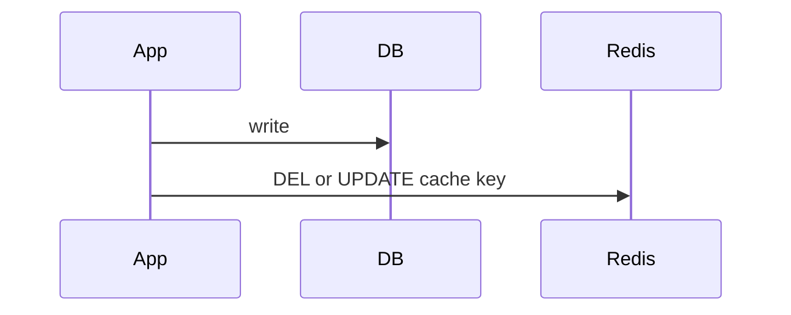
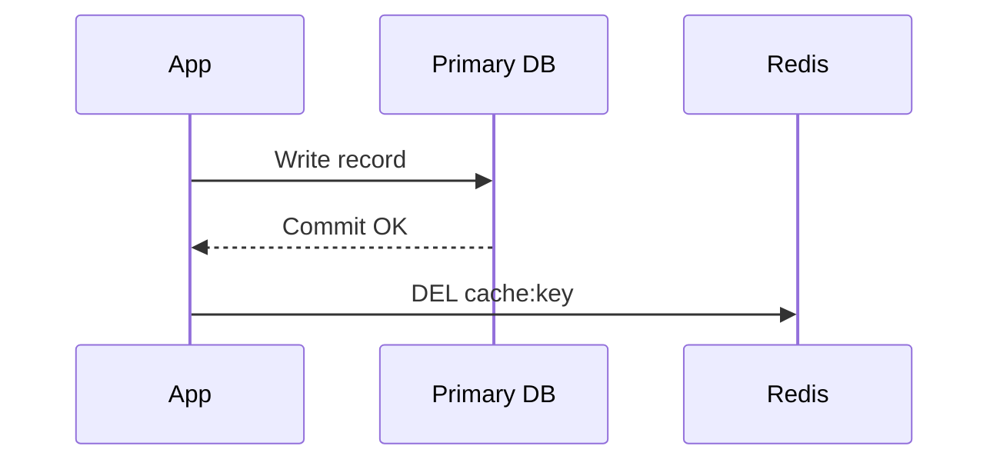

## Quick Revision

- Correctness requires explicit cache invalidation on write paths.
- Choose between delete-on-write, update-on-write, and event-based invalidation.
- Tie strategy to consistency and latency requirements.

## Core Concepts

| Strategy | Use when |
| :--- | :--- |
| Delete-on-write | Simple and safe default |
| Update-on-write | Predictable read latency, more write complexity |
| Pub/Sub invalidation | Multi-node local caches require fan-out |

## Internal Working

## Architecture

Define ownership: service updating source-of-truth data must also own invalidation behavior.

## Design Tradeoffs

| Choice | Tradeoff |
| :--- | :--- |
| Delete on write | Possible brief miss bursts |
| Update on write | More serialization logic |
| Event invalidation | Extra transport dependency |

## Production Patterns

- Version keys when atomic key swaps are easier than inplace updates.
- Use idempotent invalidation events.

## Scalability

Fan-out invalidation channels need backpressure controls in large clusters.

## Reliability

Failed invalidation should be retried or reconciled by scheduled repair jobs.

## Observability

Track stale-read incidents and invalidation latency distributions.

## Troubleshooting

If stale reads persist, verify write-path ordering and consumer delivery guarantees.

## Common Mistakes

- Updating DB without cache mutation in the same flow.
- Ignoring local in-process caches while invalidating Redis only.

## Architect Notes

Invalidation is a correctness concern and should be reviewed like transaction design.

## How do you keep cache and database consistent under write-through versus write-behind?

### Short Answer
The production-grade Redis answer is comparing Redis to alternatives on data model, durability, ops model, and failure semantics — not feature checklists for: How do you keep cache and database consistent under write-through versus write-behind.

### Detailed Explanation
Redis offers rich structures and optional persistence; Memcached is simpler cache; Kafka/RabbitMQ excel at durable messaging scale for: How do you keep cache and database consistent under write-through versus write-behind.

### Internal Working
Using Redis as a message bus works for moderate throughput with Streams; very large retention or routing complexity may favor dedicated brokers for: How do you keep cache and database consistent under write-through versus write-behind.

### Production Notes
You justify it by minimizing hot-key blast radius and single-thread CPU contention by documenting ADR assumptions and exit strategy if load doubles for: How do you keep cache and database consistent under write-through versus write-behind.

### Common Mistakes
Resume-driven Redis adoption without ops maturity for Sentinel/Cluster causes painful incidents for: How do you keep cache and database consistent under write-through versus write-behind.

### Follow-up Questions
What requirement in: How do you keep cache and database consistent under write-through versus write-behind is decisive if throughput numbers are similar across options?

---
## How does write-behind improve write latency while risking data loss on crash?

### Short Answer
For this question, the architecturally correct Redis answer is deleting or updating cache keys on write and broadcasting invalidation when multi-tier caches exist for: How does write-behind improve write latency while risking data loss on crash.

### Detailed Explanation
Write-through updates DB and cache together; write-behind updates cache first with async flush — each shifts consistency risk for: How does write-behind improve write latency while risking data loss on crash.

### Internal Working
Pub/Sub can signal app-local cache eviction, but Redis remains source for shared cache layer for: How does write-behind improve write latency while risking data loss on crash.

### Production Notes
You justify it by proving behavior with INFO, slowlog, and workload replay before changing topology by defining who invalidates on partial updates and out-of-order writes for: How does write-behind improve write latency while risking data loss on crash.

### Common Mistakes
Updating DB without cache delete is the most common stale-data bug for: How does write-behind improve write latency while risking data loss on crash.

### Follow-up Questions
How do you invalidate related keys (lists, aggregates) when: How does write-behind improve write latency while risking data loss on crash updates one entity?

---
## How does Pub/Sub-based cache invalidation avoid stale local caches in multi-tier apps?

### Short Answer
The senior-level decision is deleting or updating cache keys on write and broadcasting invalidation when multi-tier caches exist for: How does Pub/Sub-based cache invalidation avoid stale local caches in multi-tier apps.

### Detailed Explanation
Write-through updates DB and cache together; write-behind updates cache first with async flush — each shifts consistency risk for: How does Pub/Sub-based cache invalidation avoid stale local caches in multi-tier apps.

### Internal Working
Pub/Sub can signal app-local cache eviction, but Redis remains source for shared cache layer for: How does Pub/Sub-based cache invalidation avoid stale local caches in multi-tier apps.

### Production Notes
You justify it by aligning durability settings with business RPO/RTO and client retry contracts by defining who invalidates on partial updates and out-of-order writes for: How does Pub/Sub-based cache invalidation avoid stale local caches in multi-tier apps.

### Common Mistakes
Updating DB without cache delete is the most common stale-data bug for: How does Pub/Sub-based cache invalidation avoid stale local caches in multi-tier apps.

### Follow-up Questions
How do you invalidate related keys (lists, aggregates) when: How does Pub/Sub-based cache invalidation avoid stale local caches in multi-tier apps updates one entity?

---
<!-- interview-answers:end -->

---

## How do you keep cache and database consistent under write-through versus write-behind?

### Short Answer
The production-grade Redis answer is comparing Redis to alternatives on data model, durability, ops model, and failure semantics — not feature checklists for: How do you keep cache and database consistent under write-through versus write-behind.

### Detailed Explanation
Redis offers rich structures and optional persistence; Memcached is simpler cache; Kafka/RabbitMQ excel at durable messaging scale for: How do you keep cache and database consistent under write-through versus write-behind.

### Internal Working
Using Redis as a message bus works for moderate throughput with Streams; very large retention or routing complexity may favor dedicated brokers for: How do you keep cache and database consistent under write-through versus write-behind.

### Production Notes
You justify it by minimizing hot-key blast radius and single-thread CPU contention by documenting ADR assumptions and exit strategy if load doubles for: How do you keep cache and database consistent under write-through versus write-behind.

### Common Mistakes
Resume-driven Redis adoption without ops maturity for Sentinel/Cluster causes painful incidents for: How do you keep cache and database consistent under write-through versus write-behind.

### Follow-up Questions
What requirement in: How do you keep cache and database consistent under write-through versus write-behind is decisive if throughput numbers are similar across options?

---
## How does write-behind improve write latency while risking data loss on crash?

### Short Answer
For this question, the architecturally correct Redis answer is deleting or updating cache keys on write and broadcasting invalidation when multi-tier caches exist for: How does write-behind improve write latency while risking data loss on crash.

### Detailed Explanation
Write-through updates DB and cache together; write-behind updates cache first with async flush — each shifts consistency risk for: How does write-behind improve write latency while risking data loss on crash.

### Internal Working
Pub/Sub can signal app-local cache eviction, but Redis remains source for shared cache layer for: How does write-behind improve write latency while risking data loss on crash.

### Production Notes
You justify it by proving behavior with INFO, slowlog, and workload replay before changing topology by defining who invalidates on partial updates and out-of-order writes for: How does write-behind improve write latency while risking data loss on crash.

### Common Mistakes
Updating DB without cache delete is the most common stale-data bug for: How does write-behind improve write latency while risking data loss on crash.

### Follow-up Questions
How do you invalidate related keys (lists, aggregates) when: How does write-behind improve write latency while risking data loss on crash updates one entity?

---
## How does Pub/Sub-based cache invalidation avoid stale local caches in multi-tier apps?

### Short Answer
The senior-level decision is deleting or updating cache keys on write and broadcasting invalidation when multi-tier caches exist for: How does Pub/Sub-based cache invalidation avoid stale local caches in multi-tier apps.

### Detailed Explanation
Write-through updates DB and cache together; write-behind updates cache first with async flush — each shifts consistency risk for: How does Pub/Sub-based cache invalidation avoid stale local caches in multi-tier apps.

### Internal Working
Pub/Sub can signal app-local cache eviction, but Redis remains source for shared cache layer for: How does Pub/Sub-based cache invalidation avoid stale local caches in multi-tier apps.

### Production Notes
You justify it by aligning durability settings with business RPO/RTO and client retry contracts by defining who invalidates on partial updates and out-of-order writes for: How does Pub/Sub-based cache invalidation avoid stale local caches in multi-tier apps.

### Common Mistakes
Updating DB without cache delete is the most common stale-data bug for: How does Pub/Sub-based cache invalidation avoid stale local caches in multi-tier apps.

### Follow-up Questions
How do you invalidate related keys (lists, aggregates) when: How does Pub/Sub-based cache invalidation avoid stale local caches in multi-tier apps updates one entity?

---
<!-- interview-answers:end -->

---

## How do you keep cache and database consistent under write-through versus write-behind?

### Short Answer
The production-grade Redis answer is comparing Redis to alternatives on data model, durability, ops model, and failure semantics — not feature checklists for: How do you keep cache and database consistent under write-through versus write-behind.

### Detailed Explanation
Redis offers rich structures and optional persistence; Memcached is simpler cache; Kafka/RabbitMQ excel at durable messaging scale for: How do you keep cache and database consistent under write-through versus write-behind.

### Internal Working
Using Redis as a message bus works for moderate throughput with Streams; very large retention or routing complexity may favor dedicated brokers for: How do you keep cache and database consistent under write-through versus write-behind.

### Production Notes
You justify it by minimizing hot-key blast radius and single-thread CPU contention by documenting ADR assumptions and exit strategy if load doubles for: How do you keep cache and database consistent under write-through versus write-behind.

### Common Mistakes
Resume-driven Redis adoption without ops maturity for Sentinel/Cluster causes painful incidents for: How do you keep cache and database consistent under write-through versus write-behind.

### Follow-up Questions
What requirement in: How do you keep cache and database consistent under write-through versus write-behind is decisive if throughput numbers are similar across options?

---
## How does write-behind improve write latency while risking data loss on crash?

### Short Answer
For this question, the architecturally correct Redis answer is deleting or updating cache keys on write and broadcasting invalidation when multi-tier caches exist for: How does write-behind improve write latency while risking data loss on crash.

### Detailed Explanation
Write-through updates DB and cache together; write-behind updates cache first with async flush — each shifts consistency risk for: How does write-behind improve write latency while risking data loss on crash.

### Internal Working
Pub/Sub can signal app-local cache eviction, but Redis remains source for shared cache layer for: How does write-behind improve write latency while risking data loss on crash.

### Production Notes
You justify it by proving behavior with INFO, slowlog, and workload replay before changing topology by defining who invalidates on partial updates and out-of-order writes for: How does write-behind improve write latency while risking data loss on crash.

### Common Mistakes
Updating DB without cache delete is the most common stale-data bug for: How does write-behind improve write latency while risking data loss on crash.

### Follow-up Questions
How do you invalidate related keys (lists, aggregates) when: How does write-behind improve write latency while risking data loss on crash updates one entity?

---
## How does Pub/Sub-based cache invalidation avoid stale local caches in multi-tier apps?

### Short Answer
The senior-level decision is deleting or updating cache keys on write and broadcasting invalidation when multi-tier caches exist for: How does Pub/Sub-based cache invalidation avoid stale local caches in multi-tier apps.

### Detailed Explanation
Write-through updates DB and cache together; write-behind updates cache first with async flush — each shifts consistency risk for: How does Pub/Sub-based cache invalidation avoid stale local caches in multi-tier apps.

### Internal Working
Pub/Sub can signal app-local cache eviction, but Redis remains source for shared cache layer for: How does Pub/Sub-based cache invalidation avoid stale local caches in multi-tier apps.

### Production Notes
You justify it by aligning durability settings with business RPO/RTO and client retry contracts by defining who invalidates on partial updates and out-of-order writes for: How does Pub/Sub-based cache invalidation avoid stale local caches in multi-tier apps.

### Common Mistakes
Updating DB without cache delete is the most common stale-data bug for: How does Pub/Sub-based cache invalidation avoid stale local caches in multi-tier apps.

### Follow-up Questions
How do you invalidate related keys (lists, aggregates) when: How does Pub/Sub-based cache invalidation avoid stale local caches in multi-tier apps updates one entity?

---
<!-- interview-answers:end -->

---

## How do you keep cache and database consistent under write-through versus write-behind?

### Short Answer
The production-grade Redis answer is comparing Redis to alternatives on data model, durability, ops model, and failure semantics — not feature checklists for: How do you keep cache and database consistent under write-through versus write-behind.

### Detailed Explanation
Redis offers rich structures and optional persistence; Memcached is simpler cache; Kafka/RabbitMQ excel at durable messaging scale for: How do you keep cache and database consistent under write-through versus write-behind.

### Internal Working
Using Redis as a message bus works for moderate throughput with Streams; very large retention or routing complexity may favor dedicated brokers for: How do you keep cache and database consistent under write-through versus write-behind.

### Production Notes
You justify it by minimizing hot-key blast radius and single-thread CPU contention by documenting ADR assumptions and exit strategy if load doubles for: How do you keep cache and database consistent under write-through versus write-behind.

### Common Mistakes
Resume-driven Redis adoption without ops maturity for Sentinel/Cluster causes painful incidents for: How do you keep cache and database consistent under write-through versus write-behind.

### Follow-up Questions
What requirement in: How do you keep cache and database consistent under write-through versus write-behind is decisive if throughput numbers are similar across options?

---
## How does write-behind improve write latency while risking data loss on crash?

### Short Answer
For this question, the architecturally correct Redis answer is deleting or updating cache keys on write and broadcasting invalidation when multi-tier caches exist for: How does write-behind improve write latency while risking data loss on crash.

### Detailed Explanation
Write-through updates DB and cache together; write-behind updates cache first with async flush — each shifts consistency risk for: How does write-behind improve write latency while risking data loss on crash.

### Internal Working
Pub/Sub can signal app-local cache eviction, but Redis remains source for shared cache layer for: How does write-behind improve write latency while risking data loss on crash.

### Production Notes
You justify it by proving behavior with INFO, slowlog, and workload replay before changing topology by defining who invalidates on partial updates and out-of-order writes for: How does write-behind improve write latency while risking data loss on crash.

### Common Mistakes
Updating DB without cache delete is the most common stale-data bug for: How does write-behind improve write latency while risking data loss on crash.

### Follow-up Questions
How do you invalidate related keys (lists, aggregates) when: How does write-behind improve write latency while risking data loss on crash updates one entity?

---
## How does Pub/Sub-based cache invalidation avoid stale local caches in multi-tier apps?

### Short Answer
The senior-level decision is deleting or updating cache keys on write and broadcasting invalidation when multi-tier caches exist for: How does Pub/Sub-based cache invalidation avoid stale local caches in multi-tier apps.

### Detailed Explanation
Write-through updates DB and cache together; write-behind updates cache first with async flush — each shifts consistency risk for: How does Pub/Sub-based cache invalidation avoid stale local caches in multi-tier apps.

### Internal Working
Pub/Sub can signal app-local cache eviction, but Redis remains source for shared cache layer for: How does Pub/Sub-based cache invalidation avoid stale local caches in multi-tier apps.

### Production Notes
You justify it by aligning durability settings with business RPO/RTO and client retry contracts by defining who invalidates on partial updates and out-of-order writes for: How does Pub/Sub-based cache invalidation avoid stale local caches in multi-tier apps.

### Common Mistakes
Updating DB without cache delete is the most common stale-data bug for: How does Pub/Sub-based cache invalidation avoid stale local caches in multi-tier apps.

### Follow-up Questions
How do you invalidate related keys (lists, aggregates) when: How does Pub/Sub-based cache invalidation avoid stale local caches in multi-tier apps updates one entity?

---
<!-- interview-answers:end -->

---

## See Also

- [Previous: Caching Patterns](/redis-cheatsheet/05-production-patterns/caching-patterns/)
- [Next: Cache Breakdown](/redis-cheatsheet/05-production-patterns/cache-breakdown/)
- [Redis Handbook Index](/redis-cheatsheet/)
- [Top 150 Interview Questions](/redis-cheatsheet/08-interview-guide/top-150-interview-questions/)
