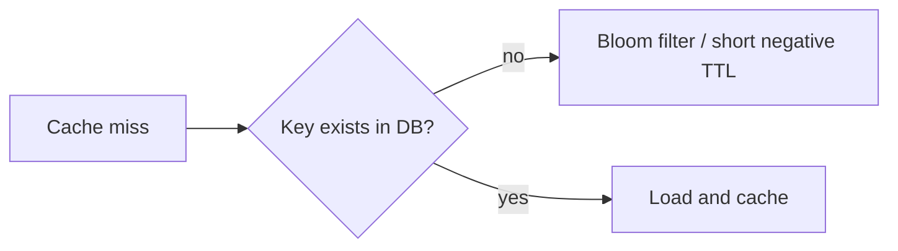
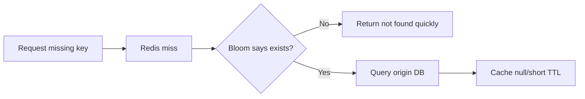

## Quick Revision

- Cache penetration occurs when repeated misses for absent keys flood the origin.
- Mitigate with negative caching, Bloom filters, and strict key validation.
- Tune miss TTL separately from hit TTL.

## Core Concepts

| Defense | Purpose |
| :--- | :--- |
| Negative caching | Short-term shield for absent IDs |
| Bloom filter | Fast probable-existence check |
| Input validation | Drop invalid keys early |

## Internal Working

## Architecture

Penetration defense belongs in API gateway and service logic, not cache layer alone.

## Design Tradeoffs

| Choice | Tradeoff |
| :--- | :--- |
| Negative cache | Possible stale "not found" window |
| Bloom filter | False positives, memory overhead |

## Production Patterns

- Separate TTL policy for negative entries.
- Protect high-risk endpoints with request throttling.

## Scalability

Bot traffic can amplify penetration risk even at moderate user volume.

## Reliability

Fallback paths must avoid bypassing all cache defenses during incidents.

## Observability

Track miss-by-prefix, negative-cache hit ratio, and origin QPS under miss storms.

## Troubleshooting

Persistent high miss with low hit ratio usually indicates penetration or poor key design.

## Common Mistakes

- Caching not-found forever.
- Assuming Bloom filters remove all miss traffic.

## Architect Notes

Penetration controls are critical for abuse resilience and origin protection budgets.

## What mitigations apply when cache penetration hammers the database for non-existent IDs?

### Short Answer
For this question, the architecturally correct Redis answer is combining TTL jitter, singleflight locks, and stale-while-revalidate to protect origin during: What mitigations apply when cache penetration hammers the database for non-existent IDs.

### Detailed Explanation
Breakdown hits when a hot key expires; avalanche when many keys expire together; penetration when misses flood DB for absent keys for: What mitigations apply when cache penetration hammers the database for non-existent IDs.

### Internal Working
Mitigations include probabilistic early refresh, Bloom filters or short negative TTL, and request coalescing for: What mitigations apply when cache penetration hammers the database for non-existent IDs.

### Production Notes
You justify it by proving behavior with INFO, slowlog, and workload replay before changing topology by load-testing synchronized expiry and hot-key miss scenarios for: What mitigations apply when cache penetration hammers the database for non-existent IDs.

### Common Mistakes
Same TTL on all keys and caching null forever are classic self-inflicted outages for: What mitigations apply when cache penetration hammers the database for non-existent IDs.

### Follow-up Questions
Which mitigation layer (jitter, lock, Bloom, local cache) is first-line for: What mitigations apply when cache penetration hammers the database for non-existent IDs in your architecture?

---
## When does caching null results with short TTL scale better than Bloom filters?

### Short Answer
The production-grade Redis answer is combining TTL jitter, singleflight locks, and stale-while-revalidate to protect origin during: When does caching null results with short TTL scale better than Bloom filters.

### Detailed Explanation
Breakdown hits when a hot key expires; avalanche when many keys expire together; penetration when misses flood DB for absent keys for: When does caching null results with short TTL scale better than Bloom filters.

### Internal Working
Mitigations include probabilistic early refresh, Bloom filters or short negative TTL, and request coalescing for: When does caching null results with short TTL scale better than Bloom filters.

### Production Notes
You justify it by minimizing hot-key blast radius and single-thread CPU contention by load-testing synchronized expiry and hot-key miss scenarios for: When does caching null results with short TTL scale better than Bloom filters.

### Common Mistakes
Same TTL on all keys and caching null forever are classic self-inflicted outages for: When does caching null results with short TTL scale better than Bloom filters.

### Follow-up Questions
Which mitigation layer (jitter, lock, Bloom, local cache) is first-line for: When does caching null results with short TTL scale better than Bloom filters in your architecture?

---
## When is a Bloom filter worth adding versus caching empty placeholders?

### Short Answer
The practical Redis answer is comparing Redis to alternatives on data model, durability, ops model, and failure semantics — not feature checklists for: When is a Bloom filter worth adding versus caching empty placeholders.

### Detailed Explanation
Redis offers rich structures and optional persistence; Memcached is simpler cache; Kafka/RabbitMQ excel at durable messaging scale for: When is a Bloom filter worth adding versus caching empty placeholders.

### Internal Working
Using Redis as a message bus works for moderate throughput with Streams; very large retention or routing complexity may favor dedicated brokers for: When is a Bloom filter worth adding versus caching empty placeholders.

### Production Notes
You justify it by measuring p99 latency, memory headroom, and failover behavior under realistic skew by documenting ADR assumptions and exit strategy if load doubles for: When is a Bloom filter worth adding versus caching empty placeholders.

### Common Mistakes
Resume-driven Redis adoption without ops maturity for Sentinel/Cluster causes painful incidents for: When is a Bloom filter worth adding versus caching empty placeholders.

### Follow-up Questions
What requirement in: When is a Bloom filter worth adding versus caching empty placeholders is decisive if throughput numbers are similar across options?

---
## How would you design negative caching TTL differently for bots versus real users?

### Short Answer
The senior-level decision is comparing Redis to alternatives on data model, durability, ops model, and failure semantics — not feature checklists for: How would you design negative caching TTL differently for bots versus real users.

### Detailed Explanation
Redis offers rich structures and optional persistence; Memcached is simpler cache; Kafka/RabbitMQ excel at durable messaging scale for: How would you design negative caching TTL differently for bots versus real users.

### Internal Working
Using Redis as a message bus works for moderate throughput with Streams; very large retention or routing complexity may favor dedicated brokers for: How would you design negative caching TTL differently for bots versus real users.

### Production Notes
You justify it by aligning durability settings with business RPO/RTO and client retry contracts by documenting ADR assumptions and exit strategy if load doubles for: How would you design negative caching TTL differently for bots versus real users.

### Common Mistakes
Resume-driven Redis adoption without ops maturity for Sentinel/Cluster causes painful incidents for: How would you design negative caching TTL differently for bots versus real users.

### Follow-up Questions
What requirement in: How would you design negative caching TTL differently for bots versus real users is decisive if throughput numbers are similar across options?

---
<!-- interview-answers:end -->

---

## What mitigations apply when cache penetration hammers the database for non-existent IDs?

### Short Answer
For this question, the architecturally correct Redis answer is combining TTL jitter, singleflight locks, and stale-while-revalidate to protect origin during: What mitigations apply when cache penetration hammers the database for non-existent IDs.

### Detailed Explanation
Breakdown hits when a hot key expires; avalanche when many keys expire together; penetration when misses flood DB for absent keys for: What mitigations apply when cache penetration hammers the database for non-existent IDs.

### Internal Working
Mitigations include probabilistic early refresh, Bloom filters or short negative TTL, and request coalescing for: What mitigations apply when cache penetration hammers the database for non-existent IDs.

### Production Notes
You justify it by proving behavior with INFO, slowlog, and workload replay before changing topology by load-testing synchronized expiry and hot-key miss scenarios for: What mitigations apply when cache penetration hammers the database for non-existent IDs.

### Common Mistakes
Same TTL on all keys and caching null forever are classic self-inflicted outages for: What mitigations apply when cache penetration hammers the database for non-existent IDs.

### Follow-up Questions
Which mitigation layer (jitter, lock, Bloom, local cache) is first-line for: What mitigations apply when cache penetration hammers the database for non-existent IDs in your architecture?

---
## When does caching null results with short TTL scale better than Bloom filters?

### Short Answer
The production-grade Redis answer is combining TTL jitter, singleflight locks, and stale-while-revalidate to protect origin during: When does caching null results with short TTL scale better than Bloom filters.

### Detailed Explanation
Breakdown hits when a hot key expires; avalanche when many keys expire together; penetration when misses flood DB for absent keys for: When does caching null results with short TTL scale better than Bloom filters.

### Internal Working
Mitigations include probabilistic early refresh, Bloom filters or short negative TTL, and request coalescing for: When does caching null results with short TTL scale better than Bloom filters.

### Production Notes
You justify it by minimizing hot-key blast radius and single-thread CPU contention by load-testing synchronized expiry and hot-key miss scenarios for: When does caching null results with short TTL scale better than Bloom filters.

### Common Mistakes
Same TTL on all keys and caching null forever are classic self-inflicted outages for: When does caching null results with short TTL scale better than Bloom filters.

### Follow-up Questions
Which mitigation layer (jitter, lock, Bloom, local cache) is first-line for: When does caching null results with short TTL scale better than Bloom filters in your architecture?

---
## When is a Bloom filter worth adding versus caching empty placeholders?

### Short Answer
The practical Redis answer is comparing Redis to alternatives on data model, durability, ops model, and failure semantics — not feature checklists for: When is a Bloom filter worth adding versus caching empty placeholders.

### Detailed Explanation
Redis offers rich structures and optional persistence; Memcached is simpler cache; Kafka/RabbitMQ excel at durable messaging scale for: When is a Bloom filter worth adding versus caching empty placeholders.

### Internal Working
Using Redis as a message bus works for moderate throughput with Streams; very large retention or routing complexity may favor dedicated brokers for: When is a Bloom filter worth adding versus caching empty placeholders.

### Production Notes
You justify it by measuring p99 latency, memory headroom, and failover behavior under realistic skew by documenting ADR assumptions and exit strategy if load doubles for: When is a Bloom filter worth adding versus caching empty placeholders.

### Common Mistakes
Resume-driven Redis adoption without ops maturity for Sentinel/Cluster causes painful incidents for: When is a Bloom filter worth adding versus caching empty placeholders.

### Follow-up Questions
What requirement in: When is a Bloom filter worth adding versus caching empty placeholders is decisive if throughput numbers are similar across options?

---
## How would you design negative caching TTL differently for bots versus real users?

### Short Answer
The senior-level decision is comparing Redis to alternatives on data model, durability, ops model, and failure semantics — not feature checklists for: How would you design negative caching TTL differently for bots versus real users.

### Detailed Explanation
Redis offers rich structures and optional persistence; Memcached is simpler cache; Kafka/RabbitMQ excel at durable messaging scale for: How would you design negative caching TTL differently for bots versus real users.

### Internal Working
Using Redis as a message bus works for moderate throughput with Streams; very large retention or routing complexity may favor dedicated brokers for: How would you design negative caching TTL differently for bots versus real users.

### Production Notes
You justify it by aligning durability settings with business RPO/RTO and client retry contracts by documenting ADR assumptions and exit strategy if load doubles for: How would you design negative caching TTL differently for bots versus real users.

### Common Mistakes
Resume-driven Redis adoption without ops maturity for Sentinel/Cluster causes painful incidents for: How would you design negative caching TTL differently for bots versus real users.

### Follow-up Questions
What requirement in: How would you design negative caching TTL differently for bots versus real users is decisive if throughput numbers are similar across options?

---
<!-- interview-answers:end -->

---

## What mitigations apply when cache penetration hammers the database for non-existent IDs?

### Short Answer
For this question, the architecturally correct Redis answer is combining TTL jitter, singleflight locks, and stale-while-revalidate to protect origin during: What mitigations apply when cache penetration hammers the database for non-existent IDs.

### Detailed Explanation
Breakdown hits when a hot key expires; avalanche when many keys expire together; penetration when misses flood DB for absent keys for: What mitigations apply when cache penetration hammers the database for non-existent IDs.

### Internal Working
Mitigations include probabilistic early refresh, Bloom filters or short negative TTL, and request coalescing for: What mitigations apply when cache penetration hammers the database for non-existent IDs.

### Production Notes
You justify it by proving behavior with INFO, slowlog, and workload replay before changing topology by load-testing synchronized expiry and hot-key miss scenarios for: What mitigations apply when cache penetration hammers the database for non-existent IDs.

### Common Mistakes
Same TTL on all keys and caching null forever are classic self-inflicted outages for: What mitigations apply when cache penetration hammers the database for non-existent IDs.

### Follow-up Questions
Which mitigation layer (jitter, lock, Bloom, local cache) is first-line for: What mitigations apply when cache penetration hammers the database for non-existent IDs in your architecture?

---
## When does caching null results with short TTL scale better than Bloom filters?

### Short Answer
The production-grade Redis answer is combining TTL jitter, singleflight locks, and stale-while-revalidate to protect origin during: When does caching null results with short TTL scale better than Bloom filters.

### Detailed Explanation
Breakdown hits when a hot key expires; avalanche when many keys expire together; penetration when misses flood DB for absent keys for: When does caching null results with short TTL scale better than Bloom filters.

### Internal Working
Mitigations include probabilistic early refresh, Bloom filters or short negative TTL, and request coalescing for: When does caching null results with short TTL scale better than Bloom filters.

### Production Notes
You justify it by minimizing hot-key blast radius and single-thread CPU contention by load-testing synchronized expiry and hot-key miss scenarios for: When does caching null results with short TTL scale better than Bloom filters.

### Common Mistakes
Same TTL on all keys and caching null forever are classic self-inflicted outages for: When does caching null results with short TTL scale better than Bloom filters.

### Follow-up Questions
Which mitigation layer (jitter, lock, Bloom, local cache) is first-line for: When does caching null results with short TTL scale better than Bloom filters in your architecture?

---
## When is a Bloom filter worth adding versus caching empty placeholders?

### Short Answer
The practical Redis answer is comparing Redis to alternatives on data model, durability, ops model, and failure semantics — not feature checklists for: When is a Bloom filter worth adding versus caching empty placeholders.

### Detailed Explanation
Redis offers rich structures and optional persistence; Memcached is simpler cache; Kafka/RabbitMQ excel at durable messaging scale for: When is a Bloom filter worth adding versus caching empty placeholders.

### Internal Working
Using Redis as a message bus works for moderate throughput with Streams; very large retention or routing complexity may favor dedicated brokers for: When is a Bloom filter worth adding versus caching empty placeholders.

### Production Notes
You justify it by measuring p99 latency, memory headroom, and failover behavior under realistic skew by documenting ADR assumptions and exit strategy if load doubles for: When is a Bloom filter worth adding versus caching empty placeholders.

### Common Mistakes
Resume-driven Redis adoption without ops maturity for Sentinel/Cluster causes painful incidents for: When is a Bloom filter worth adding versus caching empty placeholders.

### Follow-up Questions
What requirement in: When is a Bloom filter worth adding versus caching empty placeholders is decisive if throughput numbers are similar across options?

---
## How would you design negative caching TTL differently for bots versus real users?

### Short Answer
The senior-level decision is comparing Redis to alternatives on data model, durability, ops model, and failure semantics — not feature checklists for: How would you design negative caching TTL differently for bots versus real users.

### Detailed Explanation
Redis offers rich structures and optional persistence; Memcached is simpler cache; Kafka/RabbitMQ excel at durable messaging scale for: How would you design negative caching TTL differently for bots versus real users.

### Internal Working
Using Redis as a message bus works for moderate throughput with Streams; very large retention or routing complexity may favor dedicated brokers for: How would you design negative caching TTL differently for bots versus real users.

### Production Notes
You justify it by aligning durability settings with business RPO/RTO and client retry contracts by documenting ADR assumptions and exit strategy if load doubles for: How would you design negative caching TTL differently for bots versus real users.

### Common Mistakes
Resume-driven Redis adoption without ops maturity for Sentinel/Cluster causes painful incidents for: How would you design negative caching TTL differently for bots versus real users.

### Follow-up Questions
What requirement in: How would you design negative caching TTL differently for bots versus real users is decisive if throughput numbers are similar across options?

---
<!-- interview-answers:end -->

---

## What mitigations apply when cache penetration hammers the database for non-existent IDs?

### Short Answer
For this question, the architecturally correct Redis answer is combining TTL jitter, singleflight locks, and stale-while-revalidate to protect origin during: What mitigations apply when cache penetration hammers the database for non-existent IDs.

### Detailed Explanation
Breakdown hits when a hot key expires; avalanche when many keys expire together; penetration when misses flood DB for absent keys for: What mitigations apply when cache penetration hammers the database for non-existent IDs.

### Internal Working
Mitigations include probabilistic early refresh, Bloom filters or short negative TTL, and request coalescing for: What mitigations apply when cache penetration hammers the database for non-existent IDs.

### Production Notes
You justify it by proving behavior with INFO, slowlog, and workload replay before changing topology by load-testing synchronized expiry and hot-key miss scenarios for: What mitigations apply when cache penetration hammers the database for non-existent IDs.

### Common Mistakes
Same TTL on all keys and caching null forever are classic self-inflicted outages for: What mitigations apply when cache penetration hammers the database for non-existent IDs.

### Follow-up Questions
Which mitigation layer (jitter, lock, Bloom, local cache) is first-line for: What mitigations apply when cache penetration hammers the database for non-existent IDs in your architecture?

---
## When does caching null results with short TTL scale better than Bloom filters?

### Short Answer
The production-grade Redis answer is combining TTL jitter, singleflight locks, and stale-while-revalidate to protect origin during: When does caching null results with short TTL scale better than Bloom filters.

### Detailed Explanation
Breakdown hits when a hot key expires; avalanche when many keys expire together; penetration when misses flood DB for absent keys for: When does caching null results with short TTL scale better than Bloom filters.

### Internal Working
Mitigations include probabilistic early refresh, Bloom filters or short negative TTL, and request coalescing for: When does caching null results with short TTL scale better than Bloom filters.

### Production Notes
You justify it by minimizing hot-key blast radius and single-thread CPU contention by load-testing synchronized expiry and hot-key miss scenarios for: When does caching null results with short TTL scale better than Bloom filters.

### Common Mistakes
Same TTL on all keys and caching null forever are classic self-inflicted outages for: When does caching null results with short TTL scale better than Bloom filters.

### Follow-up Questions
Which mitigation layer (jitter, lock, Bloom, local cache) is first-line for: When does caching null results with short TTL scale better than Bloom filters in your architecture?

---
## When is a Bloom filter worth adding versus caching empty placeholders?

### Short Answer
The practical Redis answer is comparing Redis to alternatives on data model, durability, ops model, and failure semantics — not feature checklists for: When is a Bloom filter worth adding versus caching empty placeholders.

### Detailed Explanation
Redis offers rich structures and optional persistence; Memcached is simpler cache; Kafka/RabbitMQ excel at durable messaging scale for: When is a Bloom filter worth adding versus caching empty placeholders.

### Internal Working
Using Redis as a message bus works for moderate throughput with Streams; very large retention or routing complexity may favor dedicated brokers for: When is a Bloom filter worth adding versus caching empty placeholders.

### Production Notes
You justify it by measuring p99 latency, memory headroom, and failover behavior under realistic skew by documenting ADR assumptions and exit strategy if load doubles for: When is a Bloom filter worth adding versus caching empty placeholders.

### Common Mistakes
Resume-driven Redis adoption without ops maturity for Sentinel/Cluster causes painful incidents for: When is a Bloom filter worth adding versus caching empty placeholders.

### Follow-up Questions
What requirement in: When is a Bloom filter worth adding versus caching empty placeholders is decisive if throughput numbers are similar across options?

---
## How would you design negative caching TTL differently for bots versus real users?

### Short Answer
The senior-level decision is comparing Redis to alternatives on data model, durability, ops model, and failure semantics — not feature checklists for: How would you design negative caching TTL differently for bots versus real users.

### Detailed Explanation
Redis offers rich structures and optional persistence; Memcached is simpler cache; Kafka/RabbitMQ excel at durable messaging scale for: How would you design negative caching TTL differently for bots versus real users.

### Internal Working
Using Redis as a message bus works for moderate throughput with Streams; very large retention or routing complexity may favor dedicated brokers for: How would you design negative caching TTL differently for bots versus real users.

### Production Notes
You justify it by aligning durability settings with business RPO/RTO and client retry contracts by documenting ADR assumptions and exit strategy if load doubles for: How would you design negative caching TTL differently for bots versus real users.

### Common Mistakes
Resume-driven Redis adoption without ops maturity for Sentinel/Cluster causes painful incidents for: How would you design negative caching TTL differently for bots versus real users.

### Follow-up Questions
What requirement in: How would you design negative caching TTL differently for bots versus real users is decisive if throughput numbers are similar across options?

---
<!-- interview-answers:end -->

---

## See Also

- [Previous: Cache Avalanche](/redis-cheatsheet/05-production-patterns/cache-avalanche/)
- [Next: Session Store](/redis-cheatsheet/05-production-patterns/session-store/)
- [Redis Handbook Index](/redis-cheatsheet/)
- [Top 150 Interview Questions](/redis-cheatsheet/08-interview-guide/top-150-interview-questions/)
