## At a Glance

Caching exists because the fastest request is the one that does not touch the slowest dependency. Internally, a cache is not "just a key-value store"; it is a second read model with its own lifecycle, clocks, memory pressure, replication lag, eviction rules, and consistency failure modes.

In production, the hard problems are not `GET` and `SET`. The hard problems are:

- deciding when a cached value becomes unsafe to serve
- preventing many callers from rebuilding the same missing value
- keeping cache and database changes ordered under retries, crashes, and concurrent writes
- surviving Redis outages without turning the database into the next outage
- distributing hot and cold keys across a cluster without creating one overloaded shard

The core rule: cache is a performance copy, not the source of truth, unless the system is explicitly designed around write-through or write-behind semantics.

---

## Why Cache Exists

A database optimizes correctness, query flexibility, indexing, durability, and transactions. A cache optimizes repeated access to already-computed answers.

The difference shows up inside the request path:

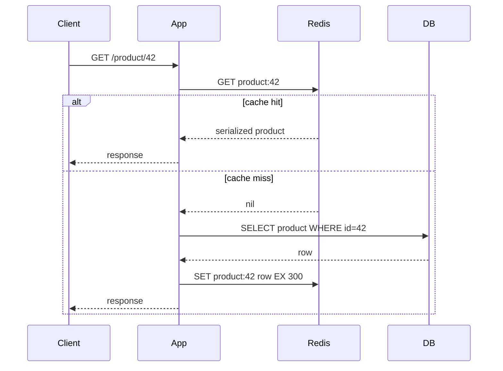
```mermaid
sequenceDiagram
  participant Client
  participant App
  participant Redis
  participant DB

  Client->>App: GET /product/42
  App->>Redis: GET product:42
  alt cache hit
    Redis-->>App: serialized product
    App-->>Client: response
  else cache miss
    Redis-->>App: nil
    App->>DB: SELECT product WHERE id=42
    DB-->>App: row
    App->>Redis: SET product:42 row EX 300
    App-->>Client: response
  end
```

The cache exists to move repeated reads away from the database. It also absorbs bursts, hides expensive joins or remote calls, and lets the app serve stable data from memory. But every cached answer creates a second truth candidate. The architecture must decide which copy wins during updates, failures, and retries.

---

## Cache Lifecycle

A cache entry moves through a lifecycle:

1. **Miss:** key is absent, expired, evicted, or inaccessible.
2. **Load:** application queries the source of truth or computes the value.
3. **Populate:** value is written to Redis with a TTL, version, or invalidation policy.
4. **Hit:** future reads return the cached bytes.
5. **Refresh:** value is rebuilt before or after expiry.
6. **Invalidate:** mutation deletes the key or marks it stale.
7. **Expire or evict:** Redis removes the key because of TTL or memory pressure.

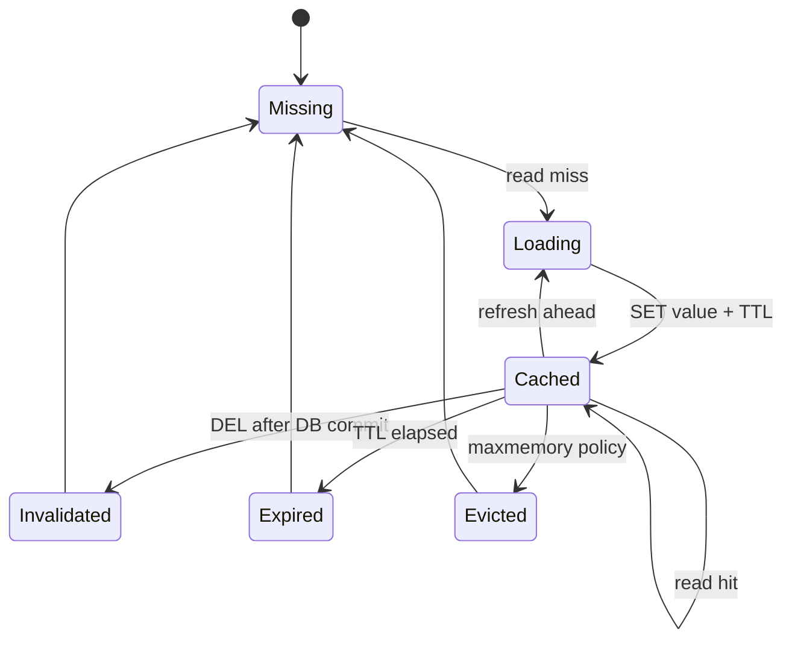
```mermaid
stateDiagram-v2
  [*] --> Missing
  Missing --> Loading: read miss
  Loading --> Cached: SET value + TTL
  Cached --> Cached: read hit
  Cached --> Loading: refresh ahead
  Cached --> Invalidated: DEL after DB commit
  Cached --> Expired: TTL elapsed
  Cached --> Evicted: maxmemory policy
  Invalidated --> Missing
  Expired --> Missing
  Evicted --> Missing
```

Good cache design is lifecycle design. A value should not enter the cache unless you know how it leaves.

---

## Read Flow

The read path decides whether the app trusts Redis, rebuilds the value, or fails open to the database.

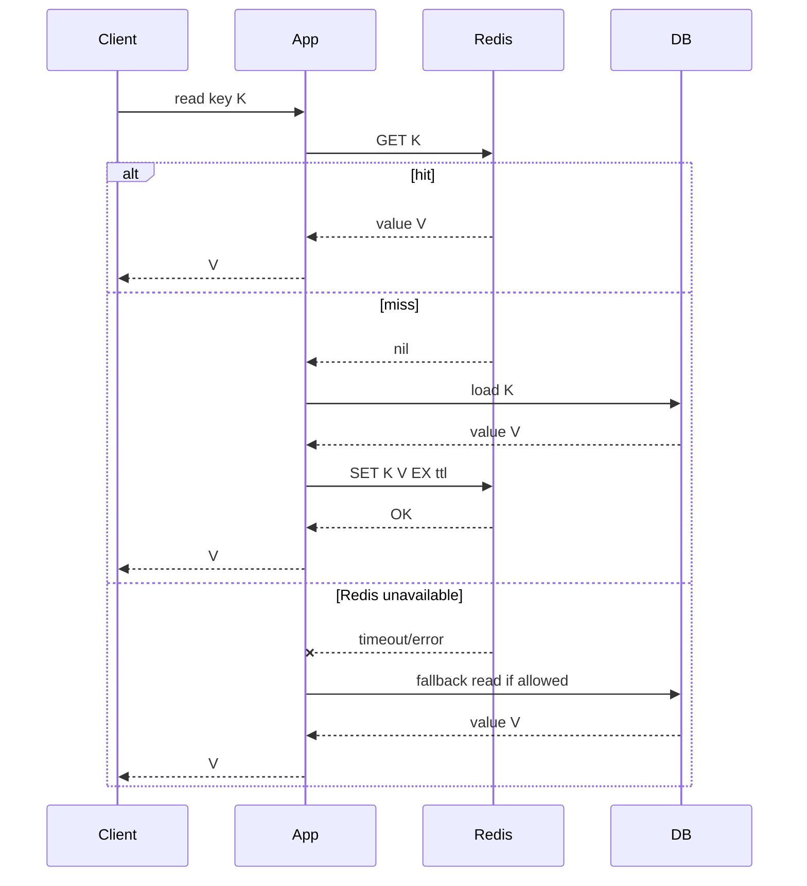
```mermaid
sequenceDiagram
  participant Client
  participant App
  participant Redis
  participant DB

  Client->>App: read key K
  App->>Redis: GET K
  alt hit
    Redis-->>App: value V
    App-->>Client: V
  else miss
    Redis-->>App: nil
    App->>DB: load K
    DB-->>App: value V
    App->>Redis: SET K V EX ttl
    Redis-->>App: OK
    App-->>Client: V
  else Redis unavailable
    Redis--x App: timeout/error
    App->>DB: fallback read if allowed
    DB-->>App: value V
    App-->>Client: V
  end
```

Internal behavior:

- A cache hit still costs network, serialization, deserialization, and Redis event-loop time.
- A cache miss costs Redis plus database plus cache population.
- A timeout is worse than a miss because the app spends latency budget waiting before falling back.
- A local in-process cache in front of Redis reduces network calls but adds another invalidation layer.
- A read path must have timeout, retry, circuit breaker, and fallback rules. Unlimited retries can amplify an outage.

---

## Write Flow

Writes are where caches become dangerous. A database write and a cache operation are usually two separate network calls. Unless both are inside a carefully designed transaction boundary, failures can leave the two copies inconsistent.

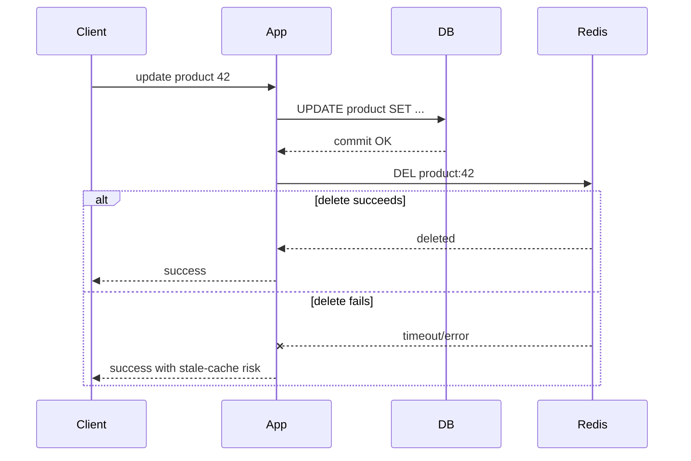
```mermaid
sequenceDiagram
  participant Client
  participant App
  participant DB
  participant Redis

  Client->>App: update product 42
  App->>DB: UPDATE product SET ...
  DB-->>App: commit OK
  App->>Redis: DEL product:42
  alt delete succeeds
    Redis-->>App: deleted
    App-->>Client: success
  else delete fails
    Redis--x App: timeout/error
    App-->>Client: success with stale-cache risk
  end
```

The common production pattern is **write database first, then delete cache**. The next read misses and rebuilds the value from the database.

Why not update cache directly after the write? Because an update is another write with ordering problems. If two writers race, the older writer can overwrite the newer value in Redis even when the database has the newer value.

---

## Why Cache Delete Is Preferred Over Update

Deleting cache after a database commit is preferred because it converts correctness risk into a controlled miss.

### Update Race

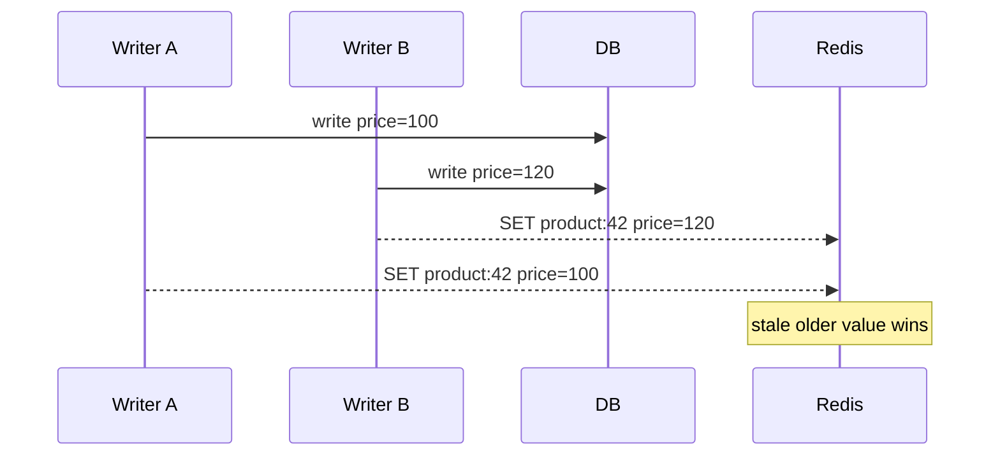
```mermaid
sequenceDiagram
  participant A as Writer A
  participant B as Writer B
  participant DB
  participant Redis

  A->>DB: write price=100
  B->>DB: write price=120
  B-->>Redis: SET product:42 price=120
  A-->>Redis: SET product:42 price=100
  Note over Redis: stale older value wins
```

### Delete Race

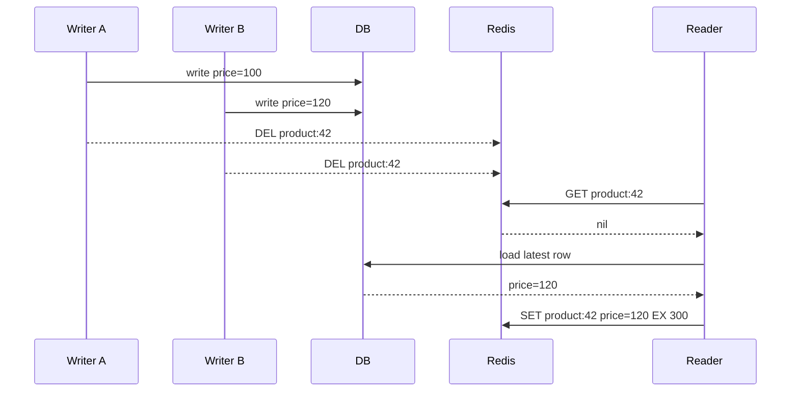
```mermaid
sequenceDiagram
  participant A as Writer A
  participant B as Writer B
  participant DB
  participant Redis
  participant Reader

  A->>DB: write price=100
  B->>DB: write price=120
  A-->>Redis: DEL product:42
  B-->>Redis: DEL product:42
  Reader->>Redis: GET product:42
  Redis-->>Reader: nil
  Reader->>DB: load latest row
  DB-->>Reader: price=120
  Reader->>Redis: SET product:42 price=120 EX 300
```

Delete is not magic. It can fail, arrive late, or race with a read that repopulates old data. But compared with update, delete avoids writing a guessed final value into the cache. It makes the database the only place where the final value is decided.

For sensitive flows, combine delete with:

- short TTL safety net
- versioned cache values
- delayed double delete
- CDC-based invalidation
- idempotent invalidation events

---

## TTL

TTL is a time-based safety net. It bounds how long a stale value can survive after a missed invalidation.

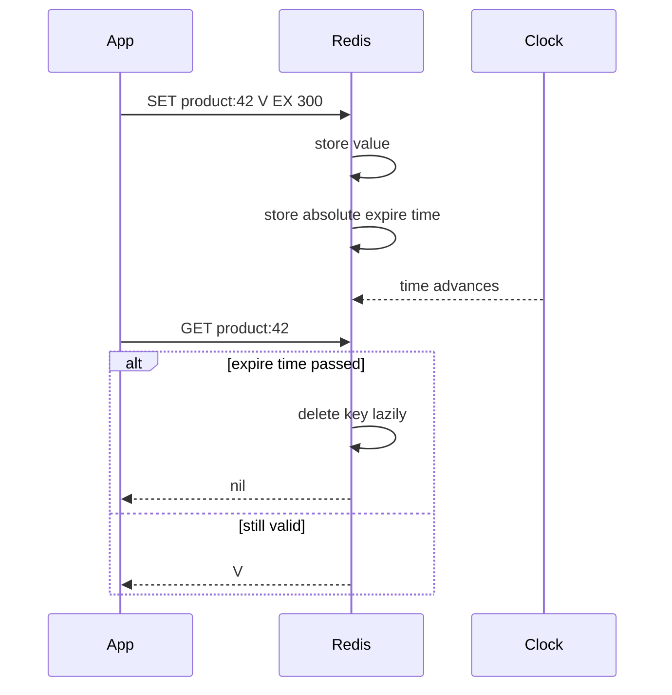
```mermaid
sequenceDiagram
  participant App
  participant Redis
  participant Clock

  App->>Redis: SET product:42 V EX 300
  Redis->>Redis: store value
  Redis->>Redis: store absolute expire time
  Clock-->>Redis: time advances
  App->>Redis: GET product:42
  alt expire time passed
    Redis->>Redis: delete key lazily
    Redis-->>App: nil
  else still valid
    Redis-->>App: V
  end
```

TTL is not an exact timer that fires precisely when the key expires. Redis stores expiration metadata and removes keys in two main ways:

- **Lazy expiration:** when a client accesses a key, Redis checks whether it is expired. If expired, Redis deletes it and returns a miss.
- **Active expiration:** Redis periodically samples keys with TTLs and deletes expired ones in the background.

This means expired keys can occupy memory briefly if they are not accessed and not selected by active expiration sampling. Under heavy expiry churn, expiration work can consume CPU and create latency spikes.

Production TTL rules:

- Always set TTL for cache-aside values unless the key is invalidated by a stronger lifecycle.
- Add jitter so many keys do not expire at the same second.
- Use shorter TTL for high-change data and longer TTL for stable reference data.
- Do not use TTL as the only correctness mechanism for money, inventory, booking, or authorization decisions.

---

## Eviction

Expiration removes keys because their TTL elapsed. Eviction removes keys because Redis needs memory.

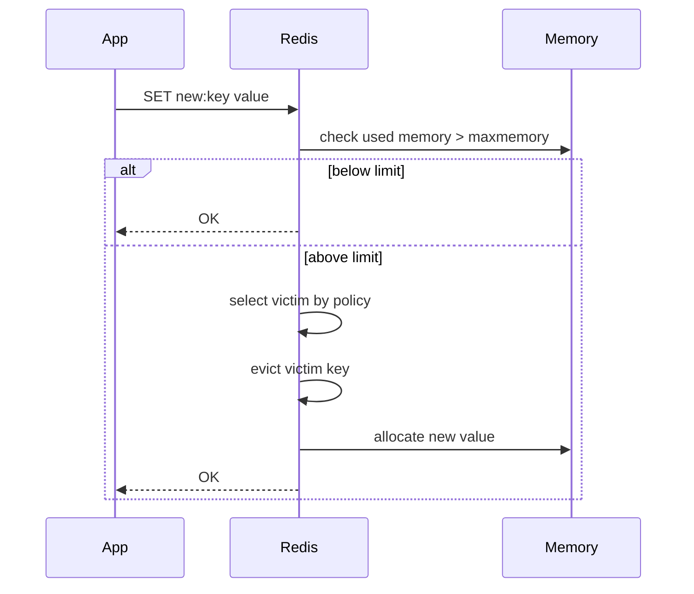
```mermaid
sequenceDiagram
  participant App
  participant Redis
  participant Memory

  App->>Redis: SET new:key value
  Redis->>Memory: check used memory > maxmemory
  alt below limit
    Redis-->>App: OK
  else above limit
    Redis->>Redis: select victim by policy
    Redis->>Redis: evict victim key
    Redis->>Memory: allocate new value
    Redis-->>App: OK
  end
```

Common policies:

| Policy | Internal behavior | Use when |
| :--- | :--- | :--- |
| `noeviction` | Reject writes when memory is full | Redis stores data you cannot discard |
| `allkeys-lru` | Evict approximately least recently used key from all keys | General cache |
| `volatile-lru` | Evict approximately LRU key only among keys with TTL | Mixed cache and persistent keys |
| `allkeys-lfu` | Evict approximately least frequently used key | Skewed traffic with hot keys |
| `volatile-ttl` | Prefer keys with nearest expiry | TTL-heavy workloads |

Redis eviction is approximate, not a perfect global sort. It samples keys and chooses likely victims. That keeps eviction fast enough for an in-memory server, but it means a valuable key can still be evicted under pressure.

---

## Cache Aside

Cache-aside means the application owns the cache logic. Redis does not know how to load missing data.

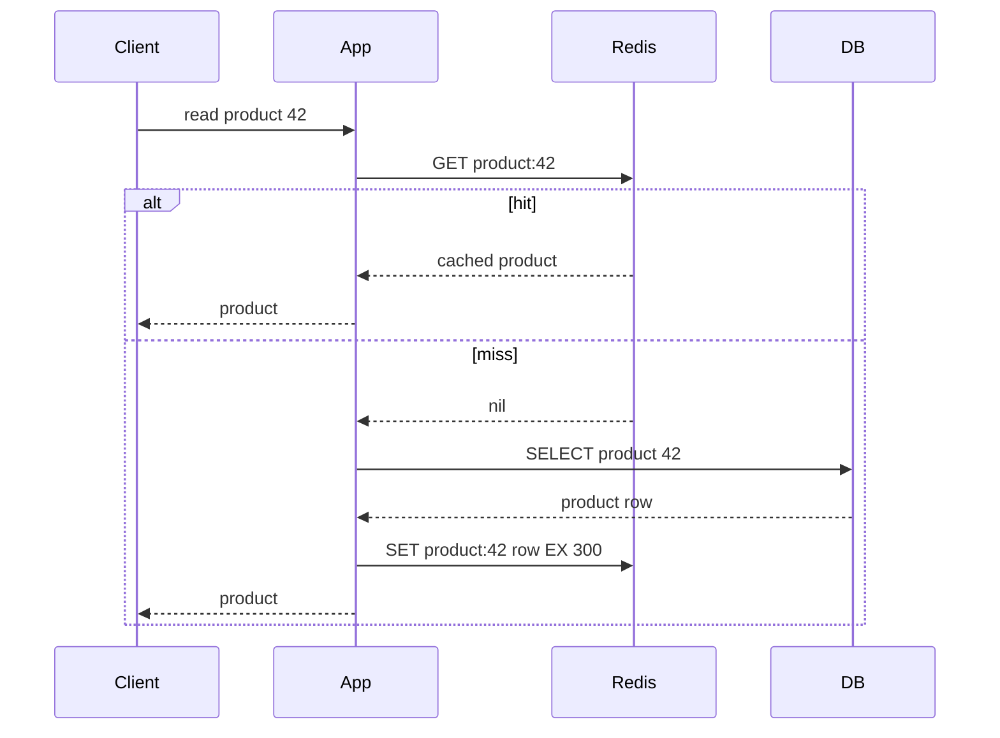
```mermaid
sequenceDiagram
  participant Client
  participant App
  participant Redis
  participant DB

  Client->>App: read product 42
  App->>Redis: GET product:42
  alt hit
    Redis-->>App: cached product
    App-->>Client: product
  else miss
    Redis-->>App: nil
    App->>DB: SELECT product 42
    DB-->>App: product row
    App->>Redis: SET product:42 row EX 300
    App-->>Client: product
  end
```

Write side:

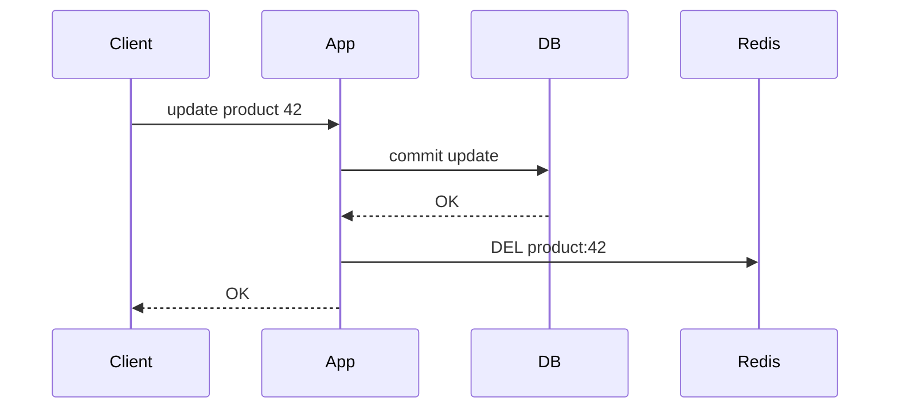
```mermaid
sequenceDiagram
  participant Client
  participant App
  participant DB
  participant Redis

  Client->>App: update product 42
  App->>DB: commit update
  DB-->>App: OK
  App->>Redis: DEL product:42
  App-->>Client: OK
```

Internal behavior:

- Cache is populated only after reads.
- Cold data never enters Redis.
- First read after deletion pays database cost.
- Invalidations are explicit and easy to reason about.
- Stale data appears when delete fails, read repopulates too early, or TTL is too long.

Cache-aside is the default for product catalogs, profiles, configuration snapshots, and read-heavy reference data.

---

## Write Through

Write-through means the write path updates cache and database together. The app usually waits for both.

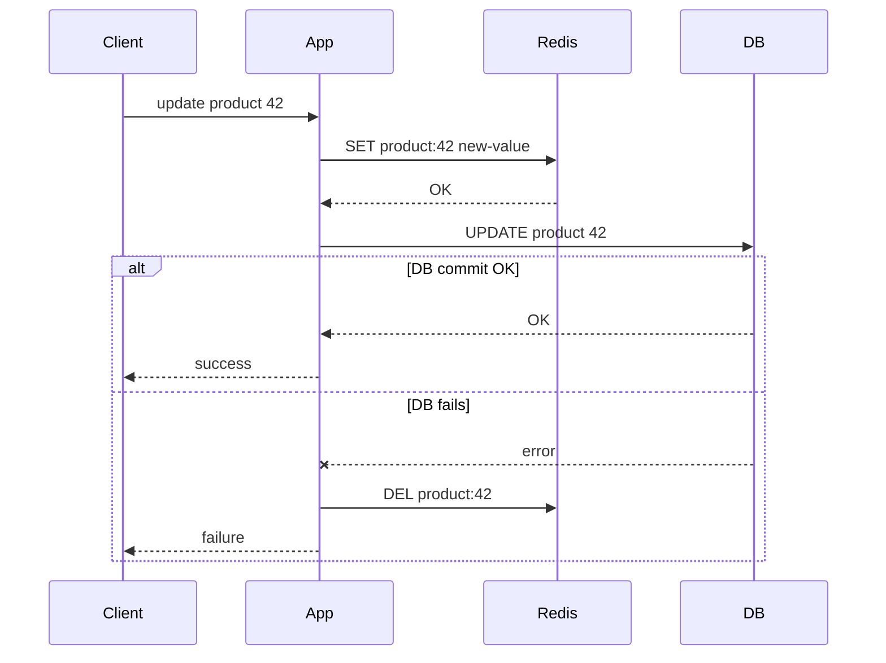
```mermaid
sequenceDiagram
  participant Client
  participant App
  participant Redis
  participant DB

  Client->>App: update product 42
  App->>Redis: SET product:42 new-value
  Redis-->>App: OK
  App->>DB: UPDATE product 42
  alt DB commit OK
    DB-->>App: OK
    App-->>Client: success
  else DB fails
    DB--x App: error
    App->>Redis: DEL product:42
    App-->>Client: failure
  end
```

Some systems write DB first and then cache; others write cache first and then DB. Either way, there is no free atomicity across Redis and the database.

Internal behavior:

- Reads are fast because cache is expected to contain the latest value.
- Writes are slower because the write path touches two systems.
- Partial failure needs compensation.
- Concurrent writers need versions, compare-and-set, or source-of-truth ordering.

Use write-through when reads must see newly written values quickly and write volume is manageable. Avoid it when database and cache updates cannot be safely ordered.

---

## Write Behind

Write-behind means the app writes to cache or a queue first, returns success, and persists to the database asynchronously.

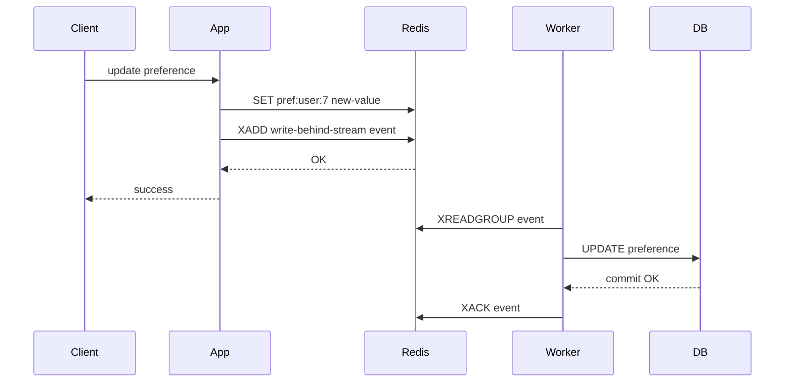
```mermaid
sequenceDiagram
  participant Client
  participant App
  participant Redis
  participant Worker
  participant DB

  Client->>App: update preference
  App->>Redis: SET pref:user:7 new-value
  App->>Redis: XADD write-behind-stream event
  Redis-->>App: OK
  App-->>Client: success
  Worker->>Redis: XREADGROUP event
  Worker->>DB: UPDATE preference
  DB-->>Worker: commit OK
  Worker->>Redis: XACK event
```

Internal behavior:

- User latency is low because DB write is off the request path.
- Redis or a durable queue becomes part of the write reliability path.
- Data can be lost if the cache accepts the write but the async pipeline loses the event.
- Reads may observe data that is not yet durable in the database.

Write-behind is useful for low-risk, high-volume state such as counters, metrics, last-seen timestamps, and preferences. It is dangerous for payments, bookings, and inventory reservations unless the queue is durable, replayable, idempotent, and monitored.

---

## Refresh Ahead

Refresh-ahead reloads a value before it expires so users do not pay the miss cost.

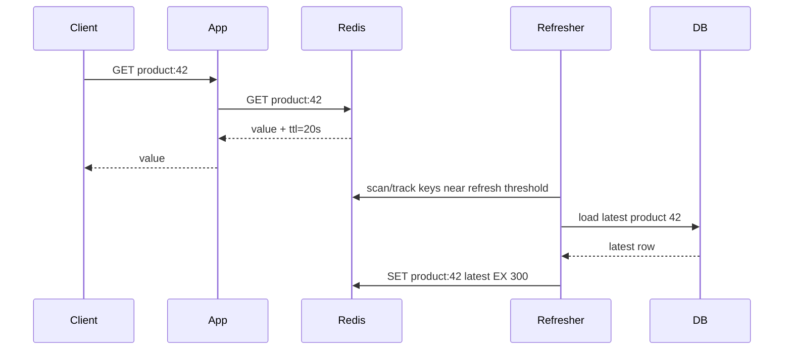
```mermaid
sequenceDiagram
  participant Client
  participant App
  participant Redis
  participant Refresher
  participant DB

  Client->>App: GET product:42
  App->>Redis: GET product:42
  Redis-->>App: value + ttl=20s
  App-->>Client: value
  Refresher->>Redis: scan/track keys near refresh threshold
  Refresher->>DB: load latest product 42
  DB-->>Refresher: latest row
  Refresher->>Redis: SET product:42 latest EX 300
```

Internal behavior:

- Refresh happens while the old value is still serveable.
- It reduces miss spikes for hot keys.
- It can waste database work refreshing keys that are no longer needed.
- It needs concurrency control so many refreshers do not rebuild the same key.

Use refresh-ahead for predictable hot data: event pages, city lists, exchange-rate snapshots, home-page feeds, and product detail pages under sale traffic.

---

## How Redis Handles Expiration

Redis expiration is built around per-key metadata and server-side cleanup.

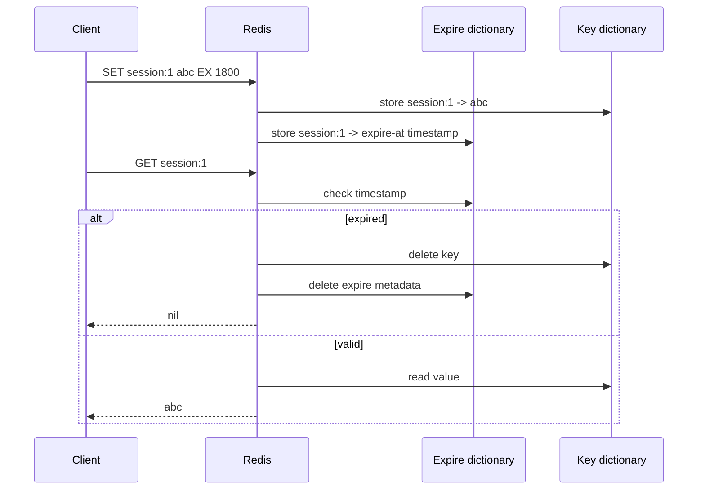
```mermaid
sequenceDiagram
  participant Client
  participant Redis
  participant ExpireDict as Expire dictionary
  participant MainDict as Key dictionary

  Client->>Redis: SET session:1 abc EX 1800
  Redis->>MainDict: store session:1 -> abc
  Redis->>ExpireDict: store session:1 -> expire-at timestamp
  Client->>Redis: GET session:1
  Redis->>ExpireDict: check timestamp
  alt expired
    Redis->>MainDict: delete key
    Redis->>ExpireDict: delete expire metadata
    Redis-->>Client: nil
  else valid
    Redis->>MainDict: read value
    Redis-->>Client: abc
  end
```

Important internals:

- Redis stores TTL as an absolute expiry timestamp.
- Reads trigger lazy deletion for expired keys.
- The active expiry cycle samples expiring keys and deletes expired ones.
- Expiry events are not a reliable business workflow trigger; use streams, queues, or CDC for business processing.
- Replicas receive expiration effects from the primary, so the primary remains authoritative for key expiry behavior.

---

## Distributed Cache

A distributed cache spreads keys across multiple nodes so memory and throughput scale horizontally.

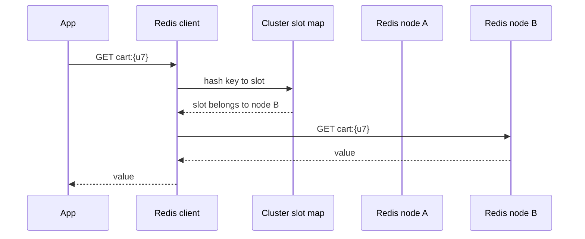
```mermaid
sequenceDiagram
  participant App
  participant ClientLib as Redis client
  participant SlotMap as Cluster slot map
  participant N1 as Redis node A
  participant N2 as Redis node B

  App->>ClientLib: GET cart:{u7}
  ClientLib->>SlotMap: hash key to slot
  SlotMap-->>ClientLib: slot belongs to node B
  ClientLib->>N2: GET cart:{u7}
  N2-->>ClientLib: value
  ClientLib-->>App: value
```

Distributed cache behavior:

- Client library hashes a key to a shard or Redis Cluster slot.
- Each shard owns only part of the keyspace.
- Replicas provide failover and sometimes read scaling, but replica reads can be stale.
- Cross-key operations are difficult unless keys are co-located.
- Client-side topology refresh is required after failover or resharding.

Do not think of a distributed cache as one giant map. It is many maps with routing.

---

## Redis Cluster Key Distribution

Redis Cluster divides the keyspace into 16,384 hash slots. Each primary node owns a range of slots.

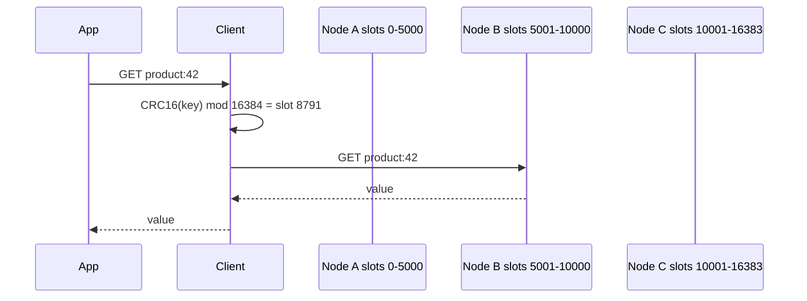
```mermaid
sequenceDiagram
  participant App
  participant Client
  participant A as Node A slots 0-5000
  participant B as Node B slots 5001-10000
  participant C as Node C slots 10001-16383

  App->>Client: GET product:42
  Client->>Client: CRC16(key) mod 16384 = slot 8791
  Client->>B: GET product:42
  B-->>Client: value
  Client-->>App: value
```

Hash tags force related keys into the same slot:

```text
cart:{user:7}
cart_items:{user:7}
cart_total:{user:7}
```

Only the substring inside `{}` is hashed, so all three keys land on the same slot. This helps multi-key operations, but overusing hash tags can create hot shards.

When a client sends a command to the wrong node, Redis Cluster returns a redirect such as `MOVED` or `ASK`. A good client updates its slot map and retries.

---

## Cache Invalidation

Invalidation means making an old cached value unservable after the source of truth changes.

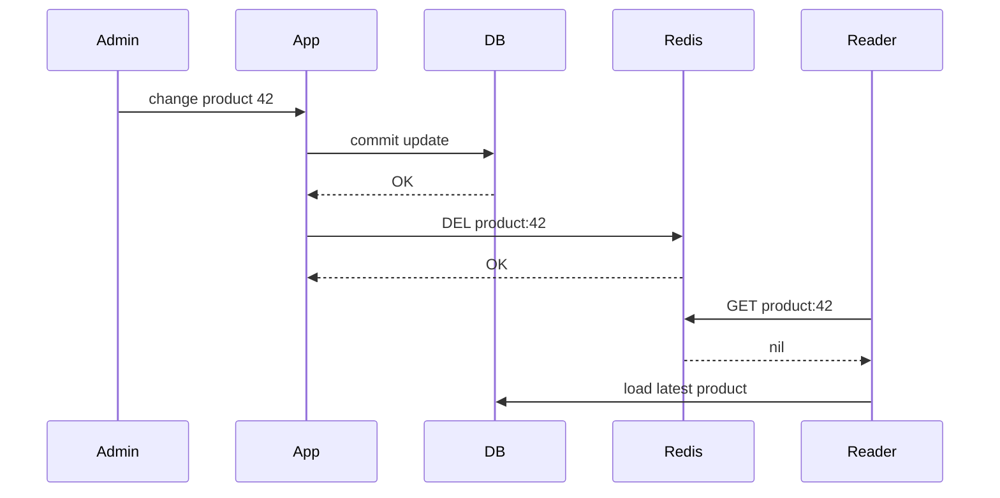
```mermaid
sequenceDiagram
  participant Admin
  participant App
  participant DB
  participant Redis
  participant Reader

  Admin->>App: change product 42
  App->>DB: commit update
  DB-->>App: OK
  App->>Redis: DEL product:42
  Redis-->>App: OK
  Reader->>Redis: GET product:42
  Redis-->>Reader: nil
  Reader->>DB: load latest product
```

Invalidation is easy for one key and hard for derived views:

- Entity key: `product:42`
- List key: `products:category:mobile:page:1`
- Search result key: `search:q=iphone`
- Aggregate key: `seller:9:rating-summary`
- Permission key: `user:7:roles`

A row update may require deleting many keys. Production systems usually maintain a key mapping convention, dependency index, or event-driven invalidation worker.

Invalidation strategies:

| Strategy | Behavior | Risk |
| :--- | :--- | :--- |
| Delete on write | App deletes known keys after DB commit | Delete can fail |
| TTL only | Wait for expiry | Stale until TTL |
| Versioned keys | Include version in key | Old keys consume memory until expiry |
| Pub/Sub invalidation | Broadcast delete to app-local caches | Messages can be missed |
| CDC invalidation | Delete based on DB change log | Lag and event ordering must be handled |

---

## CDC Invalidation

CDC invalidation moves cache invalidation out of the request path. The database commit becomes the source of invalidation events.

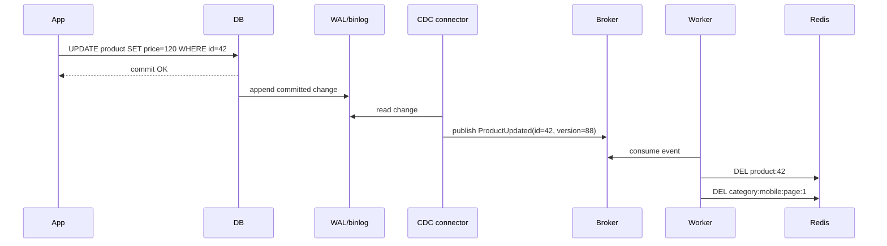
```mermaid
sequenceDiagram
  participant App
  participant DB
  participant WAL as WAL/binlog
  participant CDC as CDC connector
  participant Broker
  participant Worker
  participant Redis

  App->>DB: UPDATE product SET price=120 WHERE id=42
  DB-->>App: commit OK
  DB->>WAL: append committed change
  CDC->>WAL: read change
  CDC->>Broker: publish ProductUpdated(id=42, version=88)
  Worker->>Broker: consume event
  Worker->>Redis: DEL product:42
  Worker->>Redis: DEL category:mobile:page:1
```

Why CDC helps:

- The app does not need to dual-write DB and cache.
- If the app crashes after DB commit, CDC can still observe the committed change.
- Multiple services can subscribe to the same source-of-truth changes.
- Invalidation is retryable and observable.

CDC failure modes:

- CDC lag keeps stale values alive longer.
- Out-of-order events can delete or rebuild the wrong version unless events carry versions.
- Schema changes can break event parsing.
- Replaying old events can cause unexpected deletes unless handlers are idempotent.

Good CDC invalidation deletes keys, records event offsets, tracks lag, and includes entity version or `updated_at` in the payload.

---

## Cache Stampede

A cache stampede happens when many callers miss the same key at the same time and all rebuild it.

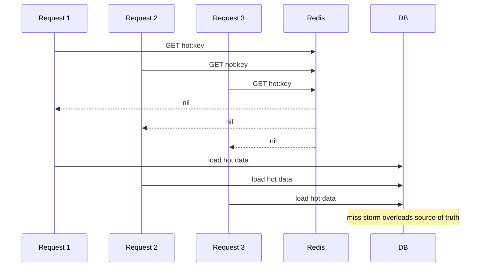
```mermaid
sequenceDiagram
  participant R1 as Request 1
  participant R2 as Request 2
  participant R3 as Request 3
  participant Redis
  participant DB

  R1->>Redis: GET hot:key
  R2->>Redis: GET hot:key
  R3->>Redis: GET hot:key
  Redis-->>R1: nil
  Redis-->>R2: nil
  Redis-->>R3: nil
  R1->>DB: load hot data
  R2->>DB: load hot data
  R3->>DB: load hot data
  Note over DB: miss storm overloads source of truth
```

Causes:

- hot key expires during peak traffic
- Redis restarts and loses warm cache
- deploy changes key format and invalidates many keys
- TTL values are synchronized
- cache node becomes unavailable and all callers fall back to DB

Mitigations:

- `SETNX` single-flight lock
- stale-while-revalidate
- refresh-ahead
- TTL jitter
- request coalescing inside the app
- rate limiting and circuit breaking database fallback

---

## SETNX Single-Flight

`SETNX` means "set if not exists." In modern Redis, use `SET lock:key token NX PX 5000`. It atomically creates a short-lived lock only if no lock exists.

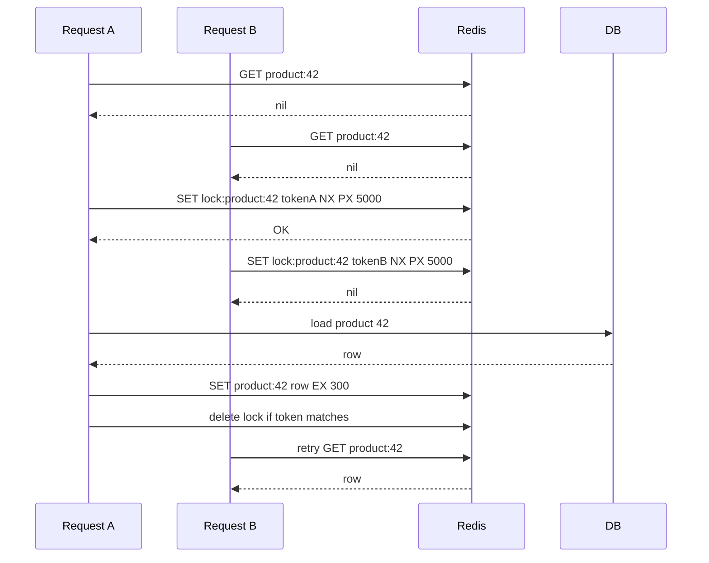
```mermaid
sequenceDiagram
  participant A as Request A
  participant B as Request B
  participant Redis
  participant DB

  A->>Redis: GET product:42
  Redis-->>A: nil
  B->>Redis: GET product:42
  Redis-->>B: nil
  A->>Redis: SET lock:product:42 tokenA NX PX 5000
  Redis-->>A: OK
  B->>Redis: SET lock:product:42 tokenB NX PX 5000
  Redis-->>B: nil
  A->>DB: load product 42
  DB-->>A: row
  A->>Redis: SET product:42 row EX 300
  A->>Redis: delete lock if token matches
  B->>Redis: retry GET product:42
  Redis-->>B: row
```

Important details:

- The lock must have a TTL or a crashed owner can block rebuild forever.
- The lock value should be a unique token.
- Delete the lock only if the token still matches; otherwise one request may delete another request's lock.
- The lock TTL must be longer than normal rebuild time but short enough to recover from crashes.
- Locking every key is unnecessary; protect hot or expensive keys.

---

## Hot Keys

A hot key is a key that receives disproportionate traffic. Redis is single-threaded for command execution per shard, so one hot key can saturate one node even if the cluster has many nodes.

```mermaid
sequenceDiagram
  participant Clients
  participant Cluster
  participant A as Node A
  participant B as Node B
  participant C as Node C

  Clients->>Cluster: many GET flash_sale:sku:99
  Cluster->>B: all requests route to same slot
  B-->>Cluster: responses
  Note over B: one shard becomes bottleneck
  Note over A,C: other shards remain underused
```

Hot keys happen when:

- one celebrity profile, event, match, product, or payment status is read by everyone
- a global config key is read on every request
- a lock key becomes contended
- a leaderboard or inventory key receives constant updates
- hash tags force too many related keys onto one slot

Mitigations:

- local in-process cache for ultra-hot read-only values
- key replication at app level: `hot:key:0..N`
- CDN or edge cache for public content
- request coalescing
- sharded counters for write-heavy keys
- separate Redis cluster for extreme hot workloads

---

## Production Failures

### Redis Crash

```mermaid
sequenceDiagram
  participant App
  participant Redis
  participant DB
  participant Sentinel as Sentinel/Cluster

  App->>Redis: GET product:42
  Redis--x App: connection reset
  Sentinel->>Sentinel: detect failure
  Sentinel->>Redis: promote replica or update topology
  App->>App: reconnect and refresh slot map
  App->>DB: fallback read if allowed
```

Failure behavior:

- All cache hits become misses or timeouts.
- App connection pools may pile up waiting on dead sockets.
- Failover can promote a replica with slightly stale data.
- A cold restarted Redis can trigger database overload.

Controls:

- short Redis timeouts
- circuit breaker around cache calls
- warmup for critical keys
- DB fallback rate limits
- replicas, Sentinel, or Cluster failover
- persistence only if Redis data must survive restart

### Cache Miss Storm

```mermaid
sequenceDiagram
  participant Clients
  participant App
  participant Redis
  participant DB

  Clients->>App: burst of reads
  App->>Redis: many GETs
  Redis-->>App: many misses
  App->>DB: many fallback queries
  DB--x App: saturation/timeouts
  App--x Clients: slow responses/errors
```

Triggers include Redis flush, deployment key change, synchronized TTL expiry, region failover, and popular event traffic. Fix with warmup, jitter, single-flight rebuild, stale serving, and fallback budgets.

### Stale Cache

```mermaid
sequenceDiagram
  participant App
  participant DB
  participant Redis
  participant User

  App->>DB: update account status=blocked
  DB-->>App: commit OK
  App->>Redis: DEL user:7
  Redis--x App: timeout
  User->>Redis: GET user:7
  Redis-->>User: old status=active
```

Stale cache is usually caused by failed invalidation, TTL too long, replica lag, local cache not receiving delete messages, or an update race. For high-risk data, use cache only for hints and revalidate against the source of truth before final decisions.

### Double Writes

```mermaid
sequenceDiagram
  participant App
  participant DB
  participant Redis

  App->>DB: write value V2
  DB-->>App: OK
  App->>Redis: write value V2
  Redis--x App: failure
  Note over DB,Redis: DB has V2, cache may still have V1
```

Double writes fail because DB and Redis do not share a transaction log. Retrying can also reorder writes. Prefer delete over update, CDC invalidation, idempotent events, and version checks.

### Race Conditions

```mermaid
sequenceDiagram
  participant Reader
  participant Writer
  participant Redis
  participant DB

  Reader->>Redis: GET product:42
  Redis-->>Reader: nil
  Reader->>DB: SELECT product 42
  Writer->>DB: UPDATE product 42 to V2
  Writer->>Redis: DEL product:42
  Reader->>Redis: SET product:42 V1 EX 300
  Note over Redis: old value repopulated after invalidation
```

This is the classic cache-aside race. Fixes include delayed double delete, versioned values, setting cache only if loaded version is current, or CDC invalidation after commit.

---

## Domain Scenarios

### BookMyShow Cache

Seat availability is high-read and high-risk. Cache can show seat maps, venue metadata, show timings, and approximate availability. The final seat lock must be handled by a transactional store or strongly controlled reservation system.

```mermaid
sequenceDiagram
  participant User
  participant App
  participant Redis
  participant DB

  User->>App: view seats for show
  App->>Redis: GET seatmap:show:123
  Redis-->>App: cached seat layout
  User->>App: reserve seat A10
  App->>DB: create reservation with constraint/lock
  DB-->>App: reserved
  App->>Redis: DEL seatmap:show:123
```

Interview answer: cache the display, not the ownership decision.

### UPI Cache

UPI systems may cache bank metadata, routing info, PSP configuration, risk rules, idempotency lookups, and short-lived payment status views. Do not use cache as the final ledger.

```mermaid
sequenceDiagram
  participant App
  participant Redis
  participant Ledger
  participant Bank

  App->>Redis: GET bank-route:vpa-domain
  Redis-->>App: route metadata
  App->>Bank: initiate payment
  Bank-->>App: pending/success/failure
  App->>Ledger: record authoritative transaction
  App->>Redis: SET payment-status:txn short TTL
```

Interview answer: cache routing and status reads; ledger correctness stays outside cache.

### Inventory Cache

Inventory is tempting to cache because reads are huge. But selling decisions must not trust a stale count.

```mermaid
sequenceDiagram
  participant User
  participant App
  participant Redis
  participant DB

  User->>App: view product
  App->>Redis: GET stock:sku:99
  Redis-->>App: approximate stock=12
  User->>App: buy 1
  App->>DB: decrement where stock > 0
  DB-->>App: success/failure
  App->>Redis: DEL stock:sku:99
```

Interview answer: cache availability display; use atomic DB update, reservation, or dedicated inventory service for commit.

### Payment Cache

Payment status is read repeatedly after checkout, but cache must not invent final state.

```mermaid
sequenceDiagram
  participant Client
  participant API
  participant Redis
  participant PaymentProvider
  participant DB

  Client->>API: poll payment status
  API->>Redis: GET payment:txn:abc
  alt cached status
    Redis-->>API: pending
  else miss
    API->>DB: read transaction status
    DB-->>API: pending
    API->>Redis: SET payment:txn:abc pending EX 10
  end
  PaymentProvider->>API: webhook success
  API->>DB: commit final success
  API->>Redis: DEL payment:txn:abc
```

Interview answer: cache short-lived status views; webhook and ledger update are authoritative.

---

## When Not To Cache

Do not cache when the cost of staleness is higher than the latency benefit.

Avoid caching:

- final payment authorization
- ledger balances used for settlement
- inventory commit decisions
- authorization decisions without very short TTL and strong invalidation
- per-user secrets, OTPs, or tokens without strict expiry and isolation
- highly volatile values where every request changes the result
- low-read data that will not be reused
- huge objects that waste memory and block network bandwidth
- queries with unbounded key cardinality

A good interview answer is not "cache everything." A good answer is "cache derived, repeatable, safe-to-be-stale reads; keep decisions that move money, stock, access, or ownership on the source-of-truth path."

---

## Top Interview Questions

### 1. Why does cache-aside usually delete instead of update?

Delete forces the next read to rebuild from the database. Updating cache can write an older value after a newer database commit when concurrent writers race.

### 2. What happens when a Redis key expires?

Redis stores an expiry timestamp. The key can be removed lazily when accessed or actively by periodic expiry sampling. Expiry is not a precise business scheduler.

### 3. How does cache stampede happen?

A hot key expires or disappears, many requests miss together, and all of them query the database. The database becomes overloaded by rebuild traffic.

### 4. How does `SETNX` prevent stampede?

Only one request atomically creates the rebuild lock. That request loads the database and repopulates cache. Other requests wait, retry, or serve stale data.

### 5. Why is Redis Cluster not automatically protected from hot keys?

Cluster spreads keys across slots, but one key belongs to one slot on one primary. If all traffic targets that key, one node is overloaded while others stay idle.

### 6. What is the safest invalidation strategy?

For many production systems: database commit, CDC event from WAL/binlog, idempotent invalidation worker, cache delete, and TTL as backup.

### 7. How do you handle Redis crash?

Use short timeouts, circuit breakers, topology-aware clients, failover, fallback budgets, warmup, and database protection. Never let cache failure create unlimited database traffic.

### 8. What is stale-while-revalidate?

The app serves an old but acceptable value while one background worker refreshes the cache. This trades freshness for availability and protects the database.

### 9. What should be cached in BookMyShow?

Seat layout, show metadata, venue data, and approximate availability. Final reservation must use transactional locking or a dedicated reservation service.

### 10. What should not be cached in payments?

The authoritative ledger decision. Cache can store short-lived status views, idempotency hints, and routing metadata, but final money movement belongs to durable systems.

---

## See Also

- [Previous: Lua Scripts](/redis-cheatsheet/04-distributed-systems/lua-scripts/)
- [Next: Cache Invalidation](/redis-cheatsheet/05-production-patterns/cache-invalidation/)
- [Redis Handbook Index](/redis-cheatsheet/)
- [Top 150 Interview Questions](/redis-cheatsheet/08-interview-guide/top-150-interview-questions/)
