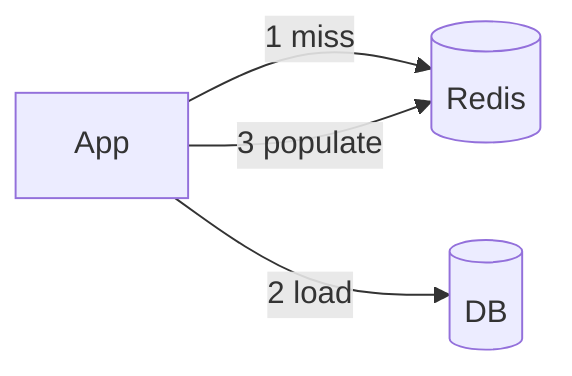

## Executive Summary

Standard cache patterns with Redis: **cache-aside**, **read-through**, **write-through**, **write-behind** — plus **stampede** protection with locks or probabilistic early expiry.

---

## Core Concepts



| Pattern | Flow |
| :--- | :--- |
| **Cache-aside** | App reads cache; on miss loads DB and sets cache |
| **Write-through** | Write DB + cache together |
| **Write-behind** | Write cache; async flush to DB |
| **TTL jitter** | See [Cache Avalanche](/redis-cheatsheet/05-production-patterns/cache-avalanche/) |

---

## Quick Reference

Cache-aside:
```bash
GET key || (load DB; SET key val EX 300)
```

Invalidate:
```bash
DEL key
# or PUBLISH cache:invalidate key
```

---

## Snippets

### Stampede lock

For lock strategy and hot-key rebuild flow, see [Cache Breakdown](/redis-cheatsheet/05-production-patterns/cache-breakdown/).

### Probabilistic early expiration

See [Cache Avalanche](/redis-cheatsheet/05-production-patterns/cache-avalanche/) for expiry spread patterns.

---

## Common Gotchas

| Pitfall | Fix |
| :--- | :--- |
| Cache inconsistency after DB update | Use [Cache Invalidation](/redis-cheatsheet/05-production-patterns/cache-invalidation/) patterns |
| Same TTL for all keys | Expiry stampede — add jitter |
| Caching null forever | See [Cache Penetration](/redis-cheatsheet/05-production-patterns/cache-penetration/) |

---

## How would you place Redis relative to the database in a read-heavy catalog service?

### Short Answer
For this question, the architecturally correct Redis answer is matching Redis data type to access pattern — not defaulting everything to JSON strings for: How would you place Redis relative to the database in a read-heavy catalog service.

### Detailed Explanation
Pick strings for counters/cache blobs, hashes for field updates, sets/ZSETs for uniqueness/ranking, Streams for durable queues for: How would you place Redis relative to the database in a read-heavy catalog service.

### Internal Working
Encoding upgrades and command complexity (O(N) vs O(1)) follow from type and size choices for: How would you place Redis relative to the database in a read-heavy catalog service.

### Production Notes
You justify it by proving behavior with INFO, slowlog, and workload replay before changing topology by validating command complexity and memory per key for: How would you place Redis relative to the database in a read-heavy catalog service.

### Common Mistakes
Using `HGETALL` or `SMEMBERS` on large collections blocks the event loop for: How would you place Redis relative to the database in a read-heavy catalog service.

### Follow-up Questions
Which type would you choose for: How would you place Redis relative to the database in a read-heavy catalog service, and what command path proves it under peak cardinality?

---
## How would you map cache patterns (aside, through, behind) to team ownership boundaries?

### Short Answer
For this question, the architecturally correct Redis answer is matching Redis data type to access pattern — not defaulting everything to JSON strings for: How would you map cache patterns (aside, through, behind) to team ownership boundaries.

### Detailed Explanation
Pick strings for counters/cache blobs, hashes for field updates, sets/ZSETs for uniqueness/ranking, Streams for durable queues for: How would you map cache patterns (aside, through, behind) to team ownership boundaries.

### Internal Working
Encoding upgrades and command complexity (O(N) vs O(1)) follow from type and size choices for: How would you map cache patterns (aside, through, behind) to team ownership boundaries.

### Production Notes
You justify it by proving behavior with INFO, slowlog, and workload replay before changing topology by validating command complexity and memory per key for: How would you map cache patterns (aside, through, behind) to team ownership boundaries.

### Common Mistakes
Using `HGETALL` or `SMEMBERS` on large collections blocks the event loop for: How would you map cache patterns (aside, through, behind) to team ownership boundaries.

### Follow-up Questions
Which type would you choose for: How would you map cache patterns (aside, through, behind) to team ownership boundaries, and what command path proves it under peak cardinality?

---
## Walk through cache-aside read and write invalidation for an updated product record.

### Short Answer
The practical Redis answer is deleting or updating cache keys on write and broadcasting invalidation when multi-tier caches exist for: Walk through cache-aside read and write invalidation for an updated product record..

### Detailed Explanation
Write-through updates DB and cache together; write-behind updates cache first with async flush — each shifts consistency risk for: Walk through cache-aside read and write invalidation for an updated product record..

### Internal Working
Pub/Sub can signal app-local cache eviction, but Redis remains source for shared cache layer for: Walk through cache-aside read and write invalidation for an updated product record..

### Production Notes
You justify it by measuring p99 latency, memory headroom, and failover behavior under realistic skew by defining who invalidates on partial updates and out-of-order writes for: Walk through cache-aside read and write invalidation for an updated product record..

### Common Mistakes
Updating DB without cache delete is the most common stale-data bug for: Walk through cache-aside read and write invalidation for an updated product record..

### Follow-up Questions
How do you invalidate related keys (lists, aggregates) when: Walk through cache-aside read and write invalidation for an updated product record. updates one entity?

---
<!-- interview-answers:end -->

---

## How would you place Redis relative to the database in a read-heavy catalog service?

### Short Answer
For this question, the architecturally correct Redis answer is matching Redis data type to access pattern — not defaulting everything to JSON strings for: How would you place Redis relative to the database in a read-heavy catalog service.

### Detailed Explanation
Pick strings for counters/cache blobs, hashes for field updates, sets/ZSETs for uniqueness/ranking, Streams for durable queues for: How would you place Redis relative to the database in a read-heavy catalog service.

### Internal Working
Encoding upgrades and command complexity (O(N) vs O(1)) follow from type and size choices for: How would you place Redis relative to the database in a read-heavy catalog service.

### Production Notes
You justify it by proving behavior with INFO, slowlog, and workload replay before changing topology by validating command complexity and memory per key for: How would you place Redis relative to the database in a read-heavy catalog service.

### Common Mistakes
Using `HGETALL` or `SMEMBERS` on large collections blocks the event loop for: How would you place Redis relative to the database in a read-heavy catalog service.

### Follow-up Questions
Which type would you choose for: How would you place Redis relative to the database in a read-heavy catalog service, and what command path proves it under peak cardinality?

---
## How would you map cache patterns (aside, through, behind) to team ownership boundaries?

### Short Answer
For this question, the architecturally correct Redis answer is matching Redis data type to access pattern — not defaulting everything to JSON strings for: How would you map cache patterns (aside, through, behind) to team ownership boundaries.

### Detailed Explanation
Pick strings for counters/cache blobs, hashes for field updates, sets/ZSETs for uniqueness/ranking, Streams for durable queues for: How would you map cache patterns (aside, through, behind) to team ownership boundaries.

### Internal Working
Encoding upgrades and command complexity (O(N) vs O(1)) follow from type and size choices for: How would you map cache patterns (aside, through, behind) to team ownership boundaries.

### Production Notes
You justify it by proving behavior with INFO, slowlog, and workload replay before changing topology by validating command complexity and memory per key for: How would you map cache patterns (aside, through, behind) to team ownership boundaries.

### Common Mistakes
Using `HGETALL` or `SMEMBERS` on large collections blocks the event loop for: How would you map cache patterns (aside, through, behind) to team ownership boundaries.

### Follow-up Questions
Which type would you choose for: How would you map cache patterns (aside, through, behind) to team ownership boundaries, and what command path proves it under peak cardinality?

---
## Walk through cache-aside read and write invalidation for an updated product record.

### Short Answer
The practical Redis answer is deleting or updating cache keys on write and broadcasting invalidation when multi-tier caches exist for: Walk through cache-aside read and write invalidation for an updated product record..

### Detailed Explanation
Write-through updates DB and cache together; write-behind updates cache first with async flush — each shifts consistency risk for: Walk through cache-aside read and write invalidation for an updated product record..

### Internal Working
Pub/Sub can signal app-local cache eviction, but Redis remains source for shared cache layer for: Walk through cache-aside read and write invalidation for an updated product record..

### Production Notes
You justify it by measuring p99 latency, memory headroom, and failover behavior under realistic skew by defining who invalidates on partial updates and out-of-order writes for: Walk through cache-aside read and write invalidation for an updated product record..

### Common Mistakes
Updating DB without cache delete is the most common stale-data bug for: Walk through cache-aside read and write invalidation for an updated product record..

### Follow-up Questions
How do you invalidate related keys (lists, aggregates) when: Walk through cache-aside read and write invalidation for an updated product record. updates one entity?

---
<!-- interview-answers:end -->

---

## How would you place Redis relative to the database in a read-heavy catalog service?

### Short Answer
For this question, the architecturally correct Redis answer is matching Redis data type to access pattern — not defaulting everything to JSON strings for: How would you place Redis relative to the database in a read-heavy catalog service.

### Detailed Explanation
Pick strings for counters/cache blobs, hashes for field updates, sets/ZSETs for uniqueness/ranking, Streams for durable queues for: How would you place Redis relative to the database in a read-heavy catalog service.

### Internal Working
Encoding upgrades and command complexity (O(N) vs O(1)) follow from type and size choices for: How would you place Redis relative to the database in a read-heavy catalog service.

### Production Notes
You justify it by proving behavior with INFO, slowlog, and workload replay before changing topology by validating command complexity and memory per key for: How would you place Redis relative to the database in a read-heavy catalog service.

### Common Mistakes
Using `HGETALL` or `SMEMBERS` on large collections blocks the event loop for: How would you place Redis relative to the database in a read-heavy catalog service.

### Follow-up Questions
Which type would you choose for: How would you place Redis relative to the database in a read-heavy catalog service, and what command path proves it under peak cardinality?

---
## How would you map cache patterns (aside, through, behind) to team ownership boundaries?

### Short Answer
For this question, the architecturally correct Redis answer is matching Redis data type to access pattern — not defaulting everything to JSON strings for: How would you map cache patterns (aside, through, behind) to team ownership boundaries.

### Detailed Explanation
Pick strings for counters/cache blobs, hashes for field updates, sets/ZSETs for uniqueness/ranking, Streams for durable queues for: How would you map cache patterns (aside, through, behind) to team ownership boundaries.

### Internal Working
Encoding upgrades and command complexity (O(N) vs O(1)) follow from type and size choices for: How would you map cache patterns (aside, through, behind) to team ownership boundaries.

### Production Notes
You justify it by proving behavior with INFO, slowlog, and workload replay before changing topology by validating command complexity and memory per key for: How would you map cache patterns (aside, through, behind) to team ownership boundaries.

### Common Mistakes
Using `HGETALL` or `SMEMBERS` on large collections blocks the event loop for: How would you map cache patterns (aside, through, behind) to team ownership boundaries.

### Follow-up Questions
Which type would you choose for: How would you map cache patterns (aside, through, behind) to team ownership boundaries, and what command path proves it under peak cardinality?

---
## Walk through cache-aside read and write invalidation for an updated product record.

### Short Answer
The practical Redis answer is deleting or updating cache keys on write and broadcasting invalidation when multi-tier caches exist for: Walk through cache-aside read and write invalidation for an updated product record..

### Detailed Explanation
Write-through updates DB and cache together; write-behind updates cache first with async flush — each shifts consistency risk for: Walk through cache-aside read and write invalidation for an updated product record..

### Internal Working
Pub/Sub can signal app-local cache eviction, but Redis remains source for shared cache layer for: Walk through cache-aside read and write invalidation for an updated product record..

### Production Notes
You justify it by measuring p99 latency, memory headroom, and failover behavior under realistic skew by defining who invalidates on partial updates and out-of-order writes for: Walk through cache-aside read and write invalidation for an updated product record..

### Common Mistakes
Updating DB without cache delete is the most common stale-data bug for: Walk through cache-aside read and write invalidation for an updated product record..

### Follow-up Questions
How do you invalidate related keys (lists, aggregates) when: Walk through cache-aside read and write invalidation for an updated product record. updates one entity?

---
<!-- interview-answers:end -->

---

## How would you place Redis relative to the database in a read-heavy catalog service?

### Short Answer
For this question, the architecturally correct Redis answer is matching Redis data type to access pattern — not defaulting everything to JSON strings for: How would you place Redis relative to the database in a read-heavy catalog service.

### Detailed Explanation
Pick strings for counters/cache blobs, hashes for field updates, sets/ZSETs for uniqueness/ranking, Streams for durable queues for: How would you place Redis relative to the database in a read-heavy catalog service.

### Internal Working
Encoding upgrades and command complexity (O(N) vs O(1)) follow from type and size choices for: How would you place Redis relative to the database in a read-heavy catalog service.

### Production Notes
You justify it by proving behavior with INFO, slowlog, and workload replay before changing topology by validating command complexity and memory per key for: How would you place Redis relative to the database in a read-heavy catalog service.

### Common Mistakes
Using `HGETALL` or `SMEMBERS` on large collections blocks the event loop for: How would you place Redis relative to the database in a read-heavy catalog service.

### Follow-up Questions
Which type would you choose for: How would you place Redis relative to the database in a read-heavy catalog service, and what command path proves it under peak cardinality?

---
## How would you map cache patterns (aside, through, behind) to team ownership boundaries?

### Short Answer
For this question, the architecturally correct Redis answer is matching Redis data type to access pattern — not defaulting everything to JSON strings for: How would you map cache patterns (aside, through, behind) to team ownership boundaries.

### Detailed Explanation
Pick strings for counters/cache blobs, hashes for field updates, sets/ZSETs for uniqueness/ranking, Streams for durable queues for: How would you map cache patterns (aside, through, behind) to team ownership boundaries.

### Internal Working
Encoding upgrades and command complexity (O(N) vs O(1)) follow from type and size choices for: How would you map cache patterns (aside, through, behind) to team ownership boundaries.

### Production Notes
You justify it by proving behavior with INFO, slowlog, and workload replay before changing topology by validating command complexity and memory per key for: How would you map cache patterns (aside, through, behind) to team ownership boundaries.

### Common Mistakes
Using `HGETALL` or `SMEMBERS` on large collections blocks the event loop for: How would you map cache patterns (aside, through, behind) to team ownership boundaries.

### Follow-up Questions
Which type would you choose for: How would you map cache patterns (aside, through, behind) to team ownership boundaries, and what command path proves it under peak cardinality?

---
## Walk through cache-aside read and write invalidation for an updated product record.

### Short Answer
The practical Redis answer is deleting or updating cache keys on write and broadcasting invalidation when multi-tier caches exist for: Walk through cache-aside read and write invalidation for an updated product record..

### Detailed Explanation
Write-through updates DB and cache together; write-behind updates cache first with async flush — each shifts consistency risk for: Walk through cache-aside read and write invalidation for an updated product record..

### Internal Working
Pub/Sub can signal app-local cache eviction, but Redis remains source for shared cache layer for: Walk through cache-aside read and write invalidation for an updated product record..

### Production Notes
You justify it by measuring p99 latency, memory headroom, and failover behavior under realistic skew by defining who invalidates on partial updates and out-of-order writes for: Walk through cache-aside read and write invalidation for an updated product record..

### Common Mistakes
Updating DB without cache delete is the most common stale-data bug for: Walk through cache-aside read and write invalidation for an updated product record..

### Follow-up Questions
How do you invalidate related keys (lists, aggregates) when: Walk through cache-aside read and write invalidation for an updated product record. updates one entity?

---
<!-- interview-answers:end -->

---

## See Also

- [Previous: Lua Scripts](/redis-cheatsheet/04-distributed-systems/lua-scripts/)
- [Next: Cache Invalidation](/redis-cheatsheet/05-production-patterns/cache-invalidation/)
- [Redis Handbook Index](/redis-cheatsheet/)
- [Top 150 Interview Questions](/redis-cheatsheet/08-interview-guide/top-150-interview-questions/)
