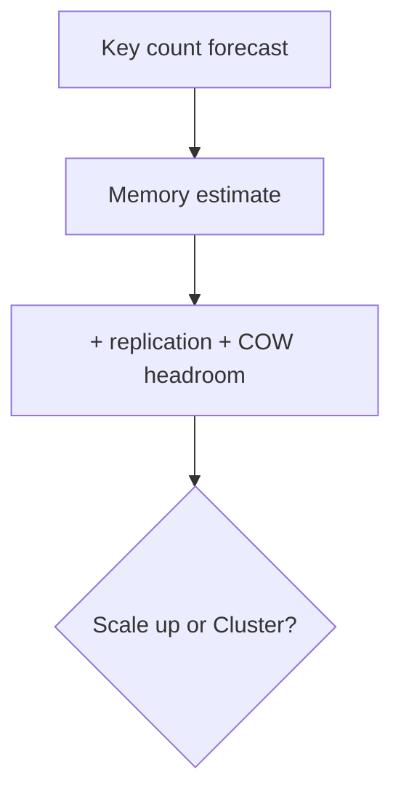
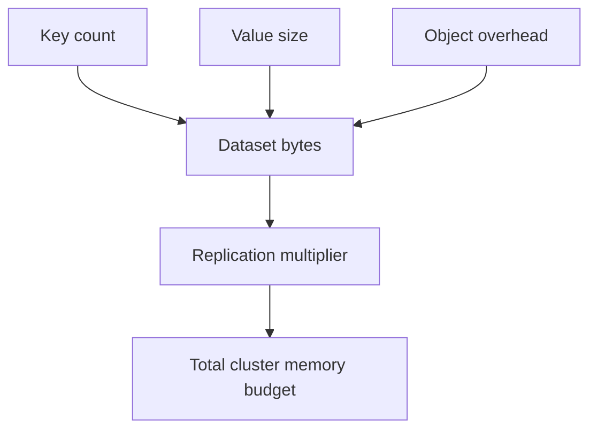

## Quick Revision

- Capacity planning combines memory math, replication factor, and growth assumptions.
- Include overhead for key metadata, encoding transitions, and persistence headroom.
- Validate both cost and failover safety in architecture reviews.

## Core Concepts

| Dimension | Baseline input |
| :--- | :--- |
| Key count | Current + projected growth |
| Value size | p50/p95 payload distribution |
| Replication factor | Primary + replicas |
| Persistence overhead | Fork/COW and rewrite headroom |

## Internal Working

## Architecture

Capacity strategy should specify scale-up thresholds and scale-out triggers.

## Design Tradeoffs

| Strategy | Tradeoff |
| :--- | :--- |
| Larger nodes | Simpler ops, bigger blast radius |
| More shards | Better parallelism, more operational complexity |

## Production Patterns

- Budget separate pools for cache, sessions, and coordination workloads.
- Re-run capacity forecast before major traffic launches.

## Scalability

Plan for hotspot risk even when total capacity looks adequate.

## Reliability

Reserve memory headroom for failover and persistence operations.

## Observability

Track growth per key prefix and per shard monthly.

## Troubleshooting

Unexpected OOM with stable traffic usually points to growth assumptions drift or missing overhead.

## Common Mistakes

- Planning only by total GB without key cardinality.
- Ignoring replication factor in cost calculations.

## Architect Notes

Capacity planning is an architectural artifact, not an afterthought spreadsheet.

## What signals indicate a workload has outgrown a single primary before ops teams admit it?

### Short Answer
The practical Redis answer is matching Redis data type to access pattern — not defaulting everything to JSON strings for: What signals indicate a workload has outgrown a single primary before ops teams admit it.

### Detailed Explanation
Pick strings for counters/cache blobs, hashes for field updates, sets/ZSETs for uniqueness/ranking, Streams for durable queues for: What signals indicate a workload has outgrown a single primary before ops teams admit it.

### Internal Working
Encoding upgrades and command complexity (O(N) vs O(1)) follow from type and size choices for: What signals indicate a workload has outgrown a single primary before ops teams admit it.

### Production Notes
You justify it by measuring p99 latency, memory headroom, and failover behavior under realistic skew by validating command complexity and memory per key for: What signals indicate a workload has outgrown a single primary before ops teams admit it.

### Common Mistakes
Using `HGETALL` or `SMEMBERS` on large collections blocks the event loop for: What signals indicate a workload has outgrown a single primary before ops teams admit it.

### Follow-up Questions
Which type would you choose for: What signals indicate a workload has outgrown a single primary before ops teams admit it, and what command path proves it under peak cardinality?

---
## What client connection pool sizing formula avoids Redis maxclients saturation?

### Short Answer
The practical Redis answer is sizing memory as key count × (value + metadata overhead) plus replication and headroom for fork for: What client connection pool sizing formula avoids Redis maxclients saturation.

### Detailed Explanation
Plan growth with key cardinality forecasts, encoding assumptions, and replica factor — Cluster adds coordination overhead for: What client connection pool sizing formula avoids Redis maxclients saturation.

### Internal Working
Connection count from many pods can exhaust `maxclients` before memory fills for: What client connection pool sizing formula avoids Redis maxclients saturation.

### Production Notes
You justify it by measuring p99 latency, memory headroom, and failover behavior under realistic skew with load tests that include failover and snapshot windows for: What client connection pool sizing formula avoids Redis maxclients saturation.

### Common Mistakes
Sizing only for data bytes without overhead, replicas, or COW margin causes emergency scale events for: What client connection pool sizing formula avoids Redis maxclients saturation.

### Follow-up Questions
At what memory or ops/sec threshold would you trigger horizontal scale for: What client connection pool sizing formula avoids Redis maxclients saturation?

---
## How would you load-test Redis Cluster to find the first bottleneck: CPU, network, or slot skew?

### Short Answer
For this question, the architecturally correct Redis answer is designing keys around 16384 hash slots, hash tags for multi-key ops, and cluster-aware clients for: How would you load-test Redis Cluster to find the first bottleneck: CPU, network, or slot skew.

### Detailed Explanation
Slot = CRC16(key) mod 16384; MOVED is permanent redirect, ASK is temporary during migration — resharding moves slot ownership without changing key names for: How would you load-test Redis Cluster to find the first bottleneck: CPU, network, or slot skew.

### Internal Working
Multi-key commands, Lua, and transactions require all keys in the same slot — `{tag}` hash tags force colocation for: How would you load-test Redis Cluster to find the first bottleneck: CPU, network, or slot skew.

### Production Notes
You justify it by proving behavior with INFO, slowlog, and workload replay before changing topology by monitoring per-node ops/sec, slot distribution, and MOVED/ASK rates during: How would you load-test Redis Cluster to find the first bottleneck: CPU, network, or slot skew.

### Common Mistakes
Typical failures: non-cluster clients, cross-slot MGET, and hot slots from poor key choice for: How would you load-test Redis Cluster to find the first bottleneck: CPU, network, or slot skew.

### Follow-up Questions
How would you rebalance slots or split hot keys if: How would you load-test Redis Cluster to find the first bottleneck: CPU, network, or slot skew appears in production metrics?

---
## How do you estimate Redis memory for N keys given average value size and encoding overhead?

### Short Answer
For this question, the architecturally correct Redis answer is separating logical key growth from allocator overhead using `used_memory`, RSS, and encoding inspection for: How do you estimate Redis memory for N keys given average value size and encoding overhead.

### Detailed Explanation
Redis picks compact encodings (listpack, intset) for small values and upgrades to hashtable/skiplist structures as data grows — memory cliffs often appear at encoding thresholds for: How do you estimate Redis memory for N keys given average value size and encoding overhead.

### Internal Working
`robj` wraps values with type metadata; jemalloc arenas and copy-on-write during persistence amplify RSS beyond `used_memory` for: How do you estimate Redis memory for N keys given average value size and encoding overhead.

### Production Notes
You justify it by proving behavior with INFO, slowlog, and workload replay before changing topology after sampling top keys with `MEMORY USAGE` and reviewing fragmentation ratio trends for: How do you estimate Redis memory for N keys given average value size and encoding overhead.

### Common Mistakes
Teams often optimize value bytes while ignoring metadata overhead, fragmentation, and fork-related RSS spikes for: How do you estimate Redis memory for N keys given average value size and encoding overhead.

### Follow-up Questions
Which encoding upgrade or key-shape change would you test first to reduce memory for: How do you estimate Redis memory for N keys given average value size and encoding overhead?

---
## How many primaries and replicas would you plan for a 500 GB working set with 200k ops/sec?

### Short Answer
The senior-level decision is treating replication as async by default and using `WAIT` or app-level checks only when stronger durability is required for: How many primaries and replicas would you plan for a 500 GB working set with 200k ops/sec.

### Detailed Explanation
Replicas tail the replication stream; lag appears when network, disk, or apply speed falls behind write rate — partial resync needs adequate `repl-backlog-size` for: How many primaries and replicas would you plan for a 500 GB working set with 200k ops/sec.

### Internal Working
Read-your-writes is not automatic on replicas; clients using replica reads must accept staleness or use primary reads after writes for: How many primaries and replicas would you plan for a 500 GB working set with 200k ops/sec.

### Production Notes
You justify it by aligning durability settings with business RPO/RTO and client retry contracts by correlating `master_repl_offset` with replica offsets and write spikes for: How many primaries and replicas would you plan for a 500 GB working set with 200k ops/sec.

### Common Mistakes
Common mistakes include writable replicas, ignoring lag during incidents, and assuming replica reads are fresh for: How many primaries and replicas would you plan for a 500 GB working set with 200k ops/sec.

### Follow-up Questions
Which writes in: How many primaries and replicas would you plan for a 500 GB working set with 200k ops/sec require synchronous acknowledgment, and how will clients handle failover mid-transaction?

---
## What growth triggers move you from one large instance to Cluster beyond memory alone?

### Short Answer
The practical Redis answer is designing keys around 16384 hash slots, hash tags for multi-key ops, and cluster-aware clients for: What growth triggers move you from one large instance to Cluster beyond memory alone.

### Detailed Explanation
Slot = CRC16(key) mod 16384; MOVED is permanent redirect, ASK is temporary during migration — resharding moves slot ownership without changing key names for: What growth triggers move you from one large instance to Cluster beyond memory alone.

### Internal Working
Multi-key commands, Lua, and transactions require all keys in the same slot — `{tag}` hash tags force colocation for: What growth triggers move you from one large instance to Cluster beyond memory alone.

### Production Notes
You justify it by measuring p99 latency, memory headroom, and failover behavior under realistic skew by monitoring per-node ops/sec, slot distribution, and MOVED/ASK rates during: What growth triggers move you from one large instance to Cluster beyond memory alone.

### Common Mistakes
Typical failures: non-cluster clients, cross-slot MGET, and hot slots from poor key choice for: What growth triggers move you from one large instance to Cluster beyond memory alone.

### Follow-up Questions
How would you rebalance slots or split hot keys if: What growth triggers move you from one large instance to Cluster beyond memory alone appears in production metrics?

---
## How do connection counts from thousands of pods affect Redis scalability in Kubernetes?

### Short Answer
For this question, the architecturally correct Redis answer is matching Redis data type to access pattern — not defaulting everything to JSON strings for: How do connection counts from thousands of pods affect Redis scalability in Kubernetes.

### Detailed Explanation
Pick strings for counters/cache blobs, hashes for field updates, sets/ZSETs for uniqueness/ranking, Streams for durable queues for: How do connection counts from thousands of pods affect Redis scalability in Kubernetes.

### Internal Working
Encoding upgrades and command complexity (O(N) vs O(1)) follow from type and size choices for: How do connection counts from thousands of pods affect Redis scalability in Kubernetes.

### Production Notes
You justify it by proving behavior with INFO, slowlog, and workload replay before changing topology by validating command complexity and memory per key for: How do connection counts from thousands of pods affect Redis scalability in Kubernetes.

### Common Mistakes
Using `HGETALL` or `SMEMBERS` on large collections blocks the event loop for: How do connection counts from thousands of pods affect Redis scalability in Kubernetes.

### Follow-up Questions
Which type would you choose for: How do connection counts from thousands of pods affect Redis scalability in Kubernetes, and what command path proves it under peak cardinality?

---
## How would you model year-over-year key growth for finance-approved capacity budgets?

### Short Answer
The senior-level decision is sizing memory as key count × (value + metadata overhead) plus replication and headroom for fork for: How would you model year-over-year key growth for finance-approved capacity budgets.

### Detailed Explanation
Plan growth with key cardinality forecasts, encoding assumptions, and replica factor — Cluster adds coordination overhead for: How would you model year-over-year key growth for finance-approved capacity budgets.

### Internal Working
Connection count from many pods can exhaust `maxclients` before memory fills for: How would you model year-over-year key growth for finance-approved capacity budgets.

### Production Notes
You justify it by aligning durability settings with business RPO/RTO and client retry contracts with load tests that include failover and snapshot windows for: How would you model year-over-year key growth for finance-approved capacity budgets.

### Common Mistakes
Sizing only for data bytes without overhead, replicas, or COW margin causes emergency scale events for: How would you model year-over-year key growth for finance-approved capacity budgets.

### Follow-up Questions
At what memory or ops/sec threshold would you trigger horizontal scale for: How would you model year-over-year key growth for finance-approved capacity budgets?

---
<!-- interview-answers:end -->

---

## What signals indicate a workload has outgrown a single primary before ops teams admit it?

### Short Answer
The practical Redis answer is matching Redis data type to access pattern — not defaulting everything to JSON strings for: What signals indicate a workload has outgrown a single primary before ops teams admit it.

### Detailed Explanation
Pick strings for counters/cache blobs, hashes for field updates, sets/ZSETs for uniqueness/ranking, Streams for durable queues for: What signals indicate a workload has outgrown a single primary before ops teams admit it.

### Internal Working
Encoding upgrades and command complexity (O(N) vs O(1)) follow from type and size choices for: What signals indicate a workload has outgrown a single primary before ops teams admit it.

### Production Notes
You justify it by measuring p99 latency, memory headroom, and failover behavior under realistic skew by validating command complexity and memory per key for: What signals indicate a workload has outgrown a single primary before ops teams admit it.

### Common Mistakes
Using `HGETALL` or `SMEMBERS` on large collections blocks the event loop for: What signals indicate a workload has outgrown a single primary before ops teams admit it.

### Follow-up Questions
Which type would you choose for: What signals indicate a workload has outgrown a single primary before ops teams admit it, and what command path proves it under peak cardinality?

---
## What client connection pool sizing formula avoids Redis maxclients saturation?

### Short Answer
The practical Redis answer is sizing memory as key count × (value + metadata overhead) plus replication and headroom for fork for: What client connection pool sizing formula avoids Redis maxclients saturation.

### Detailed Explanation
Plan growth with key cardinality forecasts, encoding assumptions, and replica factor — Cluster adds coordination overhead for: What client connection pool sizing formula avoids Redis maxclients saturation.

### Internal Working
Connection count from many pods can exhaust `maxclients` before memory fills for: What client connection pool sizing formula avoids Redis maxclients saturation.

### Production Notes
You justify it by measuring p99 latency, memory headroom, and failover behavior under realistic skew with load tests that include failover and snapshot windows for: What client connection pool sizing formula avoids Redis maxclients saturation.

### Common Mistakes
Sizing only for data bytes without overhead, replicas, or COW margin causes emergency scale events for: What client connection pool sizing formula avoids Redis maxclients saturation.

### Follow-up Questions
At what memory or ops/sec threshold would you trigger horizontal scale for: What client connection pool sizing formula avoids Redis maxclients saturation?

---
## How would you load-test Redis Cluster to find the first bottleneck: CPU, network, or slot skew?

### Short Answer
For this question, the architecturally correct Redis answer is designing keys around 16384 hash slots, hash tags for multi-key ops, and cluster-aware clients for: How would you load-test Redis Cluster to find the first bottleneck: CPU, network, or slot skew.

### Detailed Explanation
Slot = CRC16(key) mod 16384; MOVED is permanent redirect, ASK is temporary during migration — resharding moves slot ownership without changing key names for: How would you load-test Redis Cluster to find the first bottleneck: CPU, network, or slot skew.

### Internal Working
Multi-key commands, Lua, and transactions require all keys in the same slot — `{tag}` hash tags force colocation for: How would you load-test Redis Cluster to find the first bottleneck: CPU, network, or slot skew.

### Production Notes
You justify it by proving behavior with INFO, slowlog, and workload replay before changing topology by monitoring per-node ops/sec, slot distribution, and MOVED/ASK rates during: How would you load-test Redis Cluster to find the first bottleneck: CPU, network, or slot skew.

### Common Mistakes
Typical failures: non-cluster clients, cross-slot MGET, and hot slots from poor key choice for: How would you load-test Redis Cluster to find the first bottleneck: CPU, network, or slot skew.

### Follow-up Questions
How would you rebalance slots or split hot keys if: How would you load-test Redis Cluster to find the first bottleneck: CPU, network, or slot skew appears in production metrics?

---
## How do you estimate Redis memory for N keys given average value size and encoding overhead?

### Short Answer
For this question, the architecturally correct Redis answer is separating logical key growth from allocator overhead using `used_memory`, RSS, and encoding inspection for: How do you estimate Redis memory for N keys given average value size and encoding overhead.

### Detailed Explanation
Redis picks compact encodings (listpack, intset) for small values and upgrades to hashtable/skiplist structures as data grows — memory cliffs often appear at encoding thresholds for: How do you estimate Redis memory for N keys given average value size and encoding overhead.

### Internal Working
`robj` wraps values with type metadata; jemalloc arenas and copy-on-write during persistence amplify RSS beyond `used_memory` for: How do you estimate Redis memory for N keys given average value size and encoding overhead.

### Production Notes
You justify it by proving behavior with INFO, slowlog, and workload replay before changing topology after sampling top keys with `MEMORY USAGE` and reviewing fragmentation ratio trends for: How do you estimate Redis memory for N keys given average value size and encoding overhead.

### Common Mistakes
Teams often optimize value bytes while ignoring metadata overhead, fragmentation, and fork-related RSS spikes for: How do you estimate Redis memory for N keys given average value size and encoding overhead.

### Follow-up Questions
Which encoding upgrade or key-shape change would you test first to reduce memory for: How do you estimate Redis memory for N keys given average value size and encoding overhead?

---
## How many primaries and replicas would you plan for a 500 GB working set with 200k ops/sec?

### Short Answer
The senior-level decision is treating replication as async by default and using `WAIT` or app-level checks only when stronger durability is required for: How many primaries and replicas would you plan for a 500 GB working set with 200k ops/sec.

### Detailed Explanation
Replicas tail the replication stream; lag appears when network, disk, or apply speed falls behind write rate — partial resync needs adequate `repl-backlog-size` for: How many primaries and replicas would you plan for a 500 GB working set with 200k ops/sec.

### Internal Working
Read-your-writes is not automatic on replicas; clients using replica reads must accept staleness or use primary reads after writes for: How many primaries and replicas would you plan for a 500 GB working set with 200k ops/sec.

### Production Notes
You justify it by aligning durability settings with business RPO/RTO and client retry contracts by correlating `master_repl_offset` with replica offsets and write spikes for: How many primaries and replicas would you plan for a 500 GB working set with 200k ops/sec.

### Common Mistakes
Common mistakes include writable replicas, ignoring lag during incidents, and assuming replica reads are fresh for: How many primaries and replicas would you plan for a 500 GB working set with 200k ops/sec.

### Follow-up Questions
Which writes in: How many primaries and replicas would you plan for a 500 GB working set with 200k ops/sec require synchronous acknowledgment, and how will clients handle failover mid-transaction?

---
## What growth triggers move you from one large instance to Cluster beyond memory alone?

### Short Answer
The practical Redis answer is designing keys around 16384 hash slots, hash tags for multi-key ops, and cluster-aware clients for: What growth triggers move you from one large instance to Cluster beyond memory alone.

### Detailed Explanation
Slot = CRC16(key) mod 16384; MOVED is permanent redirect, ASK is temporary during migration — resharding moves slot ownership without changing key names for: What growth triggers move you from one large instance to Cluster beyond memory alone.

### Internal Working
Multi-key commands, Lua, and transactions require all keys in the same slot — `{tag}` hash tags force colocation for: What growth triggers move you from one large instance to Cluster beyond memory alone.

### Production Notes
You justify it by measuring p99 latency, memory headroom, and failover behavior under realistic skew by monitoring per-node ops/sec, slot distribution, and MOVED/ASK rates during: What growth triggers move you from one large instance to Cluster beyond memory alone.

### Common Mistakes
Typical failures: non-cluster clients, cross-slot MGET, and hot slots from poor key choice for: What growth triggers move you from one large instance to Cluster beyond memory alone.

### Follow-up Questions
How would you rebalance slots or split hot keys if: What growth triggers move you from one large instance to Cluster beyond memory alone appears in production metrics?

---
## How do connection counts from thousands of pods affect Redis scalability in Kubernetes?

### Short Answer
For this question, the architecturally correct Redis answer is matching Redis data type to access pattern — not defaulting everything to JSON strings for: How do connection counts from thousands of pods affect Redis scalability in Kubernetes.

### Detailed Explanation
Pick strings for counters/cache blobs, hashes for field updates, sets/ZSETs for uniqueness/ranking, Streams for durable queues for: How do connection counts from thousands of pods affect Redis scalability in Kubernetes.

### Internal Working
Encoding upgrades and command complexity (O(N) vs O(1)) follow from type and size choices for: How do connection counts from thousands of pods affect Redis scalability in Kubernetes.

### Production Notes
You justify it by proving behavior with INFO, slowlog, and workload replay before changing topology by validating command complexity and memory per key for: How do connection counts from thousands of pods affect Redis scalability in Kubernetes.

### Common Mistakes
Using `HGETALL` or `SMEMBERS` on large collections blocks the event loop for: How do connection counts from thousands of pods affect Redis scalability in Kubernetes.

### Follow-up Questions
Which type would you choose for: How do connection counts from thousands of pods affect Redis scalability in Kubernetes, and what command path proves it under peak cardinality?

---
## How would you model year-over-year key growth for finance-approved capacity budgets?

### Short Answer
The senior-level decision is sizing memory as key count × (value + metadata overhead) plus replication and headroom for fork for: How would you model year-over-year key growth for finance-approved capacity budgets.

### Detailed Explanation
Plan growth with key cardinality forecasts, encoding assumptions, and replica factor — Cluster adds coordination overhead for: How would you model year-over-year key growth for finance-approved capacity budgets.

### Internal Working
Connection count from many pods can exhaust `maxclients` before memory fills for: How would you model year-over-year key growth for finance-approved capacity budgets.

### Production Notes
You justify it by aligning durability settings with business RPO/RTO and client retry contracts with load tests that include failover and snapshot windows for: How would you model year-over-year key growth for finance-approved capacity budgets.

### Common Mistakes
Sizing only for data bytes without overhead, replicas, or COW margin causes emergency scale events for: How would you model year-over-year key growth for finance-approved capacity budgets.

### Follow-up Questions
At what memory or ops/sec threshold would you trigger horizontal scale for: How would you model year-over-year key growth for finance-approved capacity budgets?

---
<!-- interview-answers:end -->

---

## What signals indicate a workload has outgrown a single primary before ops teams admit it?

### Short Answer
The practical Redis answer is matching Redis data type to access pattern — not defaulting everything to JSON strings for: What signals indicate a workload has outgrown a single primary before ops teams admit it.

### Detailed Explanation
Pick strings for counters/cache blobs, hashes for field updates, sets/ZSETs for uniqueness/ranking, Streams for durable queues for: What signals indicate a workload has outgrown a single primary before ops teams admit it.

### Internal Working
Encoding upgrades and command complexity (O(N) vs O(1)) follow from type and size choices for: What signals indicate a workload has outgrown a single primary before ops teams admit it.

### Production Notes
You justify it by measuring p99 latency, memory headroom, and failover behavior under realistic skew by validating command complexity and memory per key for: What signals indicate a workload has outgrown a single primary before ops teams admit it.

### Common Mistakes
Using `HGETALL` or `SMEMBERS` on large collections blocks the event loop for: What signals indicate a workload has outgrown a single primary before ops teams admit it.

### Follow-up Questions
Which type would you choose for: What signals indicate a workload has outgrown a single primary before ops teams admit it, and what command path proves it under peak cardinality?

---
## What client connection pool sizing formula avoids Redis maxclients saturation?

### Short Answer
The practical Redis answer is sizing memory as key count × (value + metadata overhead) plus replication and headroom for fork for: What client connection pool sizing formula avoids Redis maxclients saturation.

### Detailed Explanation
Plan growth with key cardinality forecasts, encoding assumptions, and replica factor — Cluster adds coordination overhead for: What client connection pool sizing formula avoids Redis maxclients saturation.

### Internal Working
Connection count from many pods can exhaust `maxclients` before memory fills for: What client connection pool sizing formula avoids Redis maxclients saturation.

### Production Notes
You justify it by measuring p99 latency, memory headroom, and failover behavior under realistic skew with load tests that include failover and snapshot windows for: What client connection pool sizing formula avoids Redis maxclients saturation.

### Common Mistakes
Sizing only for data bytes without overhead, replicas, or COW margin causes emergency scale events for: What client connection pool sizing formula avoids Redis maxclients saturation.

### Follow-up Questions
At what memory or ops/sec threshold would you trigger horizontal scale for: What client connection pool sizing formula avoids Redis maxclients saturation?

---
## How would you load-test Redis Cluster to find the first bottleneck: CPU, network, or slot skew?

### Short Answer
For this question, the architecturally correct Redis answer is designing keys around 16384 hash slots, hash tags for multi-key ops, and cluster-aware clients for: How would you load-test Redis Cluster to find the first bottleneck: CPU, network, or slot skew.

### Detailed Explanation
Slot = CRC16(key) mod 16384; MOVED is permanent redirect, ASK is temporary during migration — resharding moves slot ownership without changing key names for: How would you load-test Redis Cluster to find the first bottleneck: CPU, network, or slot skew.

### Internal Working
Multi-key commands, Lua, and transactions require all keys in the same slot — `{tag}` hash tags force colocation for: How would you load-test Redis Cluster to find the first bottleneck: CPU, network, or slot skew.

### Production Notes
You justify it by proving behavior with INFO, slowlog, and workload replay before changing topology by monitoring per-node ops/sec, slot distribution, and MOVED/ASK rates during: How would you load-test Redis Cluster to find the first bottleneck: CPU, network, or slot skew.

### Common Mistakes
Typical failures: non-cluster clients, cross-slot MGET, and hot slots from poor key choice for: How would you load-test Redis Cluster to find the first bottleneck: CPU, network, or slot skew.

### Follow-up Questions
How would you rebalance slots or split hot keys if: How would you load-test Redis Cluster to find the first bottleneck: CPU, network, or slot skew appears in production metrics?

---
## How do you estimate Redis memory for N keys given average value size and encoding overhead?

### Short Answer
For this question, the architecturally correct Redis answer is separating logical key growth from allocator overhead using `used_memory`, RSS, and encoding inspection for: How do you estimate Redis memory for N keys given average value size and encoding overhead.

### Detailed Explanation
Redis picks compact encodings (listpack, intset) for small values and upgrades to hashtable/skiplist structures as data grows — memory cliffs often appear at encoding thresholds for: How do you estimate Redis memory for N keys given average value size and encoding overhead.

### Internal Working
`robj` wraps values with type metadata; jemalloc arenas and copy-on-write during persistence amplify RSS beyond `used_memory` for: How do you estimate Redis memory for N keys given average value size and encoding overhead.

### Production Notes
You justify it by proving behavior with INFO, slowlog, and workload replay before changing topology after sampling top keys with `MEMORY USAGE` and reviewing fragmentation ratio trends for: How do you estimate Redis memory for N keys given average value size and encoding overhead.

### Common Mistakes
Teams often optimize value bytes while ignoring metadata overhead, fragmentation, and fork-related RSS spikes for: How do you estimate Redis memory for N keys given average value size and encoding overhead.

### Follow-up Questions
Which encoding upgrade or key-shape change would you test first to reduce memory for: How do you estimate Redis memory for N keys given average value size and encoding overhead?

---
## How many primaries and replicas would you plan for a 500 GB working set with 200k ops/sec?

### Short Answer
The senior-level decision is treating replication as async by default and using `WAIT` or app-level checks only when stronger durability is required for: How many primaries and replicas would you plan for a 500 GB working set with 200k ops/sec.

### Detailed Explanation
Replicas tail the replication stream; lag appears when network, disk, or apply speed falls behind write rate — partial resync needs adequate `repl-backlog-size` for: How many primaries and replicas would you plan for a 500 GB working set with 200k ops/sec.

### Internal Working
Read-your-writes is not automatic on replicas; clients using replica reads must accept staleness or use primary reads after writes for: How many primaries and replicas would you plan for a 500 GB working set with 200k ops/sec.

### Production Notes
You justify it by aligning durability settings with business RPO/RTO and client retry contracts by correlating `master_repl_offset` with replica offsets and write spikes for: How many primaries and replicas would you plan for a 500 GB working set with 200k ops/sec.

### Common Mistakes
Common mistakes include writable replicas, ignoring lag during incidents, and assuming replica reads are fresh for: How many primaries and replicas would you plan for a 500 GB working set with 200k ops/sec.

### Follow-up Questions
Which writes in: How many primaries and replicas would you plan for a 500 GB working set with 200k ops/sec require synchronous acknowledgment, and how will clients handle failover mid-transaction?

---
## What growth triggers move you from one large instance to Cluster beyond memory alone?

### Short Answer
The practical Redis answer is designing keys around 16384 hash slots, hash tags for multi-key ops, and cluster-aware clients for: What growth triggers move you from one large instance to Cluster beyond memory alone.

### Detailed Explanation
Slot = CRC16(key) mod 16384; MOVED is permanent redirect, ASK is temporary during migration — resharding moves slot ownership without changing key names for: What growth triggers move you from one large instance to Cluster beyond memory alone.

### Internal Working
Multi-key commands, Lua, and transactions require all keys in the same slot — `{tag}` hash tags force colocation for: What growth triggers move you from one large instance to Cluster beyond memory alone.

### Production Notes
You justify it by measuring p99 latency, memory headroom, and failover behavior under realistic skew by monitoring per-node ops/sec, slot distribution, and MOVED/ASK rates during: What growth triggers move you from one large instance to Cluster beyond memory alone.

### Common Mistakes
Typical failures: non-cluster clients, cross-slot MGET, and hot slots from poor key choice for: What growth triggers move you from one large instance to Cluster beyond memory alone.

### Follow-up Questions
How would you rebalance slots or split hot keys if: What growth triggers move you from one large instance to Cluster beyond memory alone appears in production metrics?

---
## How do connection counts from thousands of pods affect Redis scalability in Kubernetes?

### Short Answer
For this question, the architecturally correct Redis answer is matching Redis data type to access pattern — not defaulting everything to JSON strings for: How do connection counts from thousands of pods affect Redis scalability in Kubernetes.

### Detailed Explanation
Pick strings for counters/cache blobs, hashes for field updates, sets/ZSETs for uniqueness/ranking, Streams for durable queues for: How do connection counts from thousands of pods affect Redis scalability in Kubernetes.

### Internal Working
Encoding upgrades and command complexity (O(N) vs O(1)) follow from type and size choices for: How do connection counts from thousands of pods affect Redis scalability in Kubernetes.

### Production Notes
You justify it by proving behavior with INFO, slowlog, and workload replay before changing topology by validating command complexity and memory per key for: How do connection counts from thousands of pods affect Redis scalability in Kubernetes.

### Common Mistakes
Using `HGETALL` or `SMEMBERS` on large collections blocks the event loop for: How do connection counts from thousands of pods affect Redis scalability in Kubernetes.

### Follow-up Questions
Which type would you choose for: How do connection counts from thousands of pods affect Redis scalability in Kubernetes, and what command path proves it under peak cardinality?

---
## How would you model year-over-year key growth for finance-approved capacity budgets?

### Short Answer
The senior-level decision is sizing memory as key count × (value + metadata overhead) plus replication and headroom for fork for: How would you model year-over-year key growth for finance-approved capacity budgets.

### Detailed Explanation
Plan growth with key cardinality forecasts, encoding assumptions, and replica factor — Cluster adds coordination overhead for: How would you model year-over-year key growth for finance-approved capacity budgets.

### Internal Working
Connection count from many pods can exhaust `maxclients` before memory fills for: How would you model year-over-year key growth for finance-approved capacity budgets.

### Production Notes
You justify it by aligning durability settings with business RPO/RTO and client retry contracts with load tests that include failover and snapshot windows for: How would you model year-over-year key growth for finance-approved capacity budgets.

### Common Mistakes
Sizing only for data bytes without overhead, replicas, or COW margin causes emergency scale events for: How would you model year-over-year key growth for finance-approved capacity budgets.

### Follow-up Questions
At what memory or ops/sec threshold would you trigger horizontal scale for: How would you model year-over-year key growth for finance-approved capacity budgets?

---
<!-- interview-answers:end -->

---

## What signals indicate a workload has outgrown a single primary before ops teams admit it?

### Short Answer
The practical Redis answer is matching Redis data type to access pattern — not defaulting everything to JSON strings for: What signals indicate a workload has outgrown a single primary before ops teams admit it.

### Detailed Explanation
Pick strings for counters/cache blobs, hashes for field updates, sets/ZSETs for uniqueness/ranking, Streams for durable queues for: What signals indicate a workload has outgrown a single primary before ops teams admit it.

### Internal Working
Encoding upgrades and command complexity (O(N) vs O(1)) follow from type and size choices for: What signals indicate a workload has outgrown a single primary before ops teams admit it.

### Production Notes
You justify it by measuring p99 latency, memory headroom, and failover behavior under realistic skew by validating command complexity and memory per key for: What signals indicate a workload has outgrown a single primary before ops teams admit it.

### Common Mistakes
Using `HGETALL` or `SMEMBERS` on large collections blocks the event loop for: What signals indicate a workload has outgrown a single primary before ops teams admit it.

### Follow-up Questions
Which type would you choose for: What signals indicate a workload has outgrown a single primary before ops teams admit it, and what command path proves it under peak cardinality?

---
## What client connection pool sizing formula avoids Redis maxclients saturation?

### Short Answer
The practical Redis answer is sizing memory as key count × (value + metadata overhead) plus replication and headroom for fork for: What client connection pool sizing formula avoids Redis maxclients saturation.

### Detailed Explanation
Plan growth with key cardinality forecasts, encoding assumptions, and replica factor — Cluster adds coordination overhead for: What client connection pool sizing formula avoids Redis maxclients saturation.

### Internal Working
Connection count from many pods can exhaust `maxclients` before memory fills for: What client connection pool sizing formula avoids Redis maxclients saturation.

### Production Notes
You justify it by measuring p99 latency, memory headroom, and failover behavior under realistic skew with load tests that include failover and snapshot windows for: What client connection pool sizing formula avoids Redis maxclients saturation.

### Common Mistakes
Sizing only for data bytes without overhead, replicas, or COW margin causes emergency scale events for: What client connection pool sizing formula avoids Redis maxclients saturation.

### Follow-up Questions
At what memory or ops/sec threshold would you trigger horizontal scale for: What client connection pool sizing formula avoids Redis maxclients saturation?

---
## How would you load-test Redis Cluster to find the first bottleneck: CPU, network, or slot skew?

### Short Answer
For this question, the architecturally correct Redis answer is designing keys around 16384 hash slots, hash tags for multi-key ops, and cluster-aware clients for: How would you load-test Redis Cluster to find the first bottleneck: CPU, network, or slot skew.

### Detailed Explanation
Slot = CRC16(key) mod 16384; MOVED is permanent redirect, ASK is temporary during migration — resharding moves slot ownership without changing key names for: How would you load-test Redis Cluster to find the first bottleneck: CPU, network, or slot skew.

### Internal Working
Multi-key commands, Lua, and transactions require all keys in the same slot — `{tag}` hash tags force colocation for: How would you load-test Redis Cluster to find the first bottleneck: CPU, network, or slot skew.

### Production Notes
You justify it by proving behavior with INFO, slowlog, and workload replay before changing topology by monitoring per-node ops/sec, slot distribution, and MOVED/ASK rates during: How would you load-test Redis Cluster to find the first bottleneck: CPU, network, or slot skew.

### Common Mistakes
Typical failures: non-cluster clients, cross-slot MGET, and hot slots from poor key choice for: How would you load-test Redis Cluster to find the first bottleneck: CPU, network, or slot skew.

### Follow-up Questions
How would you rebalance slots or split hot keys if: How would you load-test Redis Cluster to find the first bottleneck: CPU, network, or slot skew appears in production metrics?

---
## How do you estimate Redis memory for N keys given average value size and encoding overhead?

### Short Answer
For this question, the architecturally correct Redis answer is separating logical key growth from allocator overhead using `used_memory`, RSS, and encoding inspection for: How do you estimate Redis memory for N keys given average value size and encoding overhead.

### Detailed Explanation
Redis picks compact encodings (listpack, intset) for small values and upgrades to hashtable/skiplist structures as data grows — memory cliffs often appear at encoding thresholds for: How do you estimate Redis memory for N keys given average value size and encoding overhead.

### Internal Working
`robj` wraps values with type metadata; jemalloc arenas and copy-on-write during persistence amplify RSS beyond `used_memory` for: How do you estimate Redis memory for N keys given average value size and encoding overhead.

### Production Notes
You justify it by proving behavior with INFO, slowlog, and workload replay before changing topology after sampling top keys with `MEMORY USAGE` and reviewing fragmentation ratio trends for: How do you estimate Redis memory for N keys given average value size and encoding overhead.

### Common Mistakes
Teams often optimize value bytes while ignoring metadata overhead, fragmentation, and fork-related RSS spikes for: How do you estimate Redis memory for N keys given average value size and encoding overhead.

### Follow-up Questions
Which encoding upgrade or key-shape change would you test first to reduce memory for: How do you estimate Redis memory for N keys given average value size and encoding overhead?

---
## How many primaries and replicas would you plan for a 500 GB working set with 200k ops/sec?

### Short Answer
The senior-level decision is treating replication as async by default and using `WAIT` or app-level checks only when stronger durability is required for: How many primaries and replicas would you plan for a 500 GB working set with 200k ops/sec.

### Detailed Explanation
Replicas tail the replication stream; lag appears when network, disk, or apply speed falls behind write rate — partial resync needs adequate `repl-backlog-size` for: How many primaries and replicas would you plan for a 500 GB working set with 200k ops/sec.

### Internal Working
Read-your-writes is not automatic on replicas; clients using replica reads must accept staleness or use primary reads after writes for: How many primaries and replicas would you plan for a 500 GB working set with 200k ops/sec.

### Production Notes
You justify it by aligning durability settings with business RPO/RTO and client retry contracts by correlating `master_repl_offset` with replica offsets and write spikes for: How many primaries and replicas would you plan for a 500 GB working set with 200k ops/sec.

### Common Mistakes
Common mistakes include writable replicas, ignoring lag during incidents, and assuming replica reads are fresh for: How many primaries and replicas would you plan for a 500 GB working set with 200k ops/sec.

### Follow-up Questions
Which writes in: How many primaries and replicas would you plan for a 500 GB working set with 200k ops/sec require synchronous acknowledgment, and how will clients handle failover mid-transaction?

---
## What growth triggers move you from one large instance to Cluster beyond memory alone?

### Short Answer
The practical Redis answer is designing keys around 16384 hash slots, hash tags for multi-key ops, and cluster-aware clients for: What growth triggers move you from one large instance to Cluster beyond memory alone.

### Detailed Explanation
Slot = CRC16(key) mod 16384; MOVED is permanent redirect, ASK is temporary during migration — resharding moves slot ownership without changing key names for: What growth triggers move you from one large instance to Cluster beyond memory alone.

### Internal Working
Multi-key commands, Lua, and transactions require all keys in the same slot — `{tag}` hash tags force colocation for: What growth triggers move you from one large instance to Cluster beyond memory alone.

### Production Notes
You justify it by measuring p99 latency, memory headroom, and failover behavior under realistic skew by monitoring per-node ops/sec, slot distribution, and MOVED/ASK rates during: What growth triggers move you from one large instance to Cluster beyond memory alone.

### Common Mistakes
Typical failures: non-cluster clients, cross-slot MGET, and hot slots from poor key choice for: What growth triggers move you from one large instance to Cluster beyond memory alone.

### Follow-up Questions
How would you rebalance slots or split hot keys if: What growth triggers move you from one large instance to Cluster beyond memory alone appears in production metrics?

---
## How do connection counts from thousands of pods affect Redis scalability in Kubernetes?

### Short Answer
For this question, the architecturally correct Redis answer is matching Redis data type to access pattern — not defaulting everything to JSON strings for: How do connection counts from thousands of pods affect Redis scalability in Kubernetes.

### Detailed Explanation
Pick strings for counters/cache blobs, hashes for field updates, sets/ZSETs for uniqueness/ranking, Streams for durable queues for: How do connection counts from thousands of pods affect Redis scalability in Kubernetes.

### Internal Working
Encoding upgrades and command complexity (O(N) vs O(1)) follow from type and size choices for: How do connection counts from thousands of pods affect Redis scalability in Kubernetes.

### Production Notes
You justify it by proving behavior with INFO, slowlog, and workload replay before changing topology by validating command complexity and memory per key for: How do connection counts from thousands of pods affect Redis scalability in Kubernetes.

### Common Mistakes
Using `HGETALL` or `SMEMBERS` on large collections blocks the event loop for: How do connection counts from thousands of pods affect Redis scalability in Kubernetes.

### Follow-up Questions
Which type would you choose for: How do connection counts from thousands of pods affect Redis scalability in Kubernetes, and what command path proves it under peak cardinality?

---
## How would you model year-over-year key growth for finance-approved capacity budgets?

### Short Answer
The senior-level decision is sizing memory as key count × (value + metadata overhead) plus replication and headroom for fork for: How would you model year-over-year key growth for finance-approved capacity budgets.

### Detailed Explanation
Plan growth with key cardinality forecasts, encoding assumptions, and replica factor — Cluster adds coordination overhead for: How would you model year-over-year key growth for finance-approved capacity budgets.

### Internal Working
Connection count from many pods can exhaust `maxclients` before memory fills for: How would you model year-over-year key growth for finance-approved capacity budgets.

### Production Notes
You justify it by aligning durability settings with business RPO/RTO and client retry contracts with load tests that include failover and snapshot windows for: How would you model year-over-year key growth for finance-approved capacity budgets.

### Common Mistakes
Sizing only for data bytes without overhead, replicas, or COW margin causes emergency scale events for: How would you model year-over-year key growth for finance-approved capacity budgets.

### Follow-up Questions
At what memory or ops/sec threshold would you trigger horizontal scale for: How would you model year-over-year key growth for finance-approved capacity budgets?

---
<!-- interview-answers:end -->

---

## See Also

- [Previous: Monitoring](/redis-cheatsheet/06-performance-operations/monitoring/)
- [Next: Troubleshooting](/redis-cheatsheet/06-performance-operations/troubleshooting/)
- [Redis Handbook Index](/redis-cheatsheet/)
- [Top 150 Interview Questions](/redis-cheatsheet/08-interview-guide/top-150-interview-questions/)
